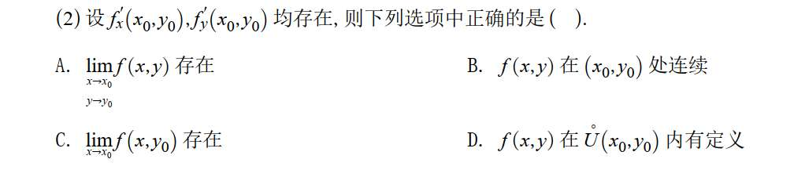
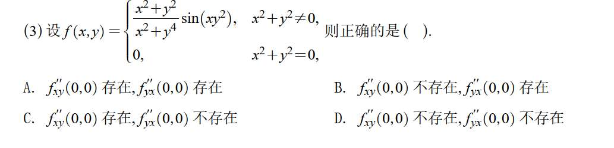
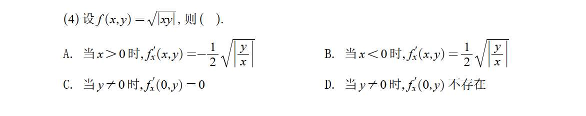
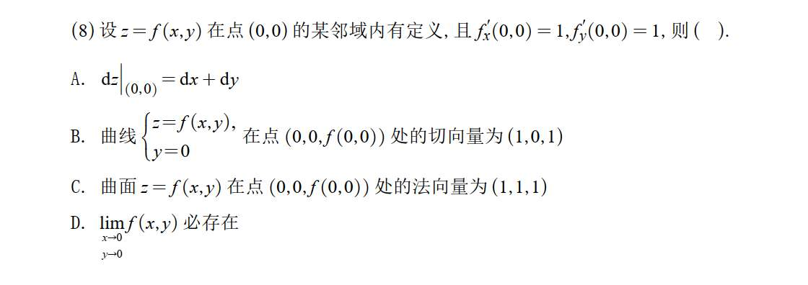
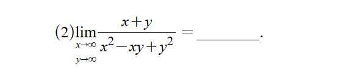
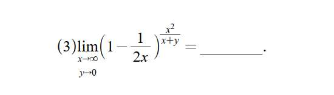

# 1 概念

### 1. 多元函数偏导数存在 $\nRightarrow$ 连续 / 极限存在 (针对选项 A 和 B)

这是多元微积分中最常考的“易错点”。

- **知识点：** 偏导数 $f_x'(x_0, y_0)$ 和 $f_y'(x_0, y_0)$ 的存在，仅仅意味着函数在点 $(x_0, y_0)$ 处，沿着平行于 $x$ 轴和 $y$ 轴的**两个特定方向**上的变化率存在。它不能保证函数从四面八方逼近该点时的状态是一致的。
    
- **结论：** 偏导数存在**不能**推导出该点的二重极限 $\lim_{\substack{x \to x_0 \\ y \to y_0}} f(x,y)$ 存在，也**不能**推导出函数在该点 $f(x,y)$ 连续。因此选项 A 和 B 是错误的。（经典反例：当 $x^2+y^2 \neq 0$ 时 $f(x,y) = \frac{xy}{x^2+y^2}$，在 $(0,0)$ 处偏导数均为 0，但极限不存在且不连续）。
    

### 2. 偏导数的定义与“一元函数可导必连续” (针对选项 C)

这是这道题的**解题核心（正确选项）**。

- **知识点：** 偏导数本质上就是“固定一个变量，对另一个变量求导”的一元函数导数。
    
    根据偏导数定义：$f_x'(x_0, y_0) = \lim_{x \to x_0} \frac{f(x, y_0) - f(x_0, y_0)}{x - x_0}$。
    
    这个极限存在，意味着一元函数 $g(x) = f(x, y_0)$ 在 $x = x_0$ 处是**可导**的。
    
- **结论：** 根据一元函数的性质“可导必连续”，函数 $g(x) = f(x, y_0)$ 在 $x = x_0$ 处必然连续。既然连续，那么它的极限就一定存在，即 $\lim_{x \to x_0} f(x, y_0) = f(x_0, y_0)$。因此 **选项 C 是正确的**。
    

### 3. 偏导数存在对定义域的要求 (针对选项 D)

考查对导数定义域的精确理解。

- **知识点：** 偏导数 $f_x'(x_0, y_0)$ 和 $f_y'(x_0, y_0)$ 的存在，只要求函数在经过点 $(x_0, y_0)$ 的**十字交叉线**（即 $y=y_0$ 和 $x=x_0$ 的直线上）的一维邻域内有定义即可。
    
- **结论：** 选项 D 说的去心邻域 $\mathring{U}(x_0, y_0)$ 是一个二维的圆盘区域（不含圆心）。偏导数存在并不要求函数在点 $(x_0, y_0)$ 的整个二维去心邻域内都有定义，只要在两根轴线上有定义就能求偏导。因此选项 D 是错误的。

# 2

你第一步算出了 $f'_x(0,0) = 0$ 和 $f'_y(0,0) = 0$，这个思路和结果是**完全正确**的！这说明你对偏导数在原点的定义掌握得很扎实。

你之所以卡在第二步，是因为遇到了求二阶混合偏导数时最常见的“盲区”：**要计算在 $(0,0)$ 处的二阶偏导数，仅知道一阶偏导数在 $(0,0)$ 处的“这一个点的值”是不够的，我们需要知道一阶偏导数在坐标轴上的“函数表达式”。**

就像你要算一辆车在某一秒的加速度（二阶导），只知道它在这一秒的速度（一阶导在某点的值）是不行的，你得知道它在这一秒前后的速度变化情况（一阶导函数）。

下面我带你一步一步破解它，关键在于回归**二阶偏导数的极限定义**。

### 1. 明确目标：二阶偏导数的定义

我们要求的是 $f''_{xy}(0,0)$ 和 $f''_{yx}(0,0)$。根据定义：

- 求 $f''_{xy}(0,0)$：先对 $x$ 求导，再对 $y$ 求导。
    
    $$f''_{xy}(0,0) = \lim_{y \to 0} \frac{f'_x(0,y) - f'_x(0,0)}{y}$$
    
- 求 $f''_{yx}(0,0)$：先对 $y$ 求导，再对 $x$ 求导。
    
    $$f''_{yx}(0,0) = \lim_{x \to 0} \frac{f'_y(x,0) - f'_y(0,0)}{x}$$
    

我们已经知道 $f'_x(0,0) = 0$ 和 $f'_y(0,0) = 0$。所以，接下来我们**必须**求出 $f'_x(0,y)$（其中 $y \neq 0$）和 $f'_y(x,0)$（其中 $x \neq 0$）。

---

### 2. 计算 $f''_{xy}(0,0)$：看它是否存在

首先，我们需要求出 $f'_x(0,y)$，即固定一个非零的 $y$，让 $x$ 趋于 0：

$$f'_x(0,y) = \lim_{x \to 0} \frac{f(x,y) - f(0,y)}{x}$$

注意这里 $y \neq 0$，所以 $f(0,y) = \frac{0^2+y^2}{0^2+y^4}\sin(0 \cdot y^2) = 0$。代入原函数：

$$f'_x(0,y) = \lim_{x \to 0} \frac{\frac{x^2+y^2}{x^2+y^4}\sin(xy^2) - 0}{x}$$

$$f'_x(0,y) = \lim_{x \to 0} \frac{x^2+y^2}{x^2+y^4} \cdot \frac{\sin(xy^2)}{x}$$

因为 $x \to 0$，我们可以用等价无穷小替换 $\sin(xy^2) \sim xy^2$：

$$f'_x(0,y) = \lim_{x \to 0} \frac{x^2+y^2}{x^2+y^4} \cdot \frac{xy^2}{x} = \lim_{x \to 0} \frac{x^2+y^2}{x^2+y^4} \cdot y^2$$

当 $x \to 0$ 时，对于固定的常数 $y \neq 0$，分式部分趋于 $\frac{y^2}{y^4}$：

$$f'_x(0,y) = \frac{y^2}{y^4} \cdot y^2 = 1$$

现在我们得到了 $f'_x(0,y) = 1$ ($y \neq 0$)。把这个结果代入到二阶偏导数的定义中：

$$f''_{xy}(0,0) = \lim_{y \to 0} \frac{f'_x(0,y) - f'_x(0,0)}{y} = \lim_{y \to 0} \frac{1 - 0}{y} = \lim_{y \to 0} \frac{1}{y}$$

显然，$\lim_{y \to 0} \frac{1}{y} = \infty$，极限不存在。

**结论 1：$f''_{xy}(0,0)$ 不存在。**

---

### 3. 计算 $f''_{yx}(0,0)$：看它是否存在

用完全相同的逻辑，我们先求 $f'_y(x,0)$，即固定一个非零的 $x$，让 $y$ 趋于 0：

$$f'_y(x,0) = \lim_{y \to 0} \frac{f(x,y) - f(x,0)}{y}$$

同样 $x \neq 0$，所以 $f(x,0) = \frac{x^2+0}{x^2+0}\sin(0) = 0$。代入计算：

$$f'_y(x,0) = \lim_{y \to 0} \frac{\frac{x^2+y^2}{x^2+y^4}\sin(xy^2) - 0}{y}$$

$$f'_y(x,0) = \lim_{y \to 0} \frac{x^2+y^2}{x^2+y^4} \cdot \frac{\sin(xy^2)}{y}$$

同样使用等价无穷小 $\sin(xy^2) \sim xy^2$：

$$f'_y(x,0) = \lim_{y \to 0} \frac{x^2+y^2}{x^2+y^4} \cdot \frac{xy^2}{y} = \lim_{y \to 0} \frac{x^2+y^2}{x^2+y^4} \cdot xy$$

当 $y \to 0$ 时，对于固定的常数 $x \neq 0$，分式部分趋于 $\frac{x^2}{x^2} = 1$，而后面的 $xy$ 趋于 $x \cdot 0 = 0$：

$$f'_y(x,0) = 1 \cdot 0 = 0$$

现在我们得到了 $f'_y(x,0) = 0$ ($x \neq 0$)。代入二阶偏导数定义：

$$f''_{yx}(0,0) = \lim_{x \to 0} \frac{f'_y(x,0) - f'_y(0,0)}{x} = \lim_{x \to 0} \frac{0 - 0}{x} = \lim_{x \to 0} 0 = 0$$

极限存在且等于 0。

**结论 2：$f''_{yx}(0,0)$ 存在。**

# 3

### 1. 用定义法分析选项 C 和 D

我们要看当 $y \neq 0$ 时，$f'_x(0,y)$ 是否存在。

根据偏导数在某一点的定义，固定 $y$，让 $x \to 0$：

$$f'_x(0,y) = \lim_{x \to 0} \frac{f(x, y) - f(0, y)}{x - 0}$$

把函数 $f(x,y) = \sqrt{|xy|}$ 代入：

- $f(x, y) = \sqrt{|xy|} = \sqrt{|x|} \cdot \sqrt{|y|}$
    
- $f(0, y) = \sqrt{|0 \cdot y|} = 0$
    

代入极限式中：

$$f'_x(0,y) = \lim_{x \to 0} \frac{\sqrt{|x|} \cdot \sqrt{|y|} - 0}{x} = \sqrt{|y|} \cdot \lim_{x \to 0} \frac{\sqrt{|x|}}{x}$$

因为题目条件是 $y \neq 0$，所以 $\sqrt{|y|}$ 是一个**非零常数**。这个极限存不存在，完全取决于后面这部分 $\lim_{x \to 0} \frac{\sqrt{|x|}}{x}$ 是否存在。

我们来看看这个极限的左极限和右极限：

- **右极限 ($x \to 0^+$)：** 此时 $x > 0$，所以 $|x| = x$。
    
    $$\lim_{x \to 0^+} \frac{\sqrt{x}}{x} = \lim_{x \to 0^+} \frac{1}{\sqrt{x}} = +\infty$$
    
- **左极限 ($x \to 0^-$)：** 此时 $x < 0$，所以 $|x| = -x$。（注意分母的 $x$ 可以写成 $-(-x)$）
    
    $$\lim_{x \to 0^-} \frac{\sqrt{-x}}{x} = \lim_{x \to 0^-} \frac{\sqrt{-x}}{-(-x)} = \lim_{x \to 0^-} -\frac{1}{\sqrt{-x}} = -\infty$$
    

**结论：** 左右极限不仅不相等，而且都是无穷大。因此，极限 $\lim_{x \to 0} \frac{\sqrt{|x|}}{x}$ 不存在。既然这个极限不存在，那么当 $y \neq 0$ 时，$f'_x(0,y)$ 也就**不存在**。

所以，**正确选项是 D**。

---

### 2. 顺便看看选项 A 和 B 错在哪 (常规求导)

当 $x \neq 0$ 时，我们可以直接用公式求导，但要把绝对值拆开看：

已知 $f(x,y) = \sqrt{|xy|} = |x|^{\frac{1}{2}} \cdot |y|^{\frac{1}{2}}$。对 $x$ 求偏导时，把 $|y|^{\frac{1}{2}}$ 看作常数。

- **对于选项 A ($x > 0$ 时)：**
    
    此时 $|x| = x$，函数可以写为 $f(x,y) = x^{\frac{1}{2}} \cdot \sqrt{|y|}$。
    
    求导：$f'_x(x,y) = \frac{1}{2}x^{-\frac{1}{2}} \cdot \sqrt{|y|} = \frac{1}{2}\frac{\sqrt{|y|}}{\sqrt{x}} = \frac{1}{2}\sqrt{\left|\frac{y}{x}\right|}$。
    
    选项 A 多了一个负号，所以是**错误**的。
    
- **对于选项 B ($x < 0$ 时)：**
    
    此时 $|x| = -x$，函数可以写为 $f(x,y) = (-x)^{\frac{1}{2}} \cdot \sqrt{|y|}$。
    
    根据复合函数求导法则（外层对底数求导，内层对 $-x$ 求导出个 $-1$）：
    
    $f'_x(x,y) = \frac{1}{2}(-x)^{-\frac{1}{2}} \cdot (-1) \cdot \sqrt{|y|} = -\frac{1}{2}\frac{\sqrt{|y|}}{\sqrt{-x}} = -\frac{1}{2}\sqrt{\left|\frac{y}{x}\right|}$。
    
    选项 B 漏了一个负号，所以也是**错误**的。
    
我们现在就用纯**定义法**，来求 $f(x,y) = \sqrt{|xy|}$ 在 $x \neq 0$ 时的偏导数 $f'_x(x,y)$。

根据偏导数的定义，我们给 $x$ 一个增量 $\Delta x$，并让 $\Delta x \to 0$：

$$f'_x(x,y) = \lim_{\Delta x \to 0} \frac{f(x+\Delta x, y) - f(x,y)}{\Delta x}$$

将函数代入：

$$f'_x(x,y) = \lim_{\Delta x \to 0} \frac{\sqrt{|(x+\Delta x)y|} - \sqrt{|xy|}}{\Delta x}$$

因为 $y$ 在这里被视为常数，我们可以把 $\sqrt{|y|}$ 提出来：

$$f'_x(x,y) = \sqrt{|y|} \cdot \lim_{\Delta x \to 0} \frac{\sqrt{|x+\Delta x|} - \sqrt{|x|}}{\Delta x}$$

接下来是核心：**去绝对值**。

既然 $x \neq 0$，那么 $x$ 要么大于 0，要么小于 0。

因为 $\Delta x \to 0$（说明 $\Delta x$ 是一个极其微小的数），所以 $x+\Delta x$ 的正负号**完全由 $x$ 的正负号决定**。

我们需要分两种情况讨论：

### 情况 1：当 $x > 0$ 时

当 $x > 0$ 时，只要 $\Delta x$ 足够小，$x+\Delta x$ 必定也大于 0。

所以绝对值可以直接去掉：$|x+\Delta x| = x+\Delta x$ 且 $|x| = x$。

此时极限变为：

$$\lim_{\Delta x \to 0} \frac{\sqrt{x+\Delta x} - \sqrt{x}}{\Delta x}$$

为了消去分子上的根号，我们使用**分子有理化**（分子分母同乘 $\sqrt{x+\Delta x} + \sqrt{x}$）：

$$= \lim_{\Delta x \to 0} \frac{(\sqrt{x+\Delta x} - \sqrt{x})(\sqrt{x+\Delta x} + \sqrt{x})}{\Delta x(\sqrt{x+\Delta x} + \sqrt{x})}$$

$$= \lim_{\Delta x \to 0} \frac{(x+\Delta x) - x}{\Delta x(\sqrt{x+\Delta x} + \sqrt{x})}$$

$$= \lim_{\Delta x \to 0} \frac{\Delta x}{\Delta x(\sqrt{x+\Delta x} + \sqrt{x})}$$

约掉 $\Delta x$ 后代入 $\Delta x = 0$：

$$= \lim_{\Delta x \to 0} \frac{1}{\sqrt{x+\Delta x} + \sqrt{x}} = \frac{1}{2\sqrt{x}}$$

把前面提出来的 $\sqrt{|y|}$ 乘回来：

$$f'_x(x,y) = \sqrt{|y|} \cdot \frac{1}{2\sqrt{x}} = \frac{1}{2}\sqrt{\frac{|y|}{x}} = \frac{1}{2}\sqrt{\left|\frac{y}{x}\right|}$$

_(这与我们上一条回复中分析选项 A/B 时，用公式法算出的 $x>0$ 时的结果一模一样)_

---

### 情况 2：当 $x < 0$ 时

当 $x < 0$ 时，只要 $\Delta x$ 足够小，$x+\Delta x$ 必定也小于 0。

所以去绝对值要加负号：$|x+\Delta x| = -(x+\Delta x) = -x-\Delta x$ 且 $|x| = -x$。

此时极限变为：

$$\lim_{\Delta x \to 0} \frac{\sqrt{-x-\Delta x} - \sqrt{-x}}{\Delta x}$$

同样使用**分子有理化**（分子分母同乘 $\sqrt{-x-\Delta x} + \sqrt{-x}$）：

$$= \lim_{\Delta x \to 0} \frac{(\sqrt{-x-\Delta x} - \sqrt{-x})(\sqrt{-x-\Delta x} + \sqrt{-x})}{\Delta x(\sqrt{-x-\Delta x} + \sqrt{-x})}$$

$$= \lim_{\Delta x \to 0} \frac{(-x-\Delta x) - (-x)}{\Delta x(\sqrt{-x-\Delta x} + \sqrt{-x})}$$

$$= \lim_{\Delta x \to 0} \frac{-\Delta x}{\Delta x(\sqrt{-x-\Delta x} + \sqrt{-x})}$$

约掉 $\Delta x$ 后代入 $\Delta x = 0$：

$$= \lim_{\Delta x \to 0} \frac{-1}{\sqrt{-x-\Delta x} + \sqrt{-x}} = \frac{-1}{2\sqrt{-x}}$$

把前面提出来的 $\sqrt{|y|}$ 乘回来：

$$f'_x(x,y) = \sqrt{|y|} \cdot \frac{-1}{2\sqrt{-x}} = -\frac{1}{2}\sqrt{\frac{|y|}{-x}} = -\frac{1}{2}\sqrt{\left|\frac{y}{x}\right|}$$

_(这同样与我们用复合函数求导公式算出的 $x<0$ 时的结果一模一样)_

# 4

### 1. 如何让 A 选项正确？（全微分存在）

- **当前的问题：** 选项 A 写的是全微分公式 $dz = f'_x dx + f'_y dy$。但是，偏导数存在**推不出**全微分存在（即函数可微）。偏导数仅仅是十字交叉线上的变化率，全微分要求从四面八方逼近时都能用一个线性平面去近似。
    
- **如何修改题干：** 需要在题干中明确补上“可微”这个条件。
    
- **修改后的题干：** 设 $z=f(x,y)$ 在点 $(0,0)$ 的某邻域内有定义，**且在点 $(0,0)$ 处可微**，且 $f'_x(0,0)=1, f'_y(0,0)=1$。
    

### 2. 如何让 D 选项正确？（极限存在 / 连续）

- **当前的问题：** 这是经典的易错点。一元函数中“可导必连续”，但在多元函数中，**“偏导数存在”推不出“连续”，当然也就推不出“极限存在”**。（反例还是那个沿着坐标轴为 0，其他路径不为 0 的十字架形函数）。
    
- **如何修改题干：** 要让极限存在，最直接的办法是加上“连续”条件；或者加上比连续更强的“可微”条件（可微必连续，连续必有极限）。
    
- **修改后的题干：** 设 $z=f(x,y)$ 在点 $(0,0)$ 的某邻域内有定义，**且在点 $(0,0)$ 处连续**（或**可微**），且 $f'_x(0,0)=1, f'_y(0,0)=1$。
    

### 3. 如何让 C 选项正确？（法向量的定义）

这个选项比较特殊，它不仅缺了理论条件，连**数值**都是错的，所以题干需要做较大的“手术”。

- **当前的问题 1（理论层面）：** 曲面要存在法向量（即存在切平面），前提是函数在该点必须是**可微**的。目前题干没给可微条件，法向量可能根本不存在。
    
- **当前的问题 2（数值层面）：** 曲面 $z = f(x,y)$ 可以改写为隐函数形式 $F(x,y,z) = f(x,y) - z = 0$。
    
    根据梯度公式，它的法向量应该是 $\vec{n} = (F'_x, F'_y, F'_z) = (f'_x, f'_y, -1)$。
    
    代入题干已知条件 $f'_x(0,0)=1, f'_y(0,0)=1$，正确的法向量应该是 **$(1, 1, -1)$**，或者它的反方向 $(-1, -1, 1)$。
    
    而选项 C 给的法向量是 $(1, 1, 1)$，它的 $z$ 坐标符号不对，永远不可能和当前的题干匹配。
    
- **如何修改题干：** 为了强行让法向量 $(1, 1, 1)$ 成立，我们必须把法向量写成 $(-f'_x, -f'_y, 1)$ 的形式（令 $F(x,y,z) = z - f(x,y) = 0$），这就要求 $-f'_x = 1$ 且 $-f'_y = 1$。
    
- **修改后的题干：** 设 $z=f(x,y)$ 在点 $(0,0)$ 的某邻域内有定义，**且在点 $(0,0)$ 处可微**，且 **$f'_x(0,0)=-1, f'_y(0,0)=-1$**。（注意，此时 B 选项和 A 选项也就跟着变了）。

# 5

### 第 (2) 题：利用“放缩法”与“夹逼定理”

**题目：** $\lim_{\substack{x \to \infty \\ y \to \infty}} \frac{x+y}{x^2-xy+y^2}$

**思路分析：**

观察式子，分子是一次的（$x$ 和 $y$），分母是二次的（$x^2$, $xy$, $y^2$）。当 $x$ 和 $y$ 都趋于无穷大时，二次的增长速度远大于一次。因此，直觉告诉我们，分母会变得比分子大得多，极限大概率是 **0**。为了严格证明这一点，我们使用放缩法和夹逼定理。

**解题步骤：**

1. **处理分母（缩小分母，放大整体）：**
    
    根据基本不等式，我们知道 $x^2 + y^2 \ge 2xy$，所以 $-xy \ge -\frac{x^2+y^2}{2}$。
    
    将其代入分母中：
    
    $$x^2 - xy + y^2 \ge x^2 - \frac{x^2+y^2}{2} + y^2 = \frac{x^2+y^2}{2}$$
    
2. **处理整体绝对值：**
    
    因为 $x \to \infty$ 且 $y \to \infty$，我们可以假定在极限过程中 $x > 0$ 且 $y > 0$。
    
    $$0 \le \left| \frac{x+y}{x^2-xy+y^2} \right| \le \frac{x+y}{\frac{1}{2}(x^2+y^2)} = \frac{2x}{x^2+y^2} + \frac{2y}{x^2+y^2}$$
    
3. **进一步放缩并取极限：**
    
    对于 $\frac{2x}{x^2+y^2}$，由于 $y^2 > 0$，我们有 $\frac{2x}{x^2+y^2} \le \frac{2x}{x^2} = \frac{2}{x}$。
    
    同理，$\frac{2y}{x^2+y^2} \le \frac{2}{y}$。
    
    所以：
    
    $$0 \le \frac{x+y}{x^2-xy+y^2} \le \frac{2}{x} + \frac{2}{y}$$
    
    当 $x \to \infty$ 且 $y \to \infty$ 时，$\frac{2}{x} \to 0$ 且 $\frac{2}{y} \to 0$。
    
4. **得出结论：**
    
    由夹逼定理可知，原极限等于 **0**。
    

---

### 第 (3) 题：凑“第二重要极限”

**题目：** $\lim_{\substack{x \to \infty \\ y \to 0}} \left(1 - \frac{1}{2x}\right)^{\frac{x^2}{x+y}}$

**思路分析：**

当 $x \to \infty$ 时，底数 $1 - \frac{1}{2x} \to 1$。

看指数部分：$\frac{x^2}{x+y}$，分子分母同除以 $x$，变成 $\frac{x}{1+y/x}$。因为 $y \to 0$ 且 $x \to \infty$，$y/x \to 0$，所以指数整体趋于 $\infty$。

底数趋于 1，指数趋于无穷，这是经典的 **$1^\infty$ 型极限**。处理这种极限的唯一指定工具就是**第二重要极限**：$\lim_{u \to \infty} (1+\frac{1}{u})^u = e$。

**解题步骤：**

1. **强行凑出 $e$ 的形式：**
    
    第二重要极限的核心是：底数里加上的那一项（$-\frac{1}{2x}$），它的**倒数**（$-2x$）必须出现在指数上。我们先强行给它配上这个倒数：
    
    $$\left(1 - \frac{1}{2x}\right)^{\frac{x^2}{x+y}} = \left[ \left(1 + \frac{1}{-2x}\right)^{-2x} \right]^{\frac{1}{-2x} \cdot \frac{x^2}{x+y}}$$
    
2. **化简外部的指数：**
    
    刚才为了配凑凑多出来的 $\frac{1}{-2x}$，和原指数乘在一起化简：
    
    $$\frac{1}{-2x} \cdot \frac{x^2}{x+y} = \frac{-x^2}{2x(x+y)} = \frac{-x}{2(x+y)}$$
    
    分子分母同时除以 $x$：
    
    $$= \frac{-1}{2\left(1 + \frac{y}{x}\right)}$$
    
3. **分布取极限：**
    
    现在式子变成了：$\left[ \left(1 - \frac{1}{2x}\right)^{-2x} \right]^{\frac{-1}{2(1 + y/x)}}$
    
    - 内部中括号的极限：当 $x \to \infty$ 时，根据第二重要极限，它趋于 **$e$**。
        
    - 外部指数的极限：当 $x \to \infty, y \to 0$ 时，$\frac{y}{x} \to 0$。所以指数趋于 $\frac{-1}{2(1+0)} = \mathbf{-\frac{1}{2}}$。
        
4. **得出结论：**
    
    原极限等于 $e^{-\frac{1}{2}}$，也就是 $\mathbf{\frac{1}{\sqrt{e}}}$。