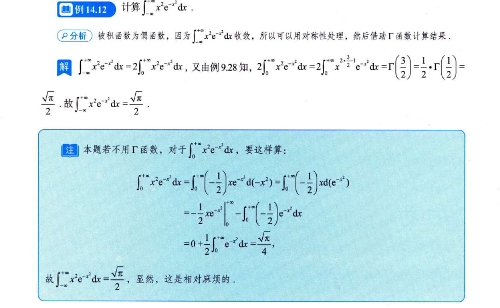

### 1. Gamma 函数的标准定义

在数学中，Gamma 函数 $\Gamma(s)$ 的标准积分定义是（通常要求 $s > 0$）：

$$\Gamma(s) = \int_0^{+\infty} x^{s-1} e^{-x} dx$$
$$\Gamma(s) = 2\int_0^{+\infty} x^{2s-1} e^{-x^2} dx$$
> **注意：** 这里的积分变量用 $x$ 还是 $t$ 都无所谓，关键看形式：一个是**幂函数** $x^{s-1}$，另一个是**指数函数** $e^{-x}$，且积分区间必须是 $(0, +\infty)$。

### 2. Gamma 函数的核心性质（为什么它等于阶乘？）

通过分部积分法，我们可以推导出一个极其重要的**递推公式**：

$$\Gamma(s+1) = s\Gamma(s)$$

有了这个递推公式，魔法就出现了：

- 首先，我们可以算出 $\Gamma(1) = \int_0^{+\infty} e^{-x} dx = 1$。
    
- 根据递推公式：
    
    - $\Gamma(2) = 1 \cdot \Gamma(1) = 1 = 1!$
        
    - $\Gamma(3) = 2 \cdot \Gamma(2) = 2 \cdot 1 = 2!$
        
    - $\Gamma(4) = 3 \cdot \Gamma(3) = 3 \cdot 2 \cdot 1 = 3!$
        

以此类推，当 $n$ 为正整数时，就得到了你死死记住的那个公式：

$$\Gamma(n+1) = n!$$

这也是为什么我们说你记住的公式 $\int_0^{+\infty} x^n e^{-x} dx = n!$ 实际上求的是 $\Gamma(n+1)$。

### 3. 考研/高数必背的三个“开挂”结论

在做积分题时，如果你能敏锐地察觉到被积函数可以凑成 Gamma 函数的形式，很多极其复杂的广义积分就能瞬间秒杀。除了上面的阶乘公式，你还需要记住以下两个结论：

- **半整数的基准值：**
    
    $$\Gamma\left(\frac{1}{2}\right) = \sqrt{\pi}$$
    
- **高斯积分（也就是上一题用到的结论）：**
    
    结合 $\Gamma(1/2) = \sqrt{\pi}$ 和换元法，就得到了高斯积分的值：
    
    $$\int_0^{+\infty} e^{-x^2} dx = \frac{\sqrt{\pi}}{2}$$

**实战串联：**

如果题目让你求 $\int_0^{+\infty} x^2 e^{-x^2} dx$，你会怎么做？

不用傻傻去算，直接令 $t = x^2$ 换元，它就会变成 $\frac{1}{2}\Gamma(3/2)$。而根据递推公式 $\Gamma(3/2) = \frac{1}{2}\Gamma(1/2) = \frac{\sqrt{\pi}}{2}$，最终答案就是 $\frac{\sqrt{\pi}}{4}$。这比分部积分快得多！

例：
