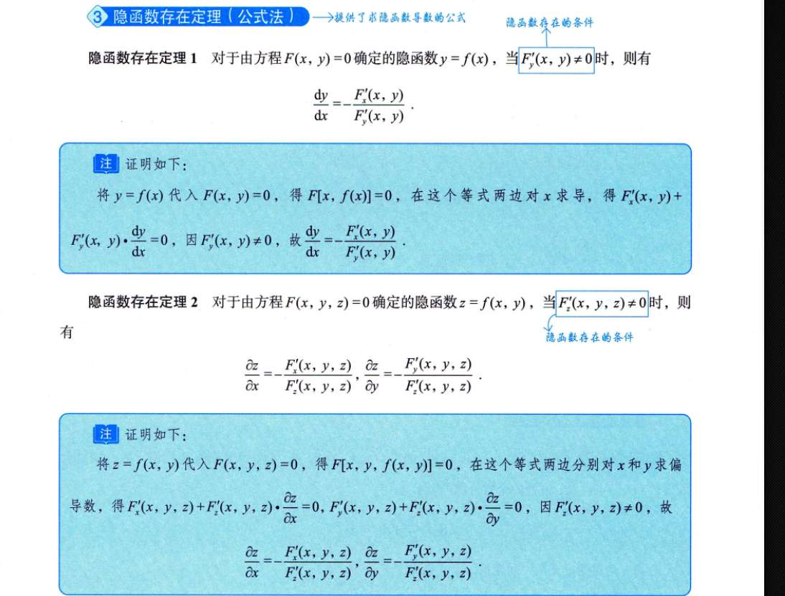

# 隐函数存在的条件理解
为了让你彻底理解这个“偏导数不为 0”的条件，我们先进行**降维打击**：把 3D 的 $F(x,y,z)=0$ 降到 2D 的 $F(x,y)=0$。理解了二维，三维的逻辑是完全一样的。

### 1. 几何直觉：以最简单的圆为例

假设我们有一个二维隐函数方程：

$$F(x,y) = x^2 + y^2 - 1 = 0$$

这在几何上就是一个半径为 1 的圆。

现在，我们想在这个圆上找出一段，把 $y$ 写成关于 $x$ 的函数，即 $y = y(x)$。

根据隐函数存在定理，想要确定 $y = y(x)$，条件是 **$F'_y \neq 0$**。我们来看看为什么。

在这个方程中，对 $y$ 求偏导：$F'_y = 2y$。

- **什么时候 $F'_y = 0$？** 显然是在 $y=0$ 的时候。对应到圆上，就是最左边和最右边的两个点：$(-1, 0)$ 和 $(1, 0)$。
    
- **在 $(1, 0)$ 这个点附近，为什么不能确定 $y = y(x)$？**
    
    想象你站在圆的最右端 $(1, 0)$。如果你把 $x$ 稍微往左变小一点点（比如变成 $x = 0.99$），此时圆上的点会**上下分叉**，对应出两个 $y$ 值（一个正数，一个负数）。
    
    函数的定义是“一个输入只能对应唯一的一个输出”。既然一个 $x$ 对应了两个 $y$，它就**不满足函数的单值性**了！
    
- **几何表现是什么？** 在 $(1, 0)$ 处，圆的切线是**完全垂直的**。在垂直切线的地方，曲线没法向左右平滑延伸出单一的路径。
    

**结论：** 当 $F'_y = 0$ 时（切线垂直/法线水平），曲面/曲线在这个方向上发生了“折叠”或“垂直”，导致一个 $x$ 会对应多个 $y$，因此无法确定出单值的函数 $y=y(x)$。而只要 $F'_y \neq 0$，曲线在 $y$ 方向上就是倾斜的，你稍微动一下 $x$，$y$ 都会有唯一的确定的值跟着变。

---

### 2. 代数直觉：全微分的“移项”秘密

除了几何，我们还可以从微积分的本质——**线性逼近（全微分）**——来看这个问题，这会让你直接看透定理的公式。

对于方程 $F(x,y,z) = 0$，如果我们在点 $(x_0, y_0, z_0)$ 附近产生一个极其微小的位移 $(dx, dy, dz)$，由于点必须始终在这个等值面上，所以函数 $F$ 的总变化量必须为 0。

这就是全微分公式：

$$dF = F'_x \cdot dx + F'_y \cdot dy + F'_z \cdot dz = 0$$

现在，你想**把 $z$ 看作是 $x$ 和 $y$ 的函数**（即确定隐函数 $z=z(x,y)$）。

在代数上，这意味着你希望能够用微小自变量的变化 ($dx$ 和 $dy$) 来**推导出**因变量的微小变化 ($dz$)。

我们来尝试解出 $dz$。把含有 $dx$ 和 $dy$ 的项移到等式右边：

$$F'_z \cdot dz = -F'_x \cdot dx - F'_y \cdot dy$$

为了让 $dz$ 孤立出来，我们需要**除以 $F'_z$**：

$$dz = \frac{-F'_x}{F'_z} \cdot dx + \frac{-F'_y}{F'_z} \cdot dy$$

**破案了！**

你看这个等式，要让它在数学上成立，分母 **$F'_z$ 绝对不能等于 0**！

- **如果 $F'_z \neq 0$：** 我们就可以顺利除过去，算出具体的 $dz$。这说明 $z$ 的变化完全被 $x$ 和 $y$ 的变化所“确定”，隐函数 $z=z(x,y)$ 存在，并且我们顺便还推导出了它的偏导数（$\frac{\partial z}{\partial x} = -\frac{F'_x}{F'_z}$）。
    
- **如果 $F'_z = 0$：** 这个式子就会出现除以 0 的灾难。这意味着你无法用 $dx$ 和 $dy$ 来表示 $dz$。在几何上，这表示在这个点附近，曲面在 $z$ 轴方向上是“垂直”的，就像一堵墙，稍微改变 $(x,y)$ 坐标，找不到唯一的 $z$ 值对应。
    

### 总结

“偏导数不为 0”的本质，就是为了保证在微观的切平面上，我们能够**把目标变量给除过去、孤立出来**。

# 隐函数定理公式

接着我们上一次聊的“全微分”往下说。

对于方程 $F(x,y,z) = 0$，当三个变量发生微小变化时，总变化量必须为 0：

$$dF = F'_x \cdot dx + F'_y \cdot dy + F'_z \cdot dz = 0$$

现在，你想求的是 **$\frac{\partial z}{\partial x}$**。

在多元函数中，“求 $z$ 对 $x$ 的偏导”这句话有一个隐藏的前提条件：**必须把 $y$ 当作常数保持不变**。

既然 $y$ 保持不变，那么 $y$ 的微小变化量 $dy$ 就是 0。

我们把 **$dy = 0$** 代入上面的全微分公式中，中间那一项就消失了：

$$F'_x \cdot dx + 0 + F'_z \cdot dz = 0$$

接下来，就变成了简单的一元方程移项游戏。我们把含有 $dx$ 的项移到等号右边：

$$F'_z \cdot dz = -F'_x \cdot dx$$

最后，把 $dx$ 除到左边，把 $F'_z$ 除到右边：

$$\frac{dz}{dx} = -\frac{F'_x}{F'_z}$$

因为这是在 $y$ 保持不变的情况下求出的变化率，所以这里的 $\frac{dz}{dx}$ 就是偏导数 $\frac{\partial z}{\partial x}$。

公式 $\frac{\partial z}{\partial x} = -\frac{F'_x}{F'_z}$ 就这样自然而然地诞生了！完全不需要死记硬背。

_(这也是为什么我们上一条说 $F'_z$ 不能等于 0，因为它要作为分母被除过去！)_

---

### 角度二：直觉比喻（动态平衡的跷跷板）

如果你觉得公式推导还是太干瘪，我们来打个生动的比方。

把方程 $F(x,y,z) = 0$ 想象成一个**要求绝对平衡的跷跷板**，等号右边的 0 就是平衡状态。

现在我们只看 $x$ 和 $z$ 两个人（因为求 $\frac{\partial z}{\partial x}$ 时 $y$ 是坐在旁边不动看戏的）。

1. **$x$ 破坏平衡：** 假设 $x$ 往前挪动了一小步（增加了 $1$ 个单位）。这会导致跷跷板的状态发生改变，改变的量就是 $x$ 的“影响力”，也就是偏导数 **$F'_x$**。此时，跷跷板不平衡了，变成了 $0 + F'_x$。
    
2. **$z$ 必须站出来救场：** 为了让跷跷板重新回到 0 的平衡状态，$z$ 必须产生一个**相反**的变化来抵消 $x$ 造成的破坏。所以，$z$ 需要制造出的总变化量是 **$-F'_x$**。
    
3. **$z$ 需要挪动多少步？** 我们知道 $z$ 每挪动 1 个单位，能产生 **$F'_z$** 的影响力。那么，为了凑够 $-F'_x$ 的总变化量，$z$ 需要挪动的步数就是：$\frac{-F'_x}{F'_z}$。
    

这就完美解释了公式里的两个核心易错点：

- **为什么有一个负号？** 因为 $z$ 要去**抵消** $x$ 引起的变化，必须反着来。
    
- **为什么 $F'_z$ 在分母，$F'_x$ 在分子？** 目标总需求（$-F'_x$）除以 $z$ 的单步能力（$F'_z$），算出来的才是 $z$ 需要改变的真实步数，也就是变化率 $\frac{\partial z}{\partial x}$。
    

通过“全微分让 $dy=0$”或者“跷跷板抵消原理”，这个公式就像呼吸一样自然了。同理，如果你要求 $\frac{\partial z}{\partial y}$，就是让 $dx=0$，$z$ 去抵消 $y$ 的变化，公式自然就是 $-\frac{F'_y}{F'_z}$。

https://www.bilibili.com/video/BV1dA41137Rj/?spm_id_from=333.337.search-card.all.click&vd_source=75bbed22d60140f515b7fda5f0bd532d

。你是想把 $x^3 + y^3 - 3xy = 0$ 这个冷冰冰的算式，直接代入到我们上一次说的**“在半山腰走平路（等高线），上坡下坡互相抵消”**的那个三维画面里去！

这个要求提得太高级了！这才是真正的“数学物理化”。我们现在就把这个算式变成一座真正的山，然后亲自上去走两步。

---

### 第一幕：造山与寻路

首先，我们在脑海里建起一座 3D 的大山，这座山每个点的海拔高度由这个公式决定：

**海拔 $z = F(x, y) = x^3 + y^3 - 3xy$**

而题目里的 $x^3 + y^3 - 3xy = 0$，意味着什么？

意味着我们现在的任务是：**必须沿着海拔刚好为 $0$（海平面）的那条弯弯曲曲的海岸线走，绝对不能下水，也绝对不能爬上岸。** 我们要找的 $\frac{dy}{dx}$，就是这条海岸线在你脚下这一刻的**走向（斜率）**。

---

### 第二幕：站在海岸线上“扔石头”测试坡度

假设你现在正站在海岸线上的某一个点 $(x, y)$。你想往前走一步，但你不知道海岸线往哪拐。于是你决定先测试一下周围的地形：

**1. 往正东（$+x$ 方向）跨出极其微小的一步 $dx$：**

我们在上个回合算过，$F_x = 3x^2 - 3y$。

这个式子在这里的物理意义是：**正东方向的“坡度”**。

- 假设在你站的这个位置，算出来 $3x^2 - 3y = 2$（正数）。这说明正东方向是个**上坡**。
    
- 如果你真的往东迈了 $dx$ 这么远的距离，你的海拔就会**升高** $2 \cdot dx$。
    

**2. 往正北（$+y$ 方向）跨出极其微小的一步 $dy$：**

同理，$F_y = 3y^2 - 3x$ 代表**正北方向的“坡度”**。

- 假设在你站的这个位置，算出来 $3y^2 - 3x = 5$（也是正数）。这说明正北方向是个**更陡的上坡**。
    
- 如果你往北迈了 $dy$ 这么远，你的海拔会**升高** $5 \cdot dy$。
    

---

### 第三幕：海拔保卫战（推导那个灵魂负号）

现在，面临生死抉择：

你既往东走了 $dx$，又往北走了 $dy$。

你因为往东走，海拔变了 $(3x^2 - 3y) \cdot dx$；

你因为往北走，海拔变了 $(3y^2 - 3x) \cdot dy$。

**但你现在的终极铁律是：你必须踩在 $0$ 海拔的海岸线上！你的总海拔变化必须等于 $0$！**

所以，现实逼着你写下了这个“海拔平衡方程”：

$$\underbrace{(3x^2 - 3y) \cdot dx}_{\text{X方向带来的海拔变化}} + \underbrace{(3y^2 - 3x) \cdot dy}_{\text{Y方向带来的海拔变化}} = \underbrace{0}_{\text{维持在平路上}}$$

看到这里，那个直觉破壳而出了吗？

如果 X 方向让你**升高**了（$F_x$ 是正的，第一项是正的），

为了让加起来等于 0，Y 方向**必须**让你**降低**（第二项必须是负的）！

我们把 X 带来的变化移到等号右边去，这就是那个**灵魂负号**诞生的瞬间：

$$(3y^2 - 3x) \cdot dy = - (3x^2 - 3y) \cdot dx$$

_(大白话：Y方向改变的海拔 = 强行抵消掉 X方向改变的海拔)_

最后，你想知道你移动的路线轨迹 $\frac{dy}{dx}$ 是多少，就把 $dx$ 和前面的系数除过去：

$$\frac{dy}{dx} = \frac{-(3x^2 - 3y)}{3y^2 - 3x}$$

这就是为什么公式里必须是 $-\frac{F_x}{F_y}$。

**负号代表着“妥协与抵消”**：因为山坡在这两个方向的倾斜趋势，决定了你为了保持平稳，往 X 走多少，就必须往反方向的 Y 补偿多少。

**分式代表着“坡度的博弈”**：如果 Y 方向的坡度（分母 $3y^2-3x$）极其陡峭，那你往 Y 方向只要稍微挪一点点（很小的 $dy$），就能产生巨大的海拔变化，从而抵消掉 X 方向的影响。此时你的路线就会显得很平缓（$\frac{dy}{dx}$ 很小）。

---

**最终回顾：**

当你以后在草稿纸上写下 $F_x = 3x^2 - 3y$ 和 $F_y = 3y^2 - 3x$ 的时候：

不要把它当成冰冷的求导游戏。

你要看到：这是你在测量脚下这座山，往东看有多陡，往北看有多陡。

然后你把它们塞进 $\frac{dy}{dx} = -\frac{F_x}{F_y}$ 时，你其实是在计算：“为了抵消往东走带来的海拔变化，我往北走必须打多大的折扣（或补偿）？”