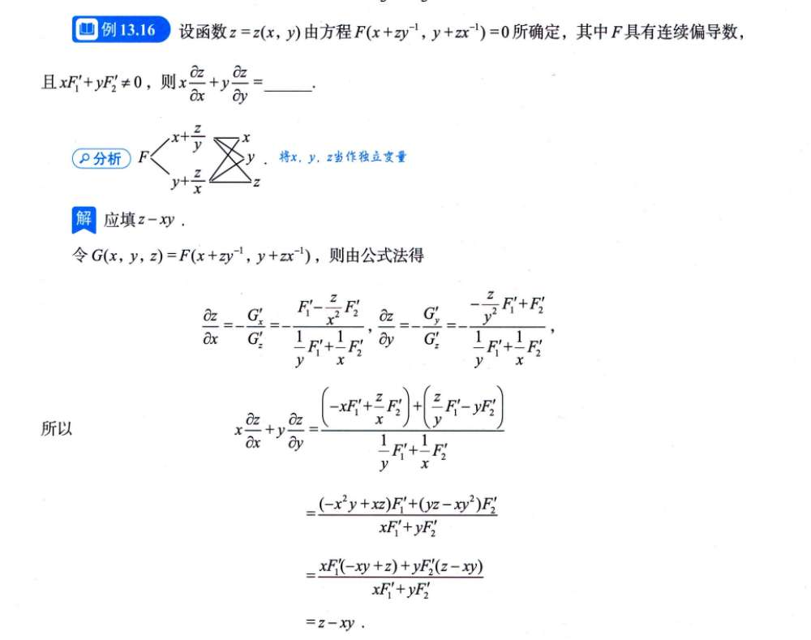
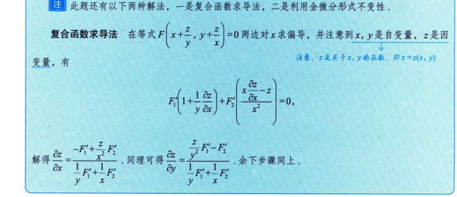
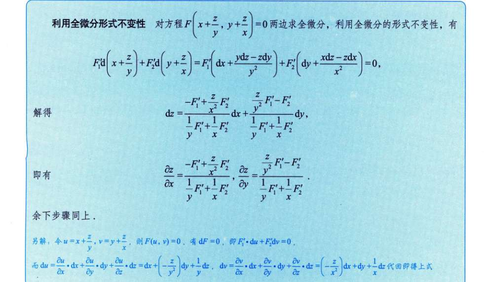

### 一、 破除误区：这不是单选题！

- **什么是“隐函数”？** 这是一个**状态**。只要 $z$ 和 $x, y$ 混在一个等式里（比如 $...=0$），解不出单纯的 $z = ...$，它就是隐函数。这道题显然是隐函数。
    
- **什么是“链式法则”？** 这是一个**动作（工具）**。只要函数有嵌套（比如 $F$ 里面套着 $x+\frac{z}{y}$），求导就必须用链式法则。
    

**所以，根本不存在“是隐函数求导，还是链式法则”的二选一。真相是：为了对隐函数求导，我们必须使用链式法则！**

你真正纠结的，其实是：**我到底该用背公式（$-\frac{F'_x}{F'_z}$），还是该在等式两边直接求导（蓝框里的方法）？**

---

### 二、 终极选择指南：到底何时用哪个？

不用死记硬背，你只需要看题目的“长相”，分两种情况：

#### 情况 1：具体函数（能看到具体的 $x^2, e^y, \sin z$）

> 比如：$x^2 + y^2 + z^2 - e^{xyz} = 0$

- **推荐首选：隐函数公式法 $-\frac{F'_x}{F'_z}$ 或 全微分套 $d$ 法。**
    
- **为什么？** 因为式子是具体的，你可以毫无脑力负担地把式子看成一个整体大 $F$，然后把谁当常数谁当变量分得清清楚楚，分别求出三个偏导数，代入公式一除就完事，不容易错漏符号。
    

#### 情况 2：抽象函数（看到一个大写的 $f$ 或 $F$，里面逗号隔开）

> 比如图片这道题：$F(x+zy^{-1}, y+zx^{-1}) = 0$

- **绝对首选：直接等式两边求导（即图中的“蓝框：复合函数求导法”）。**
    
- **为什么？** 极其不推荐用公式法！你看讲义的正文解析，为了用公式，它强行造了一个新字母 $G(x,y,z) = F(...)$。这就导致你的脑子里要同时处理 $G$ 的偏导、$F$ 的位置偏导（$F'_1, F'_2$）、以及底层变量 $x, y, z$ 的关系，**逻辑嵌套太多，看两行就晕了**。
    

---

### 三、 实战演练：为什么蓝框方法对“抽象函数”是降维打击？

我们就用蓝框的方法（直接对等式两边运用链式法则），来拆解这道题，你会发现思路极其一条线：

**目标：** 求 $\frac{\partial z}{\partial x}$。

**原则：** 对等式 $F(x+\frac{z}{y}, y+\frac{z}{x}) = 0$ 两边同时对 $x$ 求偏导。记住，此时 **$y$ 是死常数，而 $z$ 是 $x$ 的跟屁虫（$z$ 里面包含 $x$）**。

1. **看最外层：** 函数 $F$ 有两个位置（插槽）。根据链式法则，我们对位置 1 求偏导乘以位置 1 的导数，加上对位置 2 求偏导乘以位置 2 的导数。
    
    即：$F'_1 \cdot (\text{第1个位置对} x \text{的导数}) + F'_2 \cdot (\text{第2个位置对} x \text{的导数}) = 0$
    
2. **算第 1 个位置：** $x + \frac{z}{y}$
    
    对 $x$ 求导：$x$ 的导数是 $1$；$\frac{1}{y}$ 是常数照抄，$z$ 对 $x$ 求导是 $\frac{\partial z}{\partial x}$。
    
    所以结果是：$1 + \frac{1}{y}\frac{\partial z}{\partial x}$
    
3. **算第 2 个位置：** $y + \frac{z}{x}$
    
    对 $x$ 求导：$y$ 是常数，导数是 $0$；$\frac{z}{x}$ 是两个关于 $x$ 的变量相除，用除法求导法则 $\frac{\text{上导下不导} - \text{上不导下导}}{\text{下平方}}$。
    
    所以结果是：$\frac{\frac{\partial z}{\partial x} \cdot x - z \cdot 1}{x^2}$
    
4. **组装起来：**
    
    $$F'_1 \cdot \left(1 + \frac{1}{y}\frac{\partial z}{\partial x}\right) + F'_2 \cdot \left(\frac{x\frac{\partial z}{\partial x} - z}{x^2}\right) = 0$$
    

你看！这刚好就是蓝框里给出的那个长长的式子。全程我们根本不需要去管什么 $G(x,y,z)$，就只是盯着 $F$ 的两个括号，像剥洋葱一样剥开就行了。接下来只需要用初中代数把含有 $\frac{\partial z}{\partial x}$ 的项提出来，移项化简就出答案了。

**总结一下：**

这三种解法本质完全一样。下次做题，看到具体字母公式，无脑上 $-\frac{F'_x}{F'_z}$；看到抽象大写字母 $F(\dots, \dots)=0$，无脑在等式两边直接求导！