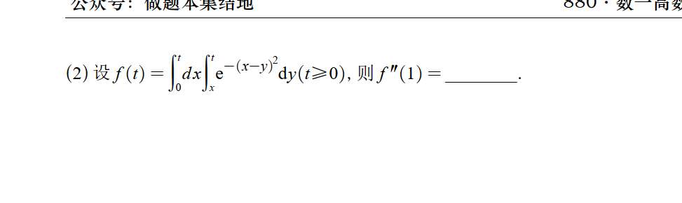

# 1

这种带有变上限的二重积分求导，如果直接硬套莱布尼茨公式（变限积分求导公式）计算量会比较大，且容易出错。

对付这类题目，最优雅且不易出错的方法是：**先换元化简，再求导**。

我们可以分两步进行变量代换，将复杂的积分形式转化为最简单的单变量变限积分。

### 1. 内层积分换元

原函数为：

$$f(t) = \int_{0}^{t} \left( \int_{x}^{t} e^{-(x-y)^2} \text{d}y \right) \text{d}x$$

观察内层积分 $\int_{x}^{t} e^{-(x-y)^2} \text{d}y$，积分变量是 $y$，$x$ 相当于常数。

我们令 $u = y - x$，那么 $\text{d}u = \text{d}y$。

- 当下限 $y = x$ 时，$u = 0$；
    
- 当上限 $y = t$ 时，$u = t - x$。
    

代入后，原函数变为：

$$f(t) = \int_{0}^{t} \left( \int_{0}^{t-x} e^{-u^2} \text{d}u \right) \text{d}x$$

### 2. 外层积分换元

现在外层积分的变量是 $x$。为了把上限 $t-x$ 变得更简单，我们再次换元。

令 $v = t - x$，那么 $\text{d}x = -\text{d}v$。

- 当下限 $x = 0$ 时，$v = t$；
    
- 当上限 $x = t$ 时，$v = 0$。
    

代入外层积分：

$$f(t) = \int_{t}^{0} \left( \int_{0}^{v} e^{-u^2} \text{d}u \right) (-\text{d}v)$$

利用负号交换积分上下限：

$$f(t) = \int_{0}^{t} \left( \int_{0}^{v} e^{-u^2} \text{d}u \right) \text{d}v$$

### 3. 求导

经过两次换元，$f(t)$ 变成了一个非常标准的变上限积分（它的被积函数本身也是一个变上限积分）。现在求导就变得非常简单了，直接使用微积分基本定理：

**求一阶导数 $f'(t)$：**

直接把上限 $t$ 代入内部的被积函数：

$$f'(t) = \int_{0}^{t} e^{-u^2} \text{d}u$$

**求二阶导数 $f''(t)$：**

再次对变上限积分求导：

$$f''(t) = e^{-t^2}$$

### 4. 代入求值

题目要求计算 $f''(1)$，将 $t = 1$ 代入即可：

$$f''(1) = e^{-1^2} = e^{-1} = \frac{1}{e}$$

所以，最终答案是 **$e^{-1}$** 或 **$\frac{1}{e}$**。