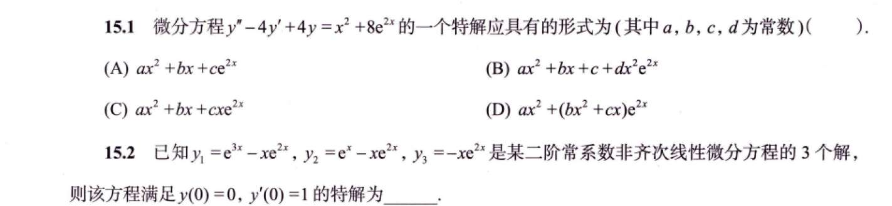
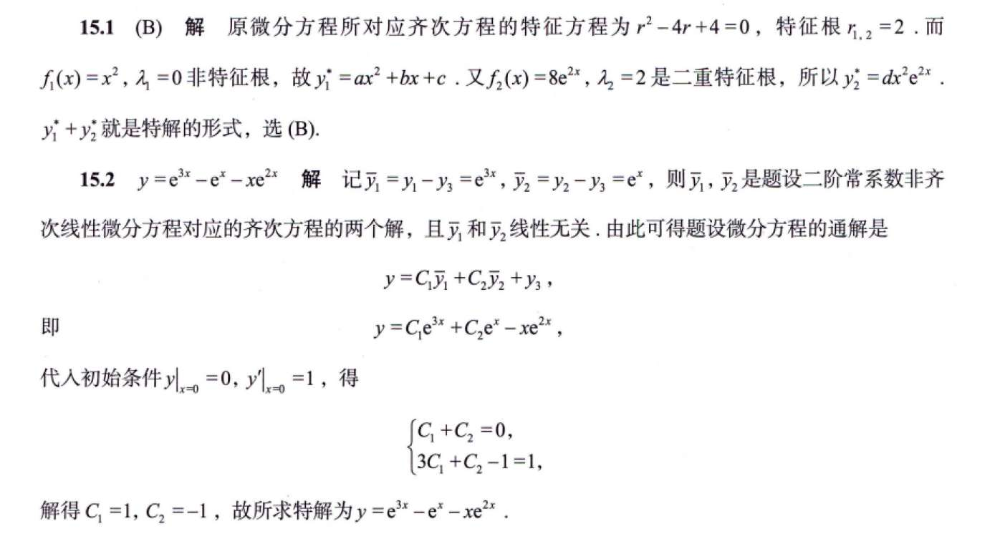
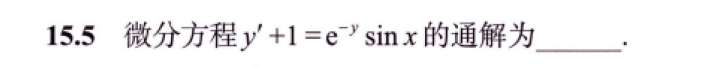
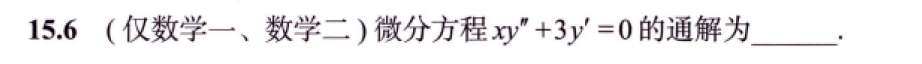
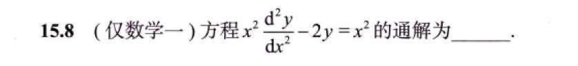
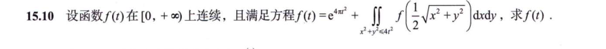
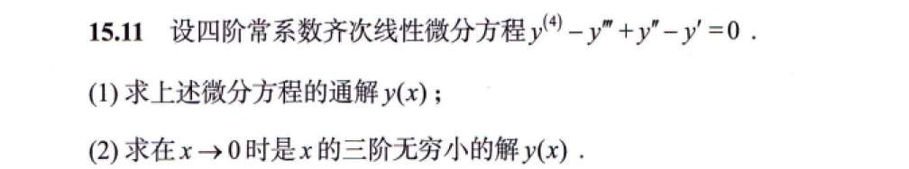

# 习题

## 1，2 特解齐次解理解

## 5 变形

## 6 化简

### 第一步：降阶与分离变量

题目：$xy'' + 3y' = 0$

因为方程里缺了 $y$，所以我们果断使用你说的换元法：

令 $y' = p$，那么 $y'' = \frac{dp}{dx}$。

代入原方程，就从二阶降到了一阶：

$$x\frac{dp}{dx} + 3p = 0$$

把 $p$ 和 $x$ 各回各家（分离变量）：

$$x\frac{dp}{dx} = -3p$$

$$\frac{dp}{p} = -\frac{3}{x}dx$$

---

### 第二步：第一次积分与常数的“华丽变身”

等号两边同时积分：

$$\int \frac{1}{p} dp = \int -\frac{3}{x} dx$$

积分出来以后，**常数第一次登场**：

$$\ln|p| = -3\ln|x| + C$$

> **💡 核心知识点：对数常数的“凑脸熟”技巧**
> 
> 到了这一步，左边是 $\ln$，右边也有 $\ln$。如果你把常数写成孤零零的 $C$，下一步解 $p$ 的时候就会变成 $p = e^{-3\ln|x| + C}$，特别难看。
> 
> **怎么办？** 因为 $C$ 是可以在 $(-\infty, +\infty)$ 随便取的任意常数，那我们完全可以把它写成 $\ln|C_1|$ 的形式（因为 $\ln$ 的值域也是实数集）。
> 
> 这样写纯粹是为了等会儿能利用对数的加法公式合并！

我们把 $C$ 换成 $\ln|C_1|$，并利用对数法则（$-3$ 放进指数里）：

$$\ln|p| = \ln|x^{-3}| + \ln|C_1|$$

$$\ln|p| = \ln|C_1 x^{-3}|$$

现在两边都有 $\ln|\dots|$，直接脱掉对数符号：

$$p = \pm C_1 x^{-3}$$

> **💡 核心知识点：正负号的“黑洞吸收”**
> 
> 这里的 $\pm C_1$ 看着很烦。但你想，$C_1$ 本来就是个任意正常数，前面加个 $\pm$，它就变成了一个**可以为正、可以为负的全新任意常数**。
> 
> 为了书写干净，数学家们会毫不留情地把 $\pm$ 号直接“吸收”进常数里，重新命名为一个新的常数。为了省字母，通常还是写成 $C_1$（此时的 $C_1$ 包含了正负）。

所以，化简后我们得到了极其干净的 $p$：

$$p = C_1 x^{-3}$$

---

### 第三步：第二次积分与常数的再次合并

别忘了，我们的 $p$ 其实是 $y'$：

$$\frac{dy}{dx} = C_1 x^{-3}$$

为了求 $y$，我们把 $dx$ 乘过去，进行**第二次积分**：

$$dy = C_1 x^{-3} dx$$

$$y = \int C_1 x^{-3} dx$$

根据幂函数的积分公式 $\int x^n dx = \frac{x^{n+1}}{n+1}$：

$$y = C_1 \left( \frac{x^{-2}}{-2} \right) + C_2$$

此时，**第二次积分产生了第二个常数 $C_2$**。

> **💡 核心知识点：系数的“黑洞吸收”**
> 
> 我们来看这一坨：$C_1 \cdot \frac{1}{-2}$。
> 
> 刚才说了，常数是个无底洞。一个任意常数 $C_1$ 乘以一个具体的数字 $-\frac{1}{2}$，结果依然是一个任意常数！
> 
> 所以，我们再次发动“黑洞吸收”大法，令新的 $C_1^* = -\frac{1}{2} C_1$。
> 
> 在最终写答案时，为了美观，我们连星号都不写，直接用一个干净的 $C_1$ 来代表这一整坨。

于是，式子变成了最终的完美形态：

$$y = C_1 x^{-2} + C_2$$

或者写成分数形式：

$$y = \frac{C_1}{x^2} + C_2$$

### 多解法：欧拉
### 第一步：给它穿上“欧拉”的马甲（配凑次幂）

你可能会纳闷，欧拉方程的标准脸不是 $x^2y'' + pxy' + qy = 0$ 吗？这道题怎么少了一个 $x$？

没关系，既然它等号右边是 0，我们直接**等式两边同乘一个 $x$**，强行给它凑出完美的“等维匹配”：

$$x^2y'' + 3xy' = 0$$

看！现在它完全符合欧拉方程的特征了：二阶导配 $x^2$，一阶导配 $x^1$。这里的常数 $p=3, q=0$。

### 第二步：祭出换元法“秒杀公式”

按照我们上一节总结的欧拉方程套路，直接令 **$x = e^t$**（即 $t = \ln x$）。

不需要再苦哈哈地推导一遍链式法则了，直接默写那两个替换公式：

- $xy' \implies \frac{dy}{dt}$
    
- $x^2y'' \implies \frac{d^2y}{dt^2} - \frac{dy}{dt}$
    

把它们代入到我们刚才凑好的 $x^2y'' + 3xy' = 0$ 中：

$$(\frac{d^2y}{dt^2} - \frac{dy}{dt}) + 3(\frac{dy}{dt}) = 0$$

合并同类项，见证奇迹的时刻：

$$\frac{d^2y}{dt^2} + 2\frac{dy}{dt} = 0$$

或者写成我们更习惯的形式：**$y''(t) + 2y'(t) = 0$**。

你看！烦人的变系数 $x$ 瞬间灰飞烟灭，它变成了一个极其温顺的**常系数线性齐次微分方程**！

### 第三步：常规操作，解常系数方程

这下就是闭着眼睛都能解的送分题了。

写出特征方程：

$$r^2 + 2r = 0$$

提取公因式：

$$r(r + 2) = 0$$

解得两个不相等的实数特征根：**$r_1 = 0, r_2 = -2$**。

既然有两个不同的实根，按照公式，它的通解（注意此时自变量是 $t$）就是：

$$y = C_1 e^{0 \cdot t} + C_2 e^{-2t}$$

因为 $e^0 = 1$，所以化简为：

$$y = C_1 + C_2 e^{-2t}$$

### 第四步：脱下马甲，变回 $x$

最后一步，千万别忘了我们的自变量本来是 $x$。

因为我们一开始令了 $x = e^t$，所以 $e^{-2t}$ 可以写成 $(e^t)^{-2}$，也就是 **$x^{-2}$**。

把它代回去：

$$y = C_1 + C_2 x^{-2}$$

稍微整理一下排版：

$$y = C_1 + \frac{C_2}{x^2}$$

## 8 欧拉

**为什么书上要分 $x>0$ 和 $x<0$ 写那么一大坨？**

这是教科书必须保持的“严谨求生欲”。

因为第一步换元时 $t = \ln x$，对数函数里的 $x$ 必须大于 0！那万一题目里的 $x$ 是负数怎么办呢？

数学家就打了个补丁：如果 $x<0$，我们就令 $x = -e^t$，这样就能保证里面是正数。经过同样一套流程算下来，最后把两个结果合并时，为了兼容正负号，就在对数里面加上了绝对值，变成 **$\ln|x|$**，并且把常数项统一写成带绝对值的形式。

**考场实战建议：**

在考研或期末考的大题中，除非题目明确告诉你定义域，否则你默认 $x>0$ 去算，最后在写答案的时候，**顺手把 $\ln x$ 写成 $\ln|x|$**，这就能拿到满分，完全不需要像书上那样写两遍推导过程。

## 10 含积分，转化为微分方程

化为了一阶非齐次微分方程

## 11

第二问其实是一个极限题