# 书籍
## 概念
- 常微分方程
	- 线性微分方程
		- n 阶常系数线性微分方程
			- n 阶常系数**齐次/非齐次**线性微分方程

- 微分方程的解
	- 通解
	- 特解

## 可分离微分方程
主要特点是，能化简为 xx=xx，xx 都是整体，也就是乘积多。
- 分离变量
- 换元后分离变量

接着积分即可。
注意 C 的格式，很灵活

## 一阶线性微分方程

- **一阶**：因为它最高只有一阶导数 $y'$。
    
- **线性**：这是重点！这里的“线性”是**针对未知函数 $y$ 和它的导数 $y'$ 来说的**。在方程里，$y'$ 和 $y$ 的次数都是 $1$ 次。
    
    - 不能有 $y^2$、$y^3$（这叫非线性）。
        
    - 不能有 $y \cdot y'$ （它们不能互相乘在一起）。
        
    - 不能有 $\sin(y)$、$e^y$ 等复合函数。
        
    - 但是，$x$ 怎么折腾都行！$P(x)$ 和 $Q(x)$ 可以是 $x^2$、$\sin x$、$\ln x$ 等任何关于 $x$ 的函数。
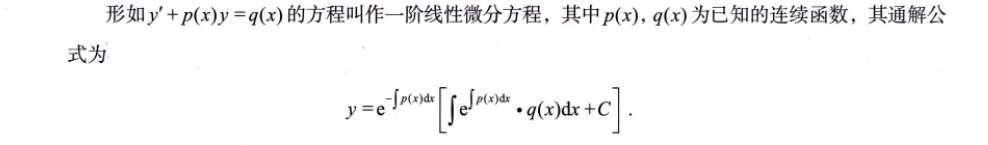

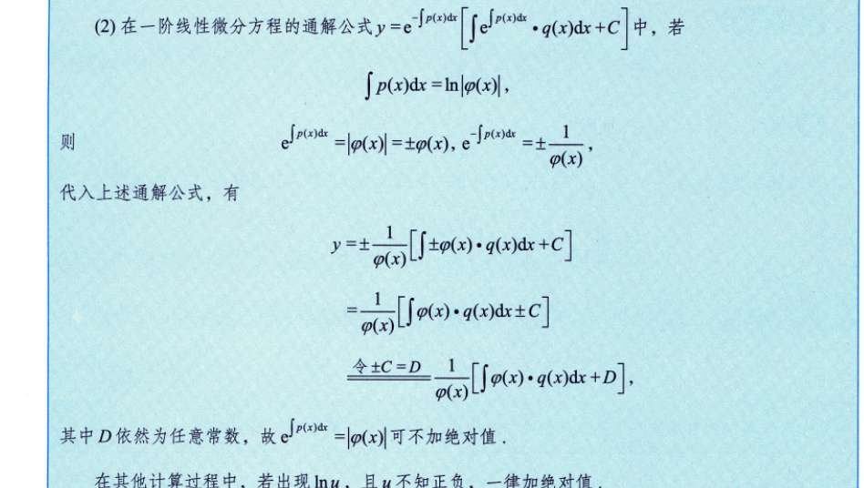
### 有没有可能是它的某个特殊情况是可分离微分方程？

**绝对有可能！** 我们把一阶线性微分方程变形一下，把 $y'$ 留在左边：

$$y' = Q(x) - P(x)y$$

这时候，我们来看看什么时候它能变成你总结的“整体乘积”（可分离变量）：

**特殊情况 1：当 $Q(x) = 0$ 时（这叫一阶齐次线性微分方程）**

方程变成了：$y' = -P(x)y$

写成微商形式：$\frac{dy}{dx} = -P(x)y$

这时候，你把 $y$ 除过去，$dx$ 乘过去：

$$\frac{dy}{y} = -P(x)dx$$

看！**它完美地变成了一个可分离变量微分方程！** 所有的 $y$ 在左边，所有的 $x$ 在右边。

> **🌰 举个例子：** $y' + 2xy = 0$
> 
> 它是一阶线性的（$P(x)=2x$, $Q(x)=0$）。
> 
> 它也是可分离的：$\frac{dy}{dx} = -2xy \implies \frac{dy}{y} = -2xdx$。两边同时积分就是 $\ln|y| = -x^2 + C$。

**特殊情况 2：当 $P(x) = 0$ 时**

方程变成了：$y' = Q(x)$

即：$\frac{dy}{dx} = Q(x)$

直接分离变量：$dy = Q(x)dx$

这也是最最简单的可分离变量方程，直接两边积分就行了。

若不好凑成标准式子，可以试试 x 与 y 互换

## 伯努利
是对于一阶线性微分式子中，q 部分又多乘了 y ^n，此时让化简式子 q 独立，然后换元
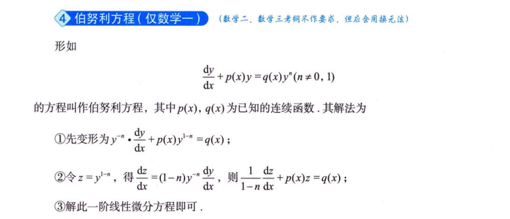

## 二阶化一阶
其实就是个换元
- y'', y'，x时：y'=p (x)，$y'' = \frac{dp}{dx}$
- y'', y', y 时：y'=p (y)，$y'' = p \cdot \frac{dp}{dy}$
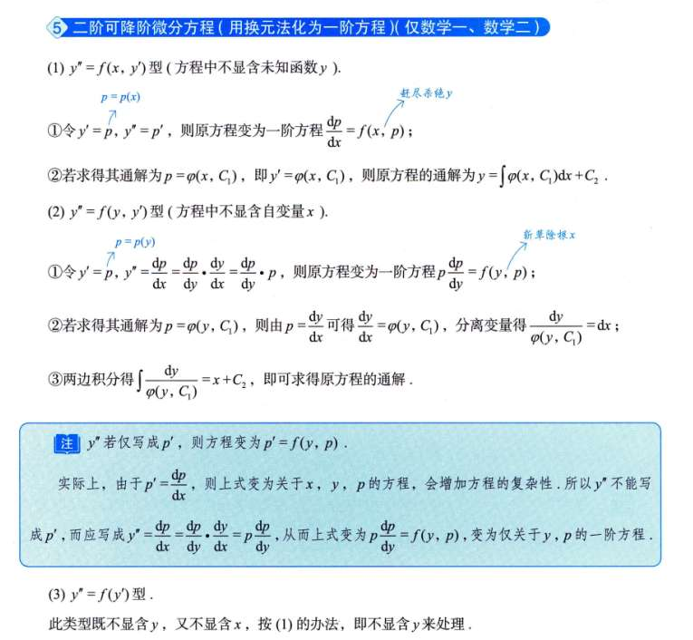

## 全微分方程
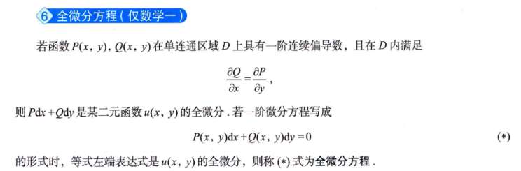

## 二阶线性微分
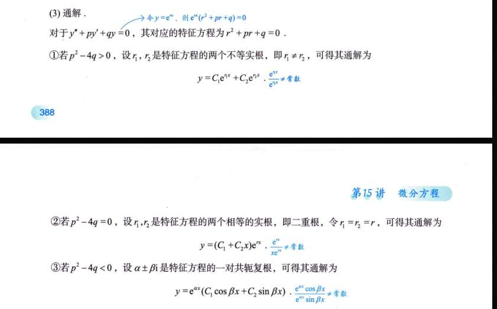
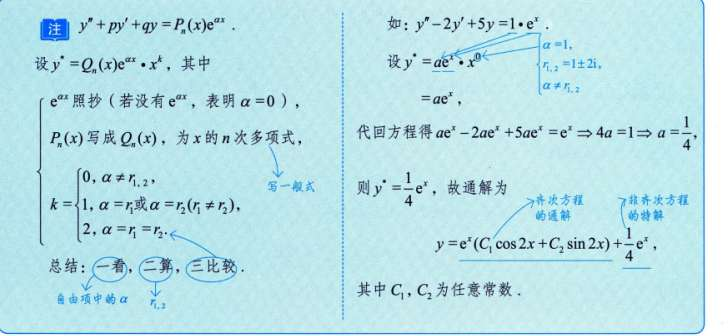
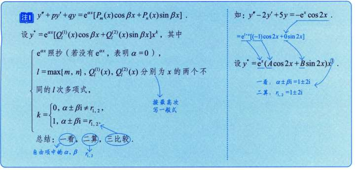

## 欧拉方程
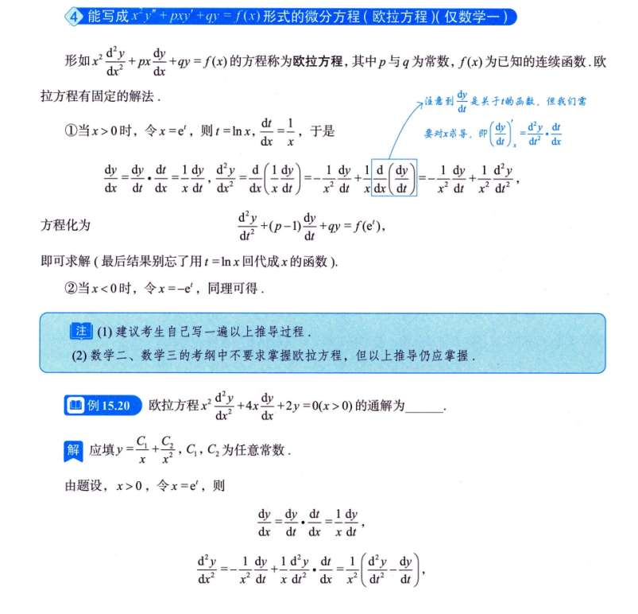
欧拉方程的“脸”非常有辨识度，它的核心特点是四个字：**“等维匹配”**（或者叫齐位次）。

你仔细观察它的左边：$x^2 \frac{d^2y}{dx^2} + px \frac{dy}{dx} + qy$

- 二阶导数 $y''$ 旁边，配的是 $x$ 的**平方** ($x^2$)。
    
- 一阶导数 $y'$ 旁边，配的是 $x$ 的**一次方** ($x^1$)。
    
- 零阶导数 $y$ 旁边，配的是常数（没有 $x$）。
    

**怎么记？** 你就想，求一次导，相当于除以一个 $x$（把次数降了一阶）；为了补偿，前面就必须乘上一个同样次数的 $x$。这种“导数阶数”和“前面系数 $x$ 的幂次”**严格一一对应**的微分方程，就是欧拉方程。

我们在常系数方程里，最喜欢猜的解是 **$y = e^{rt}$**（指数函数求导后，形状不变，只会多出常数 $r$）。

但在欧拉方程这种带有 $x^n$ 的多项式环境里，我们猜什么解最合适？自然是**幂函数 $y = x^r$**。

你看：

- $y = x^r$
    
- $y' = r x^{r-1}$ $\implies$ 两边同乘 $x$，得到 **$x y' = r x^r$**
    
- $y'' = r(r-1)x^{r-2}$ $\implies$ 两边同乘 $x^2$，得到 **$x^2 y'' = r(r-1)x^r$**
**那这跟“换元 $x=e^t$”有什么关系？**

既然欧拉方程的本命解是 $y = x^r$，而常系数方程的本命解是 $y = e^{rt}$。

我们想把欧拉方程变成常系数方程，就是让这两个本命解画等号：

$$x^r = (e^t)^r = e^{rt}$$

看出来了吗？为了让 $x^r$ 变身成 $e^{rt}$，我们必须强行规定 **$x = e^t$** （或者写成 $t = \ln x$）

## 微分方程应用
# 例题

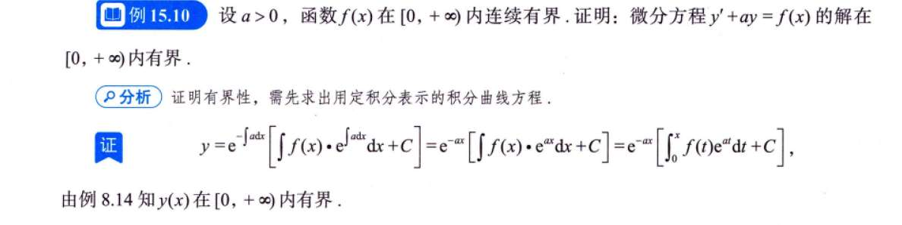

变上限积分 $\int_{x_0}^x f(t) dt$ 的意思就是：从 $x_0$ 这个起点开始，往右刷漆刷到 $x$ 所累积的面积。

- 假设你从 $x_0 = 0$ 开始刷，算出来一个面积，公式是 $\int_0^x f(t) dt + C_1$。
    
- 假设你换个心情，从 $x_0 = 5$ 开始刷，算出来的面积公式是 $\int_5^x f(t) dt + C_2$。
    

这两个公式算出来的面积肯定不一样对吧？差了多少？正好差了从 0 刷到 5 的那块固定面积（这是一个**常数**）。

但是！你注意看通解括号里的尾巴，那里站着一个**任意常数 $C$**。

这个 $C$ 就像是一个可以无限伸缩的“常数垃圾桶”。不管你把起点 $x_0$ 设成 0、设成 5 还是设成 100，由于起点不同而产生的那个面积差（常数），**都会被直接合并到这个任意常数 $C$ 里面去**。

**大白话总结：** 因为有任意常数 $C$ 在兜底，所以变上限积分的下限 $x_0$ 取什么数字，在数学上是完全等价的。

**那为什么偏偏选 0 呢？**

因为题目第一句话说了：“函数 $f(x)$ 在 $[0, +\infty)$ 内连续”。题目的地盘就是从 0 开始的，所以把起跑线 $x_0$ 设在 0，是最自然、最不容易越界的做法。
**已知条件：**

1. $a > 0$
    
2. $f(x)$ 有界，这意味着存在一个正数 $M$，使得对于所有的 $x \ge 0$，都有 $|f(x)| \le M$。
    

**我们要证明的目标：**

证明解 $y(x) = e^{-ax} \left[ \int_0^x f(t)e^{at} dt + C \right]$ 的绝对值 $|y(x)|$ 小于某个固定的常数。

**证明过程（三步走）：**

**第一步：套绝对值，并把式子拆开**

$$|y(x)| = \left| e^{-ax} \int_0^x f(t)e^{at} dt + Ce^{-ax} \right|$$

利用绝对值的三角不等式（$|A+B| \le |A| + |B|$），拆成两块：

$$|y(x)| \le e^{-ax} \left| \int_0^x f(t)e^{at} dt \right| + |C|e^{-ax}$$

_(注意：因为 $e^{-ax}$ 肯定是正数，所以可以直接把它拿稳在绝对值外面)_

**第二步：分别对这两块进行“放缩”（把它们放大，看它们的天花板在哪）**

- **看右边那块 $|C|e^{-ax}$：**
    
    因为 $x \ge 0$ 且 $a > 0$，所以指数 $-ax \le 0$。
    
    那么 $e^{-ax}$ 最大也就是 $e^0 = 1$。
    
    所以，右边这块被封顶了：$|C|e^{-ax} \le |C| \cdot 1 = |C|$。
    
- **看左边那块 $e^{-ax} \left| \int_0^x f(t)e^{at} dt \right|$（核心难点）：**
    
    积分的绝对值，小于等于绝对值的积分（把绝对值符号放进积分里面会变大）：
    
    $$e^{-ax} \left| \int_0^x f(t)e^{at} dt \right| \le e^{-ax} \int_0^x |f(t)|e^{at} dt$$
    
    因为已知 $|f(t)| \le M$，我们把它换成 $M$，继续放大：
    
    $$e^{-ax} \int_0^x |f(t)|e^{at} dt \le e^{-ax} \int_0^x M \cdot e^{at} dt$$
    
    现在，积分号里面只剩下一个很好算的指数函数了，我们直接把它积出来：
    
    $$e^{-ax} \cdot M \left[ \frac{1}{a} e^{at} \right]_0^x = e^{-ax} \cdot \frac{M}{a} (e^{ax} - e^0) = \frac{M}{a} (e^{-ax} \cdot e^{ax} - e^{-ax} \cdot 1)$$
    
    化简后得到：
    
    $$\frac{M}{a} (1 - e^{-ax})$$
    
    同样，因为 $e^{-ax} > 0$，所以 $(1 - e^{-ax}) < 1$。
    
    所以，左边这块也被封顶了：它严格小于 $\frac{M}{a}$。
    

**第三步：把两块的天花板加起来**

综合上面的推导，我们得到：

$$|y(x)| \le \frac{M}{a} (1 - e^{-ax}) + |C| < \frac{M}{a} + |C|$$

你看，$\frac{M}{a} + |C|$ 这是一个彻头彻尾的**常数**（里面没有 $x$ 了）。

既然 $|y(x)|$ 永远小于一个固定的常数，这不就完美证明了 $y(x)$ 是**有界**的吗！

## 18

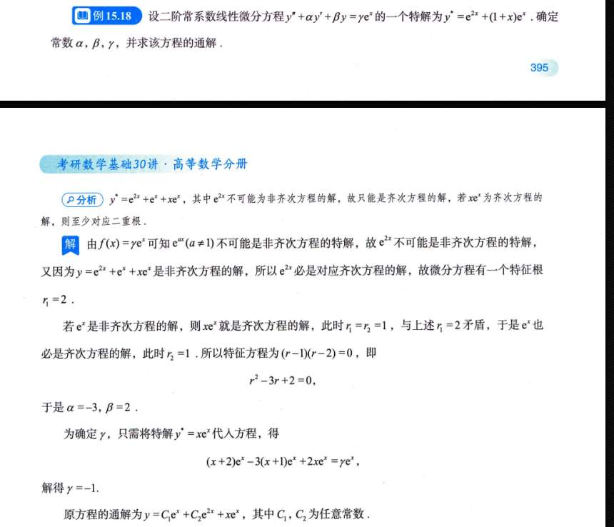