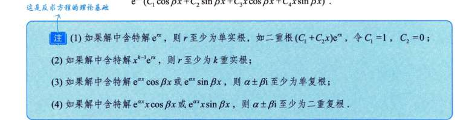

数学的严格定义里，“特解”的意思其实非常宽泛：**只要是一个没有任意常数（比如 $C_1, C_2$），且代入非齐次方程后能让等式成立的具体函数，它就有资格叫“特解”。**

这就会产生你说的两种情况：

### 1. 广义的、混合的特解（考研出题人最爱用来挖坑的）

就像上一题老板给的那个特解 $y^* = e^{2x} + e^x + xe^x$。

- 只要这个组合整体扔进机器里，最后能精准吐出 $\gamma e^x$，它在数学上就是一个完全合法的“特解”。
    
- 既然它合法，出题人就可以故意在这个特解里“塞私货”，把几个“摸鱼的”（齐次解，代入后产出为0）和那个真正“干活的”（纯正特解）打包在一起给你。反正摸鱼的加进去也不影响最终产出。
    

### 2. 我们自己设的“纯正”特解（做题时求的）

当我们用“待定系数法”去解题时，我们求的是那个**“最精简、最纯正的干活特解”**。

- 为什么？因为我们没必要给自己找麻烦去加上那些“摸鱼的”。
    
- 反正我们最后写通解的时候，格式是 $y = Y(齐次通解) + y^*(特解)$。那个齐次通解 $Y = C_1y_1 + C_2y_2$ 已经把全天下所有“摸鱼的”都囊括在内了。我们只需要专心找出那个唯一不可或缺的“纯正特解”补在后面就行了。

# 例题

题目给了一个看似很复杂的特解 $y^* = e^{2x} + e^x + xe^x$。但其实，这三个人里，有人是真正干活的，有人是混进来的“摸鱼党”。这道题的核心，就是**抓内鬼**。

我们像个侦探一样，分步来拆解这道题：

### 第一步：锁定第一个“摸鱼党”

把给定的特解拆开：$y^* = e^{2x} + e^x + xe^x$。

原方程的老板（等号右边）要的产出是 **$\gamma e^x$**。

你想想，把 $e^{2x}$ 扔进左边的“加工机器”（求导再相加）里，它吐出来的永远是带有 $e^{2x}$ 的东西（因为它的导数是 $2e^{2x}, 4e^{2x}$），**无论如何也不可能变成 $e^x$**。

那它怎么还能在这个解里待着呢？只有一个可能：它在这个机器里产出的结果是 **0**！

既然产出是 0，说明 $e^{2x}$ 是齐次方程的解（摸鱼党）。

**结论 1：** 既然 $e^{2x}$ 是齐次解，那么特征方程必然有一个根 **$r_1 = 2$**。

### 第二步：二选一，谁是真特解？

现在还剩下 $e^x$ 和 $xe^x$，它们都有可能产出 $\gamma e^x$。到底谁是干活的特解，谁是混进来的另一个齐次解？

书上的反证法非常精彩：

- **假设 $e^x$ 是干活的特解：** 那剩下的 $xe^x$ 就必须是齐次解。
    
    回忆我们之前证明过的结论：什么时候齐次解里会出现乘了 $x$ 的 $xe^rx$？只有当特征根是**二重根**的时候！
    
    也就是说，如果 $xe^x$ 是齐次解，特征根必须是 $r_1 = r_2 = 1$。
    
    但这跟我们第一步得出的“已经有一个根是 2”**矛盾了！** （二阶方程最多只有两个根）。
    
- **所以假设不成立！** 只能反过来：
    
    **$xe^x$ 才是真正干活的特解！**
    
    剩下的 $e^x$ 是混进来的齐次解。
    
    **结论 2：** 既然 $e^x$ 是齐次解，那么特征方程必然有另一个根 **$r_2 = 1$**。
    

### 第三步：重构机器（求 $\alpha, \beta$）

现在我们知道了这台机器的两个特征根是 1 和 2。

直接倒推特征方程：

$$(r - 1)(r - 2) = 0 \implies r^2 - 3r + 2 = 0$$

对比标准形式 $r^2 + \alpha r + \beta = 0$，直接秒杀：

**$\alpha = -3, \quad \beta = 2$**

### 第四步：试运行机器（求 $\gamma$）

现在我们知道左边的机器长这样了：$y'' - 3y' + 2y$。

怎么求老板的需求 $\gamma$？把那个真正干活的特解 $y = xe^x$ 扔进去算一遍就知道了！

（注意：这里你**完全不需要**把那两个齐次解 $e^{2x}, e^x$ 也代进去算，因为它们代进去结果必定是 0，算它们纯属浪费时间，这就是书上说“只需将 $y^* = xe^x$ 代入”的精妙之处）。

- 真正的特解：$y = xe^x$
    
- 一阶导：$y' = e^x + xe^x = (x+1)e^x$
    
- 二阶导：$y'' = e^x + (x+1)e^x = (x+2)e^x$
    

代入方程左边：

$$y'' - 3y' + 2y = (x+2)e^x - 3(x+1)e^x + 2xe^x$$

把 $e^x$ 提出来，化简括号里：

$$e^x(x + 2 - 3x - 3 + 2x) = e^x(-1)$$

所以左边算出来的结果是 $-e^x$。

因为等号右边是 $\gamma e^x$，对比一下：

**$\gamma = -1$**

### 第五步：写出通解

通解 = 齐次通解 + 非齐次特解。

- 齐次通解（由根 1 和 2 组成）：$C_1e^x + C_2e^{2x}$
    
- 真正干活的特解：$xe^x$
    

拼在一起：**$y = C_1e^x + C_2e^{2x} + xe^x$**