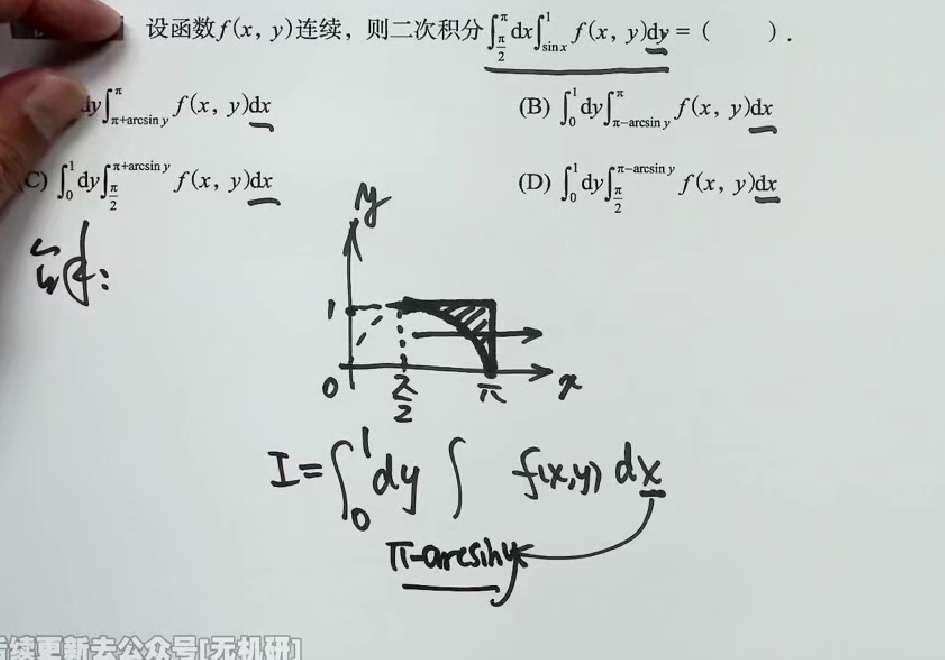
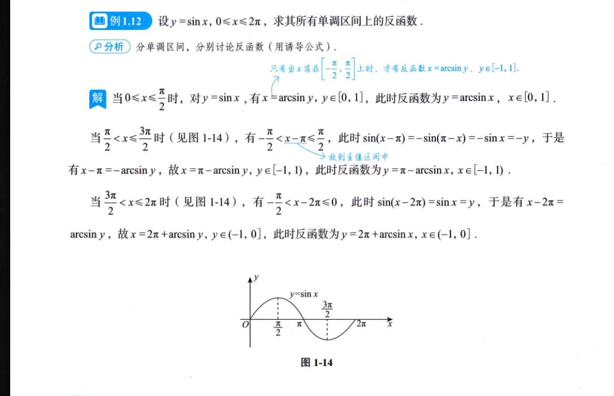
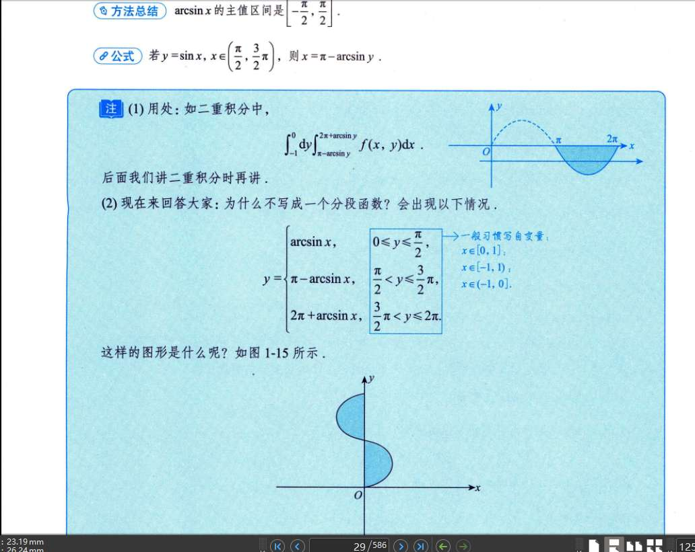

我来帮你把这个盲区彻底扫除。我们不背公式，只讲道理，保证你下次遇到肯定能秒杀。

### 核心问题：为什么不能直接写 $x = \arcsin y$？

因为 **$\arcsin y$ 是一个“死脑筋”的函数**。

数学家在定义反三角函数的时候，为了保证它是一个合格的函数（一个输入只能对应一个输出），强行规定了 $\arcsin y$ 的输出结果（也就是角度）**必须被锁死在 $[-\pi/2, \pi/2]$ 之间**（即第一和第四象限）。

你看看题目原本的积分范围：

最外层的积分是 $\int_{\pi/2}^{\pi} dx$，这意味着在你画的这个图形区域里，**$x$ 的真实物理位置是在 $[\pi/2, \pi]$ 之间**（第二象限）。

如果你不管三七二十一，直接令 $x = \arcsin y$，你就等于是把一个明明在第二象限的角，强行拉回了第一象限。这就牛头不对马嘴了。

### 破局点：怎么找到真正的 $x$？

我们需要找到一个角，它的正弦值等于 $y$，并且这个角必须落在 $[\pi/2, \pi]$ 之间。

回忆一下高中三角函数的基础公式（诱导公式）：

$$\sin(\pi - \theta) = \sin \theta$$

我们可以这样一步步推：

1. 我们先把 $y$ 扔进反三角函数 $\arcsin y$ 中。它会给你返回一个第一象限的锐角，我们叫它 $\alpha$（即 $\alpha = \arcsin y$）。
    
2. 这个 $\alpha$ 的正弦值确实是 $y$，但它不是我们要找的 $x$，因为它不在 $[\pi/2, \pi]$ 里。
    
3. 怎么把这个 $\alpha$ 完美平移到第二象限，且保证正弦值不变？根据对称性，用 $\pi$ 减去它就行了！
    
4. 所以，真正落在第二象限的那个角是 $\pi - \alpha$，也就是 **$\pi - \arcsin y$**。
    

这就是为什么曲线的表达式从 $y = \sin x$ 变成了 $x = \pi - \arcsin y$。

### 结合你的图来看（为什么它是积分下限？）

看看你手绘图里的那一排水平向右的箭头，非常标准：

要想交换积分次序变成“先积 $x$，后积 $y$”，你需要想象画一条水平线（切片）穿过阴影区域。

- **进（找下限）：** 水平线从左边穿入阴影区域时，最先碰到的是那条曲线 $y = \sin x$。所以 $x$ 的下限是这条曲线。根据刚才的推导，这条曲线在这里的正确表达方式是 **$x = \pi - \arcsin y$**。
    
- **出（找上限）：** 水平线继续向右，穿出阴影区域时，碰到的是右边垂直的直线 $x = \pi$。所以 $x$ 的上限是 **$\pi$**。
    

因此，内层积分就变成了 $\int_{\pi - \arcsin y}^{\pi} f(x,y) dx$。（也就是选项 B 的后半部分）。

---

### 下次碰到了怎么秒杀？（保姆级口诀）

下次只要遇到需要把 $y = \sin x$ 反解出 $x$ 的情况，直接看原积分中 **$x$ 的取值范围**：

- **情况 1：** 如果原积分里 $x \in [-\pi/2, \pi/2]$（曲线是递增的），直接无脑写 **$x = \arcsin y$**。
    
- **情况 2：** 如果原积分里 $x \in [\pi/2, 3\pi/2]$（曲线是递减的，就像你这道题），果断写 **$x = \pi - \arcsin y$**。
    

本质上，$\arcsin y$ 永远只提供第一/四象限的基础角度，你只需要根据 $x$ 所在的真实区间，用 $\pi$ 加减一下找找“替身”就行了。

