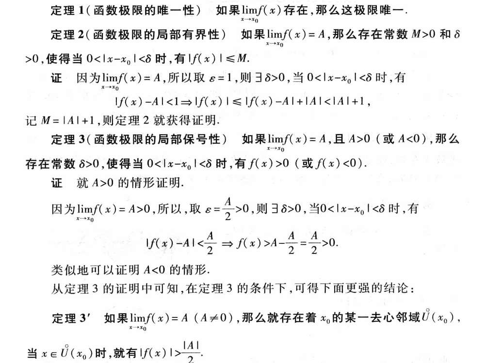
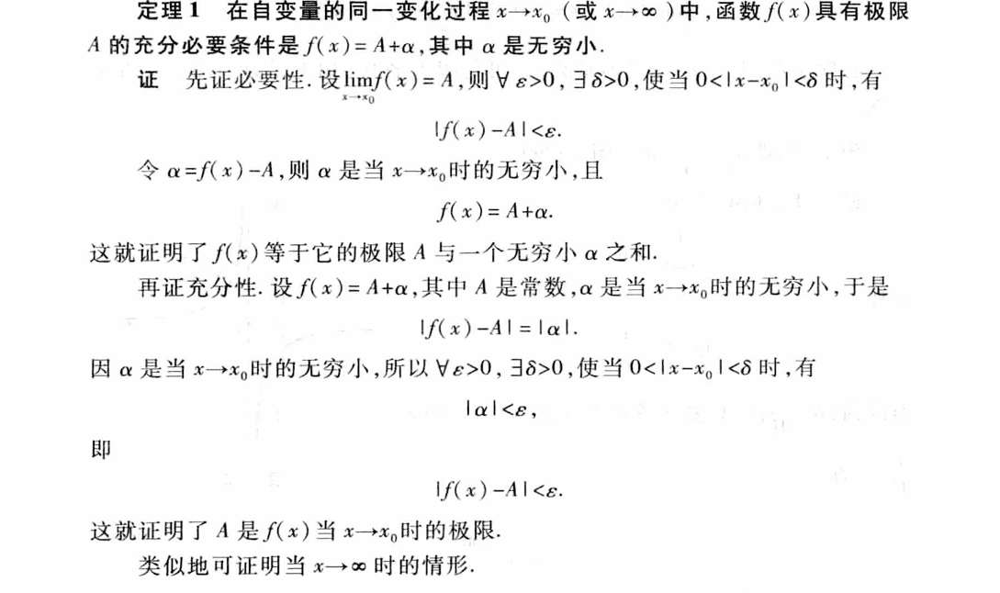
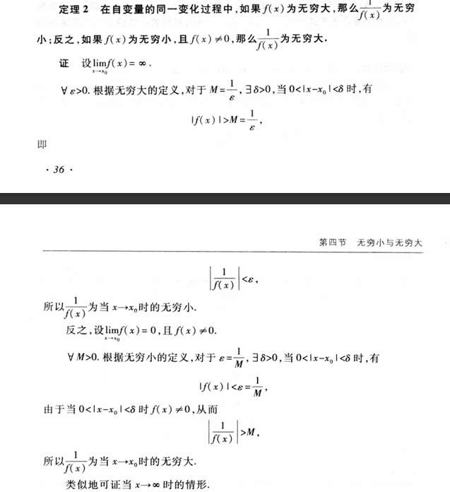
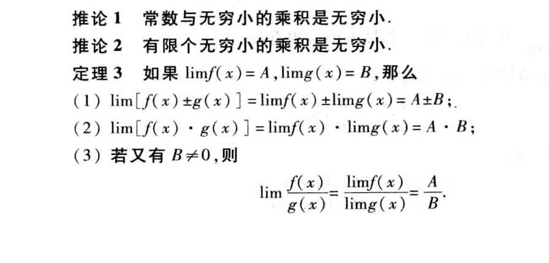
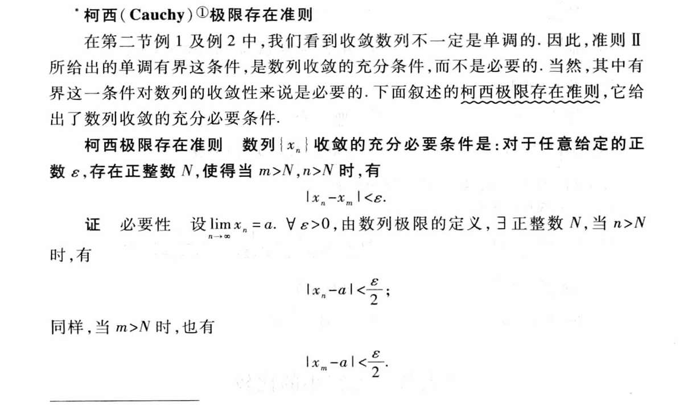
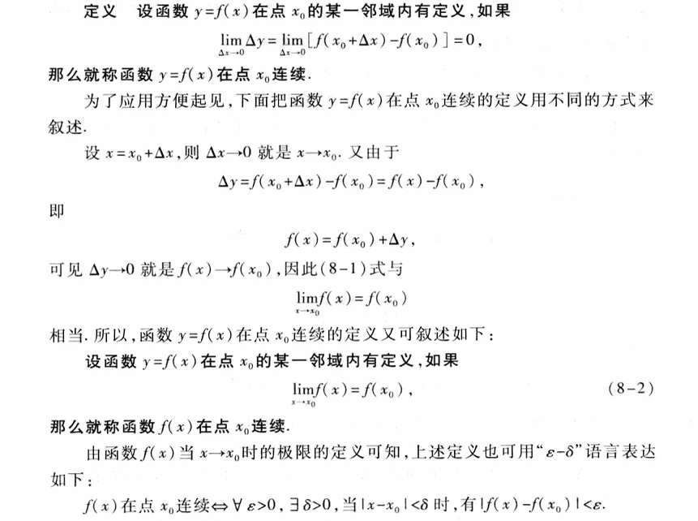

# 总结下书中定义/存在证明的地方

# 极限

1. x趋于无穷时的极限定义
2. 函数极限的局部有界性
3. 函数极限的局部保号性
4. 函数极限与数列极限的关系
5. 无穷小定理一：极限A可以翻译为 f(x) = A + α  α是无穷小
6. 无穷大定义
7. 无穷大无穷小关系定理：f(x)无穷大，f(x)的倒数是无穷小 反之亦然
8. 俩个无穷小的和是无穷小定理
9. 有界函数与无穷小的乘积是无穷小定理
10. 和差的极限等于极限的和差
11. 乘积的极限等于极限的乘积 
12. 函数比值的极限等于函数极限的比值
13. 复合函数的极限运算法则 
14. 夹逼准则的证明
15. 柯西极限存在准则的证明
16. 等价无穷小的充分必要条件：β = α+o(α)的证明
17.  **【一级战备 (Must Master)】**：**必须能默写定义/逻辑**。这是选择题（概念辨析）的命门，或者大题证明的关键起手式。
18.  **【二级熟悉 (Familiarize)】**：**懂逻辑，能复述思路**。不需要死记硬背 $\varepsilon-\delta$ 的每一步，但要能说出它是怎么证出来的（比如“用到了构造法”或“反证法”）。
19.  **【三级直觉 (Intuition Only)】**：**知结论，明前提**。把它们当作公理直接用，不要在证明细节上浪费一秒钟。

---

### **【一级战备】(核心定义与高频逻辑)**
*要求：能准确写出数学语言，能进行简单的逻辑推导。*

*   **1. x趋于无穷时的极限定义**（还有数列极限、x趋于$x_0$的定义）
    *   **理由**：考研选择题喜欢考“定义的变体”。例如：给一个乱改的 $\varepsilon-X$ 语言，问你它等不等价于极限定义。如果你不能默写标准版，就无法识别高仿版。
*   **6. 无穷大定义**
    *   **理由**：同上。必须掌握 $M-\delta$ 语言。
*   **3. 函数极限的局部保号性**
    *   **理由**：**重中之重！** 它的证明逻辑（取 $\varepsilon = A/2$）是考研证明题中判断符号的通用手段。不需要默写全过程，但必须掌握这个**“取一半”的操作逻辑**。
*   **9. 有界函数与无穷小的乘积是无穷小定理**
    *   **理由**：这不仅是个定理，更是**核心计算技巧**（例如 $\lim_{x\to 0} x \sin \frac{1}{x} = 0$）。证明非常简单（夹逼准则），掌握证明有助于你做填空题。
*   **16. 等价无穷小的充分必要条件：$\beta = \alpha + o(\alpha)$ 的证明**
    *   **理由**：**连接第一章与泰勒公式的桥梁**。这个证明只有一行（$\lim \frac{\beta}{\alpha}=1 \iff \lim (\frac{\beta}{\alpha}-1)=0$），但它揭示了“等价”和“高阶无穷小”的本质联系，必须烂熟于心。

---

### **【二级熟悉】(理论支撑与逻辑链条)**
*要求：看着定理能说出“为什么”，知道它是怎么推出来的。*

*   **2. 函数极限的局部有界性**
    *   **理由**：这是保号性的前置技能。知道“收敛必有界”的逻辑是取 $\varepsilon=1$ 即可。
*   **5. 无穷小定理一：极限A可以翻译为 $f(x) = A + \alpha$**
    *   **理由**：这是**代数变形**的基础。在做大题时，有时候把极限符号拆掉，写成等式形式，能通过代数运算发现新线索。熟悉这个转换是解题的本能。
*   **4. 函数极限与数列极限的关系 (海涅定理)**
    *   **理由**：**判断极限不存在的利器**。如果能找到两个子数列极限不同，则函数极限不存在。不需要证海涅定理本身，但要熟悉怎么用它去**证伪**。
*   **14. 夹逼准则的证明**
    *   **理由**：不需要默写证明，但要深刻理解“找放大、找缩小”的思想。

---

### **【三级直觉】(工具箱与公理)**
*要求：记住结论，**死死记住使用前提**，证明过程扫一眼即可。*

*   **7. 无穷大无穷小关系定理**
    *   **理由**：直觉太强，不用证。
*   **8. 俩个无穷小的和是无穷小定理**
    *   **理由**：显然。
*   **10. 和差的极限等于极限的和差**
*   **11. 乘积的极限等于极限的乘积**
*   **12. 函数比值的极限等于函数极限的比值**
    *   **理由**：这三个放在一起，证明过程（分摊误差）看一次懂了就行。**真正的考点是前提：拆分后的每一项极限必须都存在！** 记住那个 $\infty - \infty$ 的反例比记住证明更重要。
*   **13. 复合函数的极限运算法则**
    *   **理由**：直接用。
*   **15. 柯西极限存在准则的证明**
    *   **理由**：**超纲预警**。数一虽然要求了解柯西准则（自拉拢即收敛），但**绝不需要**你去证明它。那是数学分析（数学专业）的事。你只需要知道“它不需要知道极限值就能判定存在”这个性质即可。

理解“极限”的直觉游戏，这些定理也就生动起来了。
拿保号性来说，
如果A大于0  那么x0的邻居们，其函数值 是非常靠近A的，靠近程度就是这个任意正数episilon  这个正数任意小 特别小 所以可以理解为 这些邻居的函数值 也是大于0的   一个大于0的数 下方延展特别小的正数 最终仍是大于0 

## 无穷小

这个很好理解  证明也容易看懂
但我不知道这个定理的意义是什么，以及我们要用到他吗？ 

无穷大无穷小转化证明训练

## 极限运算法则

妙啊， 可以练习一下

## 极限存在准则
### 单调有界数列必有极限
柯西存在准则？

# 连续

无证明，单列出的定理：
有界性与最大值最小值定理
零点定理

有证明：
介值定理

我发现书籍也没有解答我的困惑 明明用的极限式子，如果严格按照极限定义，  那个语言应该是：$\forall \varepsilon > 0$，$\exists \delta > 0$，当 **$0<|x - x_0| < \delta$** 时，有 $|f(x) - f(x_0)| < \varepsilon$。 

哦哦 因为还有个条件是 在x0点有定义
这个式子，是把极限与有定义这俩个东西 融合一块而已，

## 间断点

我们很容易明白
可去、跳跃、无穷、震荡；跳跃

无穷、震荡 邻居都搞不懂极限 

可去和跳跃 邻居是搞懂极限，就是极限与函数值不同。
