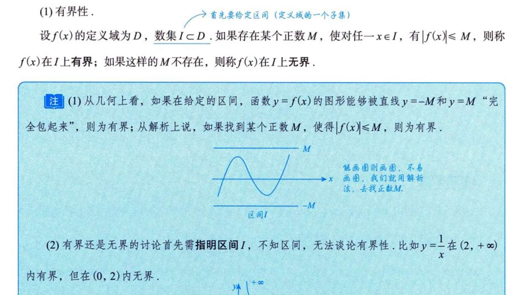
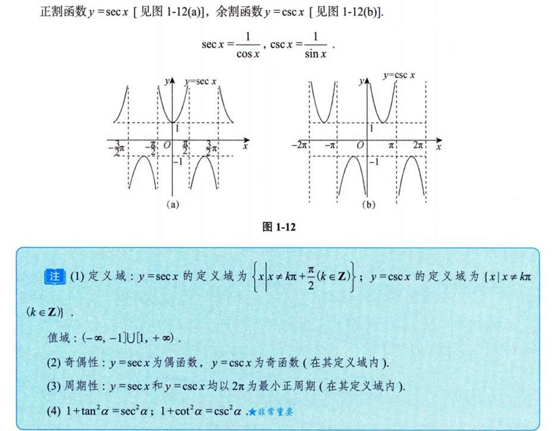
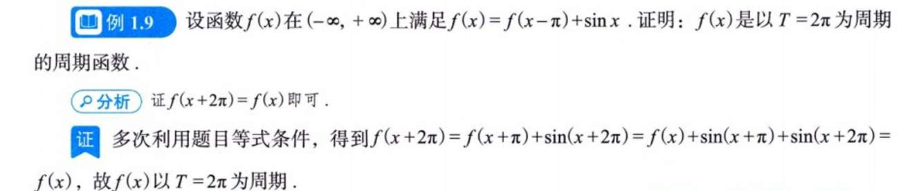

# 疑惑/感悟
严格单调函数必有反函数？
**好理解，如果是y=x方这种不单调的，那一个变量对应多个值了就**

反函数其实就是定义域值域反一下吧 然后那个 ”关于y=x“对称 来判断反函数 我发现似乎只有定义域值域都是无穷是才合适吧 不然 arctanx怎么解释 
额，仍然是关于y=x对称的。可以再看看图。主要问题是，如何理解“关于y=x”对称，目前只是直觉，比如我拿sinx 负二分之Π--二分之Π  我的想法是  把纵轴看成新横轴   横轴看成新纵轴  ， 然后， 新横轴的方向是从右往左的，所以还需要镜面反转一下，  反转后，再旋转90度  就是arcsinx的函数图像。  确实，长的是与sinx 关于y=x对称的，但我想有什么逻辑链条建立起来他们之间的联系。
**这么理解，原函数输入是a 输出是b  反函数输入是b 输出是a  （a,b) (b,a) 俩个坐标 显然关于y=x对称  每个点都是这一样 函数图像不就也这样** 

隐函数呢，额，是”变量“反一下吧 ， 但是很容易”反转“后出来个多值函数啊，
反函数和隐函数的区别到底是什么？
**反函数是“已经解开的、方向相反的函数”；隐函数是“还没解开的方程”。**
**俩者可以说没什么联系**

函数有界性  为什么称 D的一个子集I x属于I 而不直接说x属于D呢？
**因为我们往往研究的就是局部，**

不等式我只掌握最基本的（脑子能直接蹦出来的） ： a+b <= 2根号下ab   a方+b方 >=2ab 够吗？

**绝对值不等式（三角不等式）**：
    $$ |a+b| \le |a| + |b| $$
    $$ |a-b| \ge ||a| - |b|| $$

 **重要的函数不等式（记住图像）**：
      当 $x > 0$ 时：
        $$ \sin x < x < \tan x $$
        $$ \ln(1+x) < x $$
        $$ x < e^x - 1 $$

双曲余弦、正弦  熟悉的陌生人...   
1.  **基因来源**：它们其实就是**指数函数 $e^x$ 的“奇偶分解”**！
    *   $e^x$ 是个既非奇也非偶的函数。
    *   我们把它强行拆成两半：
        *   **偶函数部分**：$\cosh x = \frac{e^x + e^{-x}}{2}$ （双曲余弦）
        *   **奇函数部分**：$\sinh x = \frac{e^x - e^{-x}}{2}$ （双曲正弦）
    *   **验证**：$\cosh x + \sinh x = e^x$。

2.  **为什么叫“双曲”？**
    *   **三角函数**（$\cos t, \sin t$）定义在**圆** $x^2 + y^2 = 1$ 上。
    *   **双曲函数**（$\cosh t, \sinh t$）定义在**双曲线** $x^2 - y^2 = 1$ 上。
    *   它们的一生，就是在模仿三角函数，但所有的正号都变成了负号。
        *   $\cos^2 x + \sin^2 x = 1 \longrightarrow \cosh^2 x - \sinh^2 x = 1$
        *   $(\sin x)' = \cos x \longrightarrow (\sinh x)' = \cosh x$
        *   $(\cos x)' = -\sin x \longrightarrow (\cosh x)' = \sinh x$ (注意！这里没有负号了，这是唯一的区别)

奇偶性
这个很好证明 使用一下奇偶性的性质公式就能判定出来 但我感觉我有点难建立其直觉 u(x) 还好 就是相加抵消的感觉   v(x)我想不来 
**想象双曲正弦，  想象俩个ex图像相减， 在右半部分  ex比e的－x  多的趋势 是a   反过来在左半部分  那肯定是 比-x少的趋势是-a**

内偶则偶，内奇同外，之前没注意到过 

这个很有趣，是自己之前从未总结过的技巧 。
但同一单调性我能理解 ，为什么还能研究最值呢？？
**原因就是 给“套了这些外壳”的函数u(x) 进行求导时 发现除了u(x)外 其他东西是正的常数**

这个我确实不熟悉
我疑惑咋命名的 sec 是cos分之一 csc 是sin分之一
以及感觉这个图像只能说背熟啊 
**S 不对 S，C 不对 C**
**然后图像完全不用背 代入点试试  先画渐近线**

首先，暴露出了 对反函数的不熟悉  sin(arcsinx) = x  感觉背后有明显的 数学直觉可以描述，我不想”背“公式  我觉得这与定义域和值域有关。 再就是蓝字的证明，我也 觉得，证明能看懂，没建立起直觉，不知道是对证明逻辑的不熟悉还是？？
*设定：**
*   集合 $A = [-1, 1]$ （$\sin$ 的值域，$\arcsin$ 的定义域）
*   集合 $B = [-\frac{\pi}{2}, \frac{\pi}{2}]$ （$\sin$ 的“主值”定义域，$\arcsin$ 的值域）

**过程分析：**

**情况 1：$\sin(\arcsin x) = x$**
1.  **出发**：取一个 $x \in A$（比如 0.5）。
2.  **第一步（$\arcsin$）**：这是一个函数 $g: A \to B$。它把 $0.5$ 映射到了 $B$ 中的 $\frac{\pi}{6}$。
    *   注意：因为 $x$ 在 $A$ 里，这一步**必然有定义**，且结果**必然**落在 $B$ 里。
3.  **第二步（$\sin$）**：这是一个函数 $f: \mathbb{R} \to A$。它把 $\frac{\pi}{6}$ 映射回了 $0.5$。
4.  **结论**：因为 $\arcsin$ 的定义就是“寻找那个正弦值等于 $x$ 的角”，所以这一去一回，**恒等成立**。
    *   **严谨表述**：对于 $\forall x \in [-1, 1]$，恒等式成立。

**情况 2：$\arcsin(\sin x) = x$ （这个才是大坑！）**
*   这里就**不一定**成立了！
*   **出发**：取一个 $x \in \mathbb{R}$（比如 $x = \pi$）。
*   **第一步（$\sin$）**：$\sin \pi = 0$。结果落在 $A$ 中。
*   **第二步（$\arcsin$）**：$\arcsin 0$ 是多少？根据定义，$\arcsin$ 的值域被死死地锁在 $B=[-\frac{\pi}{2}, \frac{\pi}{2}]$ 里。所以 $\arcsin 0 = 0$。
*   **结果**：输入 $\pi$，输出 $0$。**$\pi \neq 0$**。
*   **结论**：这个式子只有当 $x \in [-\frac{\pi}{2}, \frac{\pi}{2}]$ 时才成立。

# 做题记录

1.3   反函数的求法  及  遇到ln的处理    

1.6 感觉证明有界 就是用不等式什么的凑出不等式  <=某个具体的数

1.9 好奇怪 感觉莫名奇妙就证出来了  我感觉写数学证明题经常会这种，突然而然，莫名奇妙写出来，为啥呢 

1.12  x=arcsiny  y=arcsinx 有啥区别  为什么y=sinx的反函数是 x=arcsiny而不是 y=arcsinx？ 我理解是后者啊？