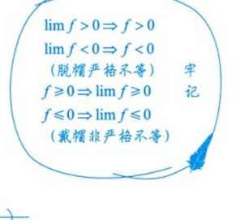
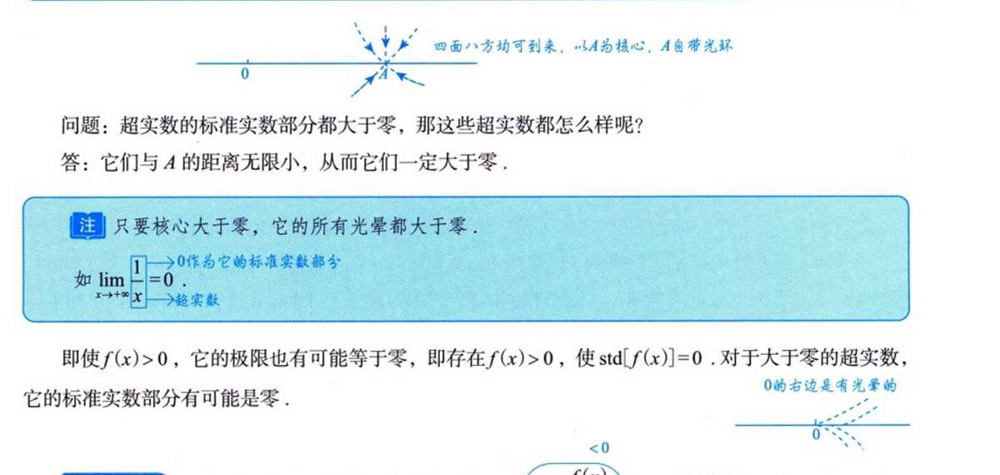
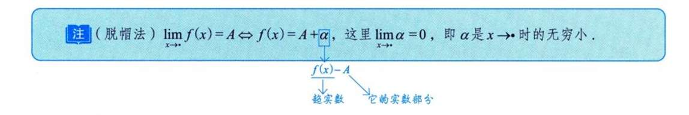
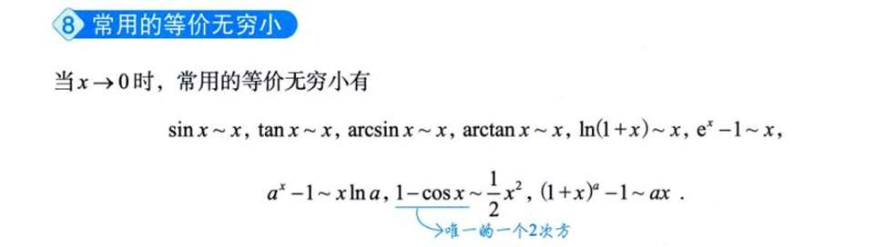
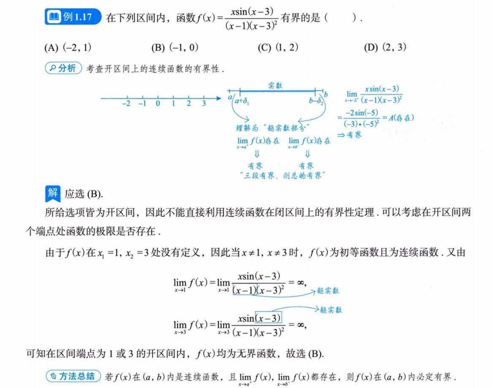
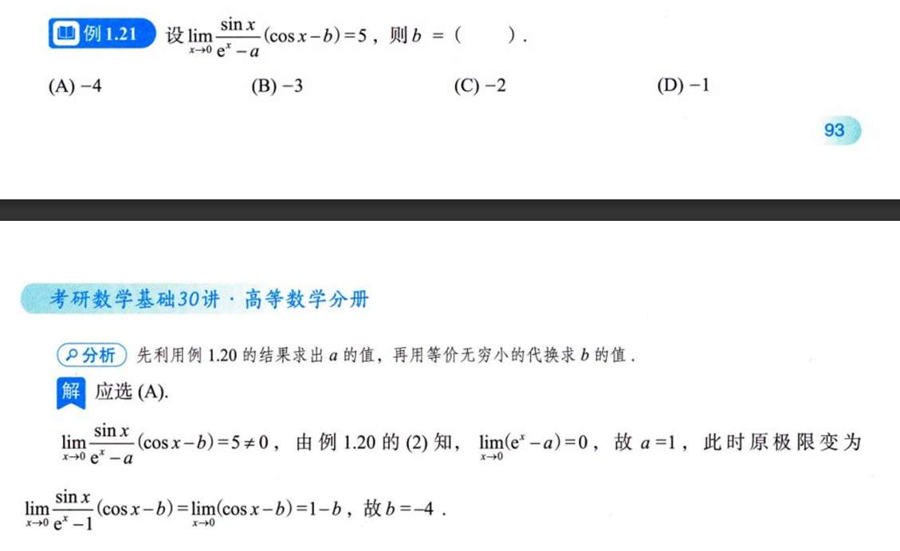

# 知识点困惑/感悟
## 超实数
这里的黑话，
”核值“
不太看得懂
其中一个应用
就讲的是分批取极限嘛。
sinx-x x趋于0 取极限  我们必须sinx和x同时趋于0. 
sinx替换成x？不行  替换只能在实数运算里。
在实数世界里，拿出个sinx-x，你能怎么换？不能换。

我查了下百科，说超实数其实就是，实数里面加一个无穷大量和无穷小量。   哦，其实这个无穷小量，就是描述函数极限的关键吧。  
## 函数极限性质
### 唯一性
经常出现 x-1分之一    e的x-1分之一次方
### 局部有界性
函数局部有界性是一个广泛的性质，函数极限性质只是恰巧能证明它。
比如sinx，x趋于无穷的极限不存在，但sinx是有界的。但这个怎么证明呢？

连续函数必有界这个点，虽然说可能比较显然，但还是希望有证明，不然总觉得不得劲。
稍等，还有个易混淆的点。
闭区间内为连续函数，是有界显然
但开区间`(a,b)`内为连续函数，要计算极限a正和极限b- 

为什么呢？感觉这里的直觉建立的不牢固 

嗯.... 举例子就好了，x分之一，开区间(0,1)显然 是五届的
### 保号性
感觉这个“脱帽”是好证明的，
课本也有。而且我觉得不一定取二分之A，三分之，四分之都可以，只要小于A即可。

但这个“戴帽”，我自己尝试用定义证明了下，
最后是f(x)-e < A <f(x) +e   f(x)条件是>=0  e（epsilode）是，存在e>0  最后应该证出A，即limf>=0啊？

反证法，已知f>=0     假设 limf，即A<0 由前面那个保号性可知，f<0 矛盾     所以A>=0？  可是前面那个保号性，似乎也没证A>=0  =>  f>=0 诶？
**是不可以证的，如果用严格不等式。**
**也可以通过直觉理解，**
* **反例**：$f(x) = x \sin(\frac{1}{x})$ 当 $x \to 0$ 时。 * 极限是 0（满足 $\ge 0$）。 * 但在 0 的任意邻域内，函数值又正又负（震荡）。 * 所以，**“脱帽”必须是严格不等式（$A>0 \implies f>0$）才成立**。非严格的推导不过去。  极限是0，和0的任意邻域内函数值震荡无关。极限是0只能说，邻域的函数值确实很接近0。但接近0是可以正负都有的。所以A=0不能推f=0   为什么A是正数就可以保号性？就因为函数值无限接近A这个正数，那函数值绝对就是正数。

哎，那f>=0 => limf >=0 能不能用不等式证明一次
**可以，见本子上**

再就是，f>0 能推出limf>0吗？
不能，f>0 => limf>=0   
x0点函数值>0    但邻域的点们，完全可以预测称此点极限=0. 等下，哪里有例子？哦，可去间断点。$$ f(x) = \begin{cases} |x|, & x \neq 0 \\ 100, & x = 0 \end{cases} $$

下面这个超实数在说啥啊f≥0⟹limf≥0
我不想看视频，但一直在说超实数.... 还有光晕，还有什么四面八方均可到来，可是，，我们不是在数轴上做讨论吗？

## 无穷小的定义
突然领悟一般，x趋于x0，这样描述时，不包括x趋于无穷的。
我回忆到证明函数局部有界性时，说了x趋于x0时的极限

但无穷小定理时，说的就是“自变量的同一变化过程x->x0 或x->无穷 中”

**很好证明， 仍然是前提条件是，假设知道极限limx->x0**  
**则$|f(x)-A|<\varepsilon$  那我们把f(x)-A看作一个整体的 $\alpha$   那么$|\alpha-0|<\varepsilon$   alpha就是无穷小量。**
**f(x) = A + a**   

  

## 等价无穷小
这个要记住

# 例题
例1.16   不能上来看f(x)  而是先把g(f(x))这个函数计算出来 

例1.17
可以理解为，计算极限嘛。按照开区间连续理论，算断电趋于正/负的极限。
但是，这个描述中的什么超实数，真不懂。（x-3）就不是超实数了吗？为啥标sin（x-3）

例1.19 可以再做一遍

例1.21
我的思路是这样的， sinx(cosx-b)是分子，sinx极限存在，为0 cosx-b的极限为1-b 也一定存在，所以可以拆分极限 那么分子的极限就为0乘（1-b） 为0 
那么，分母的极限就一定也为0  e的x次方-a极限为1-a=0 a为1.
然后就只能得到a ， b的值是多少无所谓，因为sinx是0就够了。 

所以我的思路到底错在哪？ 更深层次的，触及极限定义或性质的
