# 知识点困惑/感悟
## 超实数
这里的黑话，
”核值“
不太看得懂
其中一个应用
就讲的是分批取极限嘛。
sinx-x x趋于0 取极限  我们必须sinx和x同时趋于0. 
sinx替换成x？不行  替换只能在实数运算里。
在实数世界里，拿出个sinx-x，你能怎么换？不能换。

我查了下百科，说超实数其实就是，实数里面加一个无穷大量和无穷小量。   哦，其实这个无穷小量，就是描述函数极限的关键吧。  
## 函数极限性质
### 唯一性
经常出现 x-1分之一    e的x-1分之一次方
### 局部有界性
函数局部有界性是一个广泛的性质，函数极限性质只是恰巧能证明它。
比如sinx，x趋于无穷的极限不存在，但sinx是有界的。但这个怎么证明呢？

连续函数必有界这个点，虽然说可能比较显然，但还是希望有证明，不然总觉得不得劲。
稍等，还有个易混淆的点。
闭区间内为连续函数，是有界显然
但开区间`(a,b)`内为连续函数，要计算极限a正和极限b- 

为什么呢？感觉这里的直觉建立的不牢固 

嗯.... 举例子就好了，x分之一，开区间(0,1)显然 是五届的
### 保号性
感觉这个“脱帽”是好证明的，
课本也有。而且我觉得不一定取二分之A，三分之，四分之都可以，只要小于A即可。

但这个“戴帽”，我自己尝试用定义证明了下，
最后是f(x)-e < A <f(x) +e   f(x)条件是>=0  e（epsilode）是，存在e>0  最后应该证出A，即limf>=0啊？

反证法，已知f>=0     假设 limf，即A<0 由前面那个保号性可知，f<0 矛盾     所以A>=0？  可是前面那个保号性，似乎也没证A>=0  =>  f>=0 诶？
**是不可以证的，如果用严格不等式。**
**也可以通过直觉理解，**
* **反例**：$f(x) = x \sin(\frac{1}{x})$ 当 $x \to 0$ 时。 * 极限是 0（满足 $\ge 0$）。 * 但在 0 的任意邻域内，函数值又正又负（震荡）。 * 所以，**“脱帽”必须是严格不等式（$A>0 \implies f>0$）才成立**。非严格的推导不过去。  极限是0，和0的任意邻域内函数值震荡无关。极限是0只能说，邻域的函数值确实很接近0。但接近0是可以正负都有的。所以A=0不能推f=0   为什么A是正数就可以保号性？就因为函数值无限接近A这个正数，那函数值绝对就是正数。

哎，那f>=0 => limf >=0 能不能用不等式证明一次
**可以，见本子上**

再就是，f>0 能推出limf>0吗？
不能，f>0 => limf>=0   
x0点函数值>0    但邻域的点们，完全可以预测称此点极限=0. 等下，哪里有例子？哦，可去间断点。$$ f(x) = \begin{cases} |x|, & x \neq 0 \\ 100, & x = 0 \end{cases} $$

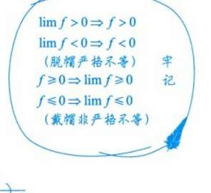

下面这个超实数在说啥啊f≥0⟹limf≥0
我不想看视频，但一直在说超实数.... 还有光晕，还有什么四面八方均可到来，可是，，我们不是在数轴上做讨论吗？
**是的。就是在数轴上讨论。如果是二维的话，就是四面八方了。这个超实数只是想体现个“逼近”。**

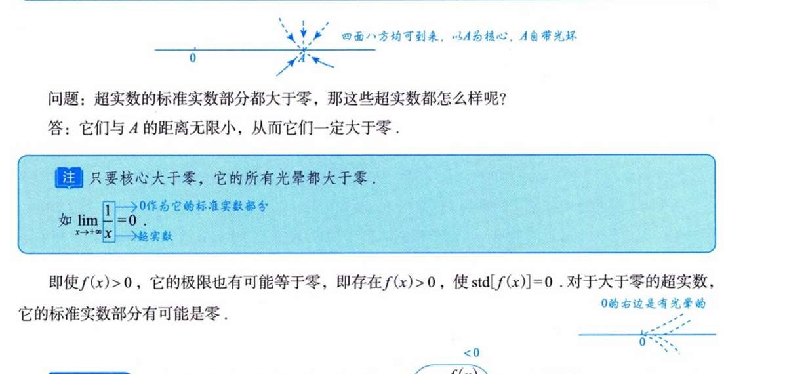

## 无穷小的定义
突然领悟一般，x趋于x0，这样描述时，不包括x趋于无穷的。
我回忆到证明函数局部有界性时，说了x趋于x0时的极限

但无穷小定理时，说的就是“自变量的同一变化过程x->x0 或x->无穷 中”

**很好证明， 仍然是前提条件是，假设知道极限limx->x0**  
**则$|f(x)-A|<\varepsilon$  那我们把f(x)-A看作一个整体的 $\alpha$   那么$|\alpha-0|<\varepsilon$   alpha就是无穷小量。**
**f(x) = A + a**   

  

同阶无穷小，比值为A，其中包括等价无穷小（比值为1）
低阶无穷小，相比的话，显然是无穷
高阶无穷小相比为0

## 等价无穷小
这个要记住
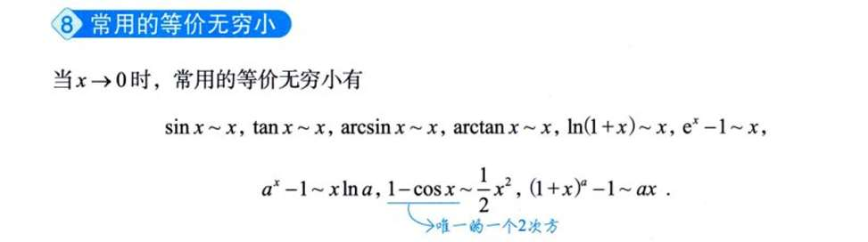

## 洛必达法则
前置条件：

- 俩种情况都能用：俩函数都趋于0；俩函数都趋于无穷
- 俩函数的导数在此点的某去心领域内存在，且不为0.也就是说， 有无数个导数呢
- 对于俩函数的导数比的极限，只要存在或无穷都行

## 泰勒公式
哎 明白要背熟
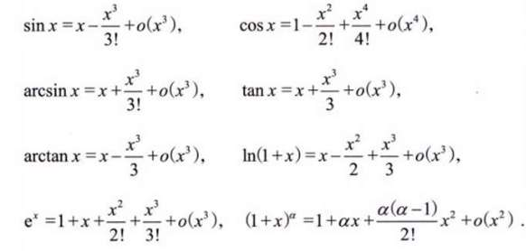
这是在说啥
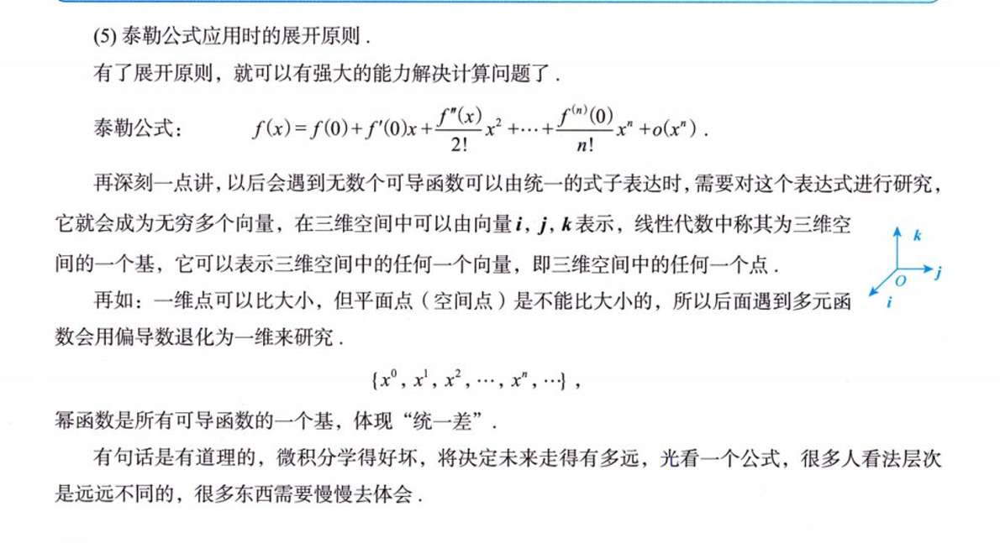

上下同阶的具体原因是什么，为什么一定要展开到对应的无穷小呢 是不是会有一个项为 o(x方)除以x方  这个有何意义？  不能o(x)除以o(x方)吗
**对，就为了这个“刚刚好”**
**o(x)除以o(x方) 结果可能是 0，可能是常数，也可能是无穷。数学最讨厌不确定性，所以我们不能让这种情况发生**

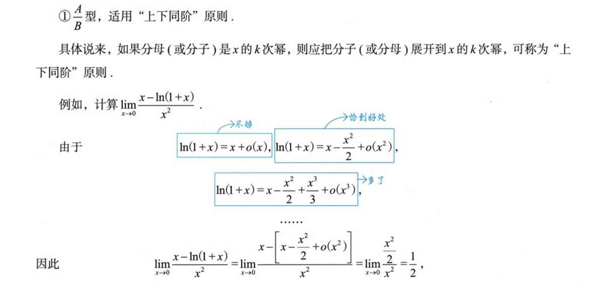
这个，我理解的话，单纯是从计算角度，我们尽可能消更多的变量
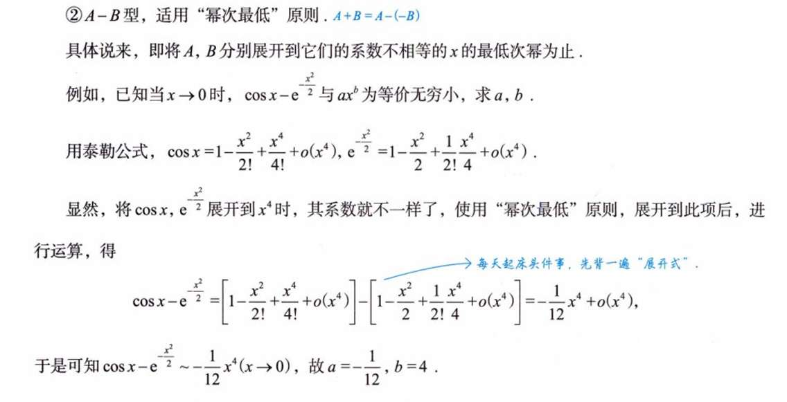

### 夹逼准则
等下，极限不存在，这三个字，到底包括不包括极限为无穷？
**包括！极限不存在，即极限发散。包括：震荡、无穷、左右极限不相等**

这里我觉得没啥，就只是说了一个差的极限存在不一定代表极限存在  emm  比如g(x)和h(x) 恰有一个不存在极限  或者俩个都不存在极限 都是有可能的  额 图中的例子 x趋于无穷时  是无穷＋0吧？难道不是无穷？为什么说不存在
**无穷就是不存在**
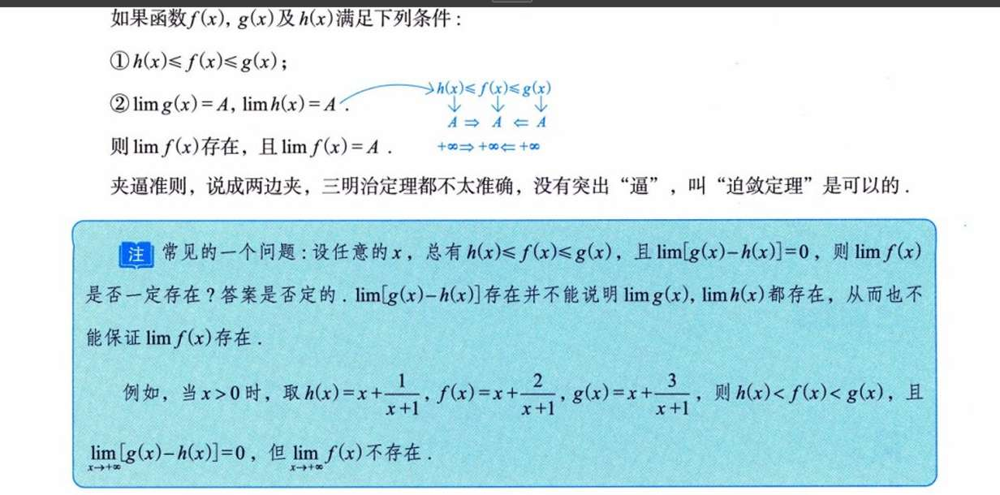

## 未定式的计算 

三大类
- 零比零，无穷比无穷，零乘无穷（可转化为前面俩个）：化简/转化，洛必达/泰勒/夹逼
- 无穷减无穷：如果发现分母，可以通分，将加减法变为乘除法；如果没有，提取公因式或作倒带换，制造分母，回到上一个分号
- 无穷的零次方/零的零次方：恒等变形，使用e的xx次方
- 1的无穷次方：仍然是恒等变形 用e的xx次方

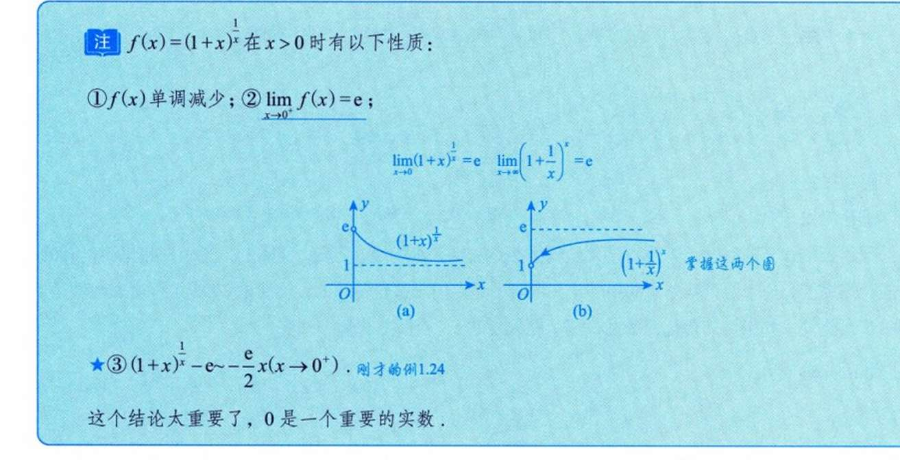

# 极限的代入

$lim_{x->0} $  

# 例题
### 例1.16   （分段函数不熟）
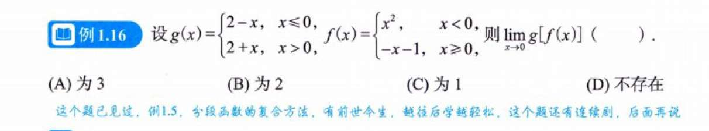
不能上来看f(x)  而是先把g(f(x))这个函数计算出来 

### 例1.17 （知识点不熟）
可以理解为，计算极限嘛。按照开区间连续理论，算断点趋于正/负的极限。
但是，这个描述中的什么超实数，真不懂。（x-3）就不是超实数了吗？为啥标sin（x-3）

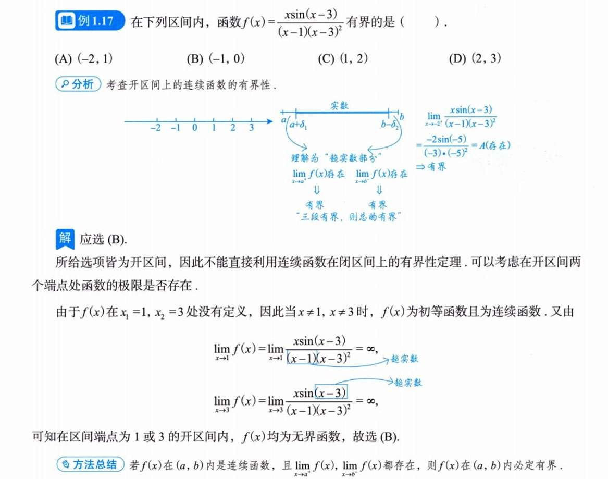

### 例1.19（ 计算套路不熟）

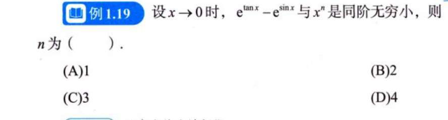
### 例1.21 （无穷小代入，没有整体思维，要兼顾全体）
我的思路是这样的， sinx(cosx-b)是分子，sinx极限存在，为0 cosx-b的极限为1-b 也一定存在，所以可以拆分极限 那么分子的极限就为0乘（1-b） 为0 
错在这！光拆分分子，不管分母了？？此时，可以把sinx单独变成x。但不能直接取值为0
那么，分母的极限就一定也为0  e的x次方-a极限为1-a=0 a为1.
然后就只能得到a ， b的值是多少无所谓，因为sinx是0就够了。 

所以我的思路到底错在哪？ 更深层次的，触及极限定义或性质的
**知道是0比0型，0比0是说最后极限的结果，得到a是1。**
**但还有取极限的过程呢，取极限的过程，能看出sinx和e^x -1 速度相等。所以 最后结果，等于5 这个重任就交给了cosx-b**
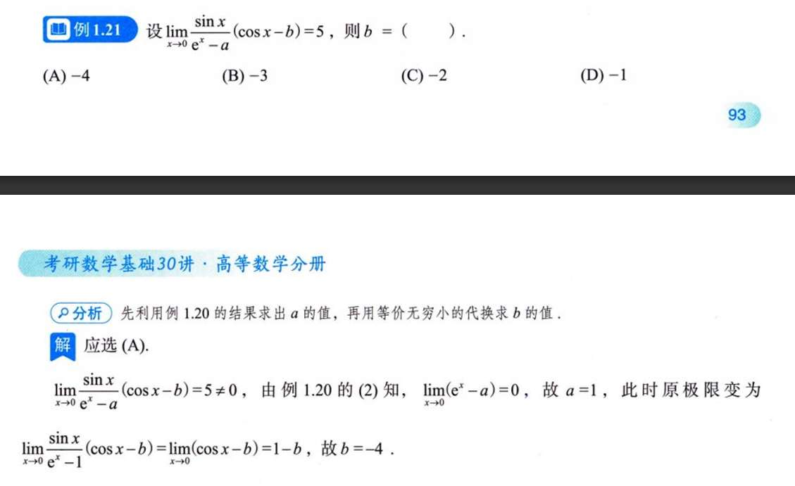

### 例1.22（计算能力）

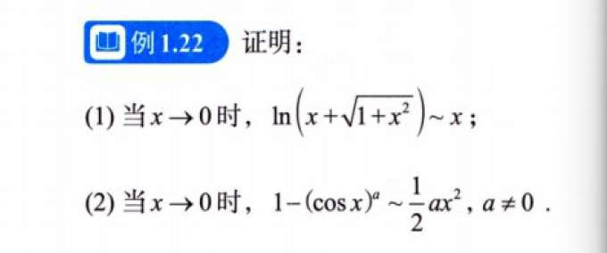
咋推的？我的计算能力这么差啊
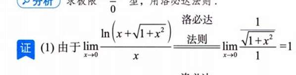

### 例 1.23（对、幂、指的性质不熟）
这又是怎么算的
**1. 三大阶级**
当 $x \to +\infty$ 时，增长速度的鄙视链如下：
$$ \ln^\alpha x \ll x^\beta \ll a^x $$
*(其中 $\alpha, \beta > 0, a > 1$)*

*   **对数函数 ($\ln x$)**：**最底层**。长得最慢，哪怕你给它加个 100 次方 ($\ln^{100} x$)，它也跑不过幂函数。
*   **幂函数 ($x^n$)**：**中产阶级**。哪怕 $x^{0.001}$，也比对数快；哪怕 $x^{1000}$，也比指数慢。
*   **指数函数 ($a^x$)**：**顶层权贵**。爆发式增长，哪怕底数很小（比如 $1.0001^x$），只要 $x$ 足够大，它能碾压任何幂函数。

**2. 回到题目**
*   $f(x) = \ln^{10} x$ —— **对数阶级**（虽然穿了件“10次方”的马甲，本质还是对数）。
*   $g(x) = x$ —— **幂函数阶级**（1次幂）。
*   $h(x) = e^{\frac{x}{10}}$ —— **指数阶级**（底数是 $e$，指数是线性增长）。

**结论**：
对数 $\ll$ 幂 $\ll$ 指数
$f(x) \ll g(x) \ll h(x)$
**选 (C)。**

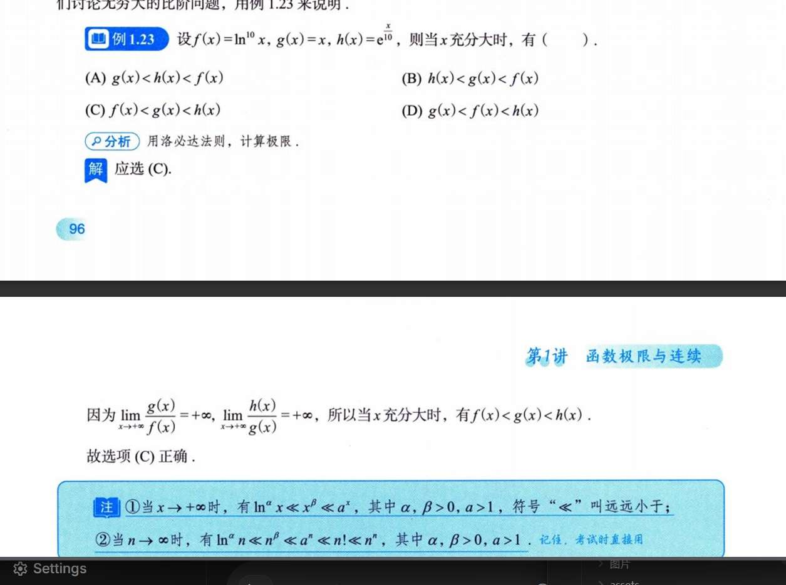
### 例1.24 （0比0型，幂指函数不熟）

### 例1.27（泰勒！）
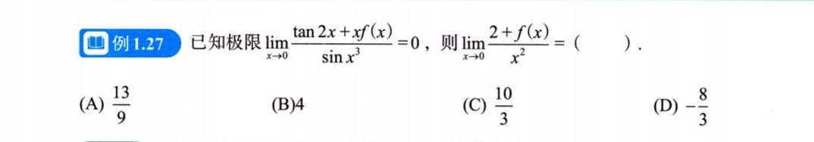

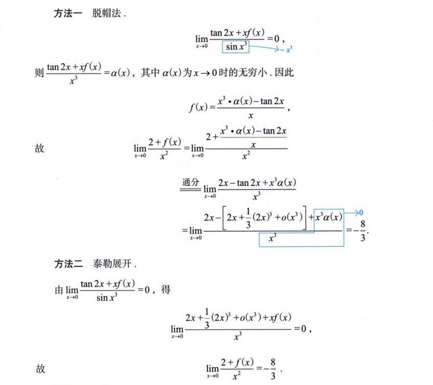

### 例1.28（对于ln的应用）
很好的方法 但是0乘无穷不是一定为0吗？ 有什么反例？

   **为什么您会有“一定为0”的直觉？**
    *   因为在**实数运算**里，$0 \times (\text{任何数}) = 0$。
    *   **但是！** 这里的 $0$ 不是真正的数字 0，而是**“趋于0的无穷小量”**。
    *   这里的 $\infty$ 也是**“趋于无穷的无穷大量”**。

*   **直观理解（拔河比赛）**：
    *   一个因子拼命想把结果拉向0。
    *   另一个因子拼命想把结果拉向无穷大。
    *   **结果取决于谁的力气大（阶数高）！**

*   **简单反例（随手就能举出一堆）**：
    1.  **结果为 1**： Let $f(x) = x$ ($\to 0$), $g(x) = \frac{1}{x}$ ($\to \infty$)。
        $\lim_{x \to 0} (x \cdot \frac{1}{x}) = \lim 1 = 1 \ne 0$。
    2.  **结果为 $\infty$**： Let $f(x) = x$, $g(x) = \frac{1}{x^2}$。
        $\lim_{x \to 0} (x \cdot \frac{1}{x^2}) = \lim \frac{1}{x} = \infty$。
    3.  **结果为 0**： Let $f(x) = x^2$, $g(x) = \frac{1}{x}$。
        $\lim_{x \to 0} (x^2 \cdot \frac{1}{x}) = \lim x = 0$。

**结论**：$0 \cdot \infty$ 必须转化成 $\frac{0}{0}$ 或 $\frac{\infty}{\infty}$，然后用洛必达法则或者泰勒公式去“比拼内力”，绝对不能直接得0。

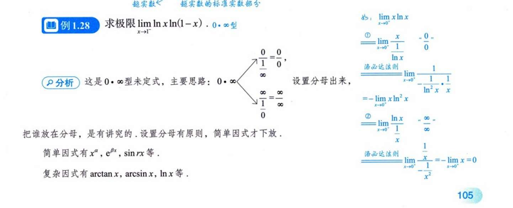

又一知识点
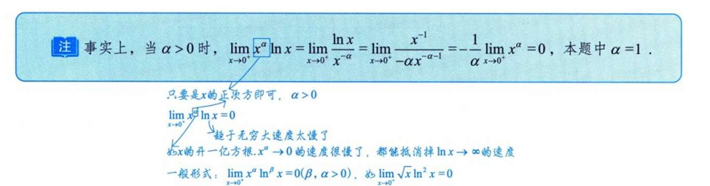

### 例1.29 （夹逼准则的使用情景，取整函数）
我咋没看懂呢
*1. 核心工具：取整不等式**
$$ x - 1 < [x] \le x $$
*   **直觉**：
    *   $[x]$ 是不超过 $x$ 的最大整数。比如 $[3.9] = 3$。
    *   它肯定小于等于 $x$（$3 \le 3.9$）。
    *   它跟 $x$ 的差距肯定不到 1（$3.9 - 3 = 0.9 < 1$）。所以 $x-1$ 肯定比它小。

**2. 题目拆解**
题目求 $I = \lim_{x \to 0} x \cdot [\frac{10}{x}]$。
*   这里 $x \to 0$，即 $x$ 是无穷小。
*   $[\frac{10}{x}]$ 里面是无穷大。
*   这是一个 **$0 \cdot \infty$** 型！（看，刚说完就来了，不能直接得0）。

**3. 夹逼过程**
令 $t = \frac{10}{x}$，则 $[t]$ 满足 $t-1 < [t] \le t$。
也就是：
$$ \frac{10}{x} - 1 < [\frac{10}{x}] \le \frac{10}{x} $$

现在，我们要给不等式三边**同时乘以 $x$**。
**注意！这里有个巨大的坑！** 不等式乘负数要变号！所以必须分左右讨论。

*   **情况 A：$x \to 0^+$（$x > 0$）**
    *   乘正数 $x$，方向不变：
        $$ x(\frac{10}{x} - 1) < x [\frac{10}{x}] \le x(\frac{10}{x}) $$
        $$ 10 - x < \text{原式} \le 10 $$
    *   两边取极限（$x \to 0$）：左边是 10，右边是 10。
    *   **夹住了！结果是 10。**

*   **情况 B：$x \to 0^-$（$x < 0$）**
    *   乘负数 $x$，方向改变（或者您把 $x$ 提出来当负号看）：
        $$ 10 - x > \text{原式} \ge 10 $$
    *   两边取极限：左边 10，右边 10。
    *   **也夹住了！结果还是 10。**

**4. 总结**
无论从左边还是右边，都被夹在 10 中间。所以极限是 10。

**直觉修正**：
这道题本质上是在算 $\lim x \cdot \frac{10}{x}$。取整符号 $[\cdot]$ 只是去掉了尾数，带来了一个微小的误差（小于1）。
当 $x$ 极小时，$\frac{10}{x}$ 极大，去掉的那点尾数根本微不足道。
所以结果就是 $x \cdot \frac{10}{x} = 10$。
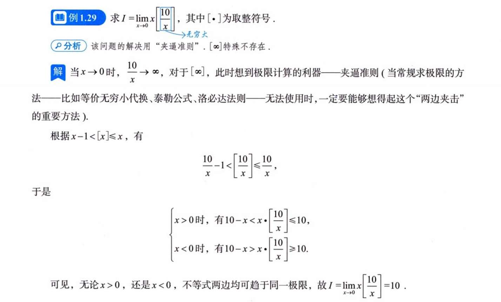

### 例1.30（泰勒不熟悉）
我有个困惑，其实本题用泰勒展开，分子的ln是展开到x方 分母的ln是展开到x，这样就能做出来。  我明白，只有这样才能”凑出“答案。但我就是有点不舒服，感觉没有科学依据，就只是看怎么凑，而去做的泰勒展开
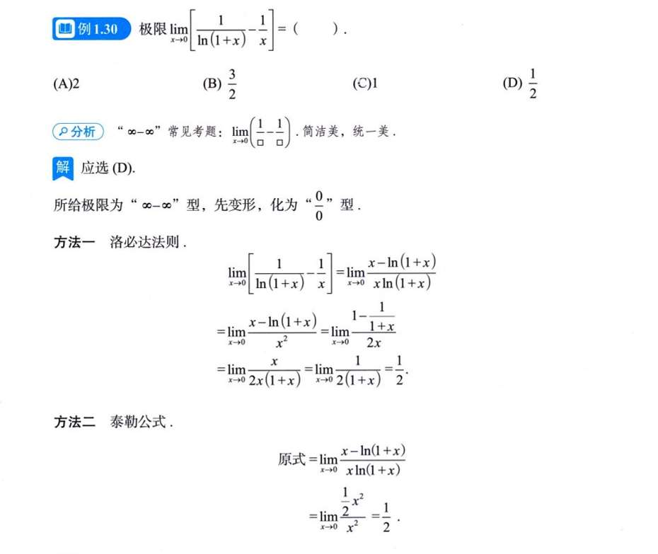

## 例1.37（看见有绝对值的就怕）
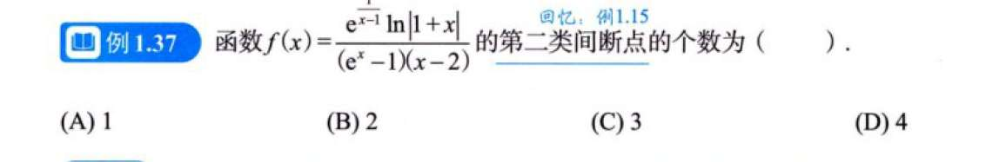
我疑惑了 x趋于-1 无论是趋于-1正还是-1负 好像都没有关系 极限都趋于负无穷吧
但x趋于2 趋于2正是正无穷 趋于2-是负无穷吧？ 这有意思了，  不仅没有极限，即左右极限不相等，符合跳跃间断点吧，又有极限一个为正无穷一个为负无穷，符合无穷间断点  怎么归类  按照顺序，应该是先判断出极限为无穷，所以为无穷间断点？
# 习题
## 1.1（同例1.27题型，比较 套路）
总在想函数拆分之类的，没头绪。
然而，可以
- 凑已知极限，熟悉极限，如sinx-x  凑就是-x+x 
- 泰勒，感觉实在没思路就泰勒展开一下
- 已知一个极限，还能给我们什么信息？ 就是极限转换为A+无穷小
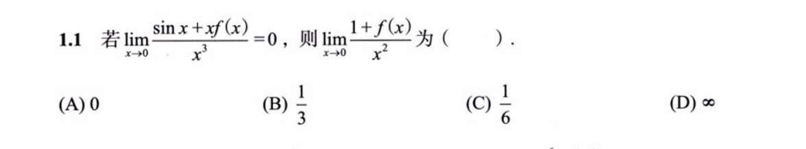
## 1.4（大意，初始条件蕴含的信息，推导后也不能丢）
本题会做，先把x看作常数，然后变换这个极限，显然是1的无穷次方。
但是，记住x在0点无意义
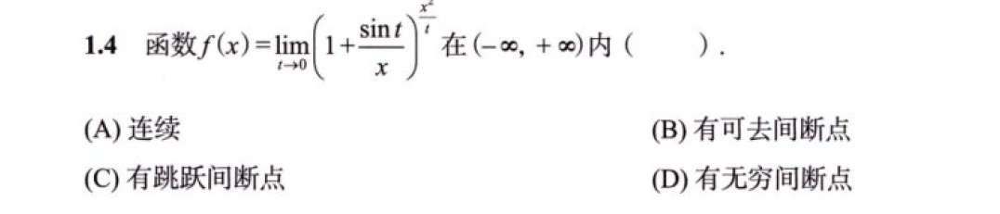
## 1.5 （函数＋ 极限，俩个变量，要分类讨论）
关于$x^{2n}$ 且n趋于无穷，  这结果和x有关。所以需要分段。
如果想当然的认为这个极限是0，那只是x绝对值大于1的情况，而还有x绝对值小于1，还有等于1的情况呢。

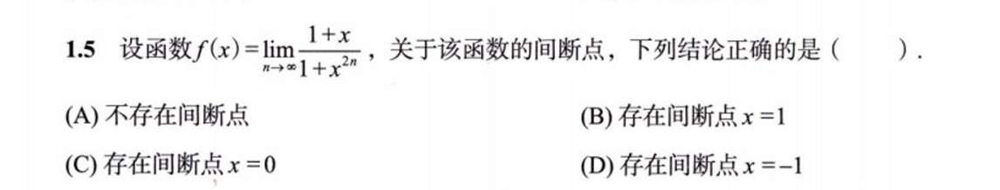

## 1.6
数学归纳法 
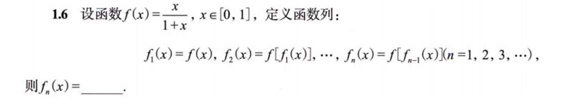

## 1.7（消根号）
真没想出来。
以后注意，有根号的加减法，试着凑二次方公式，消根号 

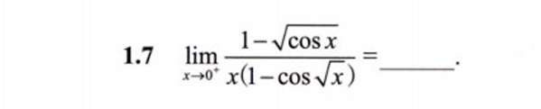

## 1.10 （连续等价无穷小，本质还是泰勒）
还能这样连续等价无穷小的？？ 那我岂不是，也可以互相换？比如把sinx换为ln（1-x）？ 
是的
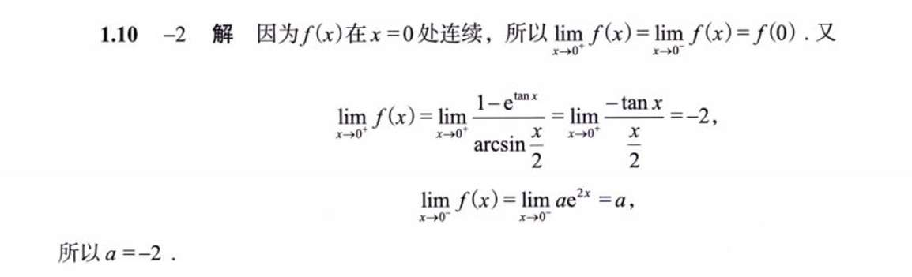
## 1.11（反函数，画图，定义域）
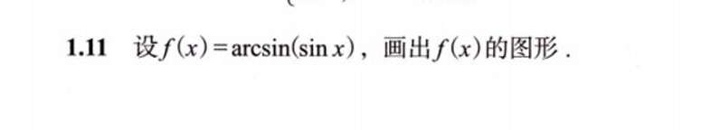
一定注意定义域，x在-二分之pai 到二分之pai f（x）才是x！ 
当x不在这个范围时，想想怎么操作x能让他回去这个范围

## 1.12（应该洛必达却错误用了等价无穷小）
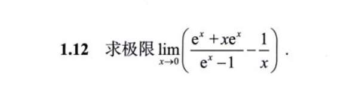

## 1.14、15、16（14是绝对值及如何化简含指数式子，15和16是泰勒，尤其16！）

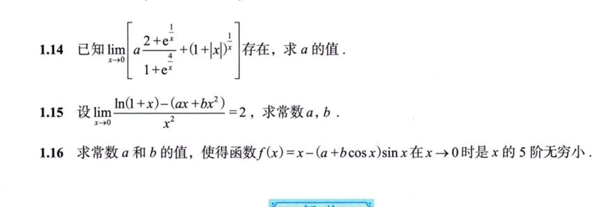

1.14 有绝对值，且x趋于0，那就分正向趋近和负向趋近，|x|在0时，分趋于0正和趋于0负是一定要变号的。
1.15 没思路用泰勒！

1.16  又是泰勒  不过 ， 自己还漏了cosxsinx相乘也可以化简  

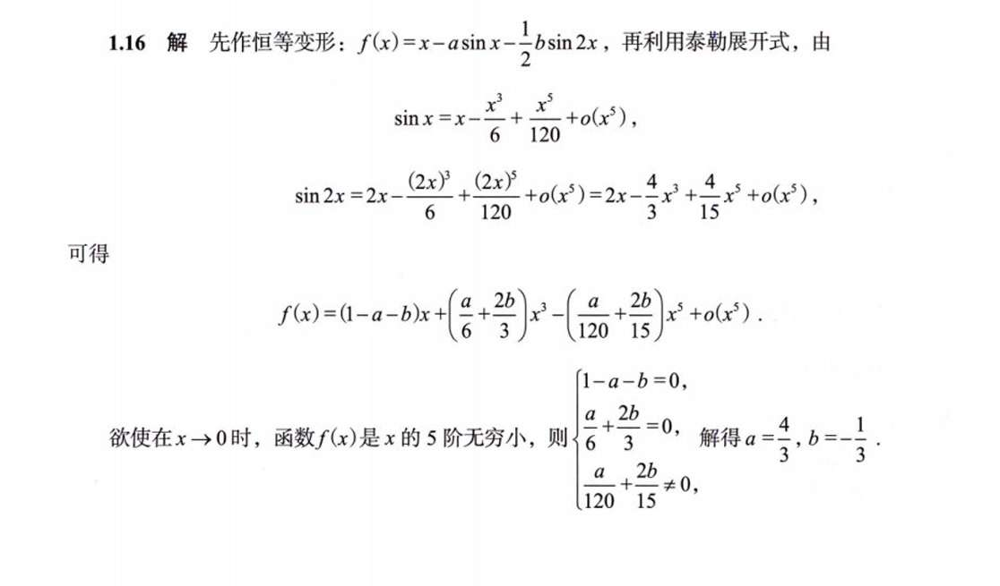

# 1000题基础题

## 2，4(同类型，周期型函数。就让x在当前区间，然后调整如加减到信息量够的区间)
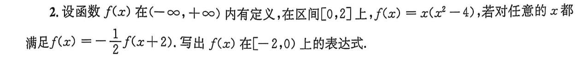

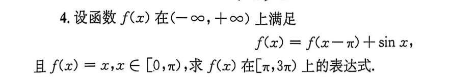

## 5 （计算失误）

服了，e的cosx ，这能用泰勒吗
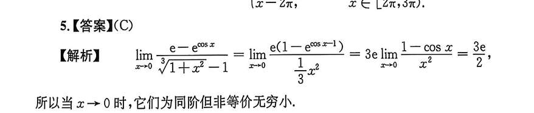

## 7 （泰勒，重点在于，暗戳戳的O(x^3)）
怎么就展开这么点？ 而且那个不是o(x方)吗
我是俩个泰勒都展开到o（x四次方）啊  结果一样。但我不理解答案的o（x三次方）哪来的

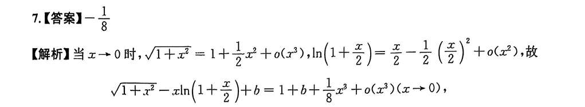
## 8（同习题1.1）
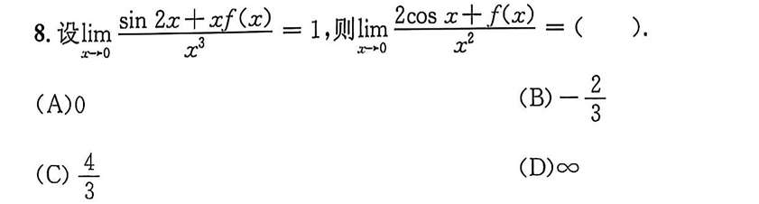
我纳闷了 sin2x可以替换为2x吧？
后面那个2cosx 为什么不能代成2呢？ 我记得不是0或无穷都可以代吧？好吧，精度丢失了！ 
那我用泰勒，我总感觉，想展开到哪展开到哪，我觉得展开是不是取决于O（x^..)这个最小项？
就是，我不想再靠“怎么方便消项”判断是否展开，展开到哪，我想有更深层的理论依据来判断极限替换

**精度丢失！其实更深层的理论依据，还是”精度丢失“这个话题**

## 9（求x趋于无穷的极限，以及如何化简含指数式子）
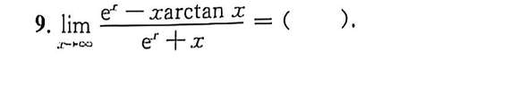
- 题上只标着无穷，那么就要算正和负，然后看是否相等
- 化简时，把无穷或0因子放一起
- 不过这道题，到底如何放，我觉得，是用了指数和x趋向速度的比较？
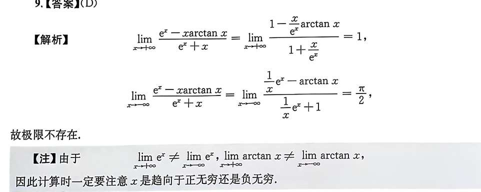

## 14（不同思路，一个是去根号，一个是泰勒）
这题做对了，但是和答案过程不同。我用无穷小替换把分子换为1+二分之一tanx - 1  - 二分之一sinx

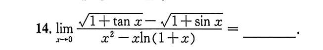
最终算的和答案一样
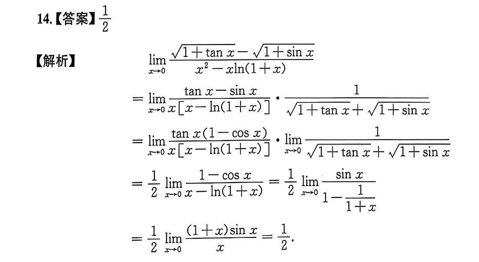
## 15 （关于ln的化简）
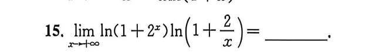

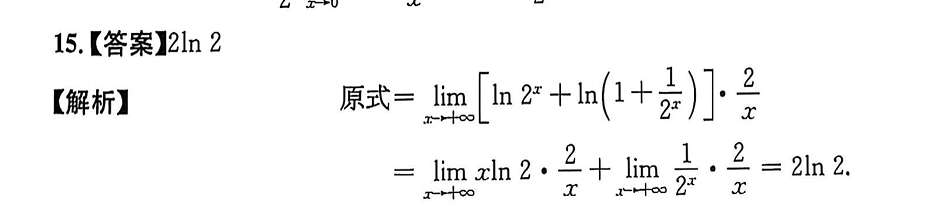

## 19（关于ex 洛必达）
图中第三个等号是怎么过去的？ 我化简到了第三个等号前，我做了错的步骤，是将$xe^x(1+x)$ 中$e^x$变成1了， 我第一反应是，没有创造出什么0，可以代入极限。但应该不能，看有没有得到1，是不是要全部x代入极限试试？
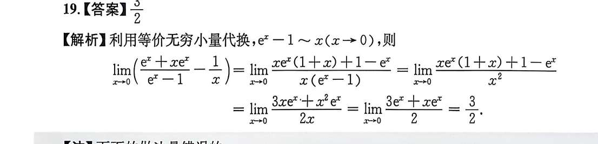
## 21（关于绝对值，幂函数的变化）
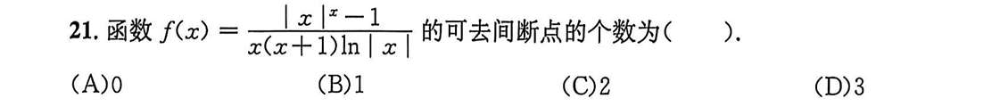
这个化简有点难想到
这个x趋于-1我理解 分子是一个等价无穷小 但x趋于0 ，分子咋画的啊 $e^{xln|x|}$ 这还能化简? x趋于1我也没理解
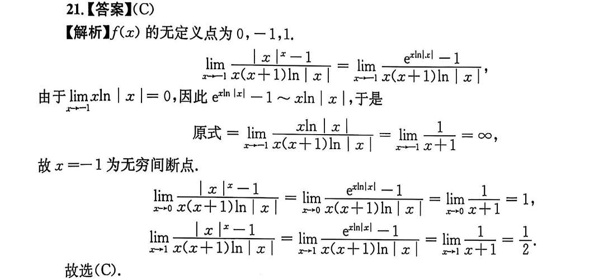

## 23 （关于ex 求极限， 无穷与0，如何化简式子）
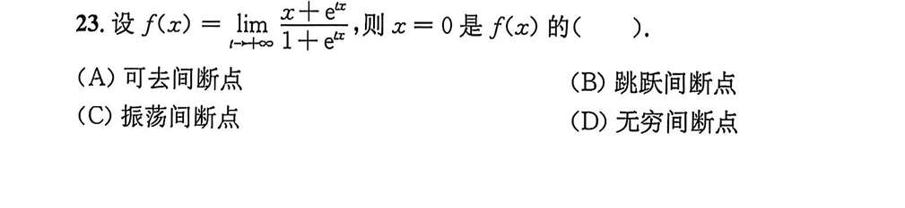

分x 
x>0 同时除以$e^{tx}$ 我不知道怎么想到的
只要见到分子分母同时趋于无穷，第一时间就要想：**“把最大的那个家伙除掉”**。

x=0时 我疑惑 0乘无穷不是不一定等于0吗？
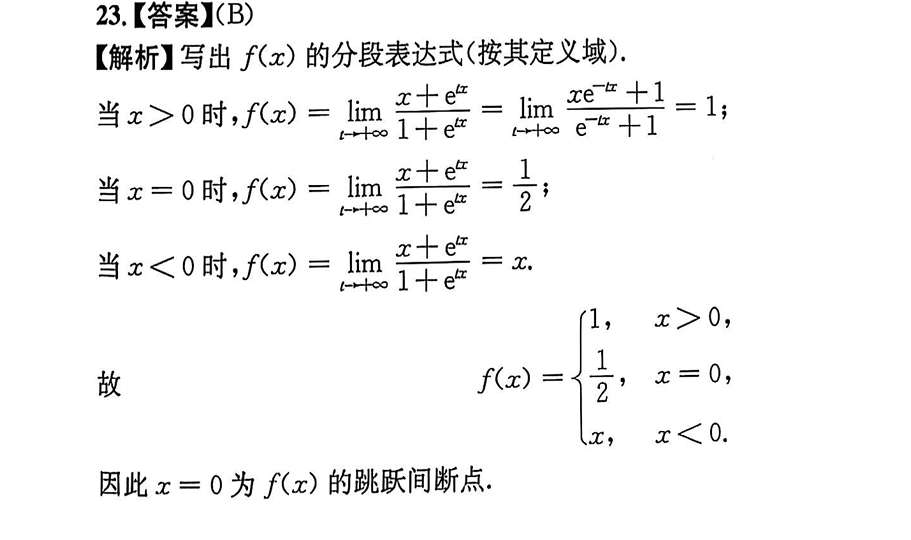

我们讨论的“$0 \cdot \infty$ 未定式”，指的是：
*   一个**正在变小、无限趋近于0**的变量 $\times$ 一个**正在变大**的变量。
*   比如 $\lim_{t \to \infty} \frac{1}{t} \cdot t$。

**但是！本题中的 $x$ 是什么？**
*   题目讨论的是“当 $x=0$ 时”。
*   这里的 $x$ 是一个**死死的、固定的、绝对的常数 0**。
*   它**不是**一个趋于0的极限过程。

**推演过程**：
1.  我们看指数部分 $tx$。
2.  因为 $x$ 固定为 0，所以 $tx = t \cdot 0$。
3.  在数学公理中，任何实数（哪怕是很大的 $t$）乘以**绝对的0**，结果都是**绝对的0**。
4.  所以，指数 **恒等于 0**（不是趋于0，就是0）。
5.  那么 $e^{tx} = e^0 = 1$。这也是一个**绝对的 1**。