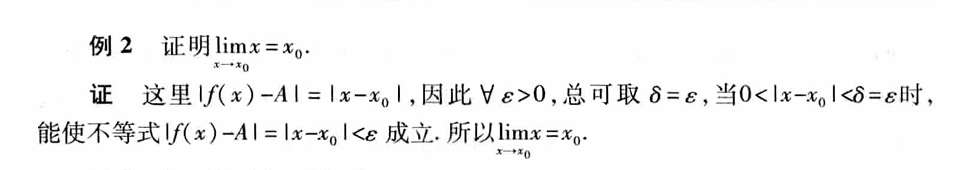
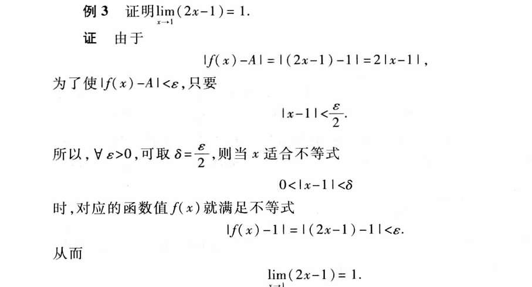

教材定义·：在自变量的某个变化过程中，对于的函数值无限接近于某个确定的数，这个数叫函数的极限

如果说x值的极限是A，那么就是说，如果我们给他施加检验，比如非常非常小的区域,，我们称任意小的 ε 0.000001   看他能否接近A加减ε
x回如何回应这个挑战？ 他总能找到邻近的区域，半径为δ  这邻近的所有的区域，都能达到我们的检验的标准。
如果，检验很宽松，ε是很大的数，  x回应也可以很轻松， δ可以设置的很大。
所以任意是题，存在是解答。 是因为这个先后顺序所以定义的任意和存在

$\varepsilon-\delta$定义的真正结构，是一个**因果/条件结构**：
“**对于任何一个**关于‘无限近’的挑战（任意$\varepsilon$>0），我们**总能找到一个**行动方案（存在$\delta$>0），**使得**只要我们的自变量x执行了这个方案（$0<|x-x_0|<\delta$），其结果f(x)就**必然会**达成挑战的要求（$|f(x)-A|<\varepsilon$）。”

例如本题，你随便用epsilon测试 我就取δ等于ε  就足以应对你的压力测试

到底如何应对压力测试，我们是可以计算的！