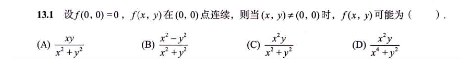
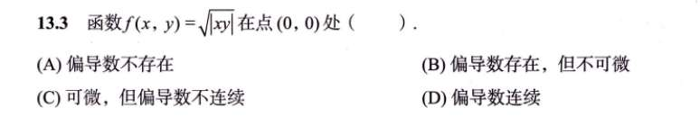
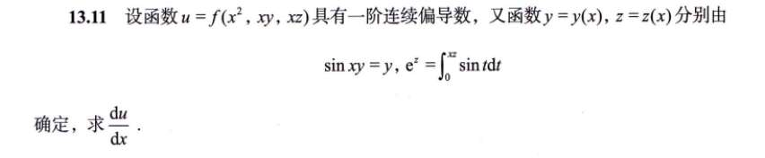
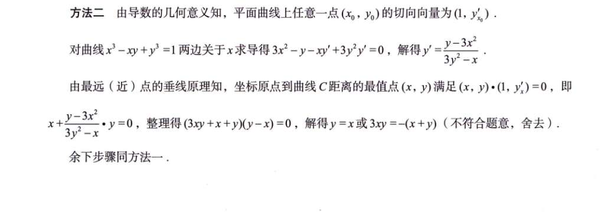

# 13.1

- **分子总次数 $\le$ 分母总次数：** 极大概率**极限不存在**。
  **战术：** 找反例。拿 $y=kx$ 或者 $y=kx^n$ 往里代，证明沿着不同路径过去，极限值不一样。
- **分子总次数 $>$ 分母总次数：** 极大概率**极限存在且为 0**
  **战术：** 证明它。用“极坐标替换”或者“不等式放缩（夹逼定理）”。

**看选项 (C)：** $\frac{x^2y}{x^2+y^2}$

- **看面相：** 分子次数是 $2+1=3$。分母最高次数是 $2$。**分子 $>$ 分母！**
    
- **定战术：** 极限存在且为 0，这大概率就是正确答案！开始证明。
    
- **执行（两种方法任选，极坐标通常更无脑）：**
    
    - _方法 1（不等式放缩）：_ 我们知道不管 $x,y$ 是多少，$\frac{x^2}{x^2+y^2}$ 这个整体永远 $\le 1$（因为分母比分子大）。所以 $| \frac{x^2y}{x^2+y^2} | = |y| \cdot | \frac{x^2}{x^2+y^2} | \le |y| \cdot 1 = |y|$。当 $y \to 0$ 时，$|y| \to 0$，所以原式极限被夹逼成了 0。完美！
        
    - _方法 2（极坐标法）：_ 令 $x = r\cos\theta, y = r\sin\theta$。代入得：$\frac{r^3\cos^2\theta\sin\theta}{r^2} = r \cdot \cos^2\theta\sin\theta$。因为后面的三角函数是有界的（永远在 $[-1, 1]$ 之间），而前面 $r \to 0$，所以“$0 \times \text{有界} = 0$”。连续！**选 (C)。**
        

**看选项 (D)（终极老六题）：** $\frac{x^2y}{x^4+y^2}$

- **看面相：** 分子是 $3$ 次。分母有点奇怪，一个是 $x^4$（$4$ 次），一个是 $y^2$（$2$ 次），力量不均衡。
    
- **定战术：** 对于分母次数不均衡的“老六”，通常是在挖坑。我们需要用一条曲线把分母的两次“强行拉平”。
    
- **执行：** 分母是 $x^4$ 和 $y^2$。怎么让它俩同量级？显然是让 $y$ 和 $x^2$ 挂钩！所以我们**不猜 $y=kx$，我们猜 $y=kx^2$！**
    
    代入 $y=kx^2$：原式变成 $\frac{x^2(kx^2)}{x^4+(kx^2)^2} = \frac{kx^4}{x^4+k^2x^4} = \frac{k}{1+k^2}$。
    
    你看！结果又和 $k$ 有关了，极限不存在！排除。

# 13.3

看到绝对值，禁止想求导，去想定义法！
- **求对 $x$ 的偏导 $f'_x(0, 0)$：**
    
    根据定义，就是让 $y$ 牢牢地等于 $0$，只让 $x$ 有一个微小的变化 $\Delta x$。
    
    $$f'_x(0, 0) = \lim_{\Delta x \to 0} \frac{f(\Delta x, 0) - f(0, 0)}{\Delta x}$$
    
    现在我们把函数 $f(x, y) = \sqrt{|xy|}$ 代进去。因为 $y=0$，所以分子变成了 $\sqrt{|\Delta x \cdot 0|} - 0 = 0$。
    
    极限变成了：$\lim_{\Delta x \to 0} \frac{0}{\Delta x} = 0$。
    
    **结论：对 $x$ 的偏导数存在，且等于 0。**
    
- **求对 $y$ 的偏导 $f'_y(0, 0)$：**
    
    同理，让 $x=0$，只让 $y$ 变化。
    
    $$f'_y(0, 0) = \lim_{\Delta y \to 0} \frac{f(0, \Delta y) - f(0, 0)}{\Delta y}$$
    
    代入原函数，分子依然是 $\sqrt{|0 \cdot \Delta y|} - 0 = 0$。
    
    极限也是 0。
    
    **结论：对 $y$ 的偏导数也存在，且等于 0。**

## 13.8

[概念--f'](卡片/概念--f'.md)
## 13.11

[辨析--d还是roundd](卡片/辨析--d还是roundd.md)

## 13.14

等等，什么切向向量，我的想法是算出dy比dx后，可写出过原点的那个直线，然后平移刚好与曲线相切，即联立方程Δ=0即可，但太麻烦了。我想看懂答案

### 第一关：什么是“切向向量为 $(1, y')$”？

你肯定知道导数 $y'$ 就是切线的**斜率** $k$。斜率的定义是什么？是“纵坐标的增量除以横坐标的增量”，即 $k = \frac{\Delta y}{\Delta x}$。

既然 $y' = \frac{y'}{1}$，用大白话来说就是：**如果你沿着切线方向，横坐标（$x$方向）每往前走 $1$ 个单位，纵坐标（$y$方向）就会变化 $y'$ 个单位。**

把这个“走法”写成向量的形式，不就是 **走位向量 $\vec{v} = (1, y')$** 吗？

这就叫“切向向量”。它极其简单粗暴地把一个斜率数字，变成了一个有方向的箭头。

### 第二关：向量版的“垂线原理”

还记得咱们之前聊过的“最远（近）点的垂线原理”吗？

要找曲线 $\Gamma$ 上离点 $Q$ 最近或最远的点 $P$，那么 **连线 $QP$ 必须垂直于曲线在 $P$ 点的切线**。

在这道题里：

1. **点 $Q$ 是谁？** 是坐标原点 $(0, 0)$。
    
2. **点 $P$ 是谁？** 是曲线上那个我们要求的极值点 $(x, y)$。
    
3. **连线向量 $\vec{QP}$ 是什么？** 就是终点减起点：$(x - 0, y - 0) = \mathbf{(x, y)}$。
    
4. **切线向量是什么？** 刚才第一关算出来了，是 $\mathbf{(1, y')}$。
    

既然它俩必须**垂直**，在向量的世界里，垂直的终极奥义是什么？**点乘（内积）等于 0！**

所以，答案写出的核心灵魂方程式就是：

$$\vec{QP} \cdot \vec{v} = 0$$

$$(x, y) \cdot (1, y') = 0$$

把点乘展开（横坐标乘横坐标 + 纵坐标乘纵坐标）：

$$x \cdot 1 + y \cdot y' = 0$$

即：

$$x + y \cdot y' = 0$$

### 第三关：代入并解方程（解密答案的算式）

答案的第一步已经通过隐函数求导，算出了 $y' = \frac{y - 3x^2}{3y^2 - x}$。

现在，把这个一长串的 $y'$ 直接塞进我们刚才得出的 $x + y \cdot y' = 0$ 里：

$$x + y \cdot \left( \frac{y - 3x^2}{3y^2 - x} \right) = 0$$

你看！这不就是答案里那长长的一串式子吗？没有任何玄学，就是**位置向量 $\cdot$ 切向向量 $= 0$** 的直接展开。

放弃 $\Delta = 0$ 的执念吧。在大学微积分里，处理“垂直、相切、最近最远”这类几何问题，**把斜率转化成向量 $(1, y')$，然后用点乘 $\cdot = 0$ 来列方程**，是最正统、最降维打击的做法！现在感觉思路打通了吗？

# 1000 题
