# 知识点
## 可微
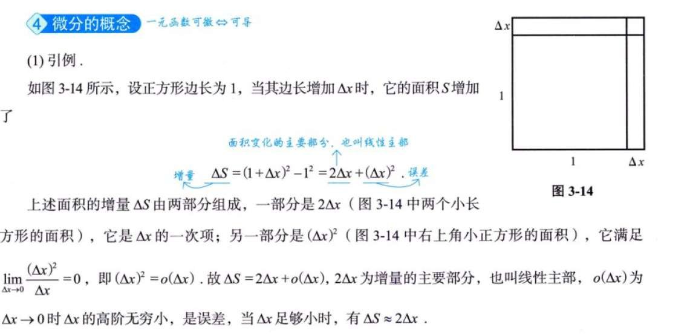
与一元可微对比，一元是正方形面积增加，一次方为主部，也是二次方部分为无穷小
多元是长方形面积增加，二次方部分（ΔxΔy）为无穷小，

偏导数连续是一个“很强”的条件，它保证了整个邻域的导数都很乖巧；而可微只是在这个单点上表现良好。所以偏导数连续能推出可微（杀鸡用牛刀），但可微推不出偏导数连续。
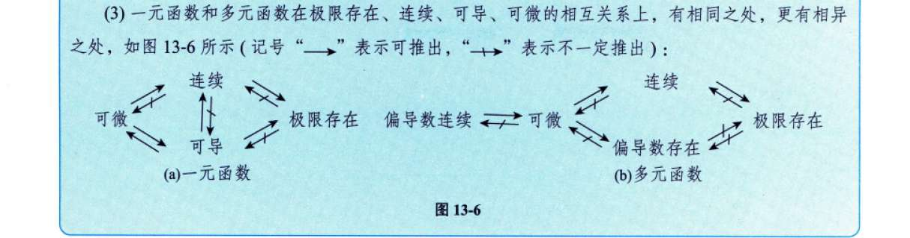

## 全微分不变
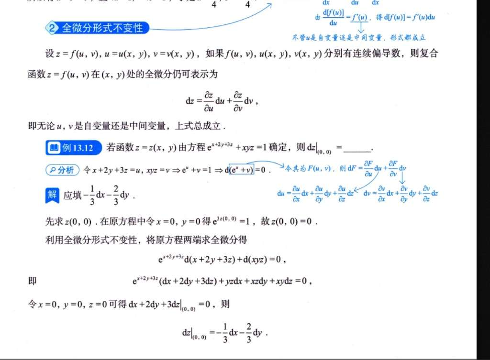
### 一、 到底是什么东西“不变”？

这里的“形式”，指的是**公式的长相**。

假设你有一个函数 $z = f(u, v)$。

- **情况A（最简单的情况）：** $u$ 和 $v$ 本身就是最底层的自变量。
    
    那么 $z$ 的全微分公式长这样：
    
    $$dz = \frac{\partial z}{\partial u}du + \frac{\partial z}{\partial v}dv$$
    
    （你可以把它理解为：$z$ 的总微小变化 = $u$ 变带来的影响 + $v$ 变带来的影响）。
    
- **情况B（复合函数的情况）：** $u$ 和 $v$ 不是底层变量，它们其实是个“中间商”，它们下面还有底层变量 $x$ 和 $y$，即 $u=u(x,y)$， $v=v(x,y)$。
    

**全微分形式不变性，说的就是：即使在情况B下，上面那个公式的长相依然绝对成立！**

无论 $u$ 和 $v$ 是真正的“大老板”（自变量），还是只是“部门经理”（中间变量），你算 $dz$ 的时候，**第一步的公式写法完全一模一样**。

### 二、 为什么形式可以不变？（本质是链式法则）

你可能会问：既然 $u$ 和 $v$ 里面还藏着 $x$ 和 $y$，凭什么公式还能长得一样？

因为这个公式里的 $du$ 和 $dv$ 替你承担了所有复杂的细节！

在情况B里，$du$ 和 $dv$ 本身也是全微分：

$$du = \frac{\partial u}{\partial x}dx + \frac{\partial u}{\partial y}dy$$

$$dv = \frac{\partial v}{\partial x}dx + \frac{\partial v}{\partial y}dy$$

如果你把这两个长长的式子代入到一开始的 $dz$ 公式里，把 $dx$ 和 $dy$ 重新合并同类项，你最终得到的结果，**恰好就等于**你直接用上一节学的“链式求导法则”算出来的结果。

**总结一句话：全微分不变性，就是链式法则的另一种“打包写法”。** 它允许你先不管底层的 $x$ 和 $y$，先把外层（$u$ 和 $v$）的微分写出来，然后再一层一层往里剥洋葱。

## 隐函数求导

## C

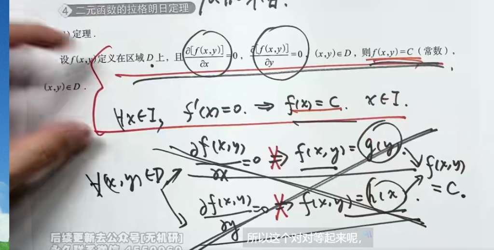
## 极值与最值
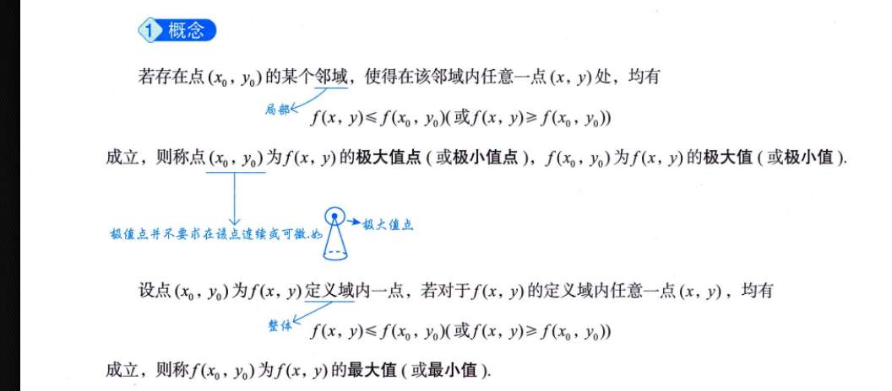
**1. 极值（Local Extremum）：微观视角的“山大王”**

- **关键词在定义里是“存在某个”：** 定义里说“若**存在**点 $(x_0, y_0)$ 的某个邻域”。这意味着，哪怕整个函数的定义域有太平洋那么大，我只要能在这个点周围画一个哪怕只有**针眼那么小**的圈（邻域），在这个微小的圈里，它是最大的，那它就是“极大值”。
    
- **生活类比：** 你是你们班最高的同学。虽然放眼全校你可能不是最高的，但在“你们班”这个极小的**局部邻域**里，你就是老大。你是一个“极大值”。
    

**2. 最值（Global Extremum）：宏观视角的“天下第一”**

- **关键词在定义里是“定义域内任意一点”：** 这里没有任何讨价还价的余地，不能只看一小块地方。你必须和定义域这个**完整版图**里的**所有点**去PK。
    
- **生活类比：** 姚明是中国篮球队里最高的。这里比的不是某个班级，而是“全中国”这个**整体定义域**。他是“最大值”。
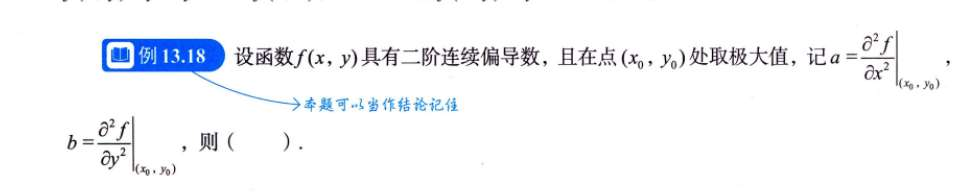
记得，已经知极值推二阶导，是有等于号的。而已知二阶导推极值是没有等于号。

### $AC-B^2$ 方法：

为了防止被马鞍点欺骗，数学家发明了 $AC - B^2$ 这个鉴渣神器。你可以把它看作一场**“主旋律”与“扭曲力”的拔河比赛**：

- **正面力量（主旋律）：$A \times C$**
    
    这是 x 方向和 y 方向弯曲程度的乘积。如果 $A$ 和 $C$ 同号（比如都是负的，都在往下弯），$AC$ 就是个正数，代表它们在**团结一致**地试图把这个点塑造成一个完美的碗状（极值点）。
    
- **反面力量（破坏者）：$B^2$**
    
    $B$ 是扭曲力，它平方之后 $B^2$ 永远是正的，前面带个减号，说明它永远在**搞破坏**。扭曲力越大，这个平面就越想把自己撕裂成薯片的形状。
    

**决战时刻：**

1. **当 $AC - B^2 > 0$ 时（主旋律获胜！）：**
    
    这意味着 $A$ 和 $C$ 的团结力量足够强大，彻底压制住了 $B$ 的扭曲力。这座山在 **360 度所有方向上**，都保持了相同的弯曲趋势！
    
    既然确认了是极值点，那到底是大还是小呢？随便抓一个主力来看看就行了：
    
    - 看 $A < 0$：说明主力是往下弯的，所以是**极大值**（山顶）。
        
    - 看 $A > 0$：说明主力是往上弯的，所以是**极小值**（谷底）。
        
2. **当 $AC - B^2 < 0$ 时（扭曲力获胜！）：**
    
    完蛋了，扭曲力 $B^2$ 太大了，或者 $A$ 和 $C$ 本来就不齐心（一正一负，$AC$ 是负数）。这地面已经被扭成了麻花，绝对是**马鞍点**，没有极值。
    
3. **当 $AC - B^2 = 0$ 时（打平了）：**
    
    检测仪冒烟了，无法判断。这就好比我们上一个问题聊的 $f(x,y) = -(x^4 + y^4)$ 那种“平顶山”，太平坦了，二阶导数测不出结果，需要用更高级的方法（比如看定义或者求更高阶导数）来判断。
    

**总结成一句话：**

$AC - B^2$ 就是用来评估“地面扭曲程度”是否足以破坏“正方向弯曲趋势”的指标。大于 0，说明没被破坏，是个纯正的碗；小于 0，说明被撕裂了，是个薯片。

## 拉格朗日乘法
F=想求的最值式子+λ约束式子
n 元的式子，就求对 n 个元分别求偏导。
最后列好约束式子。
直觉是法向量平行。

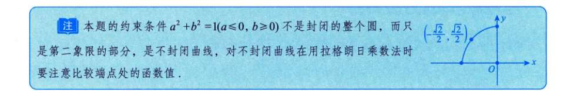
## 垂线原理
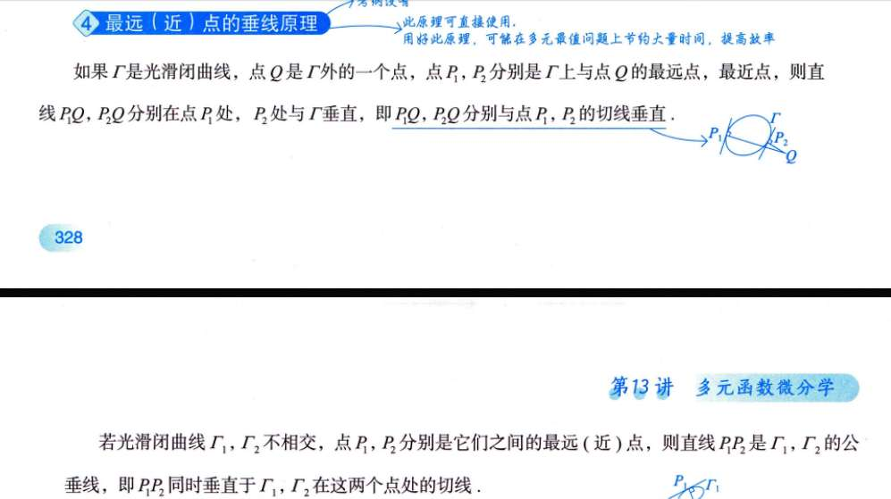
# 例题
基本均值不等式对于任意两个**非负数** $a$ 和 $b$，都有：

$$\frac{a+b}{2} \ge \sqrt{ab}$$

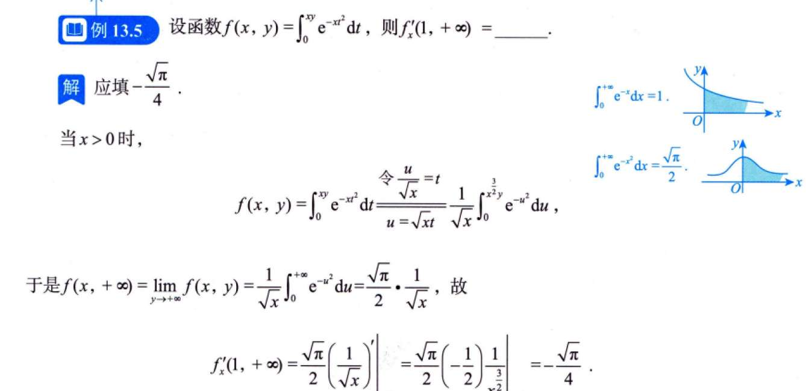

老生常谈，积分导数，积分上下限与函数都有要求导的变量，用换元法。
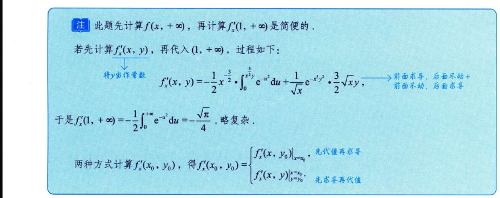
两种过程！

利用二阶导相等的条件
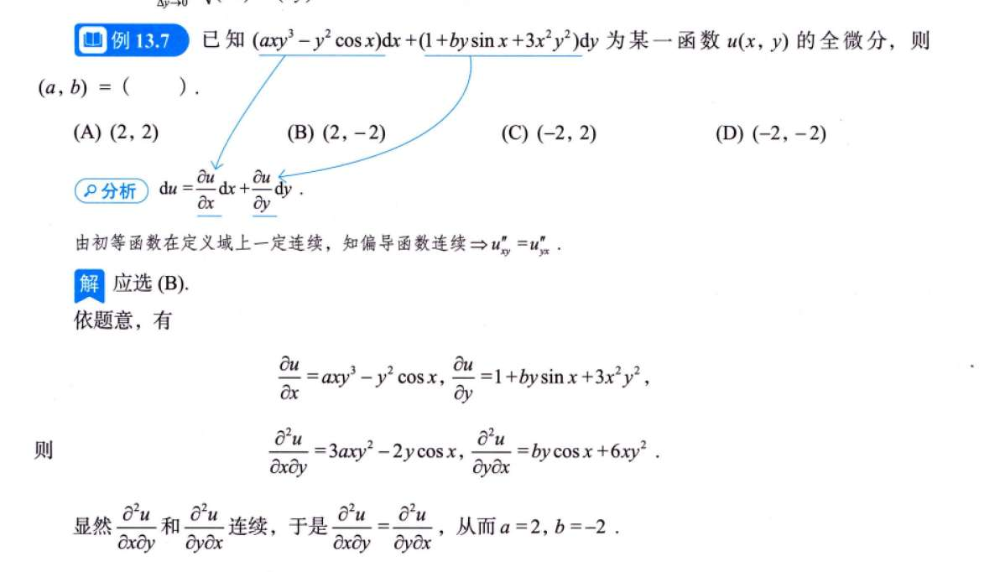

