# 可导与连续
这个直觉建立很有趣
更能记住连续是可导的充分条件了，因为可导更苛刻

# f(x)与|f(x)|

第一个性质，一个图便解释清楚

对于性质二，关键在于这句话 ：
对于连续或可导函数，只要f(x)大于或小于0，无论f(x)与0的距离有多小，它旁边相依相偎的f(x)一定大于或小于0，  我觉得，这可以用极限的保号性解释（连续---极限存在---极限保号性）

# 可微
突然在想，那个无穷小，到底怎么定义，怎么来的 。
 ==Δx的高阶无穷小  是说，其除以x，是0. 那乘x呢？（俩个都趋于0，所以还是0？如果没说趋于0呢 就说其乘x x趋于其他呢？） 那被x除以呢（这个无穷了吧）==
**o(Δx)是比Δx还小的数     比如Δx方   故而乘x 就叫 更高阶的无穷小    被Δx除以 就是无穷**
**然后只要出现这个符号 默认且必须绑定一个极限过程**

# 求导公式
推导公式要记住吗？
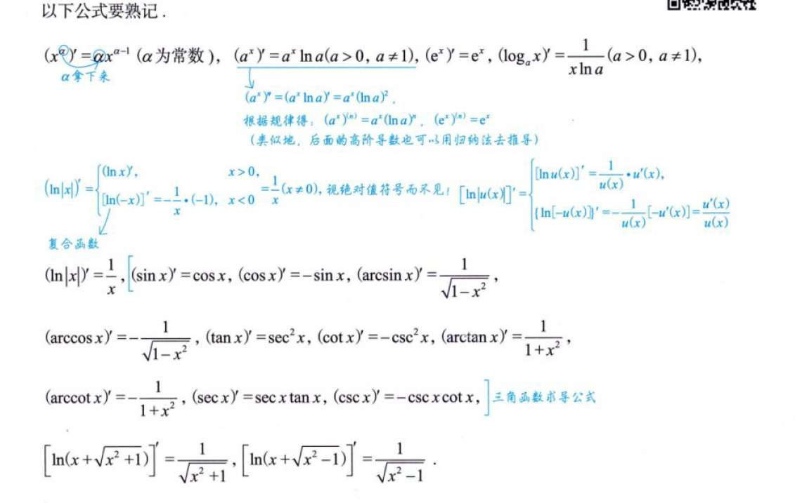

# 四则运算
这个推导u(x)v(x) 乘积的导数的过程   分子怎么多出一大堆？？ 
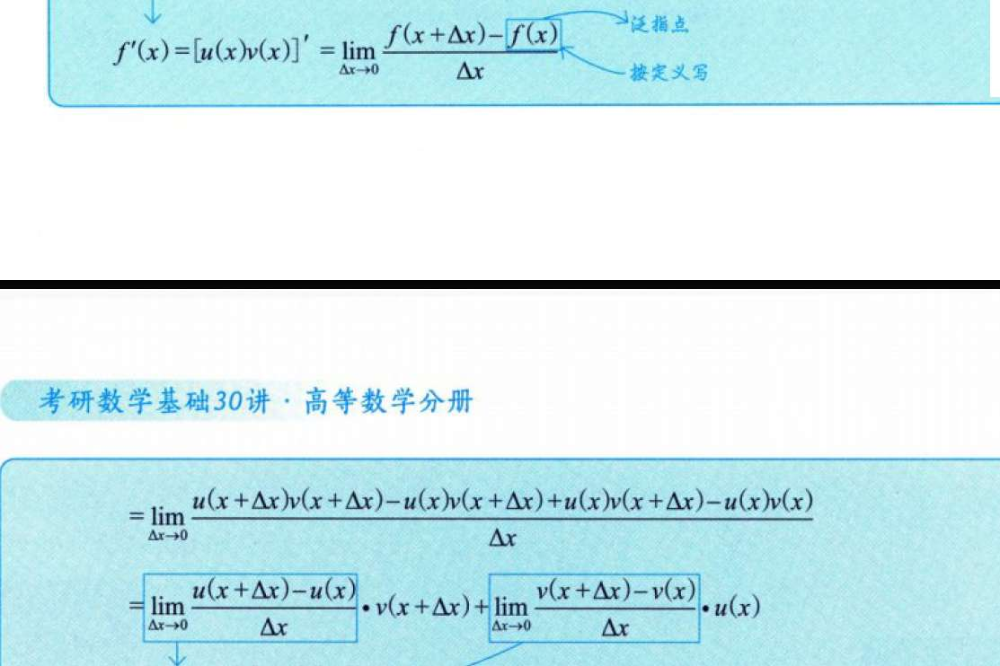

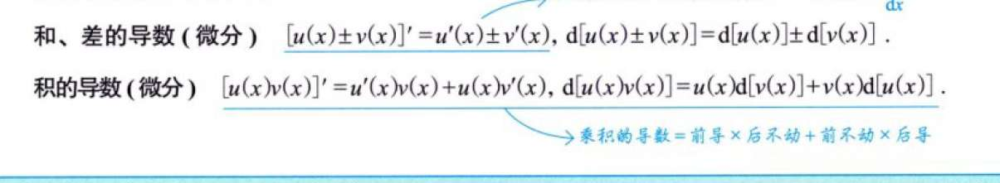
导数的式子能推到微分 可以理解为 d(u(x)) = u'(x)dx  把dx全约掉就是导数式子？

复合求导用微分很好推啊！
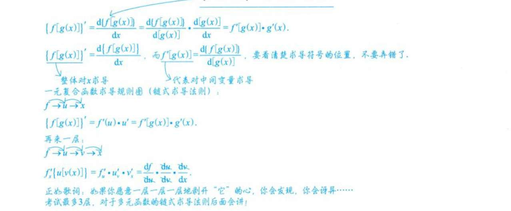

# 分段函数求导
分段函数不一定不可导！ 
不过在分段处，必须用导数定义求  导数公式自然用不了，

# 反函数的导数
反函数的导数就是 函数的倒数  这也一下就好说arcsinx导数的推导了
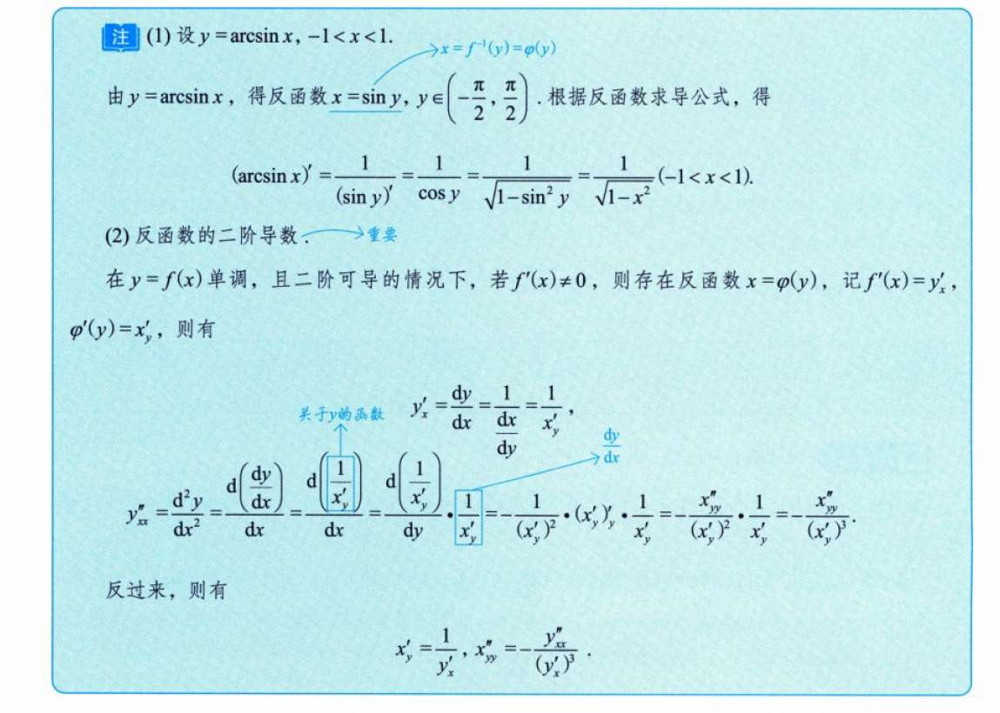

# 参数方程的求导
又是一个公式
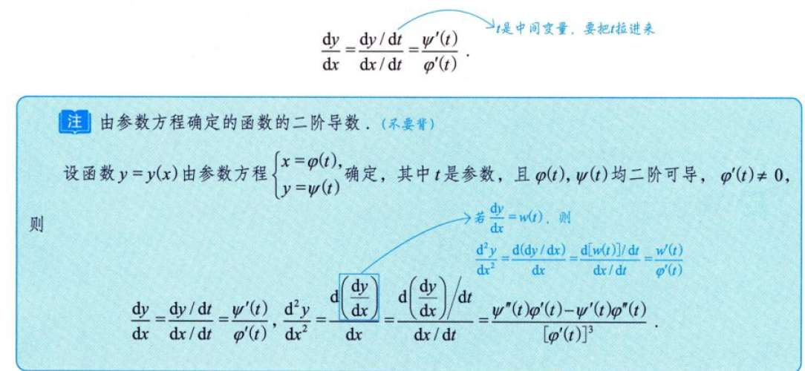

# 例题
## 例3.1（导数的奇偶性质）
导数的奇偶性与函数自身相反 ； 周期性是继承的
## 例3.3（夹逼准则）
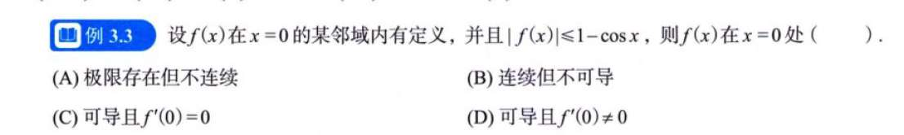

这个得重做 根本没想出来 

## 例3.5（绝对值）
每次都忘了 对于函数 代绝对值的 。
但我也好奇，这种题 我想象不了所谓“充分条件”或“必要条件”能怎么来

## 例3.6（3.5的应用 ）

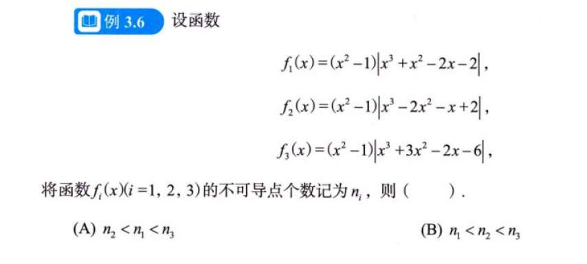

## 例3.10
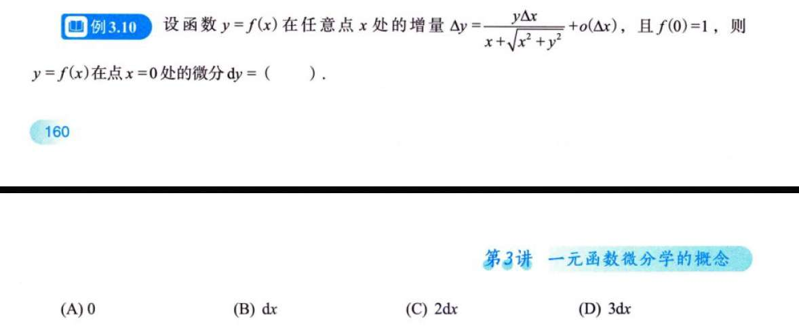
这道题，我觉得根本不用什么求导，那样和死记硬背一样。
明明dy的定义就是 线性主部 AΔx  题中 把Δx前面一大堆数字一代就好了嘛 

## 例4.1
懵逼了

secx取值都是啥 sec方呢

## 例4.3

我把函数写出来了  但是，当如本题求导数，而不是导函数或者什么函数之类时，不必写表达式

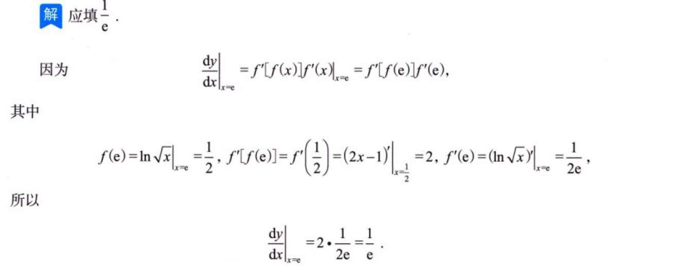
## 例4.7
纯粹是考公式

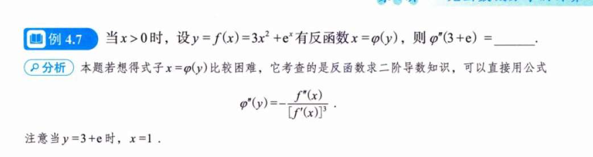

## 例4.15
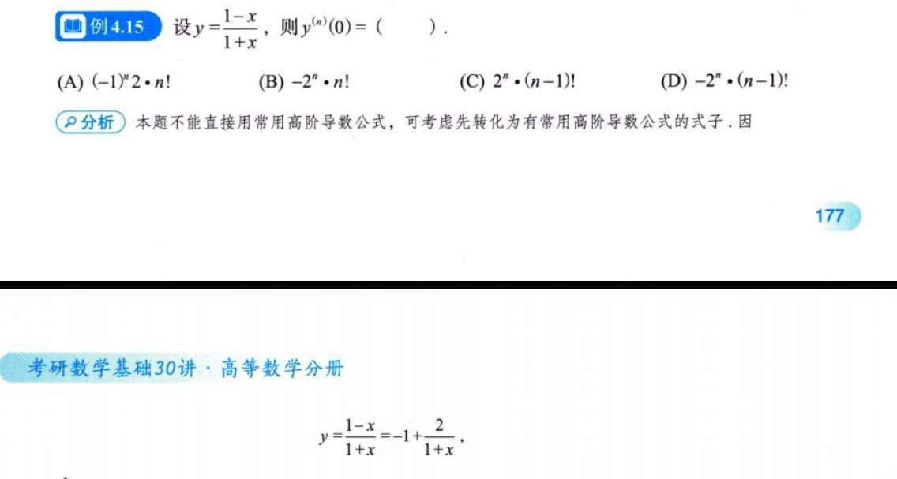
还能这么化

## 4.18泰勒公式
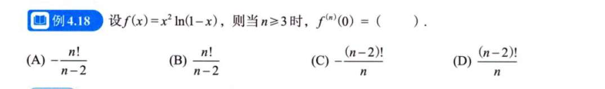

## 4.19
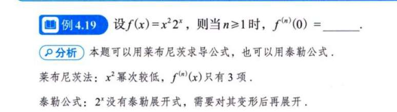
# 习题
## 3.6 3.7（凑分数凑成导数；

	3.6拆解式子，构造出导数，还能这么玩？？？！确实没想到。我觉得这类技巧性的题目，不同于知识性的，是不是要给它命个名，以后要专门整理这种？
	3.7，我实在是被这个连续和可导的条件唬住，一直在想他俩条件有啥用，但答案直接是，写出$F'_{+}(x0)$ 的定义 然后用洛必达？ 到底有什么深刻的含义
	
	以及这个图到底有什么意义？
	
对，这是个技巧 导数定义凑形法
*   导函数 $F'(x)$ **可以是不连续的**（比如在0点）。
*   **但是！** 导函数的不连续点，**绝不可能是“跳跃间断点”或“可去间断点”**。
*   如果 $\lim F'(x)$ 存在，它就必须等于 $F'(x_0)$（即被迫连续）。
*   **导函数只有两种命：要么连续，要么震荡。**（这是达布定理的通俗版）。

## 3.8 3.9
3.8自己思路没问题 就是感觉这题确实有点奇怪了 不知道有啥意义
3.9 我看证明题就是 题目条件捣鼓捣鼓（化简、利用题目条件） 一边捣鼓一边想能不能靠近证明的条件  没有什么知识性考察啊

# 1000题

## 3，4，5，6
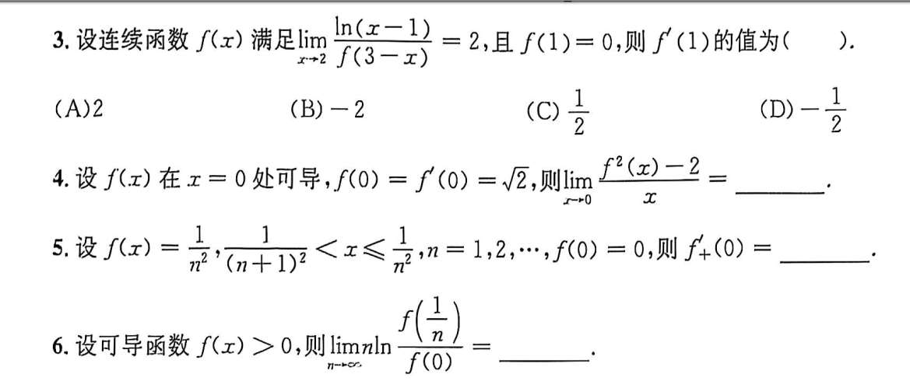
3
函数连续，其导数函数也连续？
我就这么默认了，所以用了洛必达（再强调一遍洛必达的应用前提吧）
答案不是用洛必达，而是将Δx=x-2替换到式子里   这样构造出来ln（1+Δx）/Δx  也消除掉他了
 4
好像不能洛必达？洛必达需要导数函数 此点领域都有函数值 题目只说在一点可导啊。
看到平方公式拆开 这题做对了
5
这是要干嘛呢 
似乎是什么夹逼定理？
确实是 但是自己就 无从下手的感觉 不知道为什么？ 真的 这种不知道为什么自己不会做的感觉 有点糟糕  似乎是不会用这个不等式  答案直接变形 我不敢动一样 
6
我也做对了 但又和答案不一样 我是

## 9
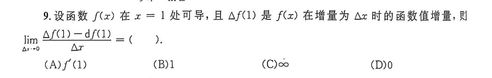
我反了一个错误 Δf(1) = Δx乘f'(1) 而不是 Δx乘df(1)        Δx乘f'(1) = df(1)

## 12，13
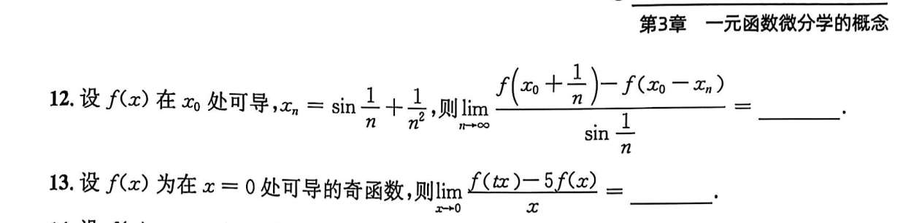
12
又是不断的凑导数
我凑了四分之三没凑出来
主要的点就在于，，不熟？不大胆？
13
确实没想到 理由f(0)=0 可以自由发挥地凑导数 想象空间很大！
还有一个坑，就是出现了与极限无关的t 记得分类讨论 t是常数 和 t是0