# 极值
注意极值的定义是 大于**等于** 小于**等于** 
自然而然的，常数函数就处处是极值了

严格单调递增不代表所有点的导数都是大于0的  可以有个别点的导数等于0 
进一步我们可以思考：导数等于0在极限的世界不能说没变化，只能说变化非常非常小 

一阶导数=0是**该点可导的函数**的极值点的必要条件 
我们讨论极值时 还有|x|这种函数去讨论 这种函数显然极值点不可导

这种情况 也暗含就是x0处导数为0的信息吧？ 还暗含了一个：连续不一定可导 这个第一充分条件完全可以适用|x|
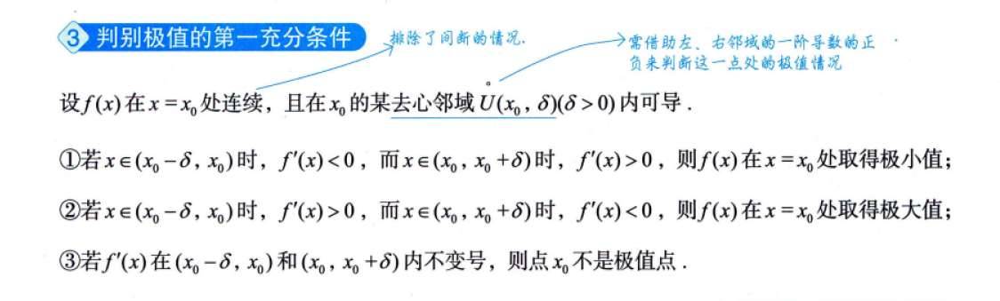

第二充分条件、第三充分条件
第二充分条件 是说 二阶导小于0 这点函数是极大值  那二阶导等于0呢 不一定  那函数是极大值 能得到二阶导的什么？ 至少小于0，还可能等于0    只要是有限个就行。 所以二阶导小于等于0

感觉这个推导必须得会，就是 一阶导等于0的情况下  二阶导小于0  说明此点为极大值
**推导直觉（泰勒公式）**：
$$ f(x) \approx f(x_0) + f'(x_0)(x-x_0) + \frac{1}{2}f''(x_0)(x-x_0)^2 $$
*   已知 $f'(x_0)=0$（驻点）。
*   所以 $f(x) - f(x_0) \approx \frac{1}{2}f''(x_0)(x-x_0)^2$。
*   $(x-x_0)^2$ 永远是正的。
*   **如果 $f''(x_0) < 0$**，那么右边就是负的。说明附近的 $f(x)$ 都比 $f(x_0)$ 小。所以是极大值。
*   **如果 $f''(x_0) = 0$**，这一项消失了，我们就得看更高阶的导数（比如三阶、四阶）。这就是为什么二阶导等于0时**“失效”**的原因。

## 函数的凹凸性
定义1好理解
定义2注意切线方程的形式

如何判别？
二阶导大于0是凸  小于0是凹

然后凹凸性引出拐点定义
拐点  二阶导为0 或不存在 

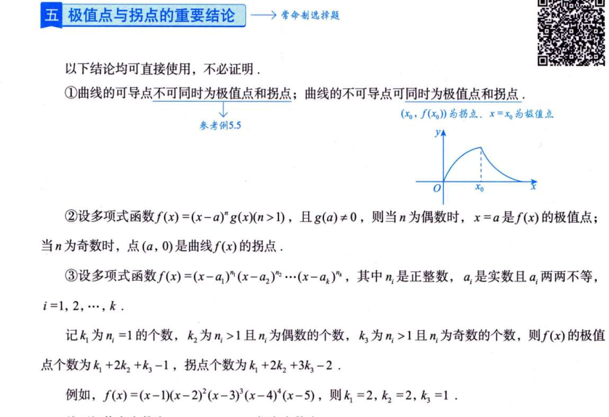

是否存在 x0处导数为0 但x0附近点的导数没有改变正负号？ 那个x^3好像就是个例子？
所以我们必须判断二阶导

结论1 
*   **直觉矛盾**：一个函数（$f'$）不可能在穿过 x 轴的同时，又在这一点取得极值（除非它是常数0，或者不可导）。
*   **简单记忆**：极值点是“回头浪”（上坡变下坡），拐点是“变奏曲”（弯得更急变弯得更缓）。同一个点不可能既回头又只是变节奏。
## 斜渐近线
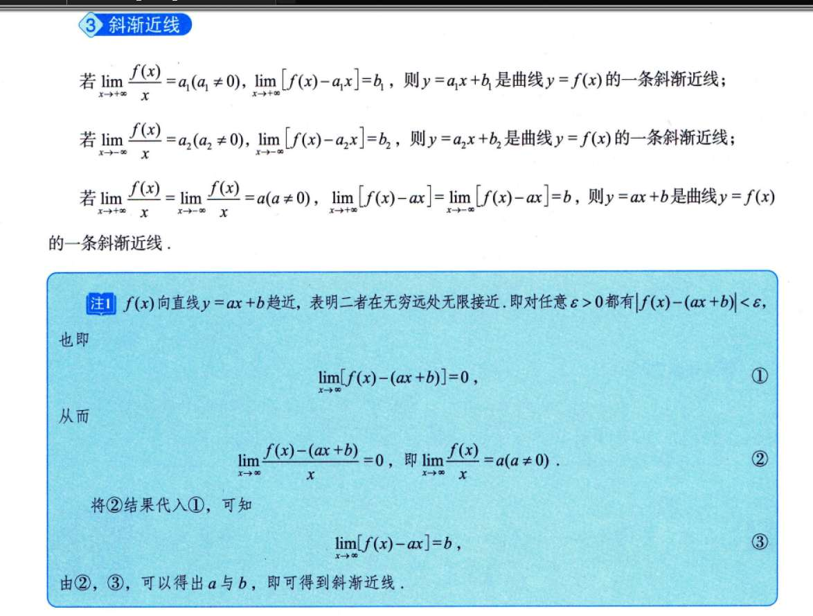
# 最值
如果最值 是在连续的区域内的  那一定最值就是极值 因为极值要求定义在一个双侧领域

那么 最值出现在端点的话 最值就不是极值  无法判定 因为无法定义极值

## 曲率
光背公式够了？
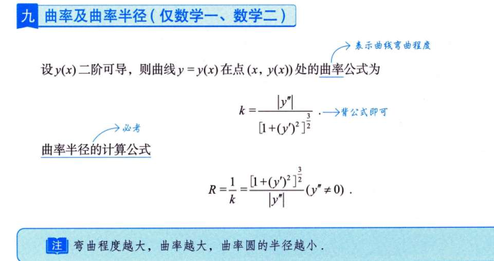
# 例题
## 5.1
根本没想到啊 还能凑
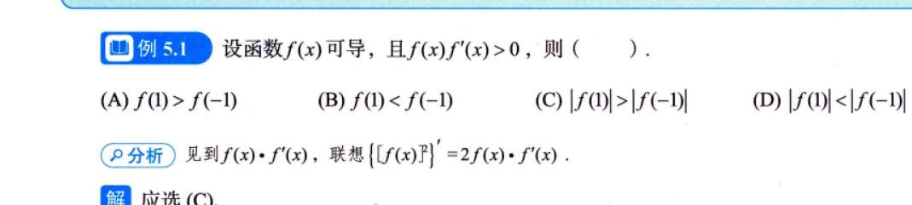

## 5.6
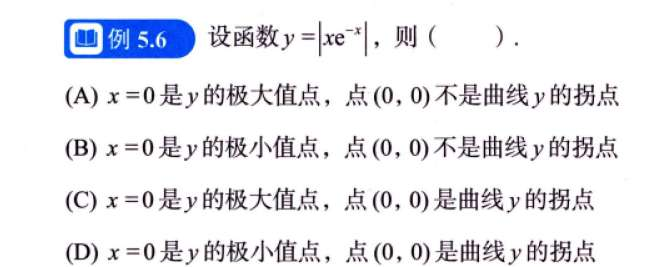
极值点的判断 似乎不能通过一阶导为0 然后看二阶导情况判断 似乎导数在0处不存在？
所以直接通过画图得出x=0为极小值点？
没错 从极值的第一项原理出发

## 5.7
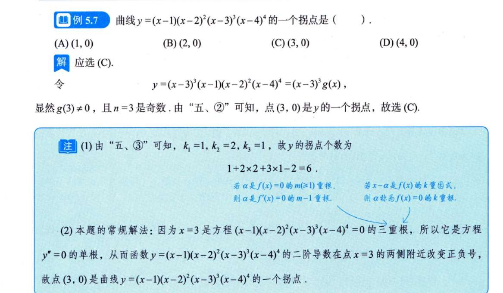
凭什么呀 就那个常规解法我都没理解 单根没问题 凭什么正负号就变了？

## 5.8
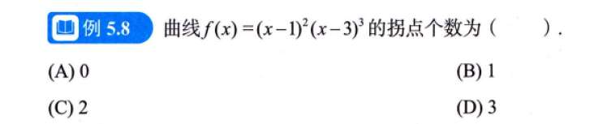

还不太理解常规做法
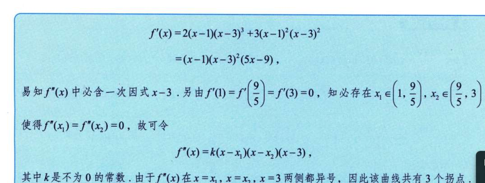

#  习题
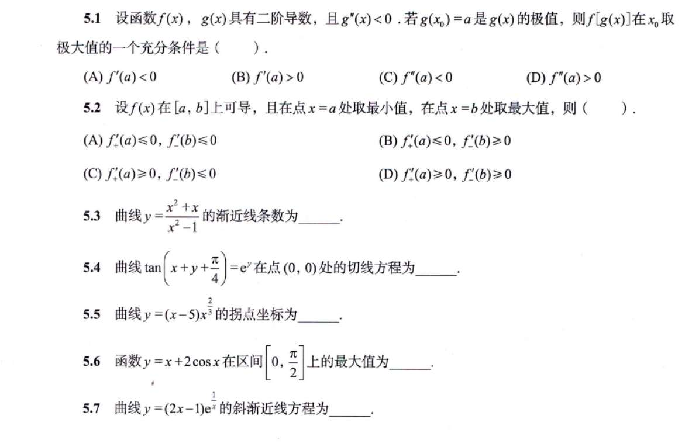
5.1
我是真懵逼 就是那种 给条件 然后看着条件不知所措的感觉
正确做法应该是       一阶导=0 二阶导小于0这俩性质去做
5.4 
看到三角函数还是有点头疼   我就说tanx导数secx方这里咋写嘛 于是就放弃 
结果答案用了arctanx
5.5
答案老实把括号展开求导 而我呢 换成lny 然后求 求二阶导 特麻烦  
5.7
一个简单的极限不会求
5.8
曲率方程 这真是计算能力不行 
怎么整理的？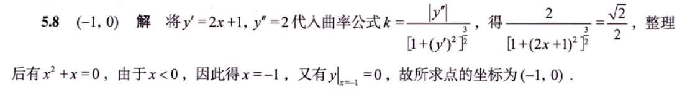
5.9
方法和过程都对又是计算的问题！ 

# 1000 题
## 2
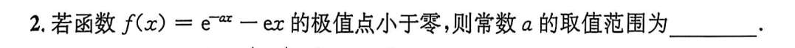
把 a 挪到一边，我没有做到
## 3
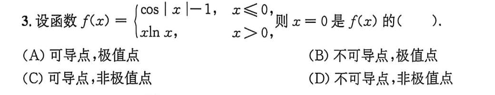
我是用极值点在函数值那一层级判断的，应用导数值这一层级。但我发现他俩很像

## 4
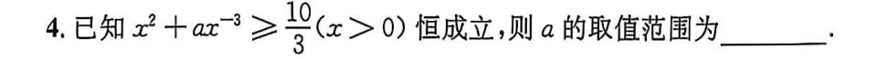
这个也是，应该把 a 单独提出来，找到 x 的函数，我这边混了。
我感觉这很像高中的选填
## 5
注意拐点是说二阶导"变号"  
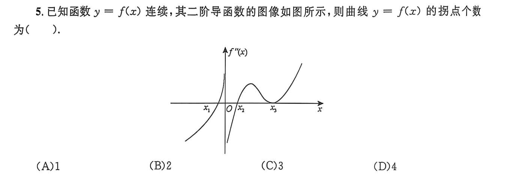

## 6
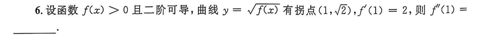
纯计算不行
## 7
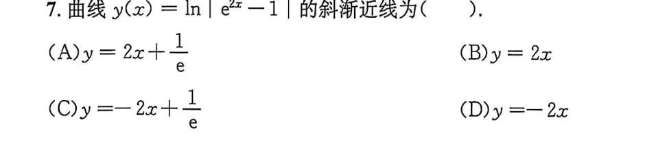
还是计算，该练极限了
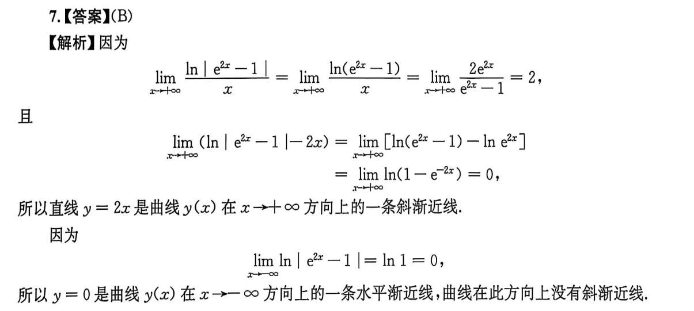
