# 中值定理
对 `[a,b]` 连续的函数：
- 有界与最值定理，函数连续那闭区间内一定有最大值最小值
- 介值定理，一定能找到介于二最值之间的数
- 平均值定理 
- 零点定理，若 $f (a)\cdot f (b)<0$ 则肯定有零点在 `[a,b]`

关于微分的：
- 费马定理：可导函数取极值的点导数为 0。使用极值定义+保号性证明（某点可导）
- 导数零点定理：条件是导数在区间内可导，端点导数异号时，有区间内某点导数为 0.我的理解是，和零点定理一样的。但书上的证明有趣啊，说端点导数异号，说明二者不是最值，但是连续函数在闭区间一定有最值，所以在区间里有其他最值，结合费马定理知其导数为 0。（闭区间区间可导，因为在说端点导数）
- 罗尔定理：闭区间连续，开区间可导，然后端点函数值相等 ---必有区间内某点导数为 0。这个条件怎么理解？闭区间连续保证有最值，开区间可导保证平滑，端点保证区间内的方向可导就行
- 拉格朗日中值定理：还是闭区间连续，开区间可导。罗尔歪过来
- 柯西不等式 ：还是闭区间连续，开区间可导。

罗尔定理推论：
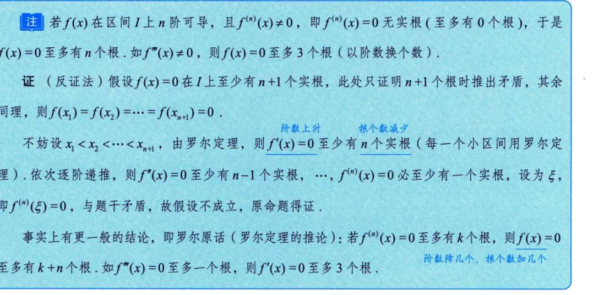
罗尔定理可证。
比如 f (x)=0 有 m 个根
那么 f' (x) 就有 m-1 个根，对每个小区间进行罗尔定理得到的。
所以导一次少一个根，

# 例题
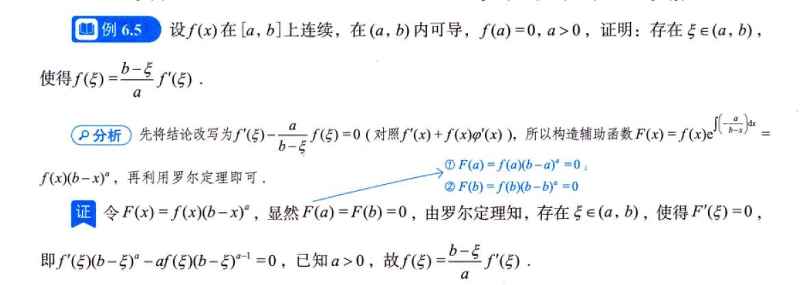
## 6.8
关键在于，把“有界”翻译成不等式
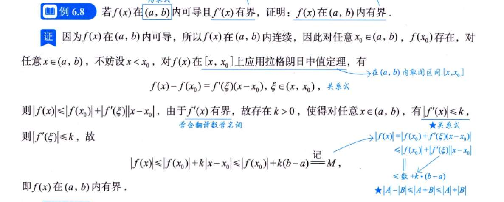
？

## 6.10
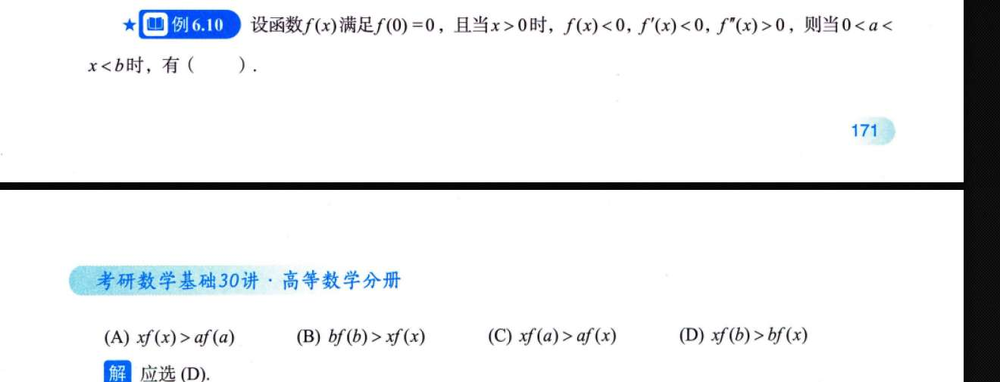

## 6.14
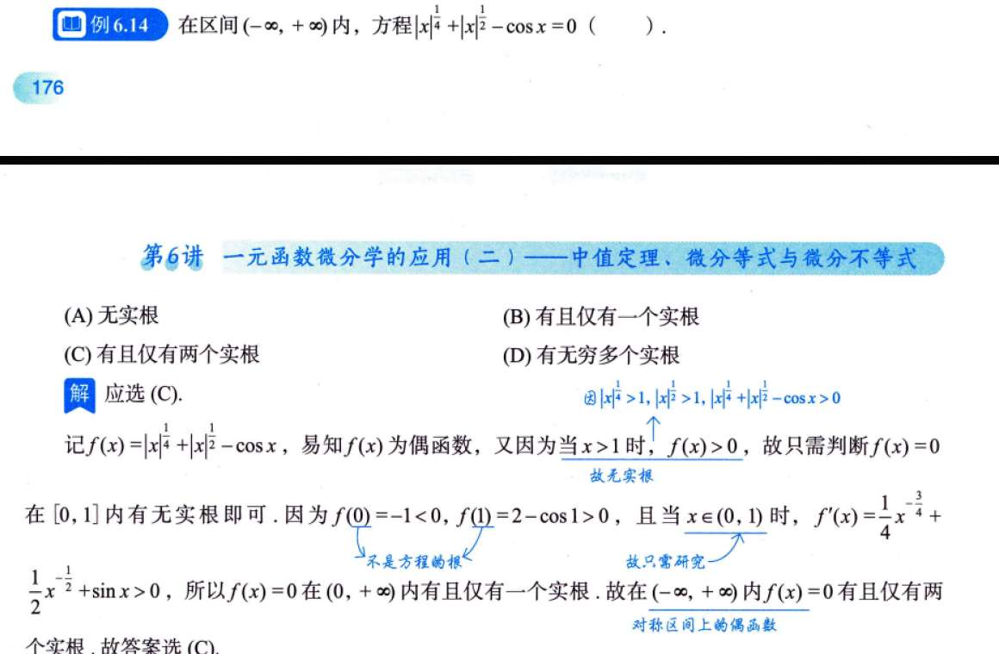
## 6.16
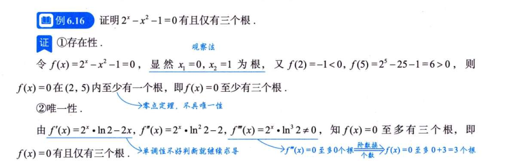
存在性纯试出来？
唯一性倒是技巧，罗尔定理推论

## 6.18
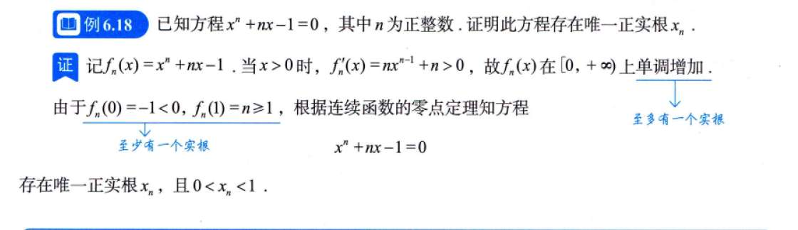
又猜 0 和 1 的地方？

## 6.20
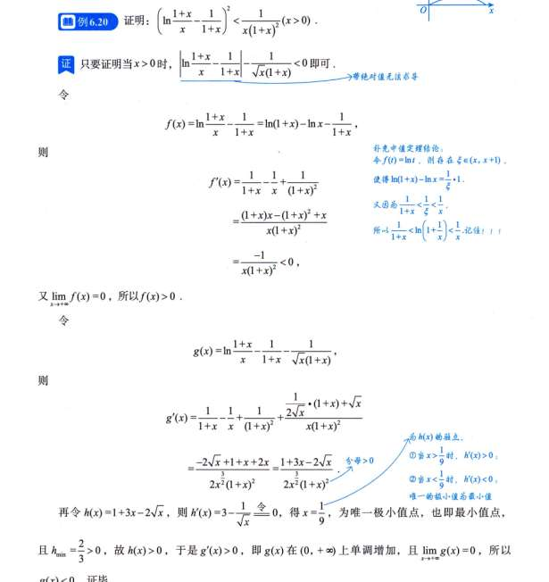

WTF
首先取绝对值，一个方法是使用记住的结论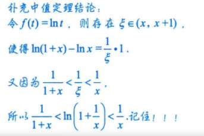

一个方法是把那看作函数求单调性看

# 习题
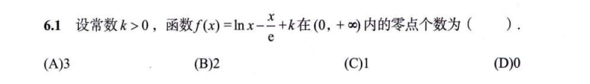
利用 lnx，在 x>0 的定义域增速不如 x（不管 x 前面系数多少吗） x<0 定义域增速大于 x 吗？

## 6.3
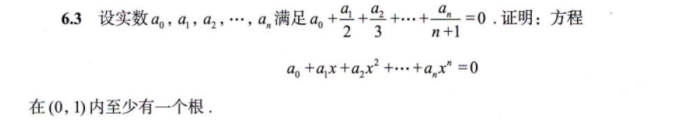
没看出来 F (1) 就是题目条件

## 6.5
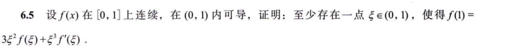
单一个 f (1) 有可能是构造后带值的，比如 F (1)=x^3f (x)=f (1)
## 6.7

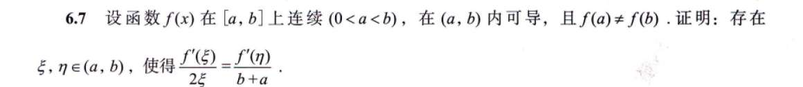

## 6.8
带绝对值的我是真没招
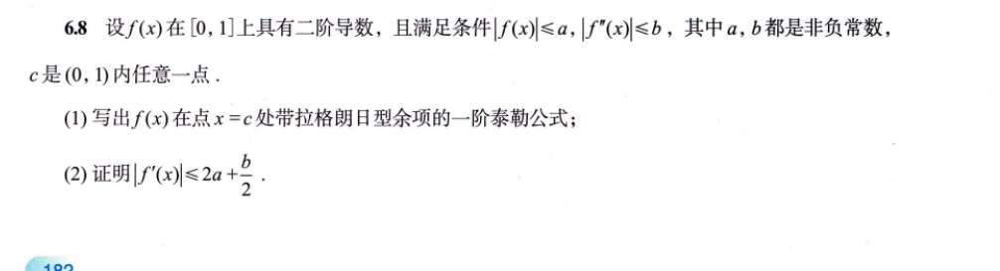
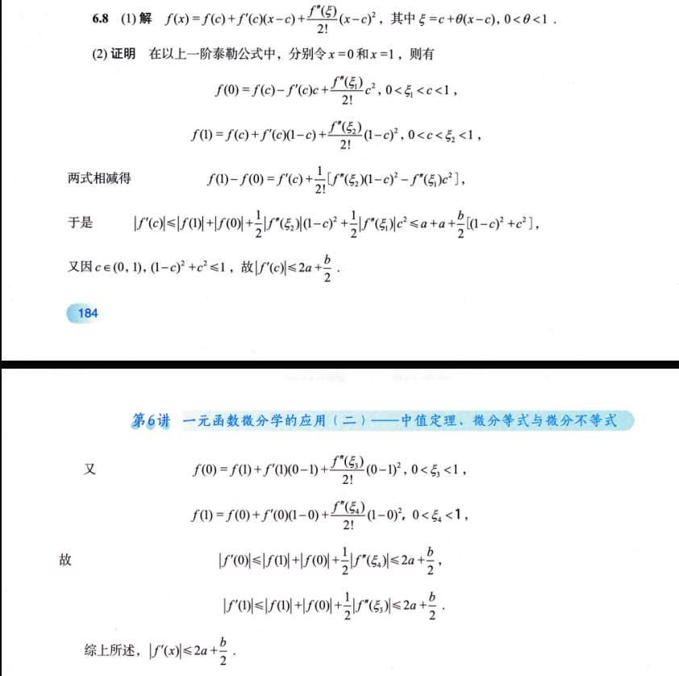