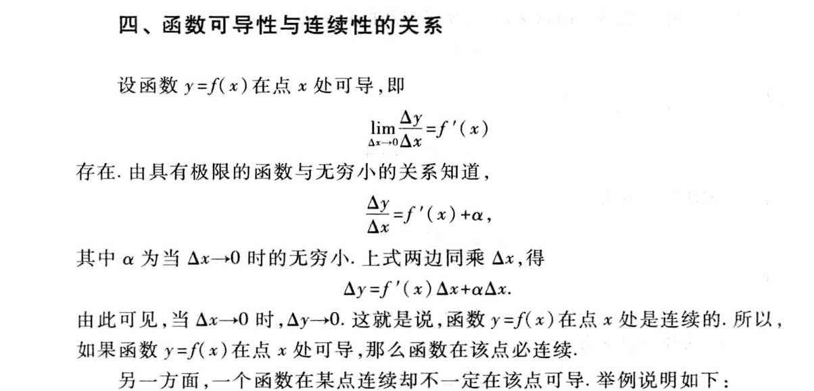
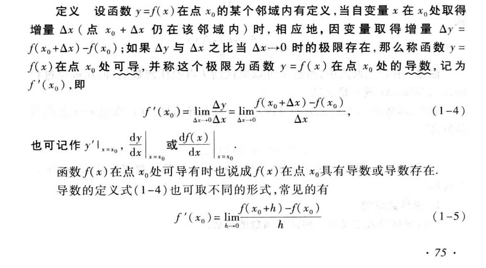
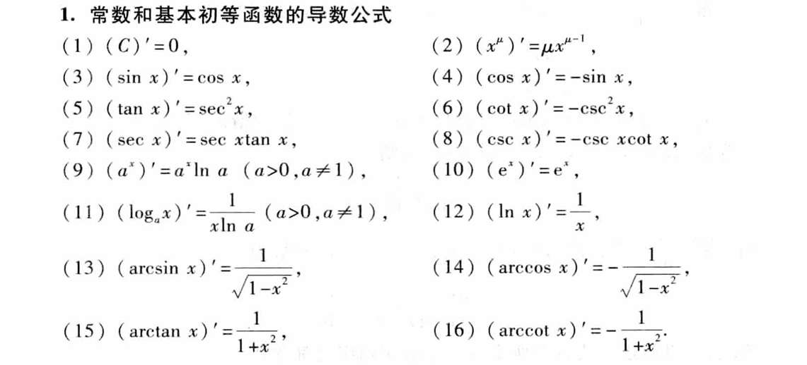
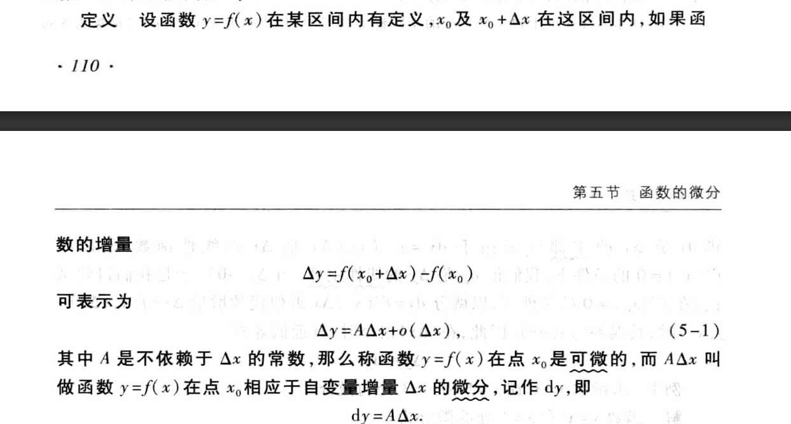
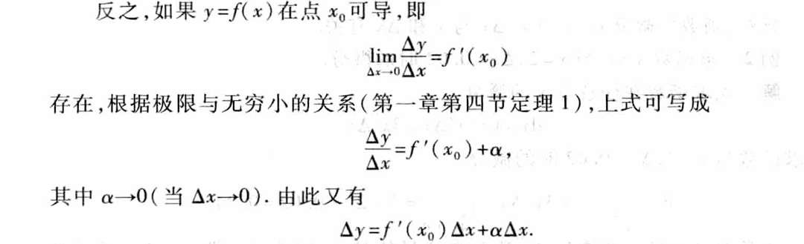
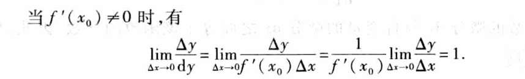
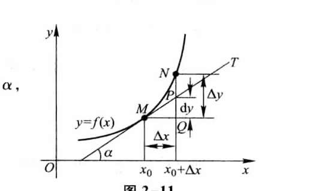

# 导数

函数在点x可导，则在点x连续
连续不一定可导

导数的定义

公式

# 微分

若增量，Δy，可表示为 主部 dy （与Δx呈正比 ） 与 Δx的高阶无穷小  的和   那么说此点可微。  也就是说 有增量不能这么表示的情况 ？

嗯... 然后显然，等式两边取极限就能发现是导数定义，

反过来，导数定义 把极限去掉，就是可微定义

又由于，Δy比dy的极限是1 

我们也可以修改o(Δx)为o（dy）

一般，求“微分”，求的是dy。  dy=此点导数 乘 Δx
但我好奇了，这不就是求导数吗？ 

哦，如果拿图来说就更具体了，是求导数，但dy具体来说，是导数 乘 Δx 是比Δy小的纵轴增量

怎么说呢， 还是没太感受到， 求微分和求导数，在题目中的差别