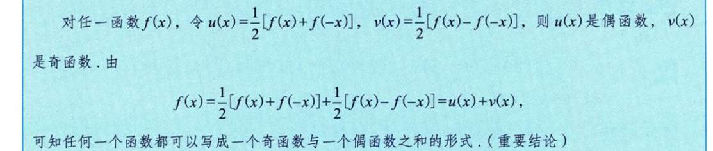
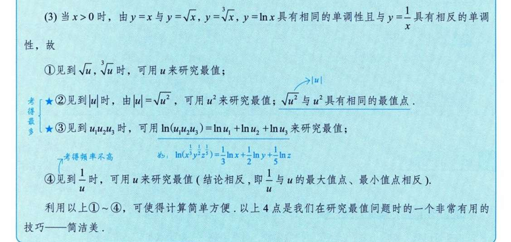

# 做题疑惑/感悟
严格单调函数必有反函数？
反函数其实就是定义域值域反一下吧  隐函数呢，额，是”变量“反一下吧 ， 但是很容易”反转“后出来个多值函数啊，

函数有界性  为什么称 D的一个子集I x属于I 而不直接说x属于D呢？

不等式我只掌握最基本的（脑子能直接蹦出来的） ： a+b <= 2根号下ab   a方+b方 >=2ab 够吗？

双曲余弦、正弦  熟悉的陌生人...

奇偶性
这个很好证明 使用一下奇偶性的性质公式就能判定出来 但我感觉我有点难建立其直觉 u(x) 还好 就是相加抵消的感觉   v(x)我想不来 

内偶则偶，内奇同外，之前没注意到过 

这个很有趣，是自己之前从未总结过的技巧 。
但同一单调性我能理解 ，为什么还能研究最值呢？？

# 做题记录
1.3   反函数的求法  及  遇到ln的处理    
1.6 感觉证明有界 就是用不等式什么的凑出不等式  <=某个具体的数
1.9 好奇怪 感觉莫名奇妙就证出来了  我感觉写数学证明题经常会这种，突然而然，莫名奇妙写出来，为啥呢 
