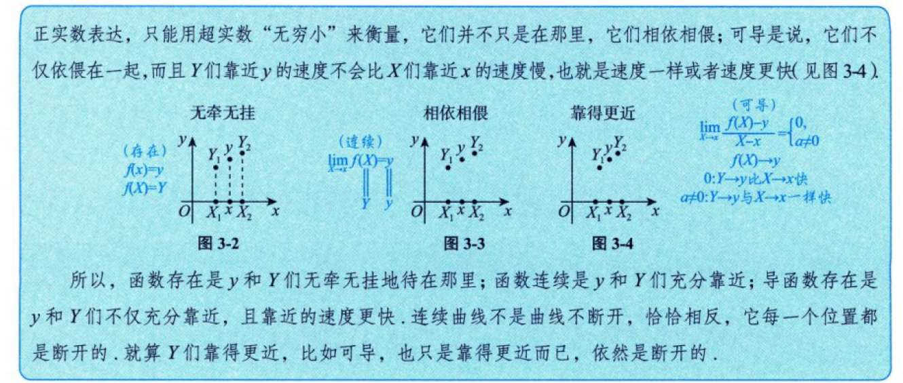
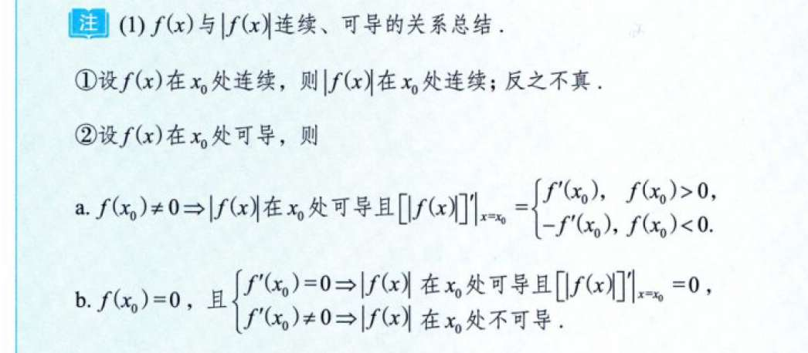
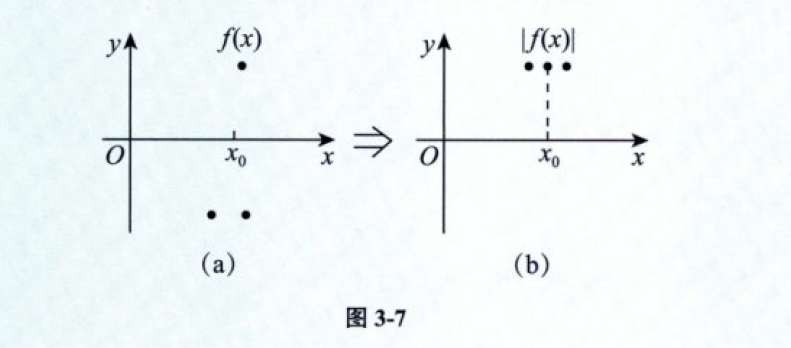
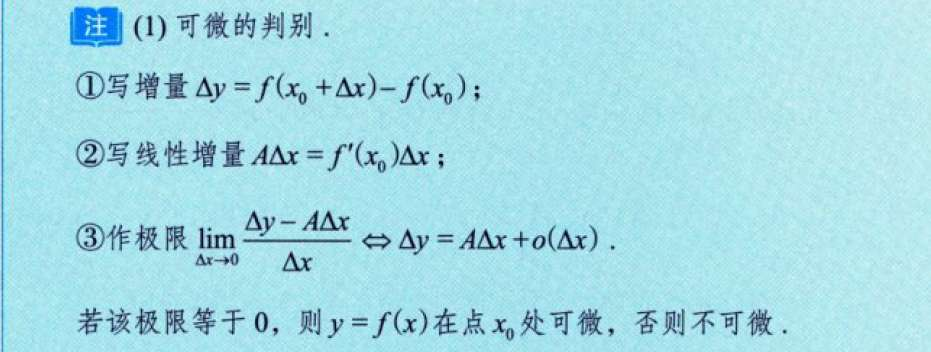
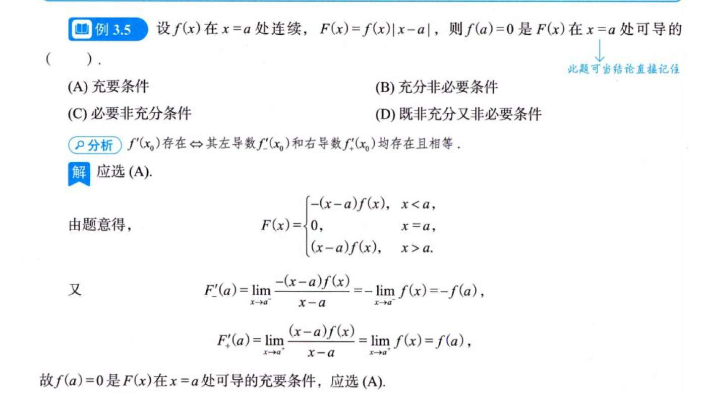
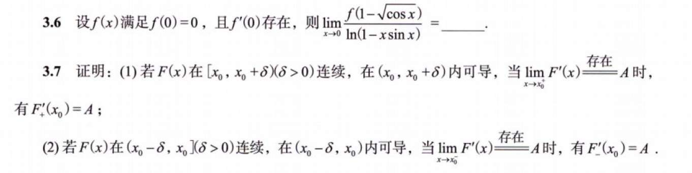
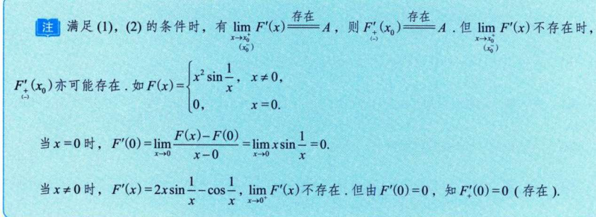
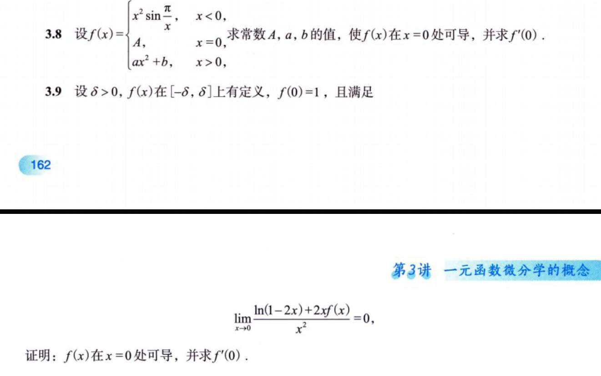

# 可导与连续
这个直觉建立很有趣
更能记住连续是可导的充分条件了，因为可导更苛刻

# f(x)与|f(x)|

第一个性质，一个图便解释清楚

对于性质二，关键在于这句话 ：
对于连续或可导函数，只要f(x)大于或小于0，无论f(x)与0的距离有多小，它旁边相依相偎的f(x)一定大于或小于0，  我觉得，这可以用极限的保号性解释（连续---极限存在---极限保号性）

# 可微
突然在想，那个无穷小，到底怎么定义，怎么来的 。
 Δx的高阶无穷小  是说，其除以x，是0. 那乘x呢？（俩个都趋于0，所以还是0？如果没说趋于0呢 就说其乘x x趋于其他呢？） 那被x除以呢（这个无穷了吧）

# 例题
## 例3.1
导数的奇偶性与函数自身相反 ； 周期性是继承的
## 例3.3
这个得重做 根本没想出来 

## 例3.5
每次都忘了 对于函数 代绝对值的 。
但我也好奇，这种题 我想象不了所谓“充分条件”或“必要条件”能怎么来

## 例3.6
3.5的应用 

## 例3.10
这道题，我觉得根本不用什么求导，死记硬背一样。
明明dy的定义就是 线性主部 AΔx  题中 把Δx前面一大堆数字一代就好了嘛 

# 习题
## 3.6 3.7

	3.6拆解式子，构造出导数，还能这么玩？？？！确实没想到。我觉得这类技巧性的题目，不同于知识性的，是不是要给它命个名，以后要专门整理这种？
	3.7，我实在是被这个连续和可导的条件唬住，一直在想他俩条件有啥用，但答案直接是，写出$F'_{+}(x0)$ 的定义 然后用洛必达？ 到底有什么深刻的含义
	
	以及这个图到底有什么意义？
## 3.8 3.9
3.8自己思路没问题 就是感觉这题确实有点奇怪了 不知道有啥意义
3.9 我看证明题就是 题目条件捣鼓捣鼓（化简、利用题目条件） 一边捣鼓一边想能不能靠近证明的条件  没有什么知识性考察啊