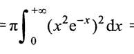
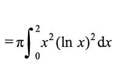
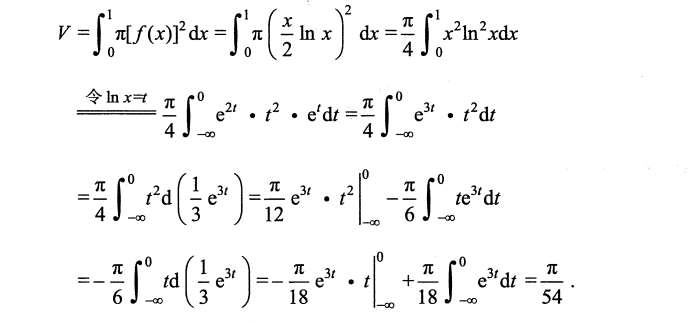
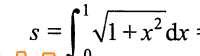
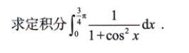
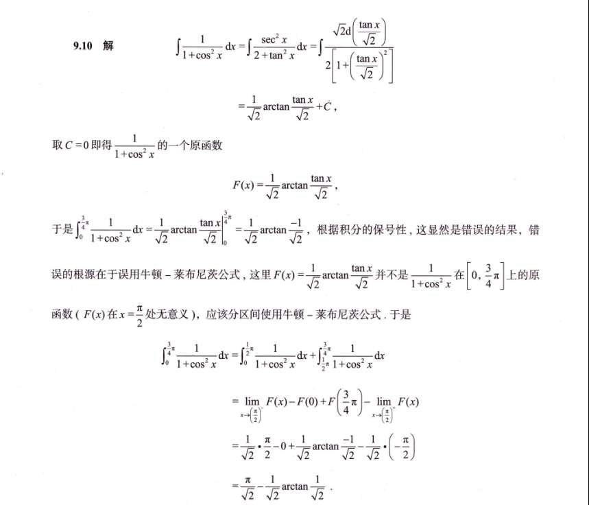
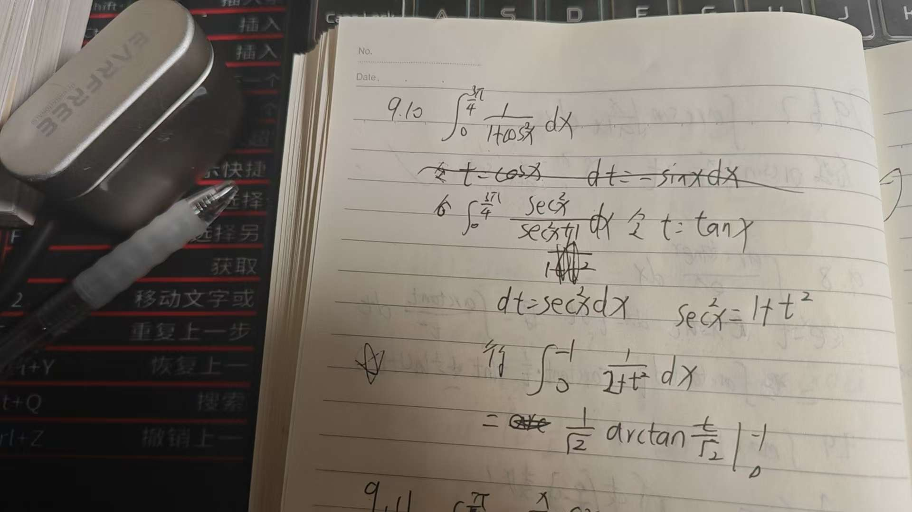
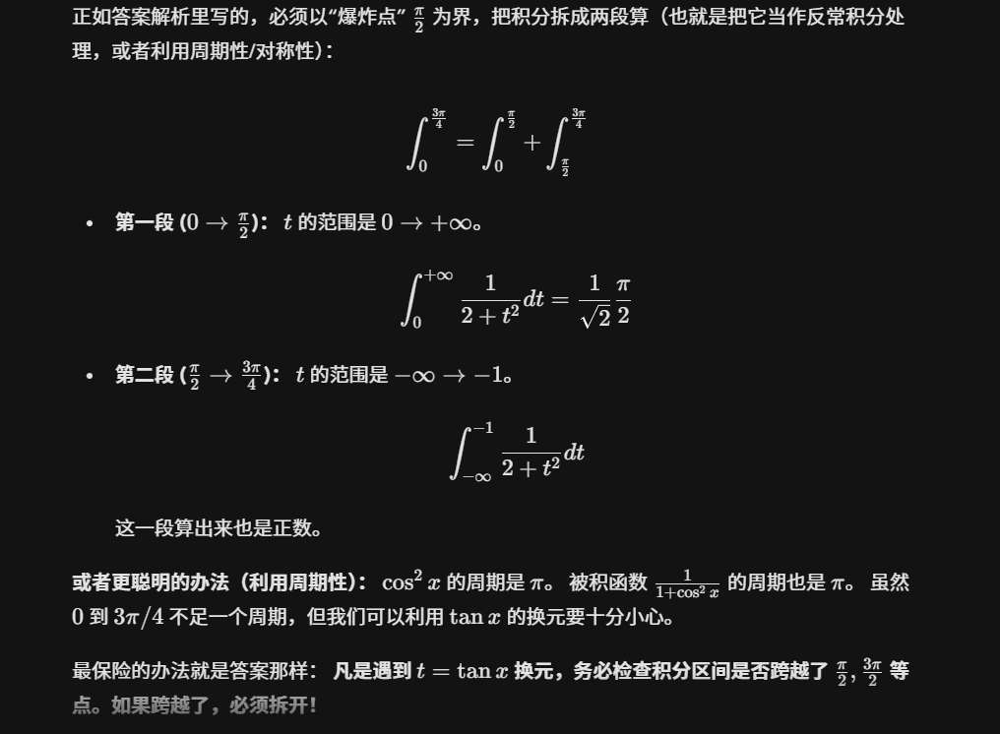

# 1

### 解法一：降维打击的“分部积分法”（强烈推荐！）

看到 $\frac{\sqrt{x^2-1}}{x^2}$，你的第一反应可能是换元，但它其实是一个完美的分部积分结构！

我们把式子拆成两部分：$\int \sqrt{x^2-1} \cdot \frac{1}{x^2} dx$

**操作步骤：**

1. **凑微分：** $\frac{1}{x^2} dx$ 其实就是 $d(-\frac{1}{x})$。
    
    所以原积分变成了：$\int \sqrt{x^2-1} \, d(-\frac{1}{x})$
    
2. **套用分部积分公式 ($uv - \int v du$)：**
    
    $$= -\frac{1}{x}\sqrt{x^2-1} - \int \left(-\frac{1}{x}\right) d(\sqrt{x^2-1})$$
    
3. **算后面的微分：**
    
    $d(\sqrt{x^2-1}) = \frac{1}{2\sqrt{x^2-1}} \cdot 2x \, dx = \frac{x}{\sqrt{x^2-1}} \, dx$
    
4. **见证奇迹：**
    
    把它代回去，你会发现那个恼人的 $x$ 竟然被完美约掉了！
    
    $$= -\frac{\sqrt{x^2-1}}{x} + \int \frac{1}{x} \cdot \frac{x}{\sqrt{x^2-1}} dx$$
    
    $$= -\frac{\sqrt{x^2-1}}{x} + \int \frac{1}{\sqrt{x^2-1}} dx$$
    

后面这个积分 $\int \frac{1}{\sqrt{x^2-1}} dx$ 是基本积分表里的常客，直接背公式：$\ln|x+\sqrt{x^2-1}|$。

**得出不定积分结果：**

$$-\frac{\sqrt{x^2-1}}{x} + \ln|x+\sqrt{x^2-1}|$$

---

### 解法二：打通你的“三角换元”（看看你卡在哪了）

如果你没看出来分部积分，硬上三角换元怎么做？

因为有 $\sqrt{x^2-1}$，所以令 **$x = \sec t$**（此时 $dx = \sec t \tan t \, dt$，且 $\sqrt{x^2-1} = \tan t$）。

代入原式：

$$\int \frac{\tan t}{\sec^2 t} \cdot \sec t \tan t \, dt = \int \frac{\tan^2 t}{\sec t} dt$$

**🎯 你的卡点大概率就在这里：$\int \frac{\tan^2 t}{\sec t} dt$ 怎么积？**

破解之道是把 $\tan$ 换回 $\sec$：记住公式 **$\tan^2 t = \sec^2 t - 1$**。

把它拆开：

$$\int \frac{\sec^2 t - 1}{\sec t} dt = \int (\sec t - \frac{1}{\sec t}) dt$$

$$= \int (\sec t - \cos t) dt$$

这两个积分就太简单了！

- $\int \sec t \, dt = \ln|\sec t + \tan t|$
    
- $\int \cos t \, dt = \sin t$
    

结合起来就是：$\ln|\sec t + \tan t| - \sin t$。

最后把 $x$ 换回来（通过画直角三角形）：$\sec t = x$，$\tan t = \sqrt{x^2-1}$，$\sin t = \frac{\sqrt{x^2-1}}{x}$。

结果依然是：$\ln|x+\sqrt{x^2-1}| - \frac{\sqrt{x^2-1}}{x}$。殊途同归！

---

### 最后一步：代入上下限算数值

不论用哪种方法，不定积分都已经求出来了。现在把上限 $2$ 和下限 $\sqrt{2}$ 代进去：

- **代入上限 $2$：**
    
    $(- \frac{\sqrt{3}}{2}) + \ln(2+\sqrt{3})$
    
- **代入下限 $\sqrt{2}$：**
    
    $(- \frac{1}{\sqrt{2}}) + \ln(\sqrt{2}+1) = (-\frac{\sqrt{2}}{2}) + \ln(\sqrt{2}+1)$
    

**上限减去下限：**

$$\left( \ln(2+\sqrt{3}) - \frac{\sqrt{3}}{2} \right) - \left( \ln(\sqrt{2}+1) - \frac{\sqrt{2}}{2} \right)$$

**最终答案：**

$$\ln(2+\sqrt{3}) - \ln(\sqrt{2}+1) - \frac{\sqrt{3}}{2} + \frac{\sqrt{2}}{2}$$

_(如果有需要，对数部分也可以合并写成 $\ln\frac{2+\sqrt{3}}{\sqrt{2}+1}$)_

# 2

### 看到这三个特征，立刻条件反射：

1. **积分上限是 $+\infty$，下限是 $0$。**
    
2. **被积函数里有 $x$ 的几次幂（比如 $x^4$）。**
    
3. **被积函数里有指数衰减项（比如 $e^{-x}$、$e^{-2x}$、$e^{-x^2}$ 等）。**
    

只要这三个要素凑齐了，出题人100%不是想考你分部积分，而是想让你用**伽马函数（Gamma Function）**的结论！

### 记住这个杀手锏公式：

$$\int_0^{+\infty} x^n e^{-x} dx = n!$$

_(前提：$n$ 是非负整数。比如 $n=4$ 时，结果就是 $4! = 24$)_

这个公式简直就是降维打击。只要能把积分凑成这个标准形式，原本要算五分钟的题，十秒钟就能出答案。

---

### 现在来看你的题，如何凑成标准形式？

原式是：

$$\pi \int_0^{+\infty} (x^2 e^{-x})^2 dx = \pi \int_0^{+\infty} x^4 e^{-2x} dx$$

对比一下我们的杀手锏公式 $\int_0^{+\infty} t^n e^{-t} dt$。

我们发现指数上是 **$-2x$**，而公式里要求是干净的 **$-t$**。

**这就是我们要换元的根本动力！**

为了用公式，我们**强行**令 $t = 2x$。（这也就是答案里为什么会写 $d(2x)$，它的本质就是换元）。

**开始换元三步走：**

1. **换变量：** 既然 $t = 2x$，那么 $x = \frac{t}{2}$。
    
2. **换微分：** $dx = \frac{1}{2} dt$。
    
3. **换上下限：** 当 $x=0$ 时，$t=0$；当 $x \to +\infty$ 时，$t \to +\infty$。上下限没变！
    

把这些统统代入原式：

$$\pi \int_0^{+\infty} \left(\frac{t}{2}\right)^4 e^{-t} \frac{1}{2} dt$$

把常数项提出来（分母上是 $2^4 \times 2 = 32$）：

$$= \frac{\pi}{32} \int_0^{+\infty} t^4 e^{-t} dt$$

见证奇迹的时刻到了，后面这一大坨积分，完美符合我们的伽马函数公式（$n=4$）：

$$\int_0^{+\infty} t^4 e^{-t} dt = 4! = 24$$

所以最终答案就是：

$\frac{\pi}{32} \times 24 = \frac{3\pi}{4}$

# 3

遇到对数（“反**对**幂三指”），永远让对数当被求导的 $u$，让多项式当被积分的 $dv$。

**具体推导过程（你可以拿张纸跟着划拉一下）：**

暂且不看外面的 $\pi$ 和上下限，我们先算不定积分 $\int x^2 (\ln x)^2 dx$：

1. **第一次分部：**
    
    令 $u = (\ln x)^2$，$dv = x^2 dx$
    
    那么 $du = 2(\ln x) \cdot \frac{1}{x} dx$，$v = \frac{1}{3}x^3$
    
    原式 $= uv - \int v du$
    
    $= \frac{1}{3}x^3(\ln x)^2 - \int \frac{1}{3}x^3 \cdot 2(\ln x)\frac{1}{x} dx$
    
    $= \frac{1}{3}x^3(\ln x)^2 - \frac{2}{3} \int x^2 \ln x dx$
    
2. **第二次分部（处理尾巴）：**
    
    现在来弄 $\int x^2 \ln x dx$。
    
    令 $u = \ln x$，$dv = x^2 dx$
    
    那么 $du = \frac{1}{x} dx$，$v = \frac{1}{3}x^3$
    
    $\int x^2 \ln x dx = \frac{1}{3}x^3 \ln x - \int \frac{1}{3}x^3 \cdot \frac{1}{x} dx$
    
    $= \frac{1}{3}x^3 \ln x - \frac{1}{3} \int x^2 dx = \frac{1}{3}x^3 \ln x - \frac{1}{9}x^3$
    
3. **拼合结果：**
    
    把第二次的结果代回第一次：
    
    原式 $= \frac{1}{3}x^3(\ln x)^2 - \frac{2}{3} \left[ \frac{1}{3}x^3 \ln x - \frac{1}{9}x^3 \right]$
    
    $= \frac{1}{3}x^3(\ln x)^2 - \frac{2}{9}x^3 \ln x + \frac{2}{27}x^3$
    

_(注：代入下限 $0$ 时，根据洛必达法则，极限是 $0$；代入上限 $2$ 再乘以 $\pi$ 即可得到最终数值。)_

另一种做法
# 4

我们把原式看成 $\int \sqrt{1+x^2} \cdot 1 dx$。

1. **令 $u = \sqrt{1+x^2}$，$dv = 1 dx$**
    
    那么 $du = \frac{x}{\sqrt{1+x^2}} dx$，$v = x$
    
2. **套用公式：**
    
    $\int \sqrt{1+x^2} dx = x\sqrt{1+x^2} - \int \frac{x^2}{\sqrt{1+x^2}} dx$
    
3. **神仙操作（加一减一）：**
    
    把后面的分子 $x^2$ 强行写成 $(x^2+1) - 1$：
    
    $\int \frac{x^2+1-1}{\sqrt{1+x^2}} dx = \int \frac{x^2+1}{\sqrt{1+x^2}} dx - \int \frac{1}{\sqrt{1+x^2}} dx$
    
    $= \int \sqrt{1+x^2} dx - \ln(x+\sqrt{1+x^2})$
    
    _(这里用到了常见积分 $\int \frac{1}{\sqrt{1+x^2}} dx = \ln(x+\sqrt{1+x^2})$)_
    
4. **移项合并：**
    
    你看，等式右边又出现了我们要找的原积分！我们把它移到等式左边：
    
    $2\int \sqrt{1+x^2} dx = x\sqrt{1+x^2} + \ln(x+\sqrt{1+x^2})$
    
5. **得出结果：**
    
    两边除以 $2$，不定积分就出来了：
    
    $\int \sqrt{1+x^2} dx = \frac{1}{2}\left[ x\sqrt{1+x^2} + \ln(x+\sqrt{1+x^2}) \right]$
    

最后代入上下限 $0$ 和 $1$：

上限 $1$：$\frac{1}{2}(\sqrt{2} + \ln(1+\sqrt{2}))$

下限 $0$：$\frac{1}{2}(0 + \ln(1)) = 0$

最终答案：**$\frac{\sqrt{2}}{2} + \frac{1}{2}\ln(1+\sqrt{2})$**

# 5

我的答案，换元，还不错，但踩坑了

