# 笔记
## 不定积分
F (x) 若可导，且导数函数为 f (x)，那么 f (x) 积分得 F (x)
### 存在定理
连续函数 f(x)，一定存在原函数。
即我们可以对 f (x) 进行不定积分。
证法是，用 F (x), 即 f (x) 的积分，我们去求导一下，利用连续的性质我们发现求导结果确实是 f (x)。

那这，连续函数，是充分必要条件吗？怎么证？

第一类间断点没有原函数 F (x)
详细说，
对于可去间断点：即F' (x) 不等于 limF' (x)，这是不可能的。导函数一定连续，
我们把 F' (x) 视作一个函数，其性质就是连续。
对于跳跃间断点、无穷间断点：和上面一样的证法。

独特的是震荡间断点，是有可能有原函数 F (x) 的。

所以，抛弃积分这个概念，我们知道
一个函数 F (x)，其导数有可能是连续函数，也有可能是有震荡间断点的函数

## 定积分

因为定限，所以有了面积的意义，有了几何的意义 
### 存在定理
对于 f (x) ，满足下面的任意一条，f (x) 就可以积分。
- 连续
- 单调
- 在 `[a,b]` 上有界，且只有有限个间断点（除无穷）
- 在 `[a,b]` 上有有限个第一类间断点。
因为定积分的时候，其第一性原理只是看能否拆分成小面积，加和成大面积。
那么有限个间断点明显可以做到有限的面积的。
单调的话，因为单调就证明闭区间内有界？所以仍然是有有限的面积，。

感觉是个特殊的例子，
是有原函数的，但没有定积分。
无穷震荡

## 变限积分
只要定区间可积，必然存在变限积分
**只要存在，必然连续**
只要 f (x) 连续，F (x) 必然可导
f (x) 有唯一跳跃间断点，我们可以写 F (x)=f (x) 的变限积分，但一定不是 f (x) 的原函数。
F (x) 在跳跃间断点不可导，

然而若是可去间断点，F (x) 可导。但！为什么 F (x) 仍然不是 f (x) 的原函数？
因为虽可导，但其导数是 limf (x0)，不等于 f (x0)!

## 反常积分

反常积分分为无穷区间，和函数值无穷。（对应打破区间有界，函数值有界的规则，所以“反常”）
对于敛散性判别法，比较判别法很简单，
重要的是比值法，
注意趋近无穷更快的，离渐近线更远！

此图 a 点处 g (x) 趋向无穷更快

下图是上面性质的应用

重要结论及其证明

## 积分公式

## 三角换元

## 分部积分表格法
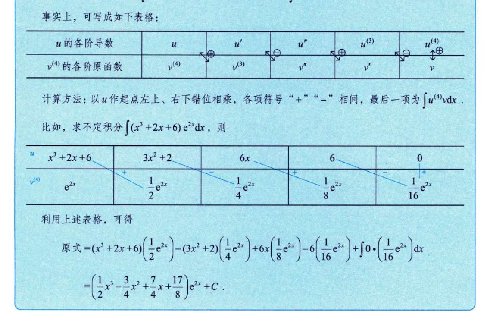

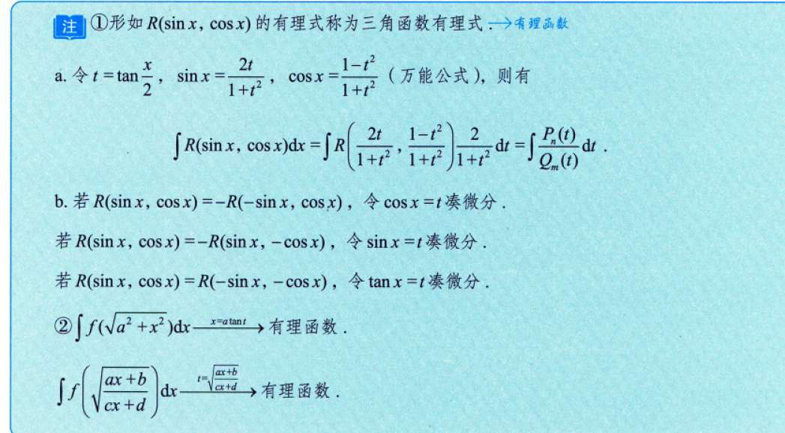

## 牛顿莱布尼茨公式
证明：

## 变限积分的计算
这个求导公式有什么证明吗，或者有什么理解？
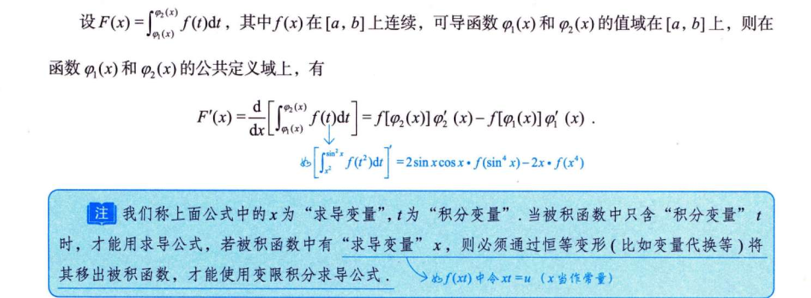
# 二级结论

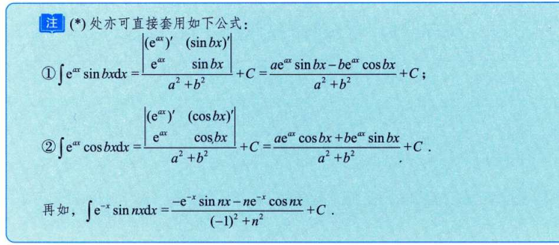

对于 $\int e^{ax} \sin bx \, dx$ 或 $\int e^{ax} \cos bx \, dx$，它们的结果都有一个共同的结构：

$$\text{积分结果} = \frac{e^{ax}}{a^2+b^2} \cdot \left[ a \cdot f(x) - f'(x) \right]$$

**口诀：**

> **系数分之e指数，(a 乘自己 减去 导数)**

**验证一下：**

- **对于 $\sin bx$：**
    
    令 $f(x) = \sin bx$，则 $f'(x) = b \cos bx$。
    
    代入公式：
    
    $$\int e^{ax} \sin bx \, dx = \frac{e^{ax}}{a^2+b^2} (a \sin bx - b \cos bx)$$
    
    _(完美符合！)_
    
- **对于 $\cos bx$：**
    
    令 $f(x) = \cos bx$，则 $f'(x) = -b \sin bx$。
    
    代入公式：
    
    $$\int e^{ax} \cos bx \, dx = \frac{e^{ax}}{a^2+b^2} (a \cos bx - (-b \sin bx)) = \frac{e^{ax}}{a^2+b^2} (a \cos bx + b \sin bx)$$
    
    _(完美符合！)_

感觉分部积分本身我也想知道怎么证的；

**1. 回忆乘法求导公式（Product Rule）：**

设有两个可导函数 $u(x)$ 和 $v(x)$，它们的乘积求导是：

$$(uv)' = u'v + uv'$$

**2. 两边同时积分：**

对上面这个等式两边同时求不定积分：

$$\int (uv)' dx = \int u'v \, dx + \int uv' \, dx$$

左边求导再积分，就还原成了 $uv$（忽略常数 $C$）：

$$uv = \int v \, du + \int u \, dv$$

_(注：这里用到了微分形式 $u'dx = du$ 和 $v'dx = dv$)_

**3. 移项得到公式：**

把 $\int v \, du$ 移到等式左边，就得到了大名鼎鼎的分部积分公式：

$$\int u \, dv = uv - \int v \, du$$

**结论：** 分部积分的本质，就是把“不好积”的 $\int u dv$ 转化成（希望）“好积”的 $\int v du$。

这种分解式：
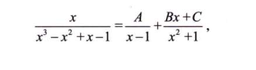
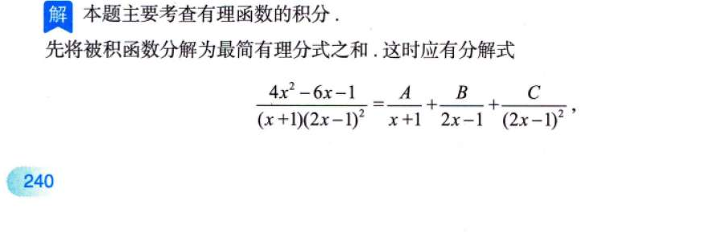

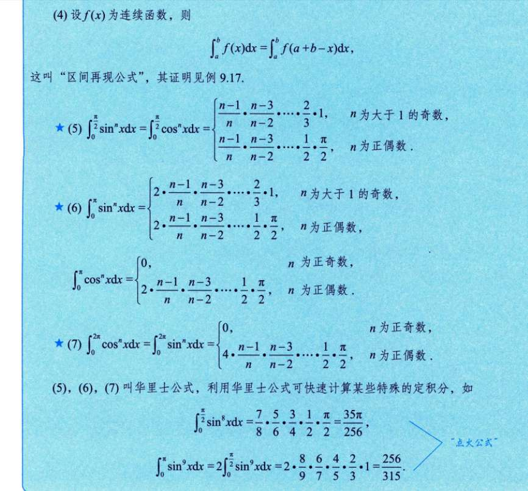

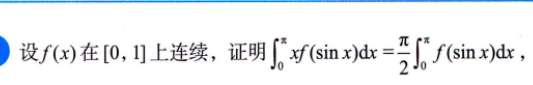

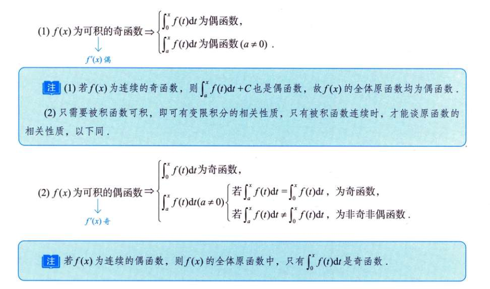
导数同理

当 $x \to +\infty$ 时，有一个绝对的增长速度链：

$$\ln x \ll x^a (a>0) \ll a^x (a>1) \ll x! \ll x^x$$

**核心结论：**

- **在无穷远处：** 指数函数 $e^x$ 增长得远比任何幂函数 $x^a$ 快。
    
    - $\lim_{x \to +\infty} \frac{x^a}{e^x} = 0$
        
    - $\lim_{x \to +\infty} x^a e^{-x} = 0$

Gamma 函数
看到 $\int_0^{+\infty} x^n e^{-x} dx$ 这种形式，不要每次都傻傻地分部积分，直接背公式：

$$\int_0^{+\infty} x^n e^{-x} dx = n! \quad (n \text{ 为正整数})$$

**常用结论：**

- $\int_0^{+\infty} e^{-x} dx = 0! = 1$
    
- $\int_0^{+\infty} x e^{-x} dx = 1! = 1$ （这就是你图片里的那个）
    
- $\int_0^{+\infty} x^2 e^{-x} dx = 2! = 2$
    

> **进阶提醒：** 如果 $x$ 的系数不是 $1$（例如 $e^{-ax}$），利用换元法可得：
> 
> $$\int_0^{+\infty} x^n e^{-ax} dx = \frac{n!}{a^{n+1}}$$

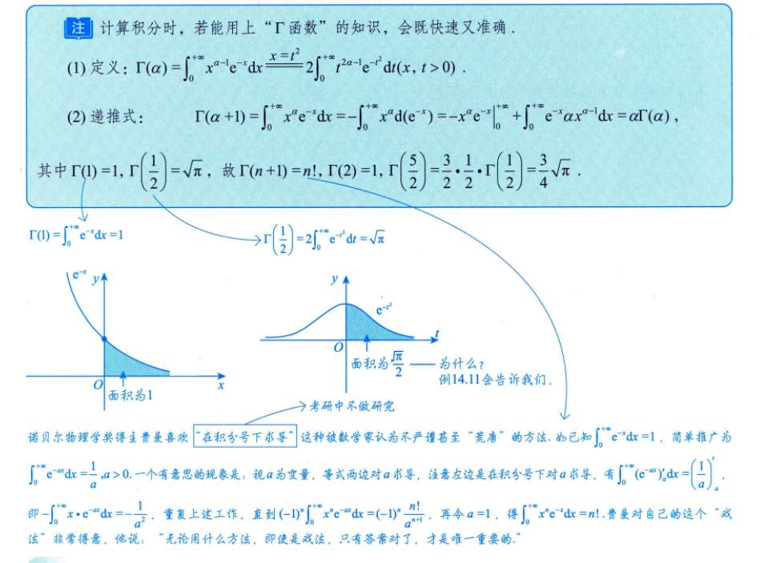
# 例题
## 8.6 （积分定义应用）
夹逼法和积分法无关

定义法，是凑积分定义

## 8.9 （比积分大小）

有点说法，挺综合。
首先是二级结论，sinx、x、tanx 比大小。
再就是跟 1 比大小的话，搞清楚哪个函数积分是 1，可以跟那个函数比较
不过通法是，I2-I1，一个新积分，研究积分的函数。

## 8.10（同上）
同类型

## 8.15（抓大头技巧）

反常积分的题要会拆分

## 8.16（指数化简）
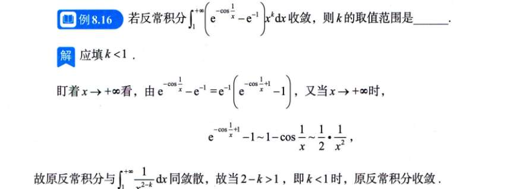
又碰到这种，提指数的技巧，

## 8.17（二级结论+比较法判断收敛）

比较法判断收敛还是蛮重要的哈，主要就是幂指数函数作分母，去比较
$\frac{lnx}{1+x^2}$ 先跟更简单的 lnx 比，lnx 再跟一些幂指数函数比
对于 D 这种正负无穷区间，且是奇偶函数，那就判断一个区间就行

## 8.18/19（重点）

无论 $k$ 多么小（只要 $k>0$），**幂函数永远比对数函数“强”**。
    *   $x \to +\infty$ 时：$x^k$ 跑得比 $\ln x$ 快得多（$x^k$ 是大哥，$\ln x$ 是弟中弟）。
    *   $x \to 0^+$ 时：$\frac{1}{x^k}$ 爆得比 $\ln x$ 快得多。
* 我们找一个标准的 $P$ 积分 $\frac{1}{x^p}$ 来和题目去比（相除求极限）。
* *   **区间 $[1, +\infty)$**：标准参考系是 $\frac{1}{x^p}$，**$p > 1$ 收敛**。
* *   **区间 $(0, 1]$**：标准参考系是 $\frac{1}{x^p}$，**$p < 1$ 收敛**。

处理无穷区间 $\int_1^{+\infty} \frac{\ln x}{x^\alpha} dx$ （例 8.19）
  *   分母是 $x^\alpha$，分子是 $\ln x$。
    *   $\ln x$ 会让整个分数变大（坏事，阻碍收敛），但它力量很弱。
    *   我们知道 $\int_1^{+\infty} \frac{1}{x^\alpha}$ 收敛要求 $\alpha > 1$。
    *   加上 $\ln x$ 后，只要 $\alpha$ 仍然比 1 大（给 $\ln x$ 留一点余地），就能收敛。
*   **严谨做法（极限比较法）**：
    *   **情况 A：若 $\alpha \le 1$**。
        分母不够大，甚至比 $\frac{1}{x}$ 还小，分子还在增大，必然发散。
    *   **情况 B：若 $\alpha > 1$**。
        我们可以选一个**介于 1 和 $\alpha$ 之间**的数 $p$（比如 $p = \frac{1+\alpha}{2}$），这就不用像答案那样写 $\epsilon$ 了。
        令标准函数 $g(x) = \frac{1}{x^p}$（注意这里 $1 < p < \alpha$）。
        $$\lim_{x \to +\infty} \frac{f(x)}{g(x)} = \lim_{x \to +\infty} \frac{\frac{\ln x}{x^\alpha}}{\frac{1}{x^p}} = \lim_{x \to +\infty} \frac{\ln x}{x^{\alpha-p}}$$
        因为 $\alpha > p$，所以 $\alpha - p > 0$。根据“幂函数比对数强”，分母无穷大，极限为 0。
        **结论**：因为大哥 $g(x)$ ($p>1$) 收敛，且 $f(x)$ 比大哥还小（极限为 0），所以 $f(x)$ **收敛**。
    *   **答案**：选 (B) $\alpha > 1$。

处理瑕点区间 $\int_0^1 \frac{\ln x}{x^\alpha} dx$ 
*   **直觉判断**：
    *   我们知道 $\int_0^1 \frac{1}{x^\alpha}$ 收敛要求 $\alpha < 1$。
    *   $\ln x$ 在 $x \to 0$ 时趋于无穷大，这会让函数发散得更厉害。
    *   所以 $\alpha$ 必须严格小于 1，才能压得住。那 $\alpha$ 等于 1 行不行？
        *   若 $\alpha=1$，原式 $= \frac{\ln x}{x}$，积分是 $\frac{1}{2}\ln^2 x$，代入 0 是无穷大，发散。
*   **严谨做法**：
    *   **若 $\alpha \ge 1$**：发散（如上分析）。
    *   **若 $\alpha < 1$**：
        选一个**介于 $\alpha$ 和 1 之间**的数 $p$（比如 $p = \frac{\alpha+1}{2}$）。
        令标准函数 $g(x) = \frac{1}{x^p}$（注意这里 $\alpha < p < 1$）。
        $$\lim_{x \to 0^+} \frac{f(x)}{g(x)} = \lim_{x \to 0^+} \frac{\frac{\ln x}{x^\alpha}}{\frac{1}{x^p}} = \lim_{x \to 0^+} x^{p-\alpha} \cdot \ln x$$
        因为 $p > \alpha$，令 $k = p-\alpha > 0$。即求 $\lim_{x \to 0^+} x^k \ln x$。
        这是经典的洛必达或泰勒，极限为 0。
        **结论**：因为大哥 $g(x)$ ($p<1$) 收敛，且极限为常数（0），所以 $f(x)$ **收敛**。
    *   **答案**：选 (B) $\alpha < 1$。

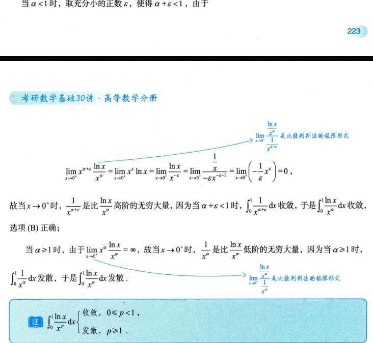
## 9.6（分部积分入门）
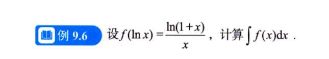
有个坑，这里不需要 $dx=e^tdt$ 

## 9.7（拆开后抵消）
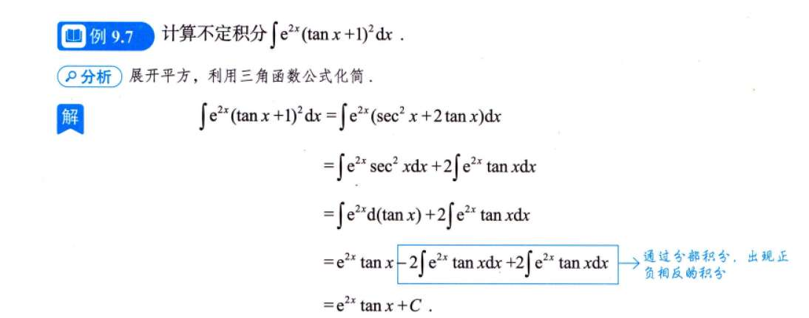
我急于拆开后分别算，但他们拆开后就可以抵消。
自认问是需要对数字、对全局的“敏感度”

## 9.12（ln 复杂分式）
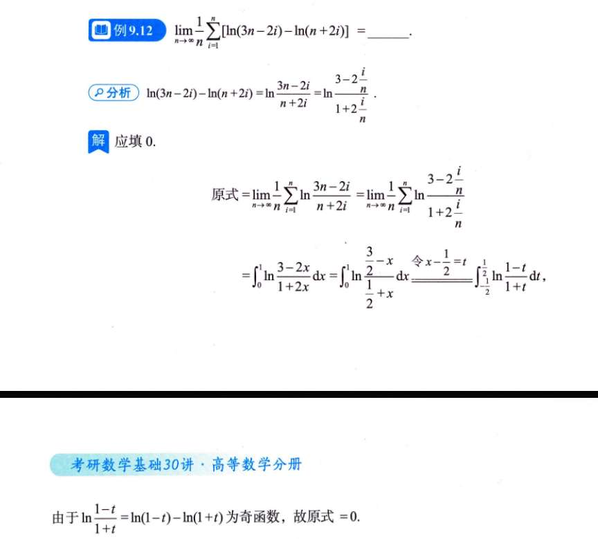

我没想什么性质，写到 ln3-2x 比 1+2x 就一股脑分布积分了...

## 9.15
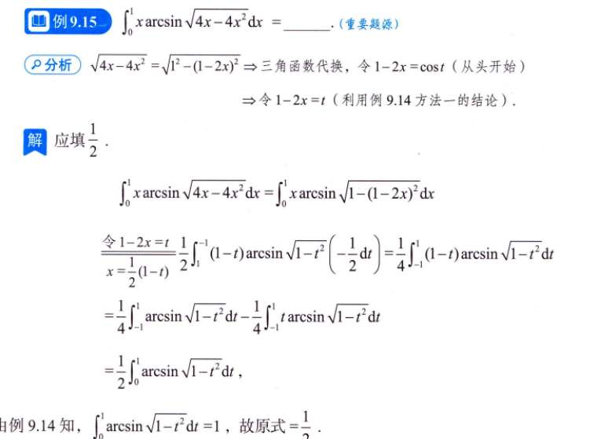
纯粹没想出来可以这样三角代换，
嗯 ... 
看到根号下有二次多项式（如 $4x - 4x^2$），且含有 $x^2$ 和 $x$ 项，第一反应应该是**配方**。

- **观察项：** $4x - 4x^2$。
    
- **目标：** 凑成 $a^2 - (bx+c)^2$ 的形式。
    
- **心算步骤：** 提取 $-4$ 得到 $-4(x^2 - x)$，补齐平方项需要 $+1/4$，所以是 $-4(x - 1/2)^2 + 1$，整理即得到 $1 - (2x - 1)^2$。由于平方具有对称性，写成 $1 - (1 - 2x)^2$ 也是一样的。

## 9.17
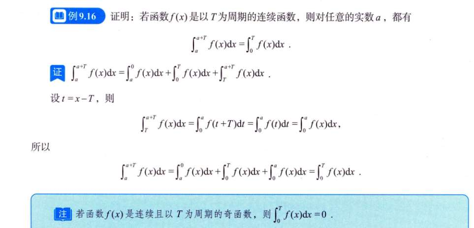
这有点像记下来的套路？
## 9.19
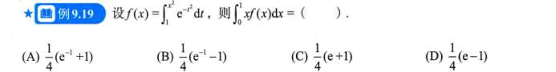
,,, 当我真的用分部积分表格法挤出来 f (x) 后，我是懵的
说明还是得多看看条件，如何能进一步变形

## 9.21

求 abc
感觉这个知识点属于是，积分去绝对值
## 9.22
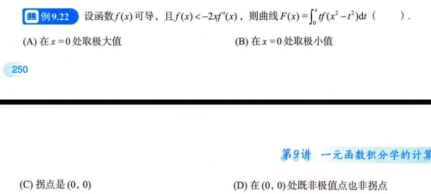
记录一个问题，令 $x^2-t^2=u$ ，不能直接-2tdt=du，而是先化 t=...（u 的形式），再 dt=... du

## 9.25
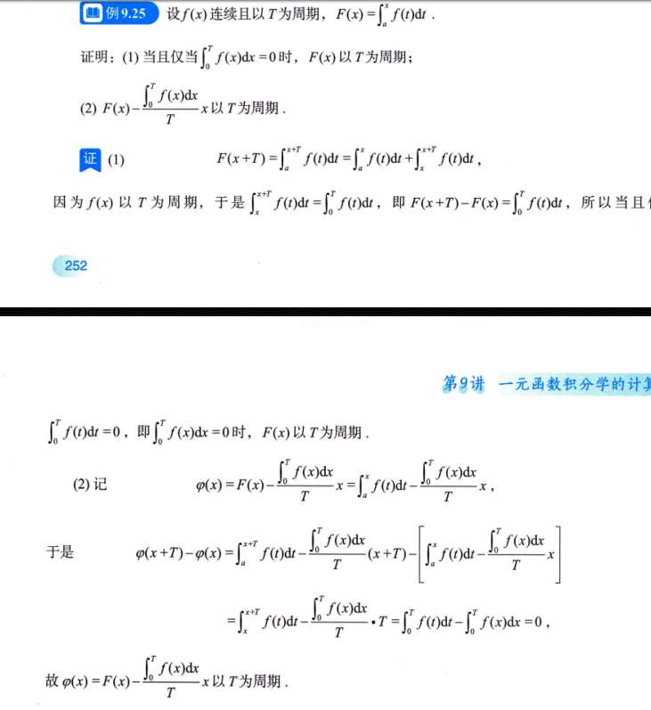
周期类题应该是有套路的 
# 习题

## 8.3（还是关于 lnx，同例题8.18/19）

这道题 $$\int_0^{+\infty} = \int_0^1 (\text{看瑕点}) + \int_1^{+\infty} (\text{看无穷})$$

**第一步：看 $x \to 0^+$ （瑕点）**
*   函数 $f(x) = \frac{\ln x}{(1+x)x^{1-p}}$。
*   当 $x \to 0$ 时，$(1+x) \sim 1$。
*   所以 $f(x) \sim \frac{\ln x}{x^{1-p}}$。
*   根据刚才 **8.18** 的结论，要想收敛，分母的指数必须 **$< 1$**。
    $$1 - p < 1 \implies -p < 0 \implies \mathbf{p > 0}$$

**第二步：看 $x \to +\infty$ （无穷）**
*   函数 $f(x) = \frac{\ln x}{(1+x)x^{1-p}}$。
*   当 $x \to +\infty$ 时，$(1+x) \sim x$。
*   所以分母总次数是 $x \cdot x^{1-p} = x^{2-p}$。
*   所以 $f(x) \sim \frac{\ln x}{x^{2-p}}$。
*   根据刚才 **8.19** 的结论，要想收敛，分母的指数必须 **$> 1$**。
    $$2 - p > 1 \implies -p > -1 \implies \mathbf{p < 1}$$

**第三步：取交集**
*   $p > 0$ 且 $p < 1$。
*   **答案选 (C)**。

### 为什么答案要写 $\epsilon$？

那个解析写的 $\epsilon$，其实就是在用数学语言描述我刚才说的**“鸿沟”**。

- 他说“任取 $\epsilon > 0$”，意思就是：既然 $p > 0$，那我总能从 $p$ 里面拆出一小点儿力量（$\epsilon$），专门用来“抵消”掉 $\ln x$ 的影响（因为 $\lim x^\epsilon \ln x = 0$），剩下的部分依然满足收敛条件。
    
- **你不用学会怎么写 $\epsilon$ 的证明，你只需要知道：在 $p$ 值严格不等式的情况下，$\ln x$ 不改变收敛性结果。**
## 8.5（习题 8.6 的一个对比，积分定义应用）
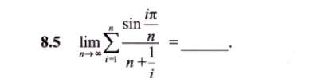
，这里就是夹逼
## 8.7（含 ln，不同的题型）

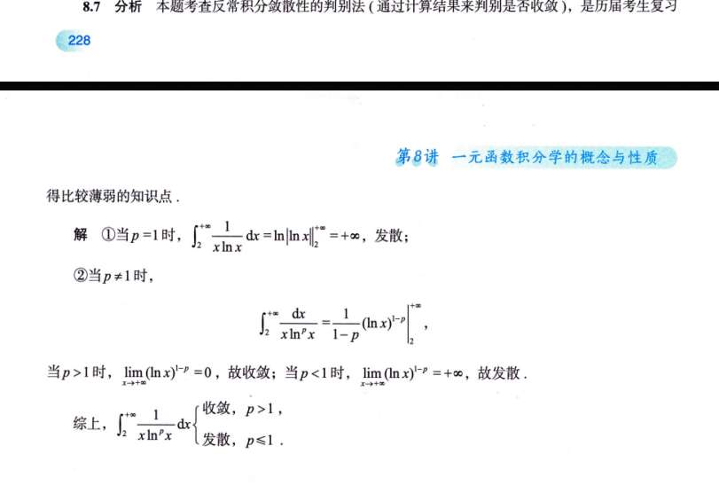

# 1000 题
## 8.1
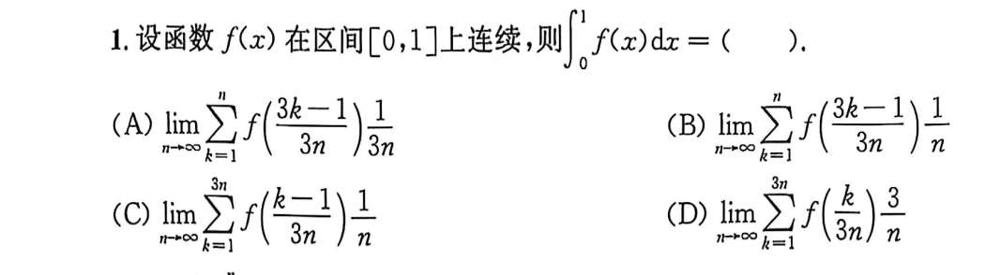定义法还有个知识点，就是区间怎么分都行，保证区间长度是 dx 就好？

还有个巧妙的方法是直接另 f (x)=1

## 8.2
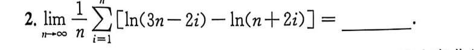
算不出积分，就试图看奇偶性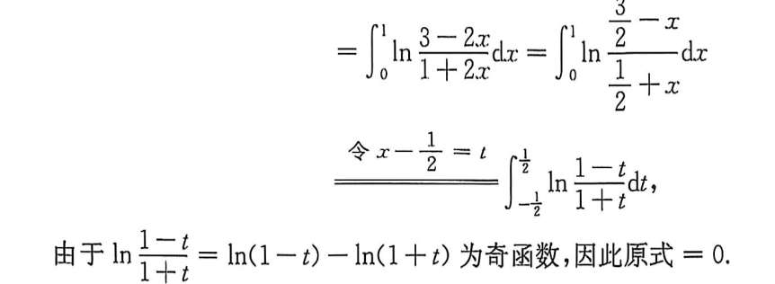

## 8.4
半天没想出奇偶性到底怎么用，然而是没拆分
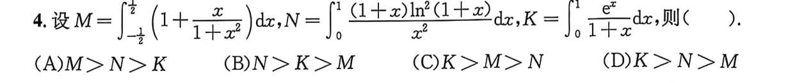
只有把 M 算出来是 1，才能反应过来是判断 N 和 K 与 1 比大小，K 直接用指数函数比 1+x 大的性质，N 的话，是求导

## 8.11
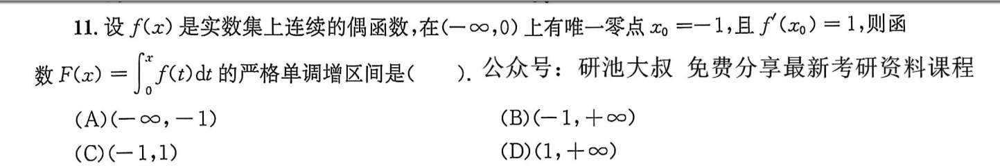
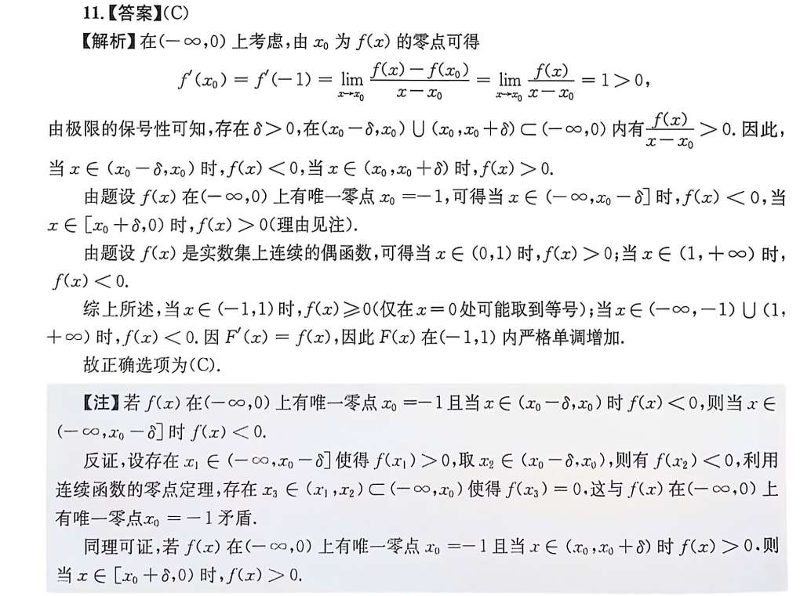
我就画了个图，

## 8.18
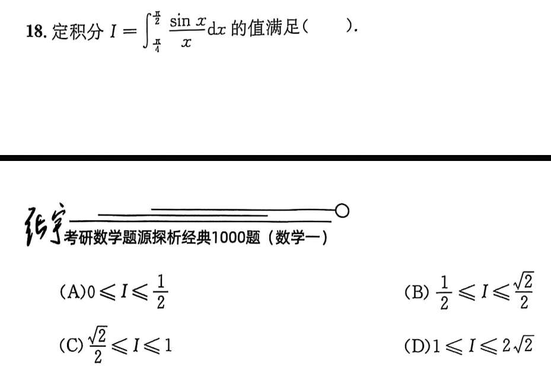
选项真想不到，所以不妨就试试，求上下界的积分

## 8.21
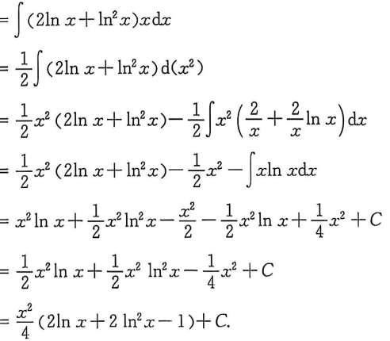
x 拿去凑 x 方，得分部积分，没想到