# 笔记
## 不定积分
F (x) 若可导，且导数函数为 f (x)，那么 f (x) 积分得 F (x)
### 存在定理
连续函数 f(x)，一定存在原函数。
即我们可以对 f (x) 进行不定积分。
证法是，用 F (x), 即 f (x) 的积分，我们去求导一下，利用连续的性质我们发现求导结果确实是 f (x)。

那这，连续函数，是充分必要条件吗？怎么证？

第一类间断点没有原函数 F (x)
详细说，
对于可去间断点：即F' (x) 不等于 limF' (x)，这是不可能的。导函数一定连续，
我们把 F' (x) 视作一个函数，其性质就是连续。
对于跳跃间断点、无穷间断点：和上面一样的证法。

独特的是震荡间断点，是有可能有原函数 F (x) 的。

所以，抛弃积分这个概念，我们知道
一个函数 F (x)，其导数有可能是连续函数，也有可能是有震荡间断点的函数

## 定积分

因为定限，所以有了面积的意义，有了几何的意义 
### 存在定理
对于 f (x) ，满足下面的任意一条，f (x) 就可以积分。
- 连续
- 单调
- 在 `[a,b]` 上有界，且只有有限个间断点（除无穷）
- 在 `[a,b]` 上有有限个第一类间断点。
因为定积分的时候，其第一性原理只是看能否拆分成小面积，加和成大面积。
那么有限个间断点明显可以做到有限的面积的。
单调的话，因为单调就证明闭区间内有界？所以仍然是有有限的面积，。

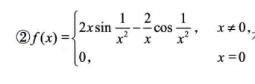
感觉是个特殊的例子，
是有原函数的，但没有定积分。
无穷震荡

## 变限积分
只要定区间可积，必然存在变限积分
只要存在，必然连续
只要 f (x) 连续，F (x) 必然可导
f (x) 有唯一跳跃间断点，我们可以写 F (x)=f (x) 的变限积分，但一定不是 f (x) 的原函数。
F (x) 在跳跃间断点不可导，
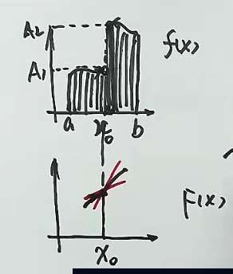
然而若是可去间断点，F (x) 可导。但！为什么 F (x) 仍然不是 f (x) 的原函数？
因为虽可导，但其导数是 limf (x0)，不等于 f (x0)!
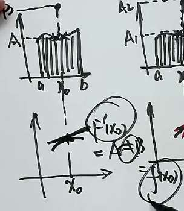

## 反常积分

反常积分分为无穷区间，和函数值无穷。（对应打破区间有界，函数值有界的规则，所以“反常”）
对于敛散性判别法，比较判别法很简单，
重要的是比值法，
注意趋近无穷更快的，离渐近线更远！
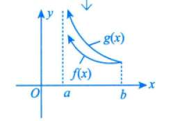
此图 a 点处 g (x) 趋向无穷更快

下图是上面性质的应用
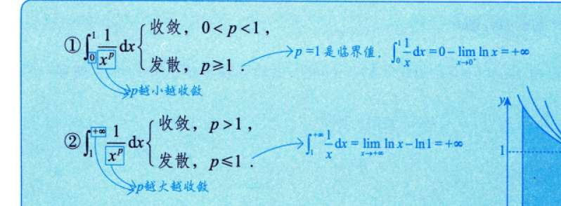
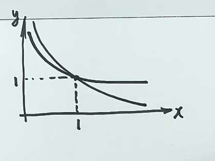
重要结论及其证明
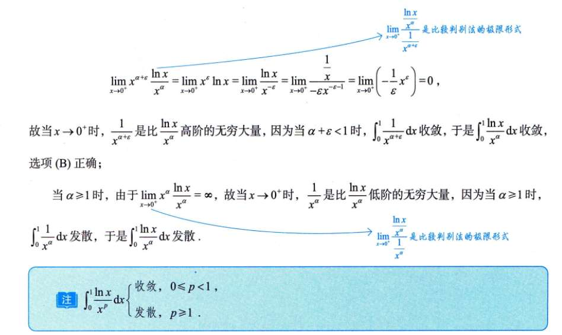

# 积分公式
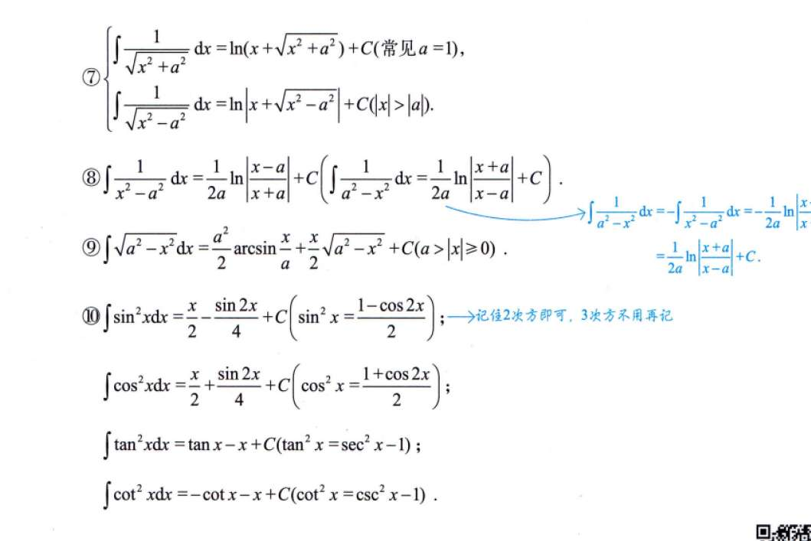
# 三角换元
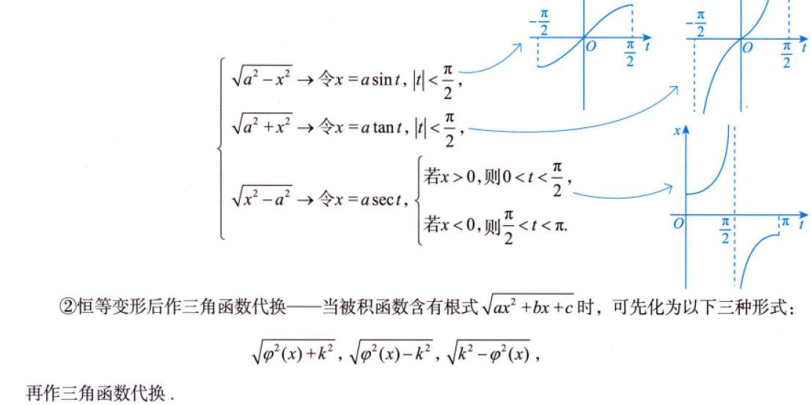

# 二级结论
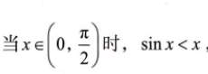
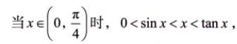

# 例题
## 8.6
定义，
夹逼
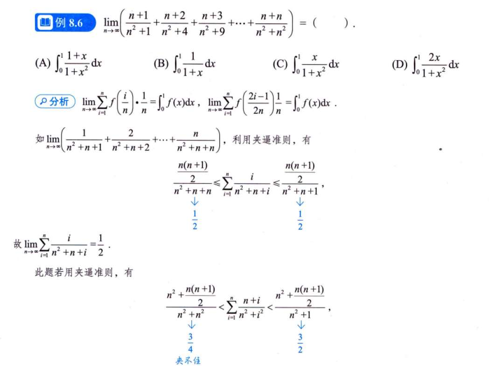
## 8.9
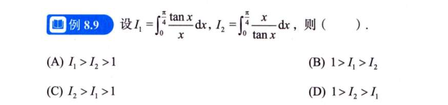
有点说法，挺综合
## 8.10
同类型
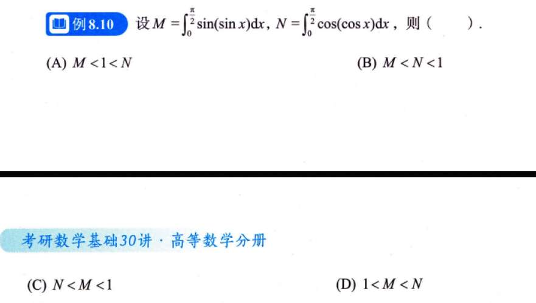

## 8.15
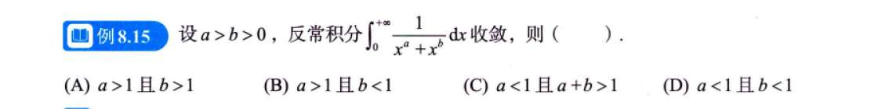
反常积分的题要会拆分

## 8.17
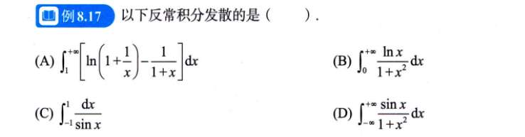

## 8.18/19
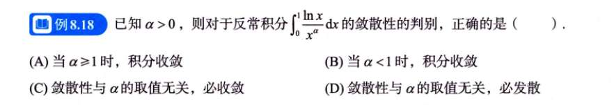
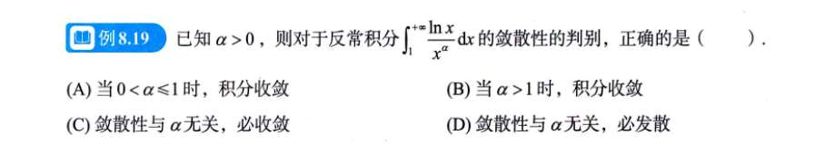

# 习题

## 8.3
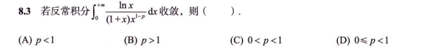
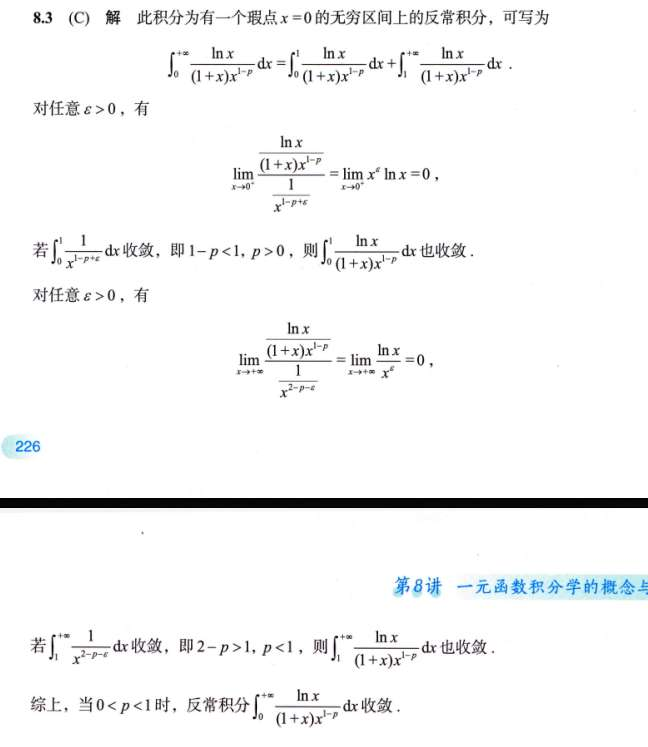这道题看答案（图3）确实会让人觉得“这是怎么凑出来的 $\epsilon$？”，这种写法是典型的**“为了严谨而牺牲直觉”**的数学证明写法。

在考场上或者平时做题时，我们绝对不是这样思考的。我们用的是**“抓大头 + 对数无视法”**。

来，我教你一个**“不用凑 $\epsilon$ 也能一眼看出答案”**的直觉思路：

在幂函数 $x^k$ 面前，$\ln x$ 的力量微乎其微。

- 当 $x \to +\infty$ 时，哪怕是 $x^{0.0001}$ 都能吊打 $\ln x$。
    
- 当 $x \to 0^+$ 时，哪怕是 $x^{-0.0001}$ 都能压制 $\ln x$。
    

**结论：** 在判断收敛性的临界指标（$p$ 值）时，**$\ln x$ 几乎不影响幂次的主导地位**。你只要盯着 $x$ 的指数看就行了，只要指数**严格**满足条件，$\ln x$ 掀不起风浪。

我们要判断 $\int_0^{+\infty} \frac{\ln x}{(1+x)x^{1-p}} dx$ 的收敛性，还是老规矩，切成两半看：

#### 第一步：看 $x \to 0^+$（左边）

1. **化简战场：**
    
    - $(1+x) \sim 1$ （因为 $x$ 很小，1 是老大）。
        
    - 所以被积函数约等于： $\frac{\ln x}{x^{1-p}}$。
        
2. **定胜负：**
    
    - 先不看 $\ln x$，只看分母 $x^{1-p}$。
        
    - 根据第一张图的规则 ①，分母 $x$ 的次数要 **$< 1$** 才能收敛（要足够“瘦”）。
        
    - 即：$1-p < 1 \Rightarrow \mathbf{p > 0}$。
        
3. **$\ln x$ 会捣乱吗？**
    
    - 如果 $p=0$，分母是 $x^1$，正好是临界点。这时候 $\frac{\ln x}{x}$ 会发散（因为 $\ln x$ 加重了头部）。
        
    - 但只要 $p > 0$（哪怕是 $0.001$），分母就是 $x^{0.999}$。**1 和 0.999 之间有一道鸿沟**，$\ln x$ 即使趋于无穷，它的“力量”也填不满这道鸿沟。
        
    - **结论：** 只要严格满足 $p > 0$，就能收敛。
        

#### 第二步：看 $x \to +\infty$（右边）

1. **化简战场：**
    
    - $(1+x) \sim x$ （因为 $x$ 很大，1 可以忽略）。
        
    - 分母变成了 $x \cdot x^{1-p} = x^{2-p}$。
        
    - 所以被积函数约等于： $\frac{\ln x}{x^{2-p}}$。
        
2. **定胜负：**
    
    - 先不看 $\ln x$，只看分母 $x^{2-p}$。
        
    - 根据第一张图的规则 ②，分母 $x$ 的次数要 **$> 1$** 才能收敛（衰减得够快）。
        
    - 即：$2-p > 1 \Rightarrow \mathbf{p < 1}$。
        
3. **$\ln x$ 会捣乱吗？**
    
    - 同样，如果 $p=1$，分母是 $x^1$，临界点。$\frac{\ln x}{x}$ 发散。
        
    - 但只要 $p < 1$（比如 $0.999$），分母是 $x^{1.001}$。**1.001 和 1 之间的差距**，足够容纳下一个“弱鸡” $\ln x$ 了。
        
    - **结论：** 只要严格满足 $p < 1$，就能收敛。
        

---

### 总结

- 左边要求：$p > 0$
    
- 右边要求：$p < 1$
    
- 合起来：$0 < p < 1$
    
- **选 (C)**
    

### 为什么答案要写 $\epsilon$？

那个解析写的 $\epsilon$，其实就是在用数学语言描述我刚才说的**“鸿沟”**。

- 他说“任取 $\epsilon > 0$”，意思就是：既然 $p > 0$，那我总能从 $p$ 里面拆出一小点儿力量（$\epsilon$），专门用来“抵消”掉 $\ln x$ 的影响（因为 $\lim x^\epsilon \ln x = 0$），剩下的部分依然满足收敛条件。
    
- **你不用学会怎么写 $\epsilon$ 的证明，你只需要知道：在 $p$ 值严格不等式的情况下，$\ln x$ 不改变收敛性结果。**

## 8.7
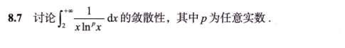