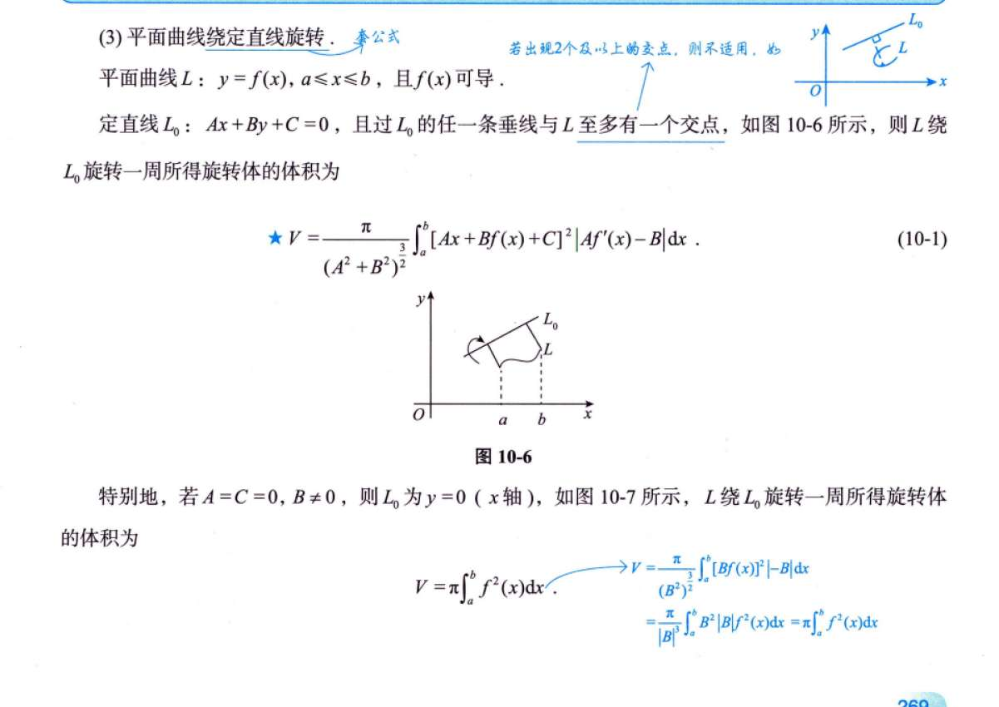
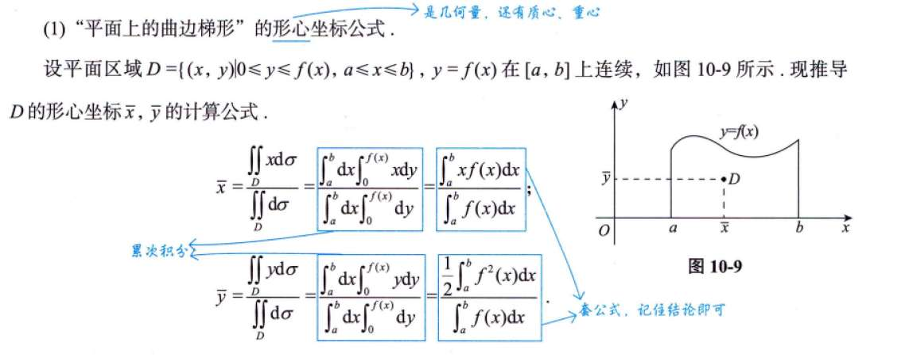
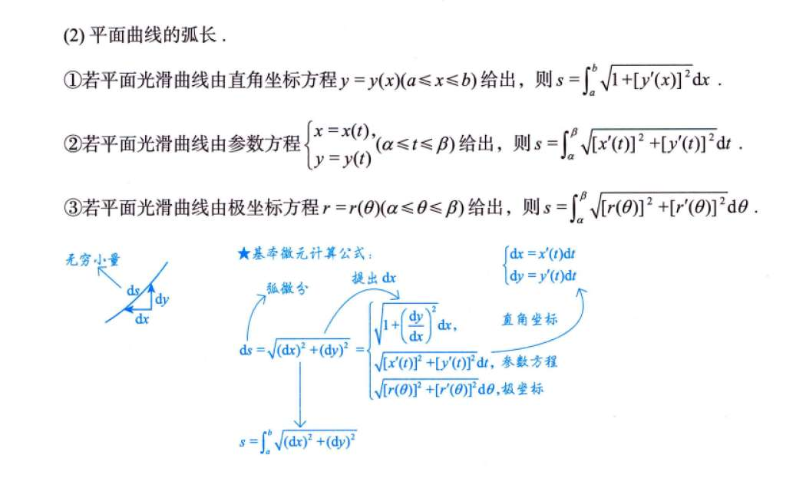
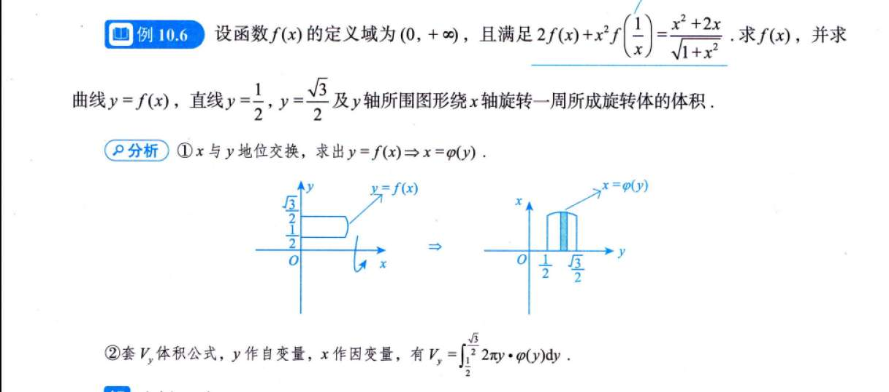
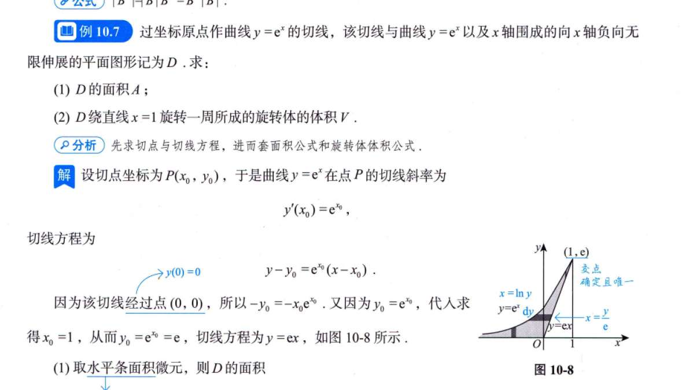
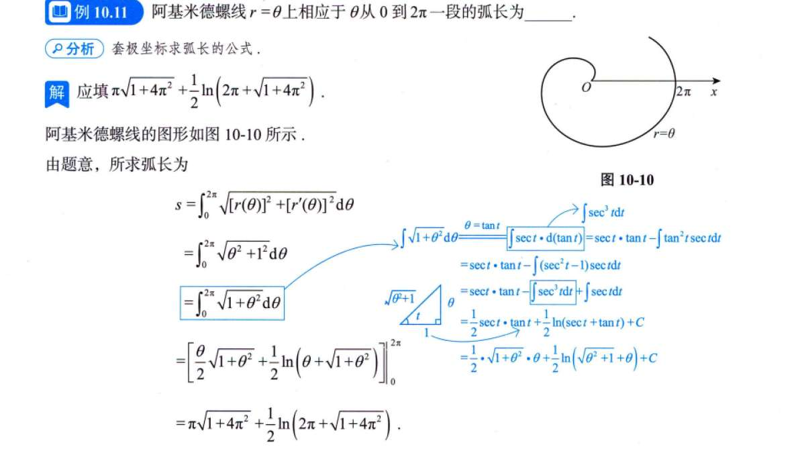
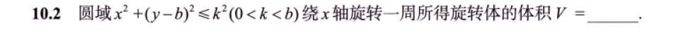
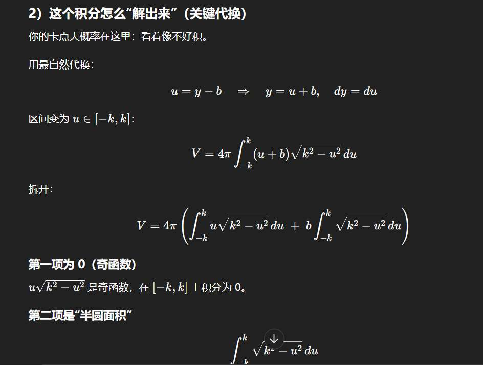
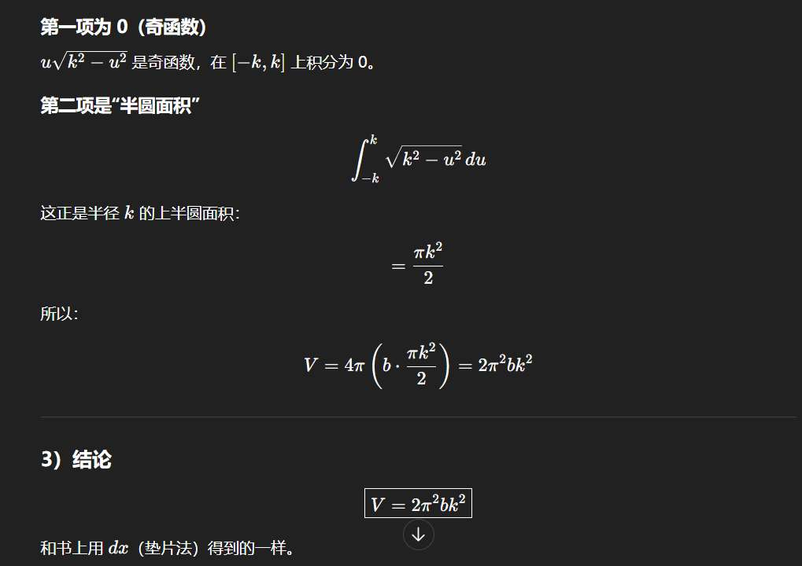

# 书籍+视频勘察

## 旋转算体积
绕x 轴的话，圆形积分。Πy 方是圆形
绕y 轴的话，展开成长方形，2Πx 为长
绕直线旋转
这个公式（公式 10-1）初看非常吓人，但它的本质其实就是我们熟悉的**微元法（盘片法/柱壳法）**。

我们可以把绕任意直线 $L_0: Ax + By + C = 0$ 旋转的体积问题，转化为绕一个“新的坐标轴”旋转的问题。推导过程主要分为三步：

---

### 1. 确定旋转半径 $r(x)$

旋转体体积的基本公式是 $V = \int \pi [r(u)]^2 du$。

对于曲线 $L$ 上的任意一点 $(x, f(x))$，它到旋转中心线 $Ax + By + C = 0$ 的**垂直距离**就是旋转半径 $r$。

根据**点到直线的距离公式**：

$$r(x) = \frac{|Ax + Bf(x) + C|}{\sqrt{A^2 + B^2}}$$

### 2. 确定微元的厚度 $du$

我们需要知道沿着旋转轴 $L_0$ 方向的“厚度”微元是多少。

设 $u$ 是直线 $L_0$ 上的坐标轴。我们可以通过投影的方式找到 $u$ 与 $x$ 的关系。

- 直线 $L_0$ 的方向向量为 $\vec{v} = (B, -A)$。
    
- 其单位方向向量为 $\vec{e} = \frac{(B, -A)}{\sqrt{A^2 + B^2}}$。
    
- 曲线上的点 $P(x, f(x))$ 在这条线上的投影位置 $u(x)$ 可以表示为向量 $(x, f(x))$ 与单位方向向量的内积：
    
    $$u(x) = (x, f(x)) \cdot \frac{(B, -A)}{\sqrt{A^2 + B^2}} = \frac{Bx - Af(x)}{\sqrt{A^2 + B^2}}$$
    

对 $u(x)$ 求导得到微元 $du$：

$$du = |u'(x)| dx = \frac{|B - Af'(x)|}{\sqrt{A^2 + B^2}} dx$$

为了和公式一致，我们可以写成 $\frac{|Af'(x) - B|}{\sqrt{A^2 + B^2}} dx$。

### 3. 组合积分式

将 $r(x)$ 和 $du$ 代入体积积分公式 $V = \int \pi r^2 du$：

$$V = \int_a^b \pi \left( \frac{Ax + Bf(x) + C}{\sqrt{A^2 + B^2}} \right)^2 \cdot \frac{|Af'(x) - B|}{\sqrt{A^2 + B^2}} \, dx$$

整理分母：

- 分母部分有 $(\sqrt{A^2 + B^2})^2 \cdot \sqrt{A^2 + B^2} = (A^2 + B^2)^{3/2}$。
    
- 将常数项提到积分符号外。
    

最终得到：

$$V = \frac{\pi}{(A^2 + B^2)^{3/2}} \int_a^b [Ax + Bf(x) + C]^2 |Af'(x) - B| \, dx$$

---

### 为什么公式里有一个绝对值 $|Af'(x) - B|$？

这保证了“厚度”始终为正。图中提到的条件“过 $L_0$ 的任一条垂线与 $L$ 至多有一个交点”，是为了确保在旋转过程中不会出现重叠或者中空的复杂情况（即 $u(x)$ 必须是单调的），这样我们才能直接使用简单的圆盘法累加。

### 快速验证：绕 $x$ 轴旋转

如果绕 $x$ 轴旋转，则直线方程为 $y=0$。

此时 $A=0, B=1, C=0$。代入公式：

$$V = \frac{\pi}{(0^2 + 1^2)^{3/2}} \int_a^b [0x + 1f(x) + 0]^2 |0f'(x) - 1| \, dx$$

$$V = \pi \int_a^b f^2(x) \cdot |-1| \, dx = \pi \int_a^b f^2(x) \, dx$$

这正是我们最基础的旋转体体积公式！

## 梯形质心

## 弧长

注意极坐标方程弧长的推导
# 例题
## 积分几何
### 10.5

### 10.6

## 10.7

第二问能用俩种方法

## 10.11

# 习题
## 10.2

两种方法

