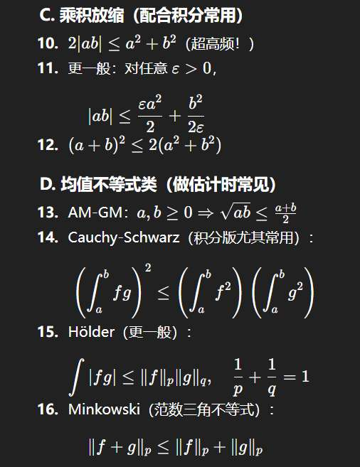

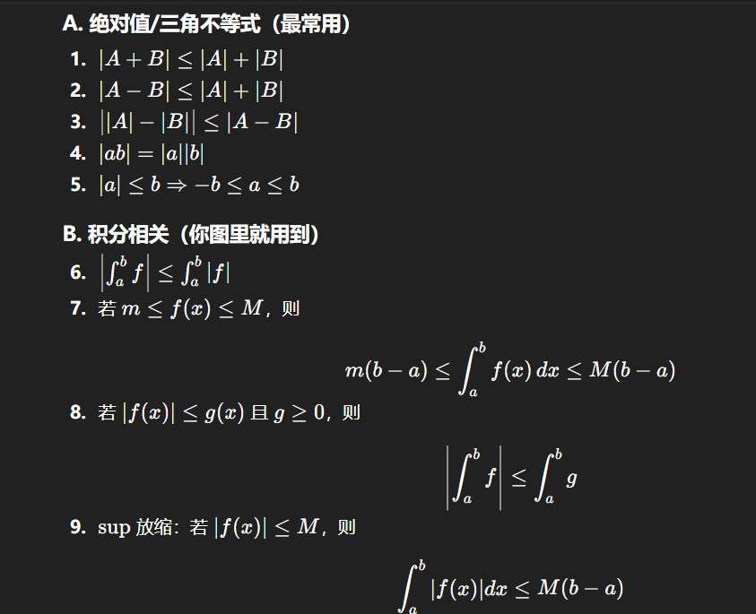

## 二级结论

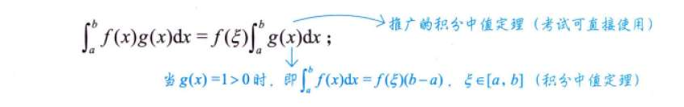
一定要注意，要求 g (x) 保号
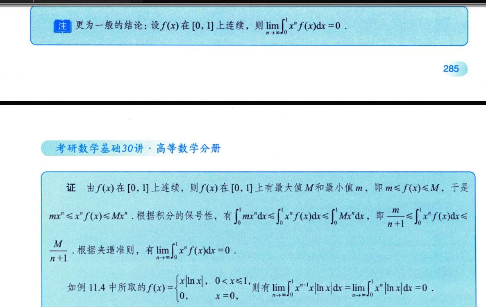
# 例题

## 1 放缩
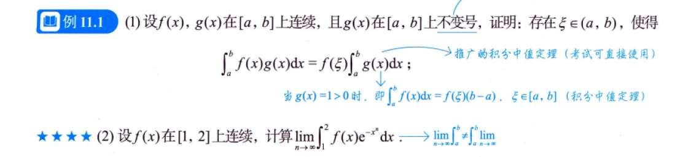
主要就是第二问，求的极限，这个放缩方法

## 2罗尔定理、拉格朗日中值

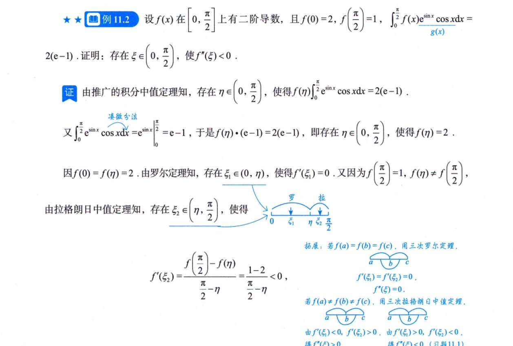
罗尔定理、拉格朗日中值的基础操作

## 3、5 夹逼
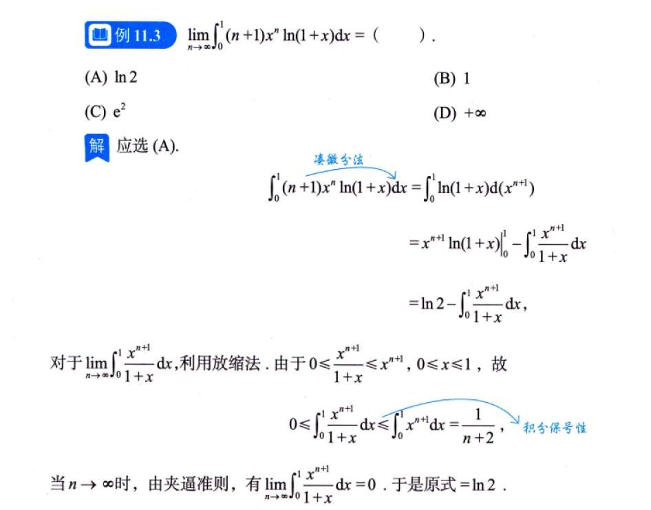

夹逼要多练
。

这题是真想不出来
## 6绝对值
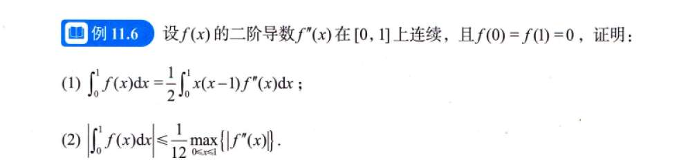
第二问，绝对值
**积分绝对值不等式**： **“先积再绝对值 $\le$ 先绝对值再积”** （因为如果有正有负，先积会互相抵消，反而变小）。：$|x(x-1)f''(x)|$。根据乘法的绝对值性质 $|abc| = |a||b||c|$，
## 7积分上下限是常数

**证明带有定积分的不等式**，如果积分上下限是常数（比如 $a, b$），**第一反应就是把上限的常数改成变量 $x$，移项构造出 $F(x)$**。然后求导，利用题干条件（比如函数的单调性、正负性）判断 $F'(x)$ 的符号，往往就能迎刃而解。
## 8、9 M两个简单端点

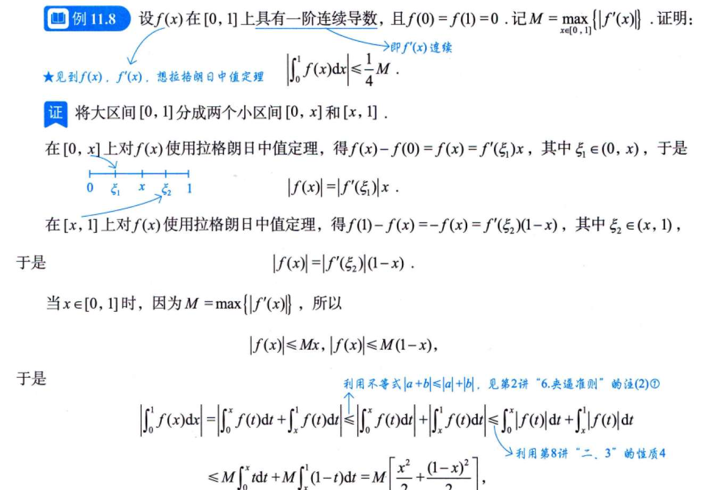
碰到有两个简单端点，要用到 f' (x) 就启动拉格朗日中值

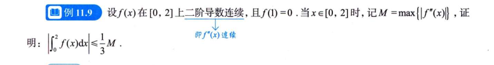
而没有多个端点，还有 f'' (x) 时，考虑泰勒

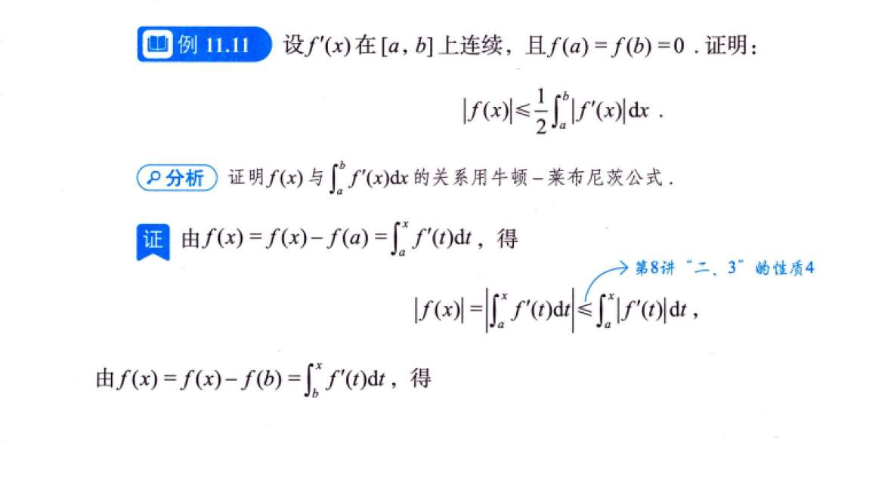
牛顿莱布尼兹公式做
- 从左边抛锚：$f(x) = f(x) - f(a) = \int_a^x f'(t)dt$
    
- 从右边抛锚：$f(x) = f(x) - f(b) = \int_b^x f'(t)dt = -\int_x^b f'(t)dt$

# 习题
## 2 定积分不等式证明
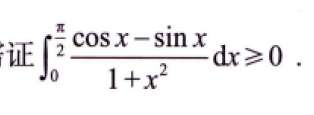
证明 $\ge 0$ 的定积分，你的第一目光应该扫向被积函数：**它在积分区间里，是不是一直大于等于 0？**
**只要发现被积函数在区间内存在变号点，第一反应永远是——在这个变号点把积分“劈开”！** （这就是为什么两种方法第一步全都是在 $\frac{\pi}{4}$ 处分段的原因，这绝对不是凑巧）。
劈开之后变成了：$\int_0^{\pi/4} (\text{正数}) dx + \int_{\pi/4}^{\pi/2} (\text{负数}) dx \ge 0$。

接下来怎么证明正的能赢？答案给出了两条极其经典的路径：

### 方法一：对称折叠法（利用三角函数的区间对称性）

**怎么想到这招的？**

当你看到区间是 $[0, \frac{\pi}{2}]$，劈开点是中点 $\frac{\pi}{4}$ 时，你的“三角函数雷达”必须狂响。在这个区间里，$\sin$ 和 $\cos$ 是高度对称的！

如果你把右半段 $[\frac{\pi}{4}, \frac{\pi}{2}]$ 像叠被子一样，往左边折叠回 $[0, \frac{\pi}{4}]$，会发生什么？

这就是答案中令 $x = \frac{\pi}{2} - t$ 的原因（也可以令 $x = t + \frac{\pi}{4}$，效果一样）。

折叠后，神奇的事情发生了：右半段的分子变成了 $\sin t - \cos t$，刚好是左半边分子的**相反数**！

把两部分合并，提取公因式 $(\cos x - \sin x)$ 后，括号里就变成了：

$$\left[ \frac{1}{1+x^2} - \frac{1}{1+(\frac{\pi}{2}-x)^2} \right]$$

因为在 $[0, \frac{\pi}{4}]$ 里，$x < \frac{\pi}{2}-x$，所以前面分母小，整体分数值大，中括号里必然是正数。正数乘正数，完胜！

**套路总结 2：遇到三角函数积分，且区间涉及 $\frac{\pi}{2}, \pi, \frac{\pi}{4}$ 这种特殊点，只要分了段，立刻尝试用 $x = \frac{\pi}{2}-t$ 或类似换元法，把两段积分的上下限“对齐”，然后合并同类项。**

---

### 方法二：提取权重法（利用积分中值定理）

**怎么想到这招的？**

如果你对三角换元不敏感，你还可以从**物理/几何直觉**出发。

积分 $\int (\cos x - \sin x) \cdot \frac{1}{1+x^2} dx$，可以看作是算面积，其中：

- $\cos x - \sin x$ 提供了基础面积。
    
- $\frac{1}{1+x^2}$ 是一个“权重”（它是单调递减的）。
    

在左半段 $[0, \frac{\pi}{4}]$，基础面积是正的，这时候 $x$ 比较小，权重 $\frac{1}{1+x^2}$ **比较大**。

在右半段 $[\frac{\pi}{4}, \frac{\pi}{2}]$，基础面积是负的，这时候 $x$ 比较大，权重 $\frac{1}{1+x^2}$ **比较小**。

**大的权重乘正数，小的权重乘负数，加起来肯定大于 0！**

怎么用数学语言把这个直觉翻译出来？

这就轮到**第一积分中值定理**登场了（还记得我们之前聊过的“保号性”前提吗？这就是为什么必须先分段！因为只有在各自的段里，$\cos x - \sin x$ 才能保持不变号）。

把那个单调的权重函数拿出来变成 $f(\xi)$ 和 $f(\eta)$，你会发现剩下部分的积分 $\int |\cos x - \sin x| dx$ 在两段里算出来**刚好相等**（都是 $\sqrt{2}-1$）。

提公因式后，比较 $\frac{1}{1+\xi^2}$ 和 $\frac{1}{1+\eta^2}$ 的大小即可。因为 $\xi$ 在左半边，$\eta$ 在右半边（$\xi < \eta$），所以显然得证。

**套路总结 3：遇到“单调函数 $\times$ 周期/变号函数”的积分不等式，分段保证不变号后，用中值定理把单调函数“抽”出来变成 $f(\xi)$，剩下的部分往往能积出常数并互相抵消。**

## 3 积分中应用反函数性质
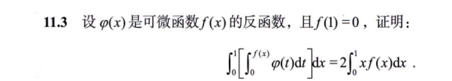
主要是反函数性质

## 4 

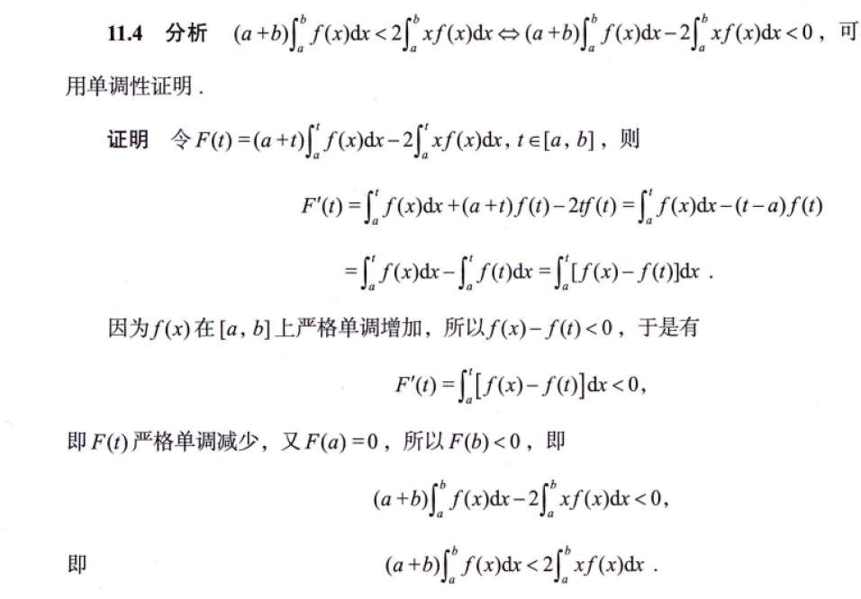

# 1000 题
## 2
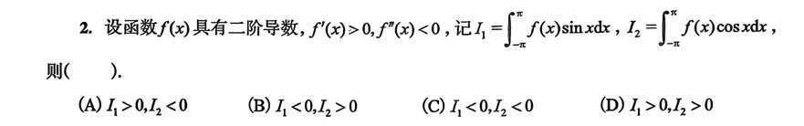
## 3
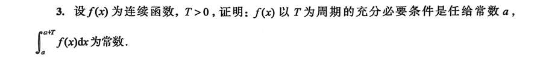
又碰到周期性，不会了

## 6
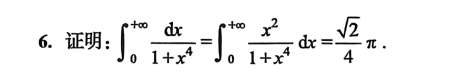
太有技巧性了

## 7
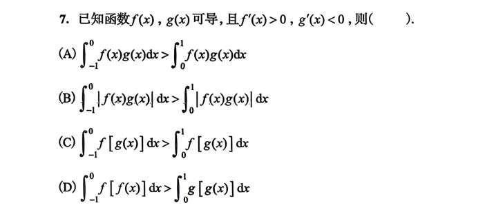

解析里用了 $e^x$ 和 $e^{-x}$，你觉得想不到。**其实你根本不需要想到这么高级的函数！**

题目只说了两个条件：

1. $f'(x) > 0$ 意味着 $f(x)$ 是个**单调递增**函数。
    
2. $g'(x) < 0$ 意味着 $g(x)$ 是个**单调递减**函数。
    

遇到这种情况，你脑子里第一反应的增减函数是什么？绝对是世界上最简单的直线：**$f(x) = x$ 和 $g(x) = -x$**。

我们就用这两个最“弱智”的函数去挨个试（其实这也就是解析里用来排除 D 选项的函数）：

- **看选项 (A)：** $f(x)g(x) = -x^2$。
    
    左边：$\int_{-1}^0 -x^2 dx = -\frac{1}{3}$
    
    右边：$\int_0^1 -x^2 dx = -\frac{1}{3}$
    
    两边**相等**，根本不是大于！(A) 直接抬走。
    
- **看选项 (B)：** $|f(x)g(x)| = |-x^2| = x^2$。
    
    左边：$\int_{-1}^0 x^2 dx = \frac{1}{3}$
    
    右边：$\int_0^1 x^2 dx = \frac{1}{3}$
    
    两边依然**相等**！(B) 直接抬走。
    
- **看选项 (D)：**
    
    左边：$f(f(x)) = f(x) = x$，$\int_{-1}^0 x dx = -\frac{1}{2}$
    
    右边：$g(g(x)) = g(-x) = -(-x) = x$，$\int_0^1 x dx = \frac{1}{2}$
    
    $-\frac{1}{2}$ 显然小于 $\frac{1}{2}$，(D) 方向反了，抬走。
    

你看，**只靠 $x$ 和 $-x$ 这两个连小学生都知道的函数，三秒钟就能排除 ABD。** 这才是考场上做选择题的最高效姿势！

：如何直接看出 (C) 是对的？

如果不让用特值，或者这是一道证明大题，该怎么思考？这就涉及到一个极其重要的积分比大小套路：**“区间不同，强行同化”**。

你要比较的两个积分：

左边：$\int_{-1}^0 f[g(x)]dx$

右边：$\int_0^1 f[g(x)]dx$

它们积分区间一个是 $[-1, 0]$，一个是 $[0, 1]$，没法直接比。所以我们要把左边的区间**平移或翻折**到右边去。

**核心操作：换元！**

盯着左边 $\int_{-1}^0 f[g(x)]dx$，令 **$x = -t$** （这就是利用对称性翻折区间）：

- 当下限 $x = -1$ 时，$t = 1$
    
- 当上限 $x = 0$ 时，$t = 0$
    
- $dx = -dt$
    

代入进去，左边就变成了：

$$\int_{1}^0 f[g(-t)](-dt) = \int_0^1 f[g(-t)] dt$$

因为积分里的字母叫 $t$ 还是叫 $x$ 根本无所谓（哑变量），我们把它改写回 $x$：

左边 $= \int_0^1 f[g(-x)] dx$

**见证奇迹的时刻到了！**

现在左边和右边的积分区间都是 $[0, 1]$ 了，我们只需要比较被积函数 **$f[g(-x)]$** 和 **$f[g(x)]$** 的大小。

在区间 $x \in (0, 1]$ 上：

1. 显然有 **$-x < x$**。
    
2. 因为 $g(x)$ 是递减的（$g'<0$），所以输入越小，输出越大。因此 **$g(-x) > g(x)$**。
    
3. 因为 $f(x)$ 是递增的（$f'>0$），所以输入越大，输出越大。因此 **$f[g(-x)] > f[g(x)]$**。
    

既然在整个积分区间上，左边的被积函数永远大于右边的被积函数，那么积出来的总面积肯定也是左边大！

即：$\int_0^1 f[g(-x)] dx > \int_0^1 f[g(x)] dx$。

**(C) 选项完美得证。**

---

**总结一下应对这种题的策略：**

1. **如果是选择题：** 不要去想要什么神仙函数，直接上 $f(x)=x$、$f(x)=x^3$ 或者 $f(x)=e^x$ 这种最基本、最极端的单调函数去试错，效率最高。
    
2. **如果是证明题/比大小：** 只要积分区间对称（比如 $[-a, 0]$ 和 $[0, a]$），**第一步永远是令 $x = -t$，把区间统一**，然后再利用函数的单调性去比较里面的内容。
    

