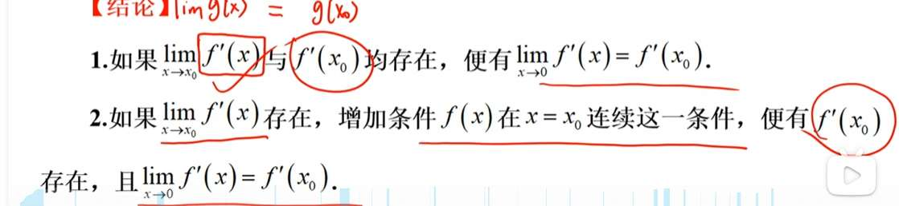

#### 1. 物理直觉（速度计）

想象你在开车，车的位置是 $f(x)$，此时的速度是 $f'(x)$。

- **$\lim_{x\to x_0} f'(x) = A$** 意味着：
    
    当你无限接近 $x_0$ 这个时刻，你的**速度计读数**无限趋近于 $A$（比如 80迈）。
    
- **$f'(x_0)$** 意味着：
    
    就在 $x_0$ 这一瞬间，你的**真实速度**是多少。
    

**导数极限定理在说什么？**

它在说：只要你的车是连续行驶的（$f(x)$ 连续），如果你在撞线前一毫秒的速度是 80迈，那你撞线那一瞬间的速度**只能是 80迈**。

你不可能在撞线的前一微秒是 80迈，撞线瞬间突然变成 0 或者 100。物理学不允许速度发生“瞬间跳跃”（除非你撞墙了，那就不连续了）。

#### 2. 几何直觉（切线趋势）

- **$\lim_{x\to x_0} f'(x)$**：是你手里拿着一把尺子，沿着曲线走，尺子的**倾斜角度的变化趋势**。
    
- **$f'(x_0)$**：是曲线在 $x_0$ 这一点的**真切线**。
    

**定理的含义**：

如果你手里的尺子越靠近 $x_0$，倾斜角越稳定地趋向于一个角度 $A$，那么在 $x_0$ 这一点的真切线，必然也是这个角度 $A$。

---

### 二、 详细证明（打通任督二脉）

你图 1 用的是洛必达法则，虽然快，但容易掩盖本质。**最稳健、最符合考研逻辑的证明是用“拉格朗日中值定理 (MVT)”**。

**命题**：

设 $f(x)$ 在 $x_0$ 的去心邻域内可导，且在 $x_0$ 处连续。

若极限 $\lim_{x\to x_0} f'(x) = A$ 存在，

**证明**：$f'(x_0)$ 存在，且 $f'(x_0) = A$。

#### 证明过程（请一步步看，非常顺滑）：

1. **回到定义**：
    
    我们要算 $f'(x_0)$，根据导数定义，就是算这个极限：
    
    $$f'(x_0) = \lim_{x \to x_0} \frac{f(x) - f(x_0)}{x - x_0}$$
    
2. **使用中值定理 (MVT)**：
    
    观察分子 $f(x) - f(x_0)$。因为 $f(x)$ 在 $x$ 和 $x_0$ 之间是连续且可导的，根据拉格朗日中值定理，**一定存在**一个 $\xi$（在 $x$ 和 $x_0$ 之间），使得：
    
    $$\frac{f(x) - f(x_0)}{x - x_0} = f'(\xi)$$
    
3. **夹逼逼近**：
    
    现在我们让 $x \to x_0$。
    
    因为 $\xi$ 夹在 $x$ 和 $x_0$ 之间（即 $x_0 < \xi < x$ 或 $x < \xi < x_0$），所以当 $x$ 跑到 $x_0$ 时，$\xi$ 被迫也必须跑到 $x_0$。
    
    即：$x \to x_0 \implies \xi \to x_0$。
    
4. **利用已知条件**：
    
    题目告诉我们 $\lim_{x\to x_0} f'(x) = A$。
    
    这意味着，只要自变量趋向于 $x_0$，导函数的值就趋向于 $A$。
    
    既然 $\xi \to x_0$，那么自然也有：
    
    $$\lim_{x \to x_0} f'(\xi) = A$$
    
5. **结论**：
    
    回到第 1 步的等式：
    
    $$f'(x_0) = \lim_{x \to x_0} \frac{f(x) - f(x_0)}{x - x_0} = \lim_{x \to x_0} f'(\xi) = A$$
    
    **得证：$f'(x_0) = A$。**
    

---

### 三、 结合图 2 的两个结论进行“人话翻译”

图 2 里的两句话，其实是同一个意思的两个侧面。

#### 1. 图 2 第 2 条（核心定理）

> **“如果 $\lim f'(x)$ 存在，且 $f(x)$ 连续，便有 $f'(x_0)$ 存在且相等。”**

- **直觉**：这就是上面证明的过程。导数的极限存在 $\implies$ 导数本身必须连续。
    
- **用途**：**它是用来“补漏洞”的**。如果导函数在某一点看着像有个洞（可去间断点），这个定理告诉你：**别傻了，导函数不可能有洞。**如果有极限，那个点的值就自动补上了。
    

#### 2. 图 2 第 1 条（推论）

> **“如果 $\lim f'(x)$ 与 $f'(x_0)$ 均存在，便有两者相等。”**

- **直觉**：这句话排除了**“可去间断点”**的可能性。
    
- **反例假设**：假设 $\lim f'(x) = 5$，但是 $f'(x_0) = 3$。
    
- **矛盾**：根据定理，既然极限是 5，那算出导数值必须是 5。如果不相等，说明前提错了（比如 $f(x)$ 在那一点根本不连续，或者根本不可导）。
    
- **结论**：**导函数 $f'(x)$ 绝不可能出现“极限值 $\neq$ 函数值”的情况。**
    

---

### 四、 最后的总结（思维导图素材）

回到你最初的问题：“f(x) 有可去间断点就没有原函数，怎么证明？”

现在你可以用这个**导数极限定理**来“秒杀”证明了：

**证明逻辑链（秒杀版）：**

1. 假设 $f(x)$ 有原函数 $F(x)$。（即 $F'(x) = f(x)$）。
    
2. 因为 $F(x)$ 可导，所以 $F(x)$ 必连续（满足了定理的前提）。
    
3. 设 $x_0$ 是 $f(x)$ 的**可去间断点**。
    
    - 这意味着 $\lim_{x\to x_0} f(x) = A$ 存在。
        
    - 也就是 $\lim_{x\to x_0} F'(x) = A$ 存在。
        
4. **召唤神龙（导数极限定理）**：
    
    既然 $\lim F'(x)$ 存在且 $F(x)$ 连续 $\implies$ $F'(x_0)$ 必须等于 $A$。
    
5. **矛盾**：
    
    可去间断点的定义是 $f(x_0) \neq A$。
    
    也就是 $F'(x_0) \neq A$。
    
    **定理说必须相等，定义说不相等 $\to$ 矛盾！**
    
6. **结论**：$f(x)$ 不可能有原函数。