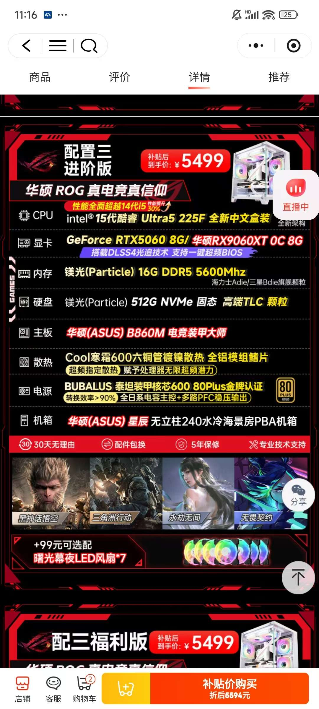

主板标华硕 B860M 电竞装甲大师 实际为
ASUS B860M-BRO 低端版
网吧工包缩水版，与宣传严重不符，属于虚假宣传。

标内存  镁光(Particle) 16G DDR5  实际内存品牌为SIX   应为Crucial
标硬盘 镁光(Particle) 512G   实际牌子 ibridge  
实际的内存牌子和硬盘牌子听都没听过！

整机配件多处使用缩水特供件，不接受此类严重溢价且质量无保障的组装机。

要求全额退款，且商家承担往返运费。如果商家拒绝，我将向 12315 举报并要求工商介入检测