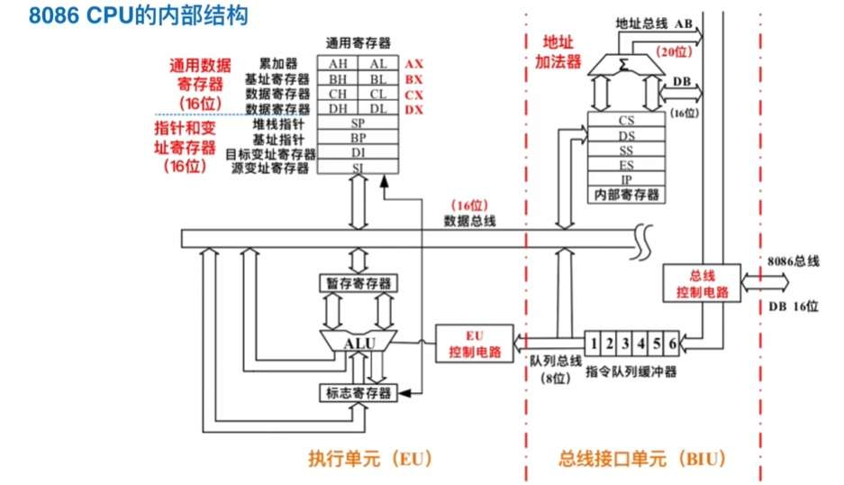

# ch2

### **如何把“运算器/控制器”映射到 8086 的 EU/BIU？**

408 计组讲的是**冯·诺依曼架构的逻辑功能划分**，而 8086 是**因特尔工程师的具体物理实现**。它们的对应关系如下：

1. **运算器 (ALU)**
    
    - **在 8086 里在哪？** 全都在 **EU (执行单元)** 里。
        
    - **原因**：EU 负责干活，算术逻辑运算单元 (ALU) 自然要在车间（EU）里。
        
2. **控制器 (CU)**
    
    - **在 8086 里在哪？** 被拆分了！
        
    - **指令译码逻辑**：在 **EU** 里。（负责看懂指令要干嘛）
        
    - **总线控制逻辑**：在 **BIU** 里。（负责控制什么时候去内存拿东西）
        
    - **原因**：8086 为了实现流水线（一边执行一边取指），把控制功能分成了“脑子”（EU译码）和“腿”（BIU取指）。
        
3. **寄存器**
    
    - **在 8086 里在哪？** 也被拆分了！
        
    - **干活用的寄存器** (AX, BX, CX, DX, SP, BP, SI, DI, FLAGS)：在 **EU** 里。（工人干活的工具包）。
        
    - **指路用的寄存器** (CS, DS, SS, ES, IP)：在 **BIU** 里。（物流部门的地图和导航仪）。
        
    - **原因**：BIU 需要计算物理地址（段地址+偏移），所以它必须拿着段寄存器和 IP。


### **第 3 题：2.6 寄存器分类与功能**

**题目**：8086/8088 微处理器内部有哪些寄存器？其主要作用是什么？

**【解析】**  
8086 共有 14 个 16位寄存器，分为三类。这道题是简答题的常客。

1. **通用寄存器 (8个)** —— EU 里的工具
    
    - **数据寄存器** (AX, BX, CX, DX)：
        
        - **AX** (Accumulator)：累加器，运算首选，I/O 专用。
            
        - **BX** (Base)：基址，**唯一能做指针的通用数据寄存器**。
            
        - **CX** (Count)：计数，串操作和 Loop 循环专用。
            
        - **DX** (Data)：数据，乘除法辅助，I/O 端口号专用。
            
    - **指针与变址寄存器** (SP, BP, SI, DI)：
        
        - **SP** (Stack Pointer)：栈顶指针，永远指向堆栈顶部。
            
        - **BP** (Base Pointer)：基址指针，常用于访问堆栈里的变量。
            
        - **SI** (Source Index)：源变址，串操作指源串。
            
        - **DI** (Destination Index)：目的变址，串操作指目的串。
            
2. **段寄存器 (4个)** —— BIU 里的地基
    
    - **CS** (Code)：代码段基址。
        
    - **DS** (Data)：数据段基址。
        
    - **SS** (Stack)：堆栈段基址。
        
    - **ES** (Extra)：附加段基址（串操作的目的地）。
        
3. **控制寄存器 (2个)**
    
    - **IP** (Instruction Pointer)：指令指针（计组里叫 PC），指向下一条要执行的指令偏移地址。
        
    - **FLAGS/PSW** (Program Status Word)：标志寄存器，存红绿灯（CF, ZF 等）和控制开关（IF, DF）。
        

---

### **第 4 题：2.7 寻址专用寄存器（考研重点）**

**题目**：IBM PC 有哪些寄存器用来指示存储器的地址？其中哪些可供在汇编语言程序中进行存储器寻址使用？

**【解析】**  
这道题问得有点绕，其实就是问：**“谁能存偏移地址？”** 和 **“谁能写在 [] 里？”**

**第一问：哪些寄存器指示存储器地址（存偏移地址）？**

- **IP**：指示**指令**的地址（配合 CS）。
    
- **SP**：指示**堆栈顶**的地址（配合 SS）。
    
- **BX, BP, SI, DI**：指示**数据**的地址（配合 DS, SS, ES）。
    

**第二问（核心）：哪些可在汇编中进行存储器寻址（能写在 [] 里）？**  
这就是我们之前做改错题时反复强调的**“四大金刚”**：

- **BX** (Base)
    
- **BP** (Base Pointer)
    
- **SI** (Source Index)
    
- **DI** (Destination Index)
    

**避坑指南（408 易错点）：**

- **AX, CX, DX** 虽然也是 16 位，但**不能**用来存地址（在 16 位汇编中），写 MOV AX, [CX] 是错的！
    
- **IP** 程序员**不能直接修改**（不能 MOV IP, ...），只能通过 JMP、CALL 间接改变。
    

---
### *回答你的疑惑：什么叫“配合 CS/SS”？**

在 8086 系统中，计算物理地址的公式你已经背过了：

> **物理地址 = 段地址 × 16 + 偏移地址**

但是，CPU 里有 4 个段寄存器（CS, DS, SS, ES），当我们只给出一个偏移地址（比如 MOV AX, [BX]，或者指令指针 IP）时，**CPU 怎么知道该乘哪一个段地址呢？**

这就有了**“默认配合”**（也叫默认段约定）：

1. **CS 配合 IP（代码区）**
    
    - **含义**：IP 指向的是**指令**。指令一定放在**代码段**（Code Segment）里。
        
    - **规则**：CPU 只要看到 IP，就自动去乘 CS。
        
    - 情景：去学校（CS）找教室（IP）。
        
2. **SS 配合 SP 和 BP（堆栈区）**
    
    - **含义**：SP（栈顶）和 BP（基址指针）指向的是**堆栈数据**。堆栈一定放在**堆栈段**（Stack Segment）里。
        
    - **规则**：只要操作数涉及 SP 或 BP（比如 PUSH, POP, MOV AX, [BP]），CPU 自动去乘 SS。
        
    - 情景：去食堂（SS）找盘子（SP）。
        
3. **DS 配合 BX, SI, DI（数据区）**
    
    - **含义**：这三个通常用来指向**变量**。变量默认放在**数据段**（Data Segment）里。
        
    - **规则**：只要用 [BX], [SI], [DI] 访问内存，CPU 默认去乘 DS。
        
    - 情景：去宿舍（DS）找人（BX）。
        
4. **ES 配合 DI（串操作专用）**
    
    - **含义**：只有在做串操作（如 MOVSB）时，目标地址 DI 才会强制配合 ES。
        

**总结表格（背这个就行）：**

|   |   |   |
|---|---|---|
|偏移地址由谁提供？|**默认配合的段寄存器**|也就是去哪里找？|
|**IP** (取指令)|**CS**|代码段|
|**SP** 或 **BP**|**SS**|堆栈段|
|**BX**, **SI**, **DI**|**DS**|数据段|


### **第 5 题：2.11 标志位计算（重点！）**

**题目**：将十六进制数 **62A0H** 与下列各数相加，求结果及标志位 CF, AF, SF, ZF, OF, PF。  
我们挑打勾的 **(1)** 和 **(6)** 来讲，这两个最典型。

**【预备知识：标志位怎么看？】**

- **CF (Carry)**：最高位进位（无符号数溢出）。
    
- **OF (Overflow)**：**有符号数**溢出（正+正=负，负+负=正）。
    
- **SF (Sign)**：结果的最高位是啥，它就是啥（0正1负）。
    
- **ZF (Zero)**：结果是0吗？是0则为1。
    
- **PF (Parity)**：结果的**低8位**里，1的个数是偶数吗？是偶数则为1。
    
- **AF (Auxiliary)**：第3位向第4位有进位吗？（低半字节进位）。
    

---

#### **(1) 62A0H + 1234H**

**第一步：列竖式计算**

codeText

```
6 2 A 0
+   1 2 3 4
-----------
    7 4 D 4
```

**结果**：**74D4H**

**第二步：分析标志位**

1. **CF (进位)**：最高位 6+1=7，没进位。 -> **CF = 0**
    
2. **SF (符号)**：结果最高位是 7 (0111)，首位是 0 (正数)。 -> **SF = 0**
    
3. **ZF (零)**：结果不是0。 -> **ZF = 0**
    
4. **OF (溢出)**：
    
    - 被加数 62A0 (正)，加数 1234 (正)。
        
    - 结果 74D4 (正)。
        
    - 正+正=正，逻辑正常，没溢出。 -> **OF = 0**
        
5. **PF (奇偶)**：看低8位 **D4H**。
    
    - D4H = 1101 0100。
        
    - 有 4 个 1（偶数）。 -> **PF = 1**
        
6. **AF (辅助)**：看最低一位 0+4=4，没进位。 -> **AF = 0**
    

---

#### **(6) 62A0H + F021H**

**第一步：列竖式计算**

codeText

```
6 2 A 0
+   F 0 2 1
-----------
  1 5 2 C 1
```

**结果**：**52C1H** （进位丢给CF）

**第二步：分析标志位**

1. **CF**：最高位 6+F = 21 (15+6=21=16+5)，产生了进位！ -> **CF = 1**
    
2. **SF**：结果最高位 5 (0101)，首位 0。 -> **SF = 0**
    
3. **ZF**：结果非0。 -> **ZF = 0**
    
4. **OF (最易错！)**：
    
    - 62A0 (正)。
        
    - F021 (首位F=1111，负)。
        
    - **正 + 负，永远不会溢出！** -> **OF = 0**
        
5. **PF**：看低8位 **C1H**。
    
    - C1H = 1100 0001。
        
    - 有 3 个 1（奇数）。 -> **PF = 0**
        

---

### **第 6 题：2.14 物理地址计算**

**题目**：写出下列存储器地址的段地址、偏移地址和物理地址。格式 AAAA:BBBB。

**【公式】**：**物理地址 = AAAA × 10H + BBBB** （十六进制乘10H就是左移一位）

我们看打勾的 **(2) 1FA0:0A1F**

1. **段地址**：冒号前面那个 -> **1FA0H**
    
2. **偏移地址**：冒号后面那个 -> **0A1FH**
    
3. **物理地址计算**：
    
    - 段地址左移一位：1FA0 -> **1FA00**
        
    - 加上偏移地址：
        
        codeText
        
        ```
        1 F A 0 0
        +   0 A 1 F
        -----------
          2 0 4 1 F
        ```
        
    - (A+A = 10+10=20=16+4 -> 进1写4)
        
    - (F+0+1 = 15+1=16 -> 进1写0)
        
    - (1+1 = 2)
        
    - **结果**：**2041FH**
        

---

### **总结技巧**

1. **配合关系**：
    
    - 取指令：找 CS。
        
    - 取堆栈：找 SS。
        
    - 取数据：找 DS。
        
2. **标志位**：
    
    - **OF**：只看有符号数逻辑（正+正=负？负+负=正？）。
        
    - **CF**：看最高位有没有进位。
        
3. **地址计算**：段地址末尾补个0，加上偏移地址，搞定。


# ch4
## 1指令
1. **[] 里只能有 BX, BP, SI, DI**。
    
2. **两边位数要一样** (AX对BX，AL对BL)。
    
3. **两个内存不能对传**。
    
4. **段寄存器 (DS, ES) 不能直接吃数字**。
    
5. **不写 PTR，CPU不知道操作多大内存

6. **MOVS 这种串指令**，后面不要加操作数，它是靠 SI/DI 吃饭的。
    
7. **PUSH/POP 在 8086 里很挑剔**：PUSH 不能压数字，POP 不能弹 CS。
    
8. **段寄存器 (DS, ES...) 是“残疾人”**：不能 MOV 立即数，不能段对段 MOV，不能 XCHG。
    
9. **DIV / MUL 很霸道**：只能写一个操作数（除数/乘数），而且不能是数字，必须是寄存器或内存。
10. **移位 SHL/SHR**：次数超过1，必须用 **CL**。
    
11. **端口 IN/OUT**：端口号要么直接写数字（<256），要么放 **DX**，别的人不行。
    
12. **地址 OFFSET**：地址永远是 **16位** 的，别想放进 AL/BL 里。
    
13. **堆栈 PUSH**：只收 **16位** 寄存器。
恭喜你！这40道题看下来，你已经掌握了 8086 汇编语法的 **80%** 考点了。

以后做这种题，**像安检员一样扫描这几个点**：

1. **扫描 []**：里面必须是 BX, BP, SI, DI 的组合。BX和BP不能共存，SI和DI不能共存。
    
2. **扫描 MOV**：两边位数必须一样（8对8，16对16）；不能两边都是内存；不能两边都是段寄存器。
    
3. **扫描 段寄存器 (DS/ES)**：不能直接给它塞数字（立即数）。
    
4. **扫描 PTR**：如果你只看到 [内存] 和 立即数，没看到寄存器，那就是错的（大小不明）。
    
5. **扫描 特殊指令**：
    
    - **移位**：大于1次用 CL。
        
    - **端口**：大于255用 DX。
        
    - **堆栈**：只能压 16位。

**小结一下指令对的区别套路**：

1. **串指令 (MOVS, STOS, SCAS...)** 最大的特点就是**自带指针移动** (SI/DI ++/--)。
    
2. **LEA 是算地址，MOV 是取值**。
    
3. **SUB 是真减，CMP 是假减（只变标志位）**。
    
4. **BP 默认找 SS，其他通用寄存器默认找 DS**


# 2 寻址
### **（补充）根据条件推测的后续题目**

(题目给出了 20100H 等数据，肯定有对应的指令，以下是标准考法)

#### **(4) 推测指令：MOV AX, [BX]**

- **类型**：**寄存器间接寻址**
    
- **分析**：
    
    - **偏移地址** = BX = 0100H
        
    - **物理地址** = 20000H + 0100H = **20100H**
        
    - 查表得：3412H
        
- **答案**：**AX = 3412H**
    

#### **(5) 推测指令：MOV AX, [BX][SI]**

- **类型**：**基址变址寻址**
    
- **分析**：
    
    - **偏移地址** = BX + SI = 0100H + 0002H = 0102H
        
    - **物理地址** = 20000H + 0102H = **20102H**
        
    - 查表得：7856H
        
- **答案**：**AX = 7856H**
    

#### **(6) 推测指令：MOV AX, 1100H[BX] (或 [BX+1100H])**

- **类型**：**寄存器相对寻址**
    
- **分析**：
    
    - **偏移地址** = BX + 1100H = 0100H + 1100H = 1200H
        
    - **物理地址** = 20000H + 1200H = **21200H**
        
    - 查表得：4C2AH
        
- **答案**：**AX = 4C2AH**
    

#### **(7) 推测指令：MOV AX, 1100H[BX][SI]**

- **类型**：**相对基址变址寻址**（全家桶）
    
- **分析**：
    
    - **偏移地址** = BX + SI + 1100H = 0100H + 0002H + 1100H = 1202H
        
    - **物理地址** = 20000H + 1202H = **21202H**
        
    - 查表得：65B7H
        
- **答案**：**AX = 65B7H**
    

---

### **做题心得总结**

这道题的核心就一个公式：  
**物理地址 = 20000H (DS基址) + []里算出来的数**


# 3循环
1. **搜索循环模版**（必背）：
    
    - MOV CX, 长度
        
    - MOV SI, -1 (或者0，看逻辑)
        
    - INC SI
        
    - CMP ...
        
    - LOOPNZ NEXT (没找到继续找)
        
    - JNZ NOT_FOUND (循环结束如果还是不相等，就是没找到)
        
    - FOUND: (找到了)
        
2. **逻辑运算口诀**：
    
    - **AND (与)**：用来**清零**（想清零哪一位，就跟0与）。
        
    - **OR (或)**：用来**置1**（想把哪一位置1，就跟1或）。
        
    - **XOR (异或)**：用来**取反**（想把哪一位取反，就跟1异或；跟0异或保持不变）。**自己异或自己 = 0**（清零最快方法）。

# 4代码
在 8086（16位机）中，寄存器最大只有 16 位。要处理 32 位数，必须把它拆成 **高16位（DX）** 和 **低16位（AX）** 两个部分来协同工作。

### **核心思路**

1. **保存“尾巴”**：  
    题目要求把“移出的低 3 位”保存在 CL 中。这 3 位原本在 AX 的最右边。移位之前，先把它们备份出来。
    
2. **32位右移怎么做？（接力跑）**
    
    - 想象 DX 和 AX 是两根首尾相接的水管：[ DX ] -> [ AX ] -> 悬崖。
        
    - **第一步**：**高位（DX）** 向右移 1 位。最右边的那一位会被挤出来，掉进 **CF（进位标志位）** 里。
        
        - 指令：SHR DX, 1 （逻辑右移，高位补0）。
            
    - **第二步**：**低位（AX）** 向右移 1 位。重点来了，**它必须去接住刚才从 DX 掉进 CF 里的那一位**，把它放到自己的最高位。
        
        - 指令：RCR AX, 1 （带进位循环右移）。
            
    - **重复 3 次**，就完成了 32 位数的右移。
        

---

### **代码实现**

codeAssembly

```
; 1. 先保存要被移走的低3位
MOV CL, AL      ; 把 AL (AX的低8位) 复制给 CL
AND CL, 07H     ; 07H = 0000 0111B，做“与”运算，只保留最后3位，其他清零。
                ; 现在 CL 里存的就是未来的“移出位”了。

; 2. 开始 32位 移位操作
; 我们需要循环 3 次。
; 注意：不能用 LOOP 指令或 CX 计数，因为 CL 已经被占用了！
; 我们用 SI 或 BL 当计数器，这里用 BL。

MOV BL, 3       ; 设置循环次数为 3

L1:             ; 循环标号
    SHR DX, 1   ; 【关键】高位逻辑右移1位。最低位进入 CF，最高位补0。
    RCR AX, 1   ; 【关键】低位带进位右移1位。CF(原DX最低位)进入AX最高位。
    
    DEC BL      ; 计数器减 1
    JNZ L1      ; 如果 BL 不为 0，跳回 L1 继续移位
```

---

### **避坑指南（考试重点）**

1. **为什么不用 LOOP 指令？**
    
    - LOOP 指令强制使用 CX 寄存器做减法计数。
        
    - 但是题目要求结果存 CL。CX = CH:CL。如果你用 LOOP，它会自动修改 CX 的值，这就把你保存在 CL 里的结果给**破坏**了。
        
    - **对策**：用其他寄存器（如 BL, SI, DI）手动计数 (DEC + JNZ)。
        
2. **为什么要用 RCR？**
    
    - SHR 是补 0，RCR 是补 CF。
        
    - AX 的最高位，必须是 DX 移出来的那个位（也就是 CF），所以必须用 **带进位** 的移位指令。
        
3. **DEC 指令不影响 CF**
    
    - 在循环中，DEC BL 会改变 ZF 标志位（用于判断是否结束），但**不会改变 CF**。
        
    - 所以，SHR 产生的 CF 可以安全地跨过 DEC 指令，保留给下一轮的 RCR 使用。这是 8086 指令集设计的精妙之处。


# 5 程序分析
1. **SHL 是什么？**
    
    - **SHL (Shift Logical Left)**：逻辑左移。
        
    - **动作**：把二进制位全部向左推，**右边（低位）补 0**，左边（高位）挤出去的位掉进 CF 标志位。
        
    - **算术还是逻辑？** 对于**左移**来说，算术左移（SAL）和逻辑左移（SHL）**完全一样**，都是右边补0。只有右移（SHR/SAR）才区分补0还是补符号位。
        
    - **指令意思**：SHL DX, CL 的意思是“把 DX 里的东西向左移 CL (4) 位”，**不是**把 8 存进去。
        
2. **04 是什么？**
    
    - MOV CL, 04：就是把数字 4 存入 CL。
        
    - 后面的 SHL ..., CL：意思就是“移 4 位”。这个 4 是**次数**，不是数据。