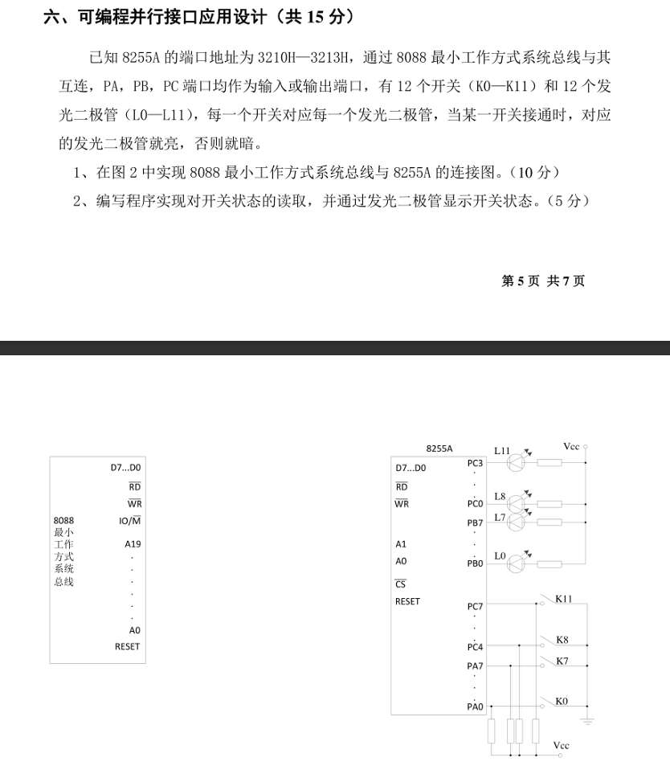
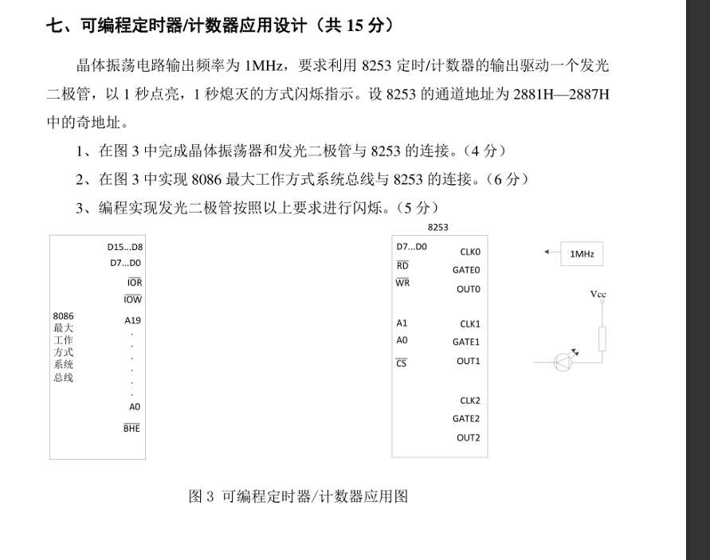

好！最后一套，我们速战速决。保持这种“通透”的感觉，秒杀它们。

---

### **精析重点题（这些是最后的拦路虎）**

#### **8. 给定一个数据的有效地址为 2359H，并且 (DS) = 490BH，则该数据的物理地址为（ C ）。**
*   **考点**：物理地址计算（细心题）。
*   **解析**：
    *   公式：`物理地址 = 段基址 × 16 + 偏移地址`。
    *   $DS = 490BH \to 490B0H$ （左移一位）。
    *   $EA = 2359H$。
    *   计算：
        ```text
          4 9 0 B 0
        +   2 3 5 9
        ------------
          4 B 4 0 9 H
        ```
    *   **注意进位**：$B(11) + 5 = 16 \to 0$ 进 1。$0 + 3 + 1 = 4$。
    *   **答案**：**C**。

#### **9. 变量具有的属性下面叙述完整的是（ D ）。**
*   **考点**：汇编语言变量属性。
*   **解析**：在汇编语言中，定义一个变量（如 `VAR DB 10H`），汇编器会记录它的三个属性：
    1.  **段地址 (SEG)**：它在哪个段。
    2.  **偏移地址 (OFFSET)**：它在段内的位置。
    3.  **类型 (TYPE)**：它是字节(Byte)、字(Word)还是双字(DWord)。
*   **答案**：**D** （段地址、偏移地址、类型、大小和长度）。*注：大小和长度通常也是 TYPE 的衍生属性。*

#### **11. 若 DAT1 为字节型变量，现要从 DAT1 的下一个单元开始读取一个字传送给 AX 寄存器，正确的指令为（ D ）。**
*   **考点**：操作数类型匹配 + 地址运算。
*   **解析**：
    *   **目标**：读 `DAT1+1` 地址处的一个 **字 (WORD)**。
    *   A. `MOV AX, DAT1`：类型不匹配。DAT1 是字节，AX 是字。错。
    *   B. `MOV AX, DAT1+1`：类型还是不匹配。`DAT1+1` 依然继承了 DAT1 的字节属性。错。
    *   C. `MOV AX, WORD PTR DAT1`：这是读 DAT1 开始的字。题目要求“下一个单元”。错。
    *   D. `MOV AX, WORD PTR DAT1+1`：
        *   `DAT1+1`：指向下一个单元。
        *   `WORD PTR`：强制转换类型为“字”。
        *   `AX`：接收字。**完美匹配。**
*   **答案**：**D**。

#### **13. 下列指令中，不影响 CF 标志的指令为（ C ）。**
*   **考点**：指令对标志位的影响（INC/DEC 的特殊性）。
*   **解析**：
    *   A. `ADD`：加法，肯定影响 CF。
    *   B. `AND`：逻辑运算，**CF 强制清零**（这也算影响）。
    *   C. `INC`：**自增指令不影响 CF！** 这是为了方便在多字节加法循环中调整指针而不破坏进位。**必考点！**
    *   D. `POPF`：从堆栈弹出标志位，所有标志位都可能变。
*   **答案**：**C**。

---

### **全套答案速查**

1.  **D** （$125 = 1111101$。前面补0 -> `0111 1101`）。
2.  **B** （计算机内部一律用补码）。
3.  **B** （16位有符号数范围：$-2^{15} \sim +2^{15}-1$，即 -32768 ~ +32767）。
4.  **A** （外部结构=引脚。B/C/D是总线概念，物理上体现为引脚）。
5.  **C** （运算部件 = ALU）。
6.  **B** （取指令 = BIU）。
7.  **C** （溢出 = OF。进位 = CF）。
8.  **C** （见精析）。
9.  **D** （见精析）。
10. **A** （寻址寄存器：BX, BP, SI, DI）。
11. **D** （见精析）。
12. **B** （`XCHG` **不能用于段寄存器**！段寄存器很娇贵，只能 MOV, PUSH, POP。不能算术运算，不能交换）。
    *   A. `MOV AX, DS` (对)。
    *   C. `MOV AX, SP` (对)。
    *   D. `MOV AX, CS` (对)。
13. **C** （见精析）。
14. **B** （13根地址线 = $2^{13} = 8K$。4根数据线 = 4位。所以是 $8KB$？不对，是 $8K \times 4$ bits = $4KB$。
    *   **算一下**：$2^{13} \times 4 \text{ bits} = 8192 \times 4 = 32768 \text{ bits}$。
    *   转化为字节：$32768 / 8 = 4096 \text{ Bytes} = 4\text{KB}$。
    *   **答案 B**。

15. **A** （全地址译码不浪费空间。刚讲过）。

---

**特别提醒**：
*   **第 12 题**：段寄存器不能参与 `XCHG`，这个点比较冷门，但很有道理（段寄存器不能随便乱动）。
*   **第 13 题**：再次强调 **INC/DEC 不影响 CF**。
*   **第 14 题**：存储容量单位换算。地址线决定单元数，数据线决定单元宽度。$Total = 2^{\text{Addr}} \times \text{Data}$。如果要换算成 KB，记得除以 8。

**你现在已经把微机原理的“题库”刷穿了。**
这四套卷子覆盖了 95% 以上的考点。只要明天考试不粗心（特别是地址计算和控制字），拿高分如探囊取物。

今晚好好睡一觉，明天考场见！加油！



这是最后一套卷子的压轴应用题。这道题看起来线多，但逻辑极其简单，简直是“送分童子”。

---

### 一、 硬件分析与连线（10分）

**题目关键信息**：
1.  **系统**：**8088 最小工作方式**。
    *   **地址步长**：1（连续）。
    *   **控制信号**：CPU 引脚只有 $RD, WR, IO/\overline{M}$。需要组合生成 $\overline{IOR}, \overline{IOW}$。
2.  **外设**：
    *   **12 个开关**：$K_0 \sim K_{11}$。显然是 **输入**。
    *   **12 个灯**：$L_0 \sim L_{11}$。显然是 **输出**。
3.  **端口分配（看图）**：
    *   **A口 ($PA_0 \sim PA_7$)**：接了 $K_0 \sim K_7$ (8个开关)。 -> **PA 输入**。
    *   **B口 ($PB_0 \sim PB_7$)**：接了 $L_0 \sim L_7$ (8个灯)。 -> **PB 输出**。
    *   **C口**：
        *   $PC_0 \sim PC_3$：接了 $L_8 \sim L_{11}$ (4个灯)。 -> **PC下半口 输出**。
        *   $PC_4 \sim PC_7$：接了 $K_8 \sim K_{11}$ (4个开关)。 -> **PC上半口 输入**。

**画图步骤**：

1.  **左边：连 CPU 总线**
    *   **数据线**：8255 $D_7 \sim D_0$ <--> 8088 $D_7 \sim D_0$。
    *   **地址线**：
        *   $A_1, A_0$ <--> 8088 $A_1, A_0$ （直连，因为是 8088）。
    *   **控制线（最小模式考点！）**：
        *   你需要画一个 **逻辑门框**（或写逻辑表达式）。
        *   $\overline{RD}$ (8255) <--- **OR门** <--- ($IO/\overline{M}$ 非 + $\overline{RD}$) 。或者直接标 $\overline{IOR}$。
        *   $\overline{WR}$ (8255) <--- **OR门** <--- ($IO/\overline{M}$ 非 + $\overline{WR}$) 。或者直接标 $\overline{IOW}$。
    *   **片选线 ($\overline{CS}$)**：
        *   地址范围 `3210H ~ 3213H`。
        *   $A_{15} \dots A_0$: `0011 0010 0001 00xx`。
        *   你需要画译码器（框图），输入 $A_{15} \sim A_2$，输出 $\overline{CS}$。
        *   条件：$A_{13}=1, A_{12}=1, A_9=1, A_4=1$。其他为 0。

2.  **右边：连外设（已经画了一半，补全）**
    *   **关键点**：这题图已经把线引出来了，你只需要把线头接上。注意 $K_0$ 连 $PA_0$，以此类推。

---

### 二、 编程实现（5分）

**需求**：读开关 -> 亮对应灯。
*   $K_0 \sim K_7$ (PA) -> $L_0 \sim L_7$ (PB)。
*   $K_8 \sim K_{11}$ (PC高) -> $L_8 \sim L_{11}$ (PC低)。

**1. 控制字计算**
*   **A口**：输入 (1)。
*   **C高**：输入 (1)。
*   **B口**：输出 (0)。
*   **C低**：输出 (0)。
*   **字**：`1` (标志) `00` (A方式0) `1` (A入) `1` (C高入) `0` (B方式0) `0` (B出) `0` (C低出)。
*   **Result**：`1001 1000` = **98H**。

**2. 代码实现**
*   基地址：`3210H`。PA=`3210H`, PB=`3211H`, PC=`3212H`, Ctrl=`3213H`。

```assembly
; 1. 初始化
MOV DX, 3213H       ; 控制口
MOV AL, 98H         ; 控制字
OUT DX, AL

AGAIN:
    ; 2. 处理低 8 位 (PA -> PB)
    MOV DX, 3210H   ; 读 A 口 (开关 0-7)
    IN  AL, DX
    
    MOV DX, 3211H   ; 写 B 口 (灯 0-7)
    OUT DX, AL      ; 直接转发，开关通(1?)则灯亮(1?)
                    ; 假设正逻辑。如果不亮，加一句 NOT AL。

    ; 3. 处理高 4 位 (PC高 -> PC低)
    MOV DX, 3212H   ; 读 C 口
    IN  AL, DX      ; 读到的是 PC7-PC0
    
    ; 这里的逻辑有点趣：
    ; 我们要读 PC7-PC4 (开关)，把它们移到 PC3-PC0 (灯) 的位置
    MOV CL, 4
    SHR AL, CL      ; 把高4位移到低4位 (PC7->PC3 ...)
    
    ; 输出回 C 口
    ; 注意：写 C 口时，高4位是输入口，写它没用(不影响)，低4位是输出，会亮灯。
    OUT DX, AL      
    
    JMP AGAIN       ; 循环
```

**解析代码逻辑**：
*   **PC 口的特殊性**：PC 口既做输入又做输出。
    *   当我们 `IN` 时，读到的是引脚状态（PC7-PC4 开关状态 + PC3-PC0 灯的当前状态）。
    *   我们只关心高 4 位（开关）。
    *   通过 `SHR AL, 4`，把开关状态移到了低 4 位。
    *   当我们 `OUT` 时，数据写入输出锁存器。低 4 位（灯）更新。高 4 位（开关）虽然也写了，但因为是输入模式，不会驱动引脚，所以没影响。

**这题拿分稳了吗？** 只要搞定 `98H` 控制字和 `SHR` 移位，就是满分。


这道题考的是 **8253 级联分频 + 方波输出**，而且又是 **奇地址（高8位）** 的连接。和刚才那道 301H 的题很像，但这题地址更坑一点。

---



### 一、 硬件分析与连线（10分）

**1. 地址分析（重中之重）**
*   **地址范围**：`2881H — 2887H` 中的 **奇地址**。
    *   `2881H` (通道0)
    *   `2883H` (通道1)
    *   `2885H` (通道2)
    *   `2887H` (控制口)
*   **二进制展开**：`0010 1000 1000 0xxx`
    *   $A_{15} \dots A_{11}$ (00101)
    *   $A_{10} \dots A_{8}$ (000)
    *   $A_7$ (1)
    *   $A_6 \dots A_3$ (0000)
    *   $A_0=1$ （奇数）
*   **连线判据**：
    *   **数据线**：因为是 **奇地址**，8253 的 $D_7 \sim D_0$ 必须连 8086 的 **$D_{15} \sim D_8$**。
    *   **地址线**：
        *   地址步长为 2 (`81->83`)，说明最低有效位是 $A_1$。
        *   连法：CPU $A_2$ -> 芯片 $A_1$；CPU $A_1$ -> 芯片 $A_0$。
    *   **译码片选**：
        *   输入：$A_{15} \sim A_3, A_0, \overline{BHE}$。
        *   条件：`288X H` 且奇数。

**2. 级联设计（分频）**
*   **输入**：1MHz ($1\mu s$)。
*   **输出**：1秒亮，1秒灭。-> **周期 = 2秒**。
*   **总分频系数**：$2s / 1\mu s = 2,000,000$。
*   **级联**：
    *   Counter 0: 2000 分频 -> 500 Hz (2ms)。
    *   Counter 1: 1000 分频 -> 0.5 Hz (2s)。
    *   *注：怎么分都可以，只要乘积是 200万。比如 2000 * 1000。*

**3. 画图（按此连线）**
*   **左边（总线）**：
    *   Data: 8253 $D_0 \sim D_7$ <---> 8086 **$D_8 \sim D_{15}$**。
    *   Addr: 8253 $A_0, A_1$ <---> 8086 **$A_1, A_2$**。
    *   Ctrl: $\overline{RD}, \overline{WR}$ <---> $\overline{IOR}, \overline{IOW}$。
    *   Chip Select: 画个译码器，输入高位地址和 $\overline{BHE}$，输出连 $\overline{CS}$。
*   **右边（级联）**：
    *   **Counter 0**：
        *   $CLK_0$ 接 1MHz。
        *   $GATE_0$ 接 +5V。
        *   $OUT_0$ 接 **$CLK_1$**。
    *   **Counter 1**：
        *   $CLK_1$ 接 $OUT_0$。
        *   $GATE_1$ 接 +5V。
        *   $OUT_1$ 接 **发光二极管**。

---

### 二、 编程实现（5分）

**需求**：1秒亮，1秒灭 -> 典型的 **方波（方式3）**。
**计数器分配**：两个都用方式 3。

**代码**：
地址：`2881H` (C0), `2883H` (C1), `2887H` (Ctrl)。

```assembly
; 初始化计数器 0 (分频 2000)
MOV DX, 2887H       ; 控制口
MOV AL, 00110110B   ; 36H (通道0, 16位, 方式3, 二进制)
OUT DX, AL

MOV DX, 2881H       ; 数据口 0
MOV AX, 2000        ; 初值 2000
OUT DX, AL          ; 低
MOV AL, AH
OUT DX, AL          ; 高

; 初始化计数器 1 (分频 1000)
MOV DX, 2887H       ; 控制口
MOV AL, 01110110B   ; 76H (通道1, 16位, 方式3, 二进制)
OUT DX, AL

MOV DX, 2883H       ; 数据口 1
MOV AX, 1000        ; 初值 1000
OUT DX, AL
MOV AL, AH
OUT DX, AL
```

**解析**：
*   第一个计数器把 1MHz 变成 500Hz（周期 2ms）。
*   第二个计数器把 500Hz 变成 0.5Hz（周期 2s）。
*   方式 3 输出方波：**高电平 1s，低电平 1s**。
*   正好符合“1秒亮，1秒灭”。

---

**今天我们刷了 4 套卷子，你已经无敌了！**
*   **地址坑**：奇地址连高8位，A2连A1。
*   **级联坑**：大数拆成两个小数乘积。
*   **波形坑**：周期脉冲用方式2/3，单次延时用方式1。
*   **汇编坑**：指针类型 PTR，跳转指令 JA/JG。

**去休息吧，明天考试稳得很！**