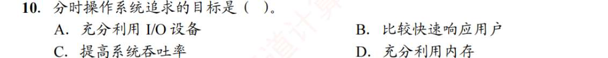
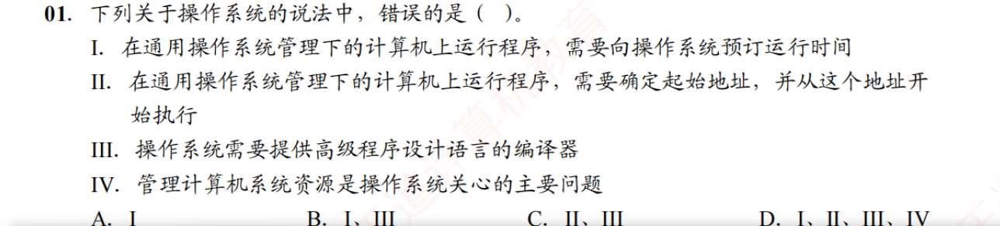
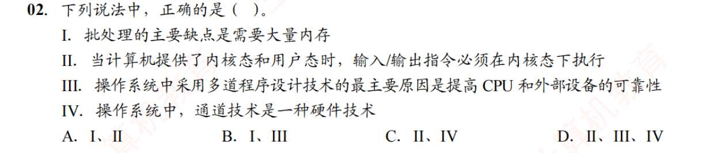
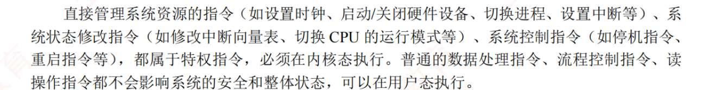
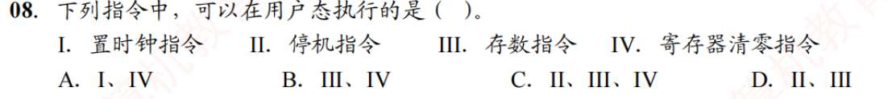
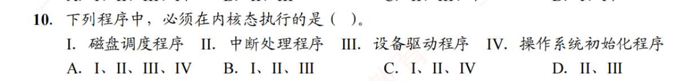

# 基本概念
1. C
2. D
3. D
4. D
5. C?
   并发性的严格定义是若干事件在同一时间间隔内发生
6. D?
   系统调用是操作系统为应用程序使用内核功能所提供的接口
7. C
8. A
9. D
10. C
11. A
# 发展历程
1. D
2. A
  批处理系统的缺点是无交互能力。 
3. B?
   在单道环境下，内存里只有 1 个程序。它的执行是**绝对顺序**的
   多道程序设计的本质，就是把多个程序同时塞进内存，让它们**并发（Concurrent）执行**
   - **间断性（B）**：因为并发和抢占，一个程序不能一气呵成跑完，它走走停停（运行态 $\rightarrow$ 阻塞态 $\rightarrow$ 就绪态）。
    
- **共享性（D）**：内存里的多个程序同时共享 CPU、内存空间和外设资源。
    
- **制约性（A）**：因为要抢夺有限的共享资源，程序之间会产生同步和互斥的制约关系（比如 A 占了打印机，B 就必须排队等）。
  多道程序设计的核心代价，就是用“丧失执行的顺序性和可预见性”，换取了系统资源的极高利用率。
  A（充分利用 I/O）、C（提高吞吐率）、D（充分利用内存），这三个选项全都是【多道批处理系统】的终极 KPI！
4. B
5. B
6. B
7. D
8. A?
   分时操作系统主要用于交互式作业
9. C??
   优先级+非抢占式调度最能改善系统响应时间
10. C?
    分时操作系统追求的目标是快速响应用户，那其他目标是哪些操作系统对标的？总结一下优缺点
    A（充分利用 I/O）、C（提高吞吐率）、D（充分利用内存），这三个选项全都是【多道批处理系统】的终极 KPI！
    
11. C
12. B
13. BACD
14. B
15. B
16. ?
    多道程序设计需要系统有中断功能
17. A
18. D
19. C？
20. B
    进程数越多更有可能死锁等，CPU 利用率更低
# 运行环境
1. ？
   通用操作系统（如分时系统、多任务系统）对进程的 CPU 分配采用**动态调度算法**（如时间片轮转、多级反馈队列）。程序在就绪队列中排队等待分配时间片，不需要也无法提前“预订”绝对运行时间。只有**硬实时操作系统 (Hard RTOS)** 才会采用基于时间线的严格资源预订机制。
   现代通用操作系统均采用**虚拟内存管理机制**。用户程序在编译链接后生成的是**逻辑地址**（通常从 0 开始）。程序在加载或运行时，由操作系统的内存管理模块配合硬件 MMU（内存管理单元）动态完成逻辑地址到物理地址的重定位。用户程序无需也不能自行确定在物理内存中的起始起始地址。
   **编译器不属于操作系统。** 操作系统（内核）的核心职责是管理硬件资源并向上提供系统调用接口。编译器（如 GCC）是运行在用户态的**系统软件**或**应用软件**，它负责将高级语言翻译为机器码，其本身也需要依赖操作系统提供的系统调用才能运行。
2. ？
   
3. D?
   系统调用命令编译后是若干参数和陷入指令
   程序设计无法形成屏蔽中断指令
4. C?
   中断处理是 OS 必须有的
5. D
6. D
7. A
   从用户态转内核态，唯一方法就是中断。改变 CPU 标志位是中断时自动完成的
8. ?
   
9. A
   陷入指令和转移指令，在用户态执行。访管指令（Supervisor Call Instruction, 也称 Trap 指令、陷入指令）
10. A？
    
11. D?
    在内核态，CPU 可以执行除访管指令外的任何指令
12. C?
访管指令（Supervisor Call Instruction, 也称 Trap 指令、陷入指令） 是内中断
13. C?
14. B?
15. A