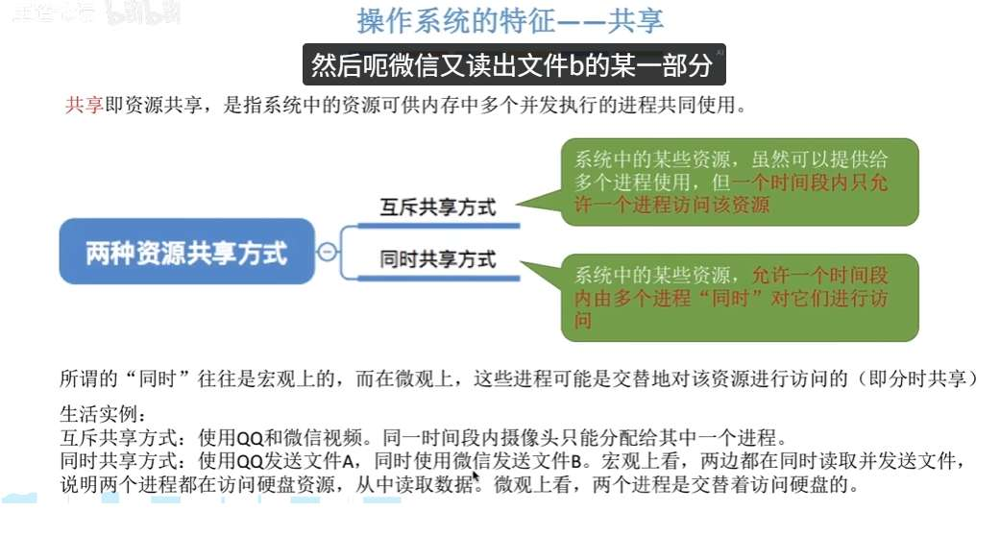
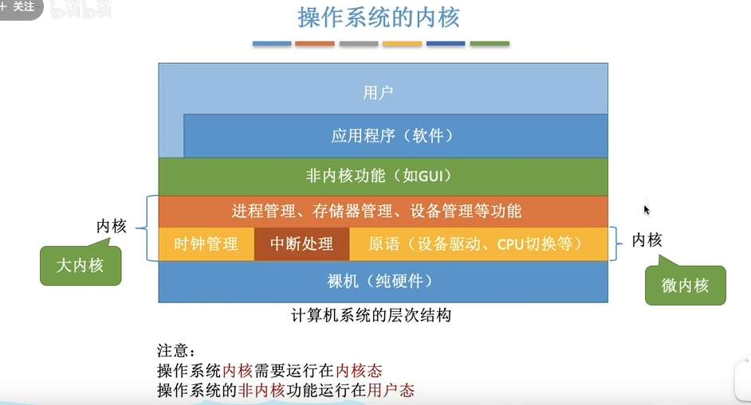

OS 的作用：
- 文件管理
- 存储管理
- 处理机管理
- 设备管理

接口：
- 直接给用户使用
	- 联机
	- 脱机（批指令）
- 给程序员的
	- 程序接口，即系统调用

同时共享也有可能是并发的，（微信 qq 发文件）
也有可能是并行的（扬声器音乐+游戏）

并发和共享互为存在条件
没有并发性，就谈不上虚拟性
由于有并发性，带来了异步性

- **提供给人类用户的接口**：叫“命令接口”（你敲键盘用的黑框框，或者鼠标点的图形界面）。
- **提供给应用程序的接口**：叫“程序接口”，它的真身就是**系统调用 (System Call)**！

库函数运行在用户态
**分两种情况！**
1. **不涉及内核**：比如 `abs()` 求绝对值，`strcpy()` 字符串拼接，纯在用户态自己就算完了。
2. **涉及内核**：比如 `printf()`，它自己没本事控制屏幕，**它内部封装了**系统调用 `write()` 去求内核帮忙。

操作系统历史
1. 手工操作
2. 批处理
	- 单道
	- 多道。吞吐量高，但没有交互！
3. 分时（多任务操作系统）
4. 实时
	- 硬实时
	- 软实时

多道程序设计是一种**设计思想**或**底层技术**。把多个程序同时塞进内存里。只要当前程序因为等 I/O 阻塞了，CPU 就立刻无缝切换给下一个程序。

# 操作系统体系结构

分层结构：
- **可以逐层往上，便于调试和验证**；层间接口清晰，便于扩充和维护
- 但不可跨层调用，**效率低，调用执行时间长**

模块化：
- 模块间逻辑清晰便于维护，可多模块同时开发；**支持加载新模块**；任何模块之间**可互相调用**，
- 但模块之间相互依赖，**难以调试**

大内核：
- 性能高，内核内部可以互相调用
- 但内核庞大复杂，难以维护；