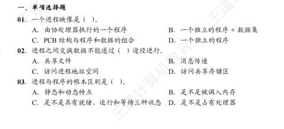
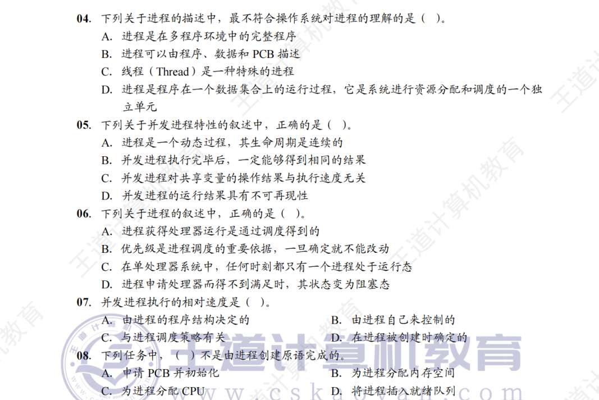
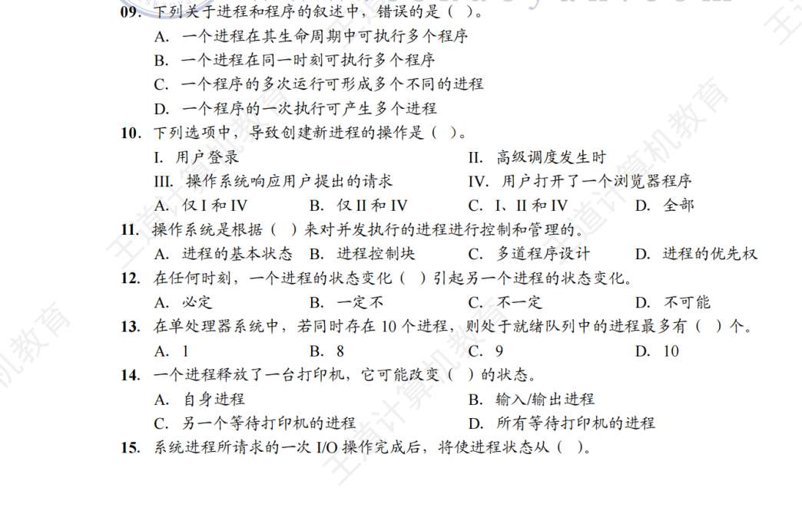
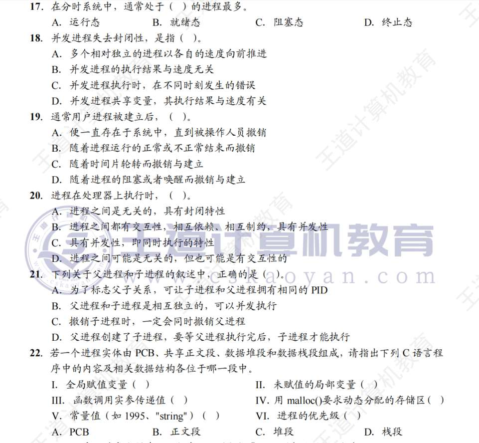
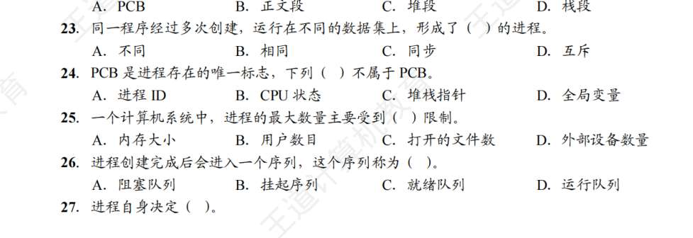
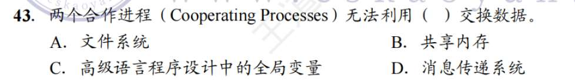
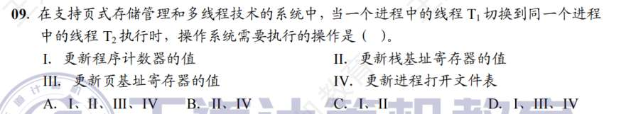
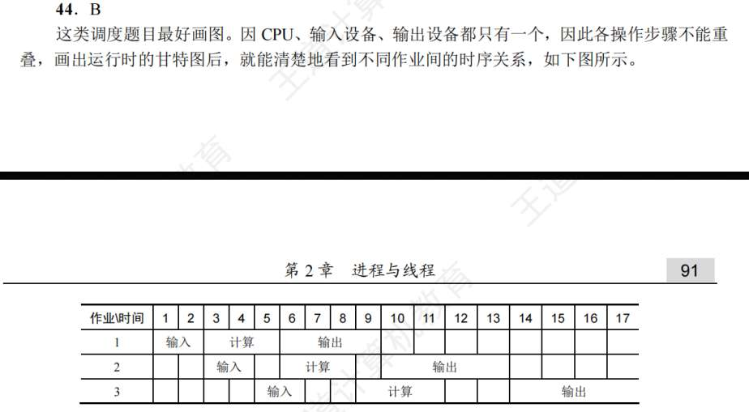

# 进程线程概念

1. C
2. C
3.  A ==C也对啊==   “是否有就绪、运行、等待三状态”难道不也是进程与程序的区别吗？**确实是... 但还是动态/静态最权威**
4. C 
	A  不能把进程说成程序然后C... 只有内核级线程才能说是一种特殊的进程吧？ **感觉也可以**
5. C   
	1.D  并发比较复杂
6. C
	**CPU完全可能空闲，即所有进程都堵塞。** 
7. C
	. **并发应与系统调度绑定**
8. C
9. B?  
	**一个进程可以顺序地执行一个或多个程序  不能同时执行多个程序；一个程序可以对应多个进程** 
10. D ?
	**用户登录 有登录进程** 
11. C?
	B  并发的语境中 系统也是通过PCB对进程控制  
12. C
13. A
	C 题都读错了 问的是就绪  不是运行
14. D ? 
	 ABC呢 什么是输入输出进程？ D的“所有”应该是错了 
15. D
16. C
17. ?分时系统？
	B 
18. ？又并发
	D **并发程序的程序封闭性**
19. B ？ A呢
	进程不会一直存在在系统，会自己消亡。我好奇这个自己意识到自己要消亡到底是怎么做到的？细节层面    **进程不是有意识的生物 它就是CPU执行的一串指令，那么最后一行就是kill 所以运行完就没了。这是正常消亡， 还有异常消亡。** 
20. D 
21.  A? 父子关系我还不熟
	答案是B  好像**没啥 父子进程就是俩个独立的进程而已**
22. ?这真不会
	1.BDDCBA   **全局赋值变量，代码，在正文段。 动态分配的存储区在数据堆段。临时使用的变量在数据栈段。**
23. A **每次创建 PID都不一样吧  PCB也不一样**
24.  B
	1.D  PCB存的是 PID 控制信息 资源信息 CPU现场信息  具体都是什么？举例，不然记不住
25. A **进程最大数量主要受内存大小限制**
26. C  阻塞和挂起的区别？
	**阻塞是还在内存里 等待磁盘读写  挂起是系统把进程踢出内存 放到硬盘的SWAP区**
27. A
28. D
29. C
30. C?  **消息最快的是共享内存**
31. B 间接与直接都有哪些直接通信好像就一个共享内存其余的都是间接。**在408体系中，“直接/间接”通常特指消息传递**  **共享内存属于高级通信方式的一种，通常不放在“直接vs间接消息传递”的维度下讨论。它就是“共享内存”。**
32. D 每种错了 
33. D   不会尤其 AB 啥知识点啊
	答案B 信号的处理时机只在进程从内核态转为用户态。什么意思，能不能举例：**就是进程去内核态时，务必有比较复杂的逻辑。其中带来的信息在切换用户态时应用。**
34. D
35. D 系统调用函数？在这里的知识点？
	A.  **线程 TCB 存的 CPU 现场，有程序计数器 PC、状态寄存器（PSW）、栈指针（SP），故而可以独立执行程序。**
36. B， A 的话，**线程一定在进程的资源里吧**
37. D
38. ?C 进程通信关线程何事
	D **线程不能增强进程安全性。因为没关系啊，反而线程出错，还会影响整个进程的运行（因为共享地址）**
39. B
40. B 跟多线程好像无关啊
	**键盘输入不需要多线程** 
41. D
42. B
43. ？D
	C，  全局变量怎么能随便动？
44. D 
45. D？
	B. 看操作与其他进程是否有关
46. C
47. A
48.  C，是不是太快了
	D. 低级错误了属于是
49. A
50. B，跨进程就要切进程，切进程就要动内核
51. 感觉都对啊，应选的话就 B
	A. **内核级线程的话，线程切换仍然有大开销**
52. A  “不同进程可以根据自身需求对自己的线程选择不同调度算法”？ 什么意思，对自己的线程调度？
53. B？
	D. **内核级线程才行**
54. D **不能和内核沾边**
55. B 
56. C
57. B? 用户级线程阻塞，到底怎么理解 **仅适用于用户级线程**
58. C?
59. C
60.  D 这种题难道不是凭感觉吗 
	C. **设备分配是在系统中设置相应数据结构**
61. D
62. A，D **同一进程下的各个线程，地址空间都是这个进程的地址**
63. A
64. C？**管道大小通常是内存的一页，故不受磁盘容量大小的限制**
65. D
66. C?
67. C
68. B? 是进程的程序创建的 TCB？
69. B
70. B
71. D
72. ?D?
	系统调用是用户程序发出的请求，自然也要回归到用户态
73. C
74. ?D 就是说，分步骤？
	A.**不是所有操作系统都设计地终结子进程** 
75. B，线程 T 的栈他俩要了有啥用呢 

 线程机制（ULT vs KLT）
**涉及题号**：4, 35, 36, 38, 51, 52, 53, 54, 57, 62, 75

进程的“物理”组成（地址空间与内存布局）
**涉及题号**：22, 43, 62, 75

边角知识点与系统调用细节
**涉及题号**：6, 33, 60, 64
# 调度
1. D
2. B 调度概念没搞清
	1. 创建态--就绪态，是高级调度。是从外存往内存
	2. 中级调度也是外存往内存，但是！中级调度
3. B
4. A
5. C
6. ?没错的啊 （临界区）
	 答案D。处于临界区的进程在退出临界区前无法被调度，临界区是那种互斥的资源吧？它可以直接被中止吧？ **普通临界区（如打印机、共享变量）：可以调度！ 比如正在打印，可以切换另一个！但另一个进程用不了打印机而已！内核临界区（如操作OS的就绪队列）：不能调度**
7. C？（进程上下文、中断向量）
	1 中断向量只是内存中的一堆向量而已，它不属于进程上下文. 
	进程上下文有，CPU 的一切，即寄存器（这就叫进程现场信息吧？）, 进程控制信息（这是靠什么存的？）、用户堆栈？
8. D?（进程上下文）
	进程切换时，不涉及主存和磁盘的数据交换
9.  这还和存储的知识有关啊 （线程上下文）
	感觉并没有考存储知识，而是考了程序计数器、栈基址、页基址寄存器对于线程的意义，进程打开文件表
	**独享：PC（跑到哪行代码）、寄存器（算到几）、栈（函数调用）。这些都在 TCB 里**
	**共享：地址空间！ 页基址寄存器 (PTBR)：它是指向页表的。因为同一个进程里的所有线程共用同一个页表（共用地址空间），所以PTBR是属于进程（PCB）的，不是线程独享的。切换线程不用切PTBR，这也是线程切换快的原因。**
	
10. A? IO 是短作业？（考各个调度方法适用的进程）
	1CPU 繁忙型即计算型即运行时间长。优先级调度、时间片轮转与进程时间长短无关，FCFS 利用长作业不利用短作业... 我想，可以设想长作业在后和短作业在后俩种情形去理解。SJF 适合短作业即IO 型
11. D
12. D?（实时级系统）
	 实时系统一定采用抢占式优先级
13. D
14. D?（调度时间）
	1 自己的理解正确，明确一下：进程主动/被动运行完毕、出错. 
15. 2+4+6+8=20  B
16. BEAD
	1 人机交互，属于实时系统 采用抢占式优先级 
17. D
18. T1+(T1+T2)+(T1+T2+T3) B
19. 平均周转最小就应该是最短 1 作业吧 D
20. C
21. C
22. D
23. C?（可抢占）
	**时间片轮转就属于绝对可抢占的，其他的所有方法都是可以设为抢占式可以非抢占式.** 
24.  ?D??（作业与进程的区别）
	1 作业是面对用户视角，进程是面对操作系统视角，俩者，执行程序段相同？都是分时？（再解释下分时的意思）？都是并发？或者说在物理角度，他们都一样？# **作业属于批处理，躺在磁盘，被“高级调度”选中放入内存后，它就变成了“进程“；进程属于分时，跑在**内存/CPU**里，强调“交互”。**
25. B
26. C 哪没算对 ^^甘特图画得不熟，可以重做一次
27. D
28. D 
29. D
30. A（分时操作系统的定义）
	1. 分时就是说用户能同时运行多个进程嘛，所以就是时间片轮转 
31. B
32. C?（各调度算法的指标）
	1 所有进程同时到达，使进程平均周转时间最短的是短进程优先，推理就是，最小周转时间是为了最小等待时间。那我好奇其他的调度算法、其他的指标之间的联系
33. D?（系统开销与调度算法）
	 系统开销应当指进程切换的开销，所有多级反馈算法开销还蛮大
34. C
35. A（饥饿现象）
	 短作业优先、优先级调度会导致饥饿现象，其他都不会？
36. D?（多处理机调度）
	. 多处理机调度，就是多核 CPU 吧，要考虑负载均衡和处理器亲和性。这属于要记住的考点
37. D
38. A
39. B
40. （多道批处理系统）我说实话，这个啥意思？我看答案就是 CPU 先来先服务啊
41. C
42. B 优先 IO，我的理解是 IO 比较重要/IO 的话自己会堵塞所以在 CPU 上的时间少
43. A
44. ?  还是甘特图不熟
45. D
46. B
47. B(粗心，题目条件没看完) 我忘加了题目给的系统时间开销
48. D（好像是算错）
49. D
50. 阻塞不用成一个队列吧？只用使用就绪 B
	 是的，但我忘了，分时系统实现时间片轮转调度时也要用到进程控制块，是因为要修改状态。
51. D 中断处理结束？
52. C
53. B
54. C
55. D（进程上下文）进程切换时，就是程序计数器+栈基址寄存器+页基地址寄存器+栈+PC，好像就只比线程多了个页基地址寄存器

# 同步与互斥
1. 