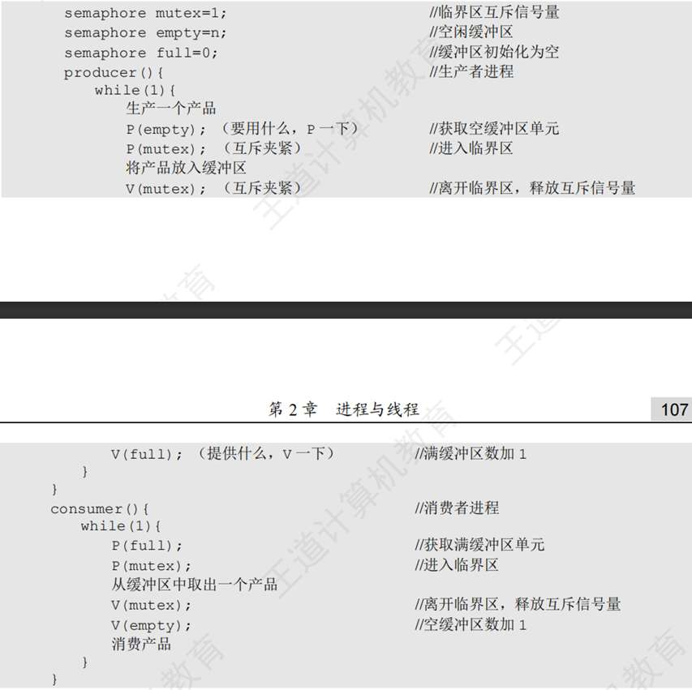
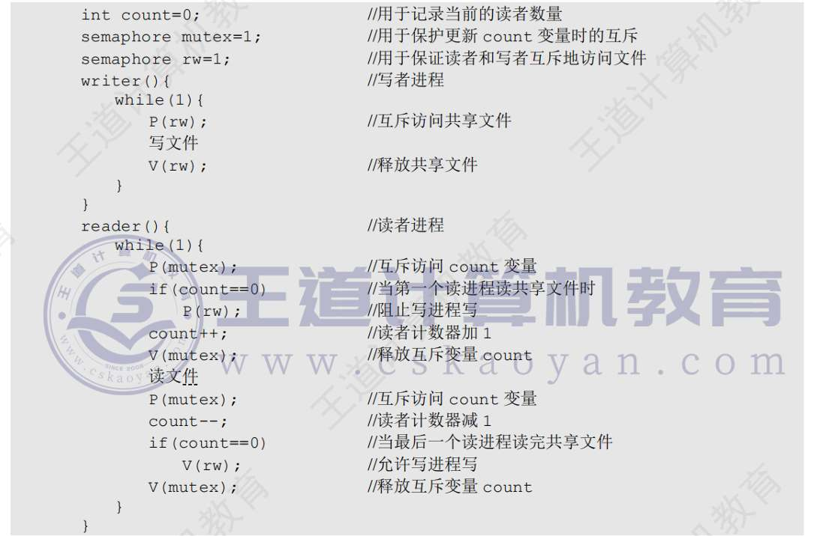
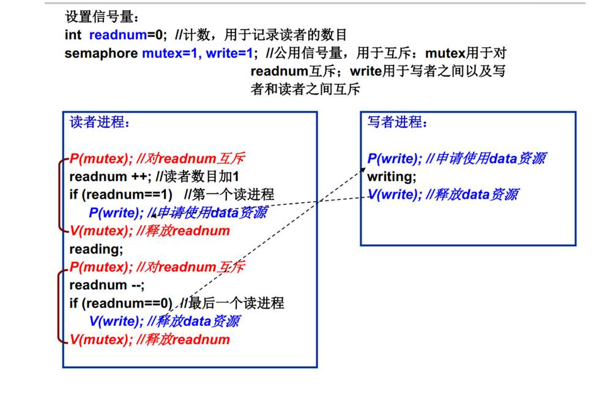
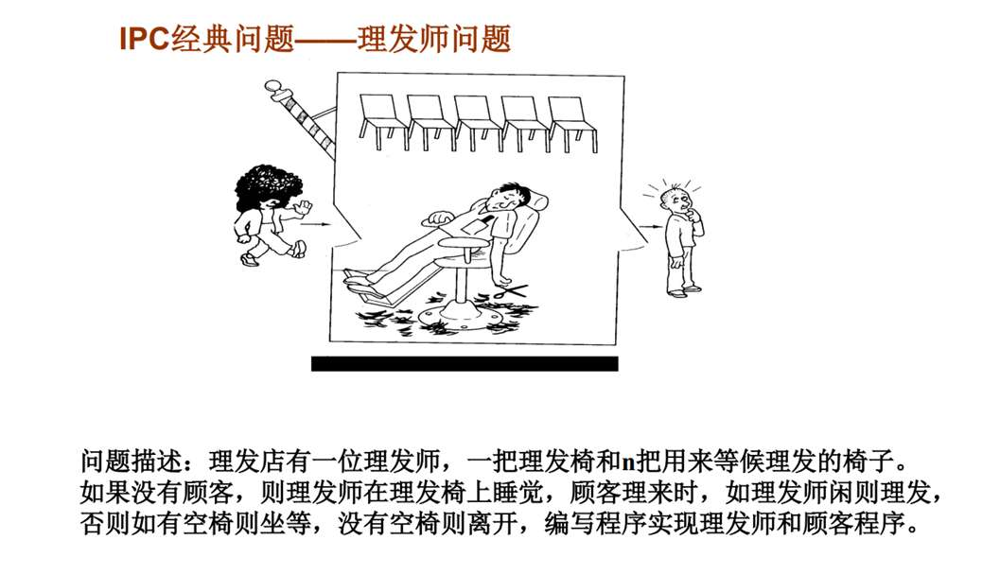
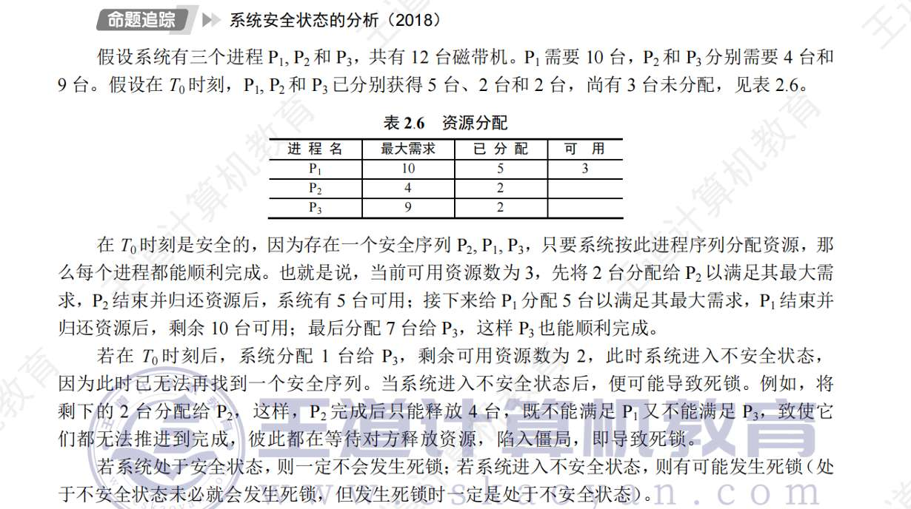

# 进程
## 概念
为程序，配置数据结构为”进程控制块“---PCB ， 用来描述进程的基本情况和状态从而能管理
而进程实体，是由
- 程序段
- 数据段
- PCB  描述、控制管理、资源分配
- 工作区 一个动态区域 保存局部变量、传递参数等
组成
### 特征
- 动态性 有消亡嘛
- 并发性 既存在多进程
- 独立性  PCB的建立 就是为了资源的边界感
- 异步性

系统对其的控制，是由”原语“实现的， 原子操作，不能被中断
## 状态及转换
创建态（申请PCB、分配资源中...） --- 就绪态--- 被cpu”看上“即可运行态 
需要某资源，无奈等待 ，为阻塞态。
终止态，收回资源，释放中

很好想象
## 线程
线程是进程”旗下“的具体”员工“ 各线程共享进程的**全局变量、地址空间、子进程、信号量**
而他们独有**程序计数器、寄存器、栈、状态字、TC**B来工作

## 调度算法
FIFO 或者叫FCFS  太基础了
RR 时间片轮转法 纯粹看时间 轮着来 （算不算有公平性？算吧？）牺牲了一点点的**吞吐量**（因为增加了上下文切换的开销）  也算非抢占调度方式
下面是抢占式调度方式？
基于优先数  种姓制度了属于是， 挺好， 有些进程就是要优先服务
基于优先数还可以再详细，再好一点：
多级反馈队列调度算法
	Q1Q2Q3代表优先级，Q1优先级最高。
	无论什么就绪态，都暂时放到Q1.
	我们要对他进行“测试”
	我们会给Q1的进程很短的时间片，如果很短的时间片内，真的完成了，就说明，他值得Q1，因为不占用时间，我们很快就能给用户反馈。
	如果完成不了，甚至还有很多，我们把它降级到Q2Q3的低优先级队列。因为完成不了说明耗费时间，是计算密集型，我们给他们很长的时间片！
	然后宏观来看，就快速把Q1处理完，然后处理Q2Q3.
	Q2Q3咋抉择，一样的，如果进程在Q2的时间片用完了还没结束进程，说明Q2还不够，退到Q3，Q3时间片更长
	同时再加个老化算法， 如果低优先级队列等待时间超过一个阈值，我们强制把他提升到更高一级。
	
再补充几个
SJF 短作业优先调度 其实就是把短进程视作”优先“  显然会有长进程饥饿现象
HRRN高响应比优先调度 综合FCFS和短作业  等待时间+要求服务时间  /  要求服务时间

# 进程间作用
感觉同步和互斥的定义中， 区别就是，同步指A、B协同完成一个任务，比如A向缓冲区提供数据，B从缓冲区提取数据，这是，在我们人类理解中，自然而然造成的，“直接”制约关系，都明白，互相有次序的等待，才能完成自己的任务。当然，在计算机的世界里，进程是**异步**的，它们像两条平行宇宙里的疯狗，谁跑得快谁跑得慢完全不可控。如果没有机制控制（人为干预），B完全可能在A还没放数据时就去读，读出一堆乱码；或者A放了数据，B还没拿，A又放了一个，把前一个覆盖了
互斥，是A和B都想访问一个资源，额，所以称“间接”制约关系，是我没抢到，所以只能不乐意地让给你

同步机制：
- 空闲让进  有资源不能空那
- 忙则等待  有人用了自己就别用
- 有限等待 承接上一点，我可以等，但不能让我一直等...
- 让权等待  如果我不能用的话 直接把我这个进程释放了 别人我白等 等了又用不了

- 双标志先检查法： 先看看对方的flag 如果对方想 那就等待。对方不想，就设立自己标志，然后进去。有可能时间撞上了，俩人同时看对方，结果就是，以为对方不来，就都进来了。
- 双标志后检查法：那先设立标志再检查呢。 一样，如果动作撞上了， 双方都检查对面“想进” 那就一直饥饿 循环等待
最终 我们使用peterson算法  除了flag 多一个turn  turn能赋值 赋值到对面（优先让别人进） 
turn是共享变量，无论如何最后只能重写到一个值。turn的最终值决定了哪个进程被允许先进入临界区。

更优化的，是硬件层面，实现“原子操作”
我们引入“互斥锁”这个共享变量，一个进程想进临界区时调用acquire获得锁（原子操作，可以理解为，不可能有大于两个进程同时acquire，一定只有一个acquire成功） 若可用 就进去 上“锁”  当其他的acquire时， 因为锁不可用，所以会被阻塞。直到使用的进程释放锁。
不过，这属于“自旋锁” 会有进程一直“轮询”的情况存在 
准确的说法是**“忙等”（Busy Waiting）**，即**占用CPU时间片空转**。与之相对的是“阻塞”（Block），后者会交出CPU。

## 信号量
我感觉，这是在假设， 我们的“临界区”S是有多个资源的区域？
- **P操作 (Wait)**：含义是**“申请资源”**或者**“检测信号”**。如果资源不够（S<=0），我就睡（阻塞）。
- **V操作 (Signal)**：含义是**“释放资源”**或者**“发送信号”**。做完事了，告诉别人“我搞定了”，或者“资源还回去
啊 巧的是 如果我们只假设S =1   也就是只有一个资源  我们能很好的get到同步与互斥如何实现

互斥的话
那就
P 操作  V  就ok了呀 

哦？原来同步也要我们操作啊，如果说，进程是异步并发的话。
对于他们 
- **同步**：S=0是对的。想象成A给B发短信。B想看短信（P），一开始没短信（S=0），B阻塞。A发了短信（V），S变1，B就能看了。

### 生产者消费者
mutex 是用来维持“互斥”关系
empty 是空闲缓冲区 初始化为n 是生产者生成的材料  P(empty) V(full)
生成后，放入full(初始化为0) 消费者是消费full的   P(full) V(empty)

值得注意的就是
这俩，都是先检查 后上锁
比如生产者是先P（empty)  再P(mutex)  
不然上锁了 一进来 发现 empty<=0 咋办  
阻塞  看啥时候能有消费者V(empty)  
可是消费者要有锁啊  不可能进行这个操作。
所以这发生了死锁 

### 读者写者
关键在于一个count 
先说第一种 
“读者优先”
我们来一个rw  用来当写者与其他写者/读者互斥的锁
来一个mutex   修改count也是要互斥的。
对于写者 很简单 直接P(rw) 写 V(rw) 即可
对于读者，
如果是第一个读者，要承担责任，进行P（rw) 不让写者进来。然后进行count++ 如果不是第一个读者，没关系，已经有一位读者帮忙把写者排斥开了。 只用count++就好 。
读完后  先进行count-- 如果发现，自己是最后一个读者  那么也要承担责任 V(rw) 通知写者可以来了。 如果不是最后一个读者 count--就好 走人。

练一下

## 小结

# 死锁
四项必要条件：
- 资源互斥使用
- 非剥夺控制
- 请求并保持
- 循环等待

我们要预防死锁 显然可以破坏这四个条件之一
资源互斥是底层的，难以破坏
破坏不可剥夺控制 也难 因为如果硬抢，后面恢复现场需要耗费很多时间和空间
破坏请求并保持  就是最开始就把可用的资源全部分配好 不让进程再有申请资源的可能  这一回浪费资源，并发性下降
破坏循环等待，一般是给资源编号。但编号逻辑困难，且编号很难和进程申请资源顺序一致

安全状态 
 !
银行家算法 看起来简单 但感觉需要找个题练一下

|               |                       |                      |                      |
| ------------- | --------------------- | -------------------- | -------------------- |
| 特性            | **死锁预防 (Prevention)** | **死锁避免 (Avoidance)** | **死锁检测 (Detection)** |
| **策略类型**      | **静态**（事前定规矩）         | **动态**（事中算卦）         | **动态**（事后收尸）         |
| **代表算法**      | 有序资源分配法               | **银行家算法**            | 资源分配图化简              |
| **资源利用率**     | **低**（管太宽）            | **中**（需要算）           | **高**（随便给）           |
| **是否需要预知MAX** | 不需要                   | **需要**（必考点）          | 不需要                  |
| **是否限制申请顺序**  | **限制**（必考点）           | 不限制                  | 不限制                  |
| **发生死锁的可能性**  | **0**（绝对不会）           | **0**（绝对不会）          | **有**（发生了再解）         |
