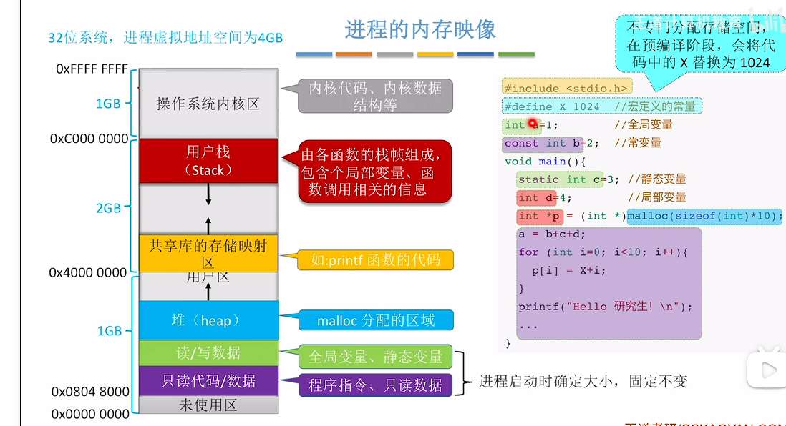
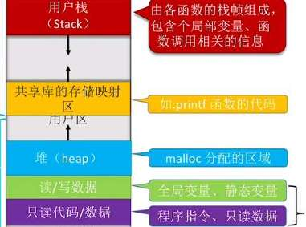

对于进程的程序段，
我想确认下，程序员写的程序，额这里说编译型语言，是静态的，
当运行时，就诞生了进程？此时需要把程序装入内存是吗？ 因为程序变成了一堆指令？
### 1. 静态的程序：硬盘里的“数字木乃伊”

当你用 C、C++ 或 Go 这种编译型语言写完程序并编译后，产生的是一个**可执行文件**（比如 Windows 下的 `.exe` 或 Linux 下的 `ELF` 文件）。

- **它是静态的**：它只是硬盘上的一堆二进制字节。
    
- **它的组成**：它包含了**机器指令**（CPU 能读懂的操作码）和**初始数据**（比如你定义的常量字符串）。
    
- 此时它没有任何生命力，不占用 CPU，也不占用内存（除了占点硬盘空间）。
    

---

### 2. 进程的诞生：从硬盘到内存的“惊险跳跃”

当你双击运行程序时，操作系统（OS）就开始干活了。这个过程被称为**装载（Loading）**。

- **为什么要入内存？** 因为 CPU 的速度极快，而硬盘的速度太慢。如果 CPU 直接去硬盘读指令，就像让博尔特等蜗牛传球一样。所以，必须把程序搬到**内存（RAM）**里。
    
- **谁来搬？** 操作系统中有一个组件叫**装载器（Loader）**。它会：
    
    1. 在内存中划出一块地盘（地址空间）。
        
    2. 把可执行文件里的**指令**和**数据**复制进去。
        
    3. 把 CPU 的控制权交给这段代码的入口（通常是 `main` 函数）。
        

**此时，进程（Process）就诞生了。** 它是程序的一个“运行实例”。

| **区域**              | **存放内容**                           | **属性**           |
| ------------------- | ---------------------------------- | ---------------- |
| **代码段 (Text/Code)** | 编译后的**机器指令**。                      | 只读，防止程序运行中途改写自己。 |
| **数据段 (Data/BSS)**  | 全局变量、静态变量。                         | 可读写。             |
| **堆 (Heap)**        | 你在代码里动态申请的空间（比如 `malloc` 或 `new`）。 | 自由生长。            |
| **栈 (Stack)**       | 函数调用、局部变量。                         | 自动管理，随着函数结束而销毁。  |

所以，三种装入方式，都描述的是一个模块（一堆指令（代码段）和数据）
其相对地址和真实物理地址的转换。 

三种链接方式，是说各个模块怎么凑到一起 **建立逻辑地址空间**。

一在现代操作系统（如 Linux）中，内存并不是简单分为三块，而是从宏观上分为两大部分。

- **内核空间 (Kernel Space)**：
    
    - **地位**：最高地址的那一块区域（比如 32 位系统最顶部的 1G）。
        
    - **内容**：存放操作系统的核心代码、内核数据结构、驱动程序等。
        
    - **权限**：普通进程绝对不能直接访问，否则系统会崩溃。
        
- **用户空间 (User Space)**：
    
    - **地位**：除了内核空间剩下的所有区域。
        
    - **重点**：你所说的**“进程区”其实就包含在用户空间里**。每一个运行的程序（进程）都以为自己拥有整个用户空间。

# 连续分配管理
单一连续分配：古老的传说，只支持一个程序，进程的数据和代码放一起，剩余的全部叫用户区。

固定分区分配：
此时进程长这样

固定分区分配的话，就把内存固定分区，好比固定了格子的数量和大小。
能进就进，进不了算了。有时进去大概率也有盈余，这个叫内部碎片。

动态分区分配，就是没有格子。空空的一块地，随你进程放。
一般使用表或链拉记录内存中的进程，好进行控制。
此时随着进程销毁与装入，会有外部碎片。不过可以用“紧凑”技术解决，
这就是为什么要使用可重定位装入。  

对于动态分区分配，我们也可以更精细点，分不同算法来分配。
- 首次适应算法
- 最佳适应算法。空闲分区需按容量递增次序链接，然后找到第一个能满足的空闲分区。但这样会产生非常多小的外部碎片、算法开销大，因为回收后要重排序
- 最坏适应算法。空闲分区需按容量递减次序链接，然后找到第一个能满足的空闲分区。但不利于大进程、算法开销大
- 邻近适应算法。算法开销小，但高地址的大分区容易被用完，即不利于大进程

# 分页存储
页表，
每一行是页表项+页面（也可以叫页）
所以页表项可以理解为索引，记录的是块号。由于连续存放，故而页号是隐含的 

有很多个页表项，其实页表项的大小就是一个页面（也可以叫页）的大小
，也是一个内存块的大小。

页号是隐含的。

i 号页表项存放地址=页表始址+i* 页表项大小

## 分段存储
