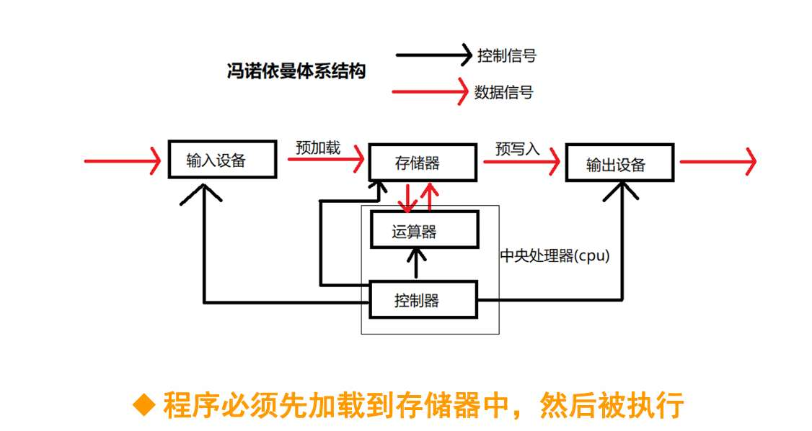
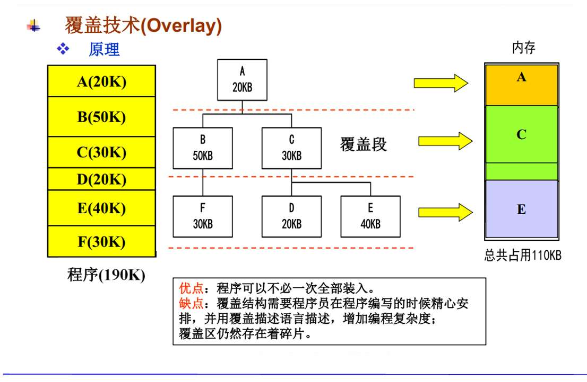
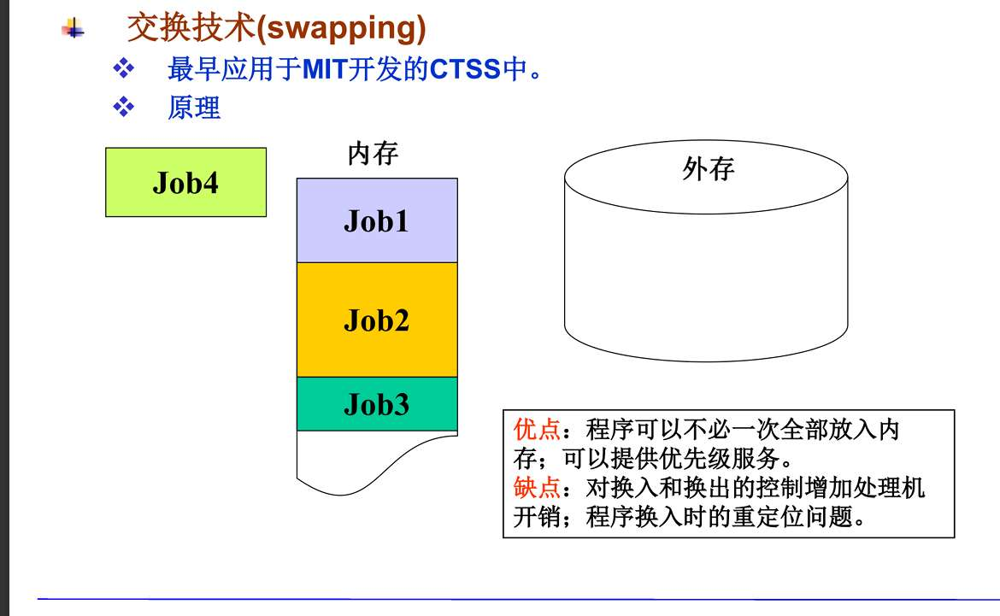
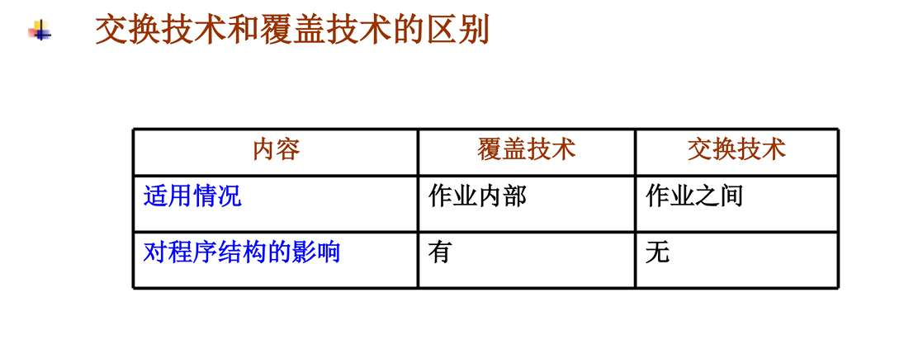
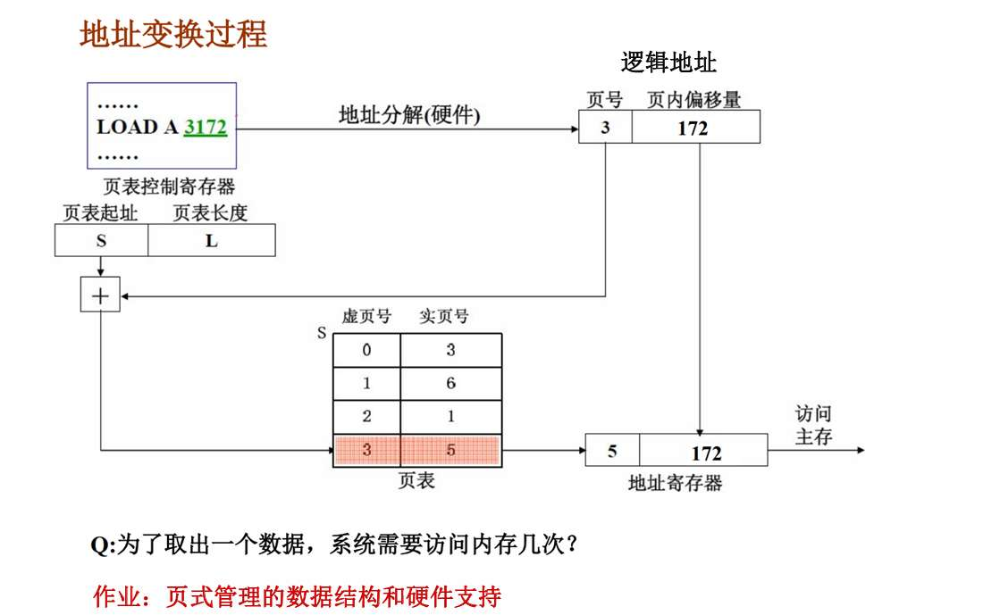
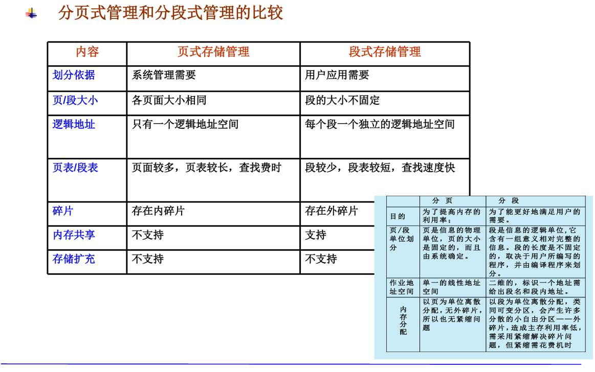
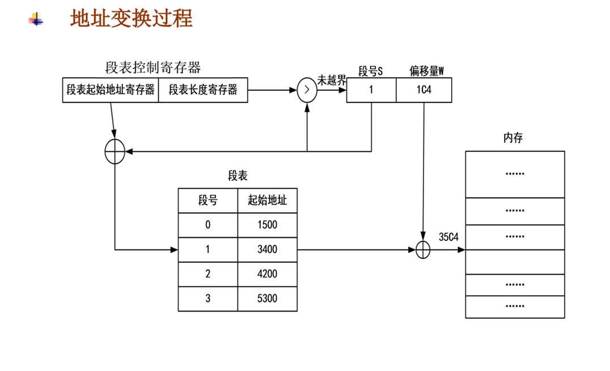

# 知识点
存储管理 分区
覆盖 （一个程序段内）交换技术（不同段间）

单一连续 最先适应算法 最佳最坏适应
地址变换过程
页 段 虚拟内存管理（重点），读各种格式地址 。页表  变换过程算地址。优缺点  考计算
虚拟内存，为什么要 程序局部性原理。怎么实现，请求段页式（解释）。 缺页中断。 淘汰算法（必考）。
内存扩充（虚拟内存）
进程 存储 一体

## 冯诺依曼

大致理解：冯诺依曼体系，以存储器为中心。此时效率更高效也更清晰了，软件读入的数据直接存储到“存储器”，控制器读取存储器的数据，这个数据包括数据（各种各样数字）和指令（加减乘除），其中“指令”包括操作码和要处理数据的地址码。控制器解码，读懂了数据，接下来交给运算器，运算器让硬件响应，执行计算。其中，“存储器、控制器、运算器” 称为主机，控制器+运算器就是 cpu

## 地址重定位 
程序里面有各种地址，但都是虚拟地址，方便程序员读的。 MMU，需要把虚拟地址转化为内存真实存在的物理地址。这一过程叫地址重定位 
- 绝对装入 没看懂，是说，干脆设计地址的时候 虚拟地址/逻辑地址（这俩个描述有区别吗） 就设计的和物理地址一样？
**对，根本就没有“地址转换”这个过程，也没有MMU的事。**
- 可重定位装入/ 静态重定位 程序执行之前，额，在装入内存之前   一一对应 把物理地址找出来 ？  
程序要运行了，操作系统决定把它放在物理内存的 10000 号位置。 在把程序搬进内存的一瞬间，把程序里所有的指令地址都加上 10000。一旦装入，程序就焊死在那了。如果内存不够，想把它挪个窝？不行，因为指令里的地址已经写死了。
- 动态再定位 逻辑地址装入内存时保持原样 需要 实实在在访问物理内存时，再找物理地址
**完全正确。**  **内存里的指令完全不改**  **只需要重定位寄存器**
### 1. 绝对装入 (Absolute Loading)

> **你的理解**：干脆设计地址的时候，逻辑地址就设计得和物理地址一样？  
> **判决**：**对了一半，但因果关系反了。**

- **纠正**：不是“逻辑地址设计得像物理地址”，而是**编译器直接生成物理地址**。
    
- **场景**：单道程序环境（比如单片机、无操作系统的微波炉、极其古老的DOS）。
    
- **逻辑链条**：
    
    1. 程序员写代码。
        
    2. 编译器知道这个程序将来**一定**会放在内存的 1000 号单元（因为内存里只有它一个程序，或者它是操作系统内核）。
        
    3. 编译器直接把代码里的跳转指令写成 JMP 1000。
        
    4. **根本就没有“地址转换”这个过程**，也没有MMU的事。
        
- **缺点**：灵活性为0。内存换个地方就跑不起来。
    

---

### 2. 可重定位装入 (Static Relocation / 静态重定位)

> **你的理解**：在装入内存之前，一一对应把物理地址找出来？  
> **判决**：**描述太模糊，容易丢分。**

- **关键词**：**装入时 (Load Time)**、**一次性**。
    
- **怎么做**：
    
    1. 编译器生成的依然是逻辑地址（从0开始）。
        
    2. 程序要运行了，操作系统决定把它放在物理内存的 10000 号位置。
        
    3. **装入程序（Loader）** 在把程序搬进内存的一瞬间，把程序里所有的指令地址都加上 10000。
        
    4. 原来的 JMP 10 变成了 JMP 10010。
        
    5. **重点**：一旦放进去，**数据在内存里的样子就已经变了**（逻辑地址变成了物理地址）。
        
- **致命缺陷（考试常考）**：
    
    - **不能移动**：一旦装入，程序就焊死在那了。如果内存不够，想把它挪个窝？不行，因为指令里的地址已经写死了。
        
    - **无法申请内存空间**：程序运行期间不能动态申请内存。
        

---

### 3. 动态重定位 (Dynamic Relocation) —— **现代OS的核心**

> **你的理解**：逻辑地址装入内存时保持原样，访问物理内存时，再找物理地址。  
> **判决**：**完全正确。**

- **关键词**：**运行时 (Run Time)**、**硬件支持 (MMU/重定位寄存器)**。
    
- **怎么做**：
    
    1. 程序装入内存，放在 10000 号位置。
        
    2. **内存里的指令完全不改**，依然是 JMP 10。
        
    3. 操作系统在CPU里设置一个**重定位寄存器**，值为 10000。
        
    4. 每次CPU执行指令要访问地址 10 时，硬件电路（MMU）自动进行计算：10 + 10000 = 10010，然后去访问物理内存。
        
- **核心优势（必考）**：
    
    - **可以移动**：要把程序挪到 20000？只需要改一下寄存器的值就行，不用改程序代码。
        
    - **紧凑（Compaction）**：内存碎片太多时，可以把程序拢一拢，腾出大块空间（基于“移动”能力）。
        
    - **虚拟内存的基础**：只有动态重定位，才能实现把程序切碎了（分页）或者只装入一部分（虚拟存储）。

## 内存扩充
### 覆盖技术
没搞懂啊 在说啥呢 
若图中的 **B** 和 **C** 是兄弟关系（由A选择调用B或者C）。**如果运行B，就绝不会运行C；如果运行C，就绝不会运行B。**B (50K) 和 C (30K) 互斥。既然不同时用，那就划出一块地盘，**谁大听谁的**。B大，所以划出50K。
- -如果你要用B，就把B装进去。
        
- 如果你后来要用C，就把B**踢走**（覆盖掉），把C装进**同一块内存地址**。
- **覆盖区 1（下面）**：F, D, E 也是互斥的。F(30), D(20), E(40)。E最大，所以划出40K的空间。

### 交换技术

啥叫作业？
在操作系统这门课里，看到“作业”，你就把它当成**“进程 (Process)”**或者**“正在运行的程序”**
- 内存里有 Job1, Job2, Job3。
- 突然，内存不够了，或者 Job4 想进来但没地儿了。
- 操作系统看 Job2 不顺眼（比如它优先级低，或者正在睡觉等待IO）。
- **动作**：把 Job2 整个儿打包，**踢出内存**，扔到**外存（磁盘/硬盘）** 的交换区（Backing Store）。
- **后果**：内存空出来一块，Job4 可以进来了。
- **后续**：等 Job2 醒了或者轮到它了，再把它从磁盘**接回来**。

## 内存分配与回收
-  单一连续分区
啥意思？？整个内存，只能装一个用户程序？？ 举个例子 内存16gb 一个程序3mb  那也是这个瞬间 内存只有这3mb？
- 固定分区
就是你有多大就给你分配多大呗 不对我看到这缺点是存在内碎片，那么缺点应该是，最开始就把分区固定好。只不过有不一样大小。有20kb的区域 有60kb的... 如果15kb的进程，他就独占20kb的。显然，会有内存碎片 
- 可变分区
	你有多大就给你分配多大  感觉这个就很无敌啊？哦哦，这样也很碎！
	- 最先适应算法：从头查找空闲分区。释放方法相邻合并，否则插入。
	- 下次适应算法：从上次分配的分区起查找 到最后的分区了就回到开头
	- 最佳适应算法：以空白区的大小排序，从小到大开始找。释放方法，在链表搜索地址相邻的空闲区，合并后再插入到合适的地方？什么意思？这么好的方法为什么前俩个不用。哦哦，合适的地方意思是排序嘛
	- 最坏适应算法：与上面相反，递减顺序

诶，内存扩充和内存分配与回收，都讲的是”分区“法吗
- **连续分配**：单一、固定、可变（分区法）。
    
- **非连续分配**：**分页、分段、段页式**（这是现代OS的主流，一定要把重点放在这！）。
1. **蛋糕不够分怎么办？ (内存扩充)**
    
    - **覆盖 (Overlay)**：古老技术，切蛋糕给自己吃。
        
    - **交换 (Swapping)**：把人赶出去腾位置。
        
    - **虚拟内存 (Virtual Memory)**：配合“分页/分段”技术，假装有一个巨大的蛋糕。

## 虚拟地址地址变换过程
页框，是定义的物理块号。是内存的区域。
页，是**逻辑地址空间**（也就是程序自己）切分成的最小单位。**页的大小 = 页框的大小**
页表，是记录逻辑地址到物理地址的映射关系的 表 在内存里    记录页号--页框号的映射 
页表项，页的单位  一个**页表项**里通常包含：页框号（主要数据） + 状态位（在不在内存） + 访问位（最近用没用） + 修改位（改没改过）
页号，是页表的索引，通常**不存**在页表项里，一个程序被切碎后，每一片的编号。0号页，1号页，2号页.因为页表项是按顺序排的，隐含了页号（就像数组 Arr[3]，你不需要在存数据的地方写个3，下标就是3

页面大小或者说页的大小   指一个进程 每页（Page）的大小 - 如果页面大小是 2的n次方 那么逻辑地址的**低 n 位**就是页内偏移量。

由于**页的大小 = 页框的大小** 故偏移量共用 

比如LOAD A 3172 是他的逻辑地址。这个程序其他部分，可能存在3173...3174等。总之逻辑地址是连续。
3172，3为页号，172为页内偏移量

那么先拿着页号，去页表，找到相对应的行？ 

- **表始址寄存器 (S)**：存着页表在内存中的**开头地址**。
    
- **计算位置**：我们要找第 3 号页。硬件会自动计算：页表项地址 = S + (3 * 每个页表项的长度)。
    
- **读取数据**：CPU跑到这个算出来的内存地址，读出了里面的数字——**5**。
    
- **含义**：这就告诉你，逻辑上的“第3页”，实际上被存在了物理内存的“第5块（Frame/Block）”。

3叫虚页号，5为实页号，额，然后到底怎么找到物理地址的？

关键在于页面大小。
如果页面大小是1000 上面
* **拆分逻辑**： * **页号** = 逻辑地址 / 页面大小 = $3172 / 1000 = 3$（取整）。
* **页内偏移** = 逻辑地址 % 页面大小 = $3172 \% 1000 = 172$（取余）。

这个Q我页没看懂 
这个问题的答案是 **2次**（假设没有TLB快表）。这是必考点！

1. **第一次访问内存**：去查**页表**。
    
    - 页表也是存在内存里的！你需要先去内存里把“3对应的块号是5”这个信息读出来。
        
2. **第二次访问内存**：去拿**数据**。
    
    - 算出了物理地址 5172 后，再去内存的 5172 地址把真正的变量 A 取出来。
## 段式
**切法**：**按逻辑结构切**。

- 主函数 (Main) 切一段。
    
- 子函数 (Function A) 切一段。
    
- 堆栈 (Stack) 切一段。
    
- 数据段 (Data) 切一段
每一段的大小**不一样**！主函数可能 50KB，堆栈可能 2KB。
**有外碎片**（因为长短不一，容易产生填不进去的空洞）。
额，这个跟”分页“没有关系，也没有用到页表映射什么的。
单纯只是，把程序，分”块“  额， 逻辑空间连续 物理空间不连续，

#### 什么是“内碎片”与“外碎片”？

#### 1. 内碎片 (Internal Fragmentation) —— “大箱子装小东西”

- **场景**：**分页存储**（或固定分区）。
    
- **规则**：内存被切成了整整齐齐的 **4KB** 的格子（页框）。
    
- **现象**：你的程序最后还剩 **1KB** 的代码没地儿放。系统只能给你分配一个新的 **4KB** 的格子。
    
- **结果**：这个格子里，你占了 1KB，剩下的 **3KB** 空着。但因为这个格子已经归你了，**别人不能用**。
    
- **位置**：浪费发生在**分配给你的区域内部**。这就是**内**碎片。
    

#### 2. 外碎片 (External Fragmentation) —— “停车场里的缝隙”

- **场景**：**分段存储**（或可变分区）。
    
- **规则**：你想存多少，我就给你切多少（按需分配）。看起来很完美，没有内碎片。
    
- **现象**：
    
    1. 你申请了 10MB，我给你切一段。
        
    2. 他又申请了 5MB，我紧挨着切一段。
        
    3. **注意！** 那个 10MB 的程序运行完走了！空出来一个 10MB 的坑。
        
    4. 现在来了一个 12MB 的程序。
        
    5. 那个 10MB 的坑**塞不进去**。虽然后面还有空地，但**不连续**。
        
- **结果**：内存里有很多这种“回收到的小坑”，总和可能很大，但每一个都太小，没法用。
    
- **位置**：浪费发生在**分配给你的区域外部**（空闲区之间）。这就是**外**碎片
# 虚拟存储
为了在内存空间运行大作业/同时运行大量作业

程序的局部性原理：
因为程序关键的执行代码，只是一部分。所以没必要全部读入到内存，而是选择某些区域。执行过程中，，

- 程序中存在许多循环结构，循环体中的指令被多次执行  所以，我们可以专注他们？ 
- 除了少部分的转移和过程调用指令外，大多数仍是顺序执行的 引起空间局部性。一旦程序访问了某个存储单元，则其附近的存储单元也最有 可能被访问。 即程序在一段时间内所访问的地址，可能集中 在一定的范围内 
- 子程序调用将会使程序的执行由一部分内存区域转至另一部分区域。但在大多 数情况下，过程调用的深度都不超过5

请求页式
“在分页系统的基础上，增加了请求调页功能、页面置 换功能，从而支持形成虚拟存储系统” 没看懂  我知道虚拟存储就是 让程序员以为内存有他要的东西 到真的用上了，如果发现没有，就去磁盘取。  额，这和页的关系？  页表记录着 啥呢？ 这里的页又是啥  和刚才讲的“用逻辑地址  基于页表映射分配内存“中的页 有什么关系？
- **定义一模一样**：都是把程序切成 4KB（假设）的小块。
    
- **唯一的区别在于**：
    
    - **基本分页（你是之前学的）**：程序运行前，**所有的页**必须全部装入内存。少一页都不让你跑。
        
    - **请求页式（现在学的）**：程序运行前，只装入**入口那一页**（或者几页）。其他的页？先扔

1. 程序开始运行，CPU 说：“我要访问第 0 页”。
    
2. 查表，发现在内存里 -> 正常执行。
    
3. CPU 说：“我要访问第 10 页”。
    
4. 查表，发现**不在内存里**（而在硬盘里）-> **触发“缺页中断”**。
    
5. 操作系统暂停程序，像搬运工一样，去硬盘把第 10 页搬到内存里，改好页表。
    
6. 让程序继续跑，就像什么都没发生过一样。

在**基本分页**里，页表很简单：  
| 页号 | 物理块号 |  
（隐含的意思是：只要在表里的，都在内存里。）

在**请求分页**里，页表**进化**了。因为有的页在内存，有的在硬盘，所以必须增加一个标志位：  
| 页号 | 物理块号 | 状态位(P) | ... |

- **状态位 (Present Bit / Valid Bit)**：
    
    - 1：老子在内存里，直接去物理块号找我。
        
    - 0：我不内存里，我在硬盘的Swap区躺着呢。

### 请求段页式
**用户 -> 段 -> 页 -> 内存框**
**一个段，对应一个页表！**
**请求段页式**：

- 程序开始时，只装入“主程序段”的“第0页”。
    
- 其他段？其他页？都在硬盘里睡大觉。
    
- **缺页中断**：当你用到“数据段”的“第5页”时，发现它不在内存，系统再去硬盘把它搬进来
在段页式中，一个逻辑地址变成了**三维**的：  
逻辑地址 = (段号 S, 段内页号 P, 页内偏移 W)

**CPU 要找数据，需要这就好比去图书馆找一本书的一句话：**

1. **查段表**（找书架）：
    
    - 拿着 段号 S 查段表。
        
    - 得到：这个段对应的**页表始址**（这张页表在哪里）。
        
2. **查页表**（找书）：
    
    - 拿着 段内页号 P 去刚才找到的那个页表里查。
        
    - **关键检查**：看**状态位**。
        
        - 1：在内存 -> 拿到**物理块号**。
            
        - 0：**缺页中断**！(去硬盘调入这一页)。
            
3. **合成地址**（找那句话）：
    
    - 物理块号 + 页内偏移 W = **物理地址**。

- **优点**：
    
    - **无外碎片**（因为底层是页）。
        
    - **方便逻辑管理**（因为上层是段，可以设置段的读写权限）。
        
    - **虚拟存储**（不用把程序一次性装完）。
        
- **缺点**：
    
    - **慢！太慢了！**
        
    - 为了取一个数据，内存要被访问 **3次**：
        
        1. 查段表。
            
        2. 查页表。
            
        3. 取数据。
            
    - **补救措施**：必须要有 **快表 (TLB)**。如果有 TLB，前两次访问通常能省掉，直接变成 1 次。
## 缺页算法
FIFO：
淘汰最早调入内存的。
belady是啥意思？如何缓解？
LRU：
淘汰最久未使用过的 

页式、段式存储管理对应的数据结构和硬件 支持是什么？
AI时代下，新的存储和计算形态？
