文件的属性
- 类型、大小、位置、创建信息、修改时间、保护信息
- 文件名
- 标识符

文件内部数据的组织形式
- 流式文件
- 记录式文件
	 记录式文件有多条记录。一条记录，有多个数据项。
	 有一个数据项是关键字，记录长度。同时各个记录，有可能是定长，有可能是可变长。
	 - 链式存储、顺序存储的可变长无法随机存取
		 - 故而引入索引文件，索引文件本身是定长、顺序文件
		     - 进一步，二级索引。叫索引顺序文件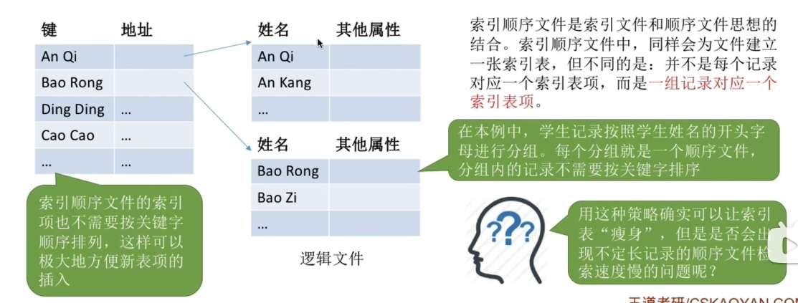
	 - 顺序存储（且是数组而不是链表）的定长记录可随机存取
然后索引文件，就是顺序存储的记录式文件，但各个记录的数据项，是键和地址，
而标准的顺序存储记录式文件数据项就是文件内容。

目录
目录也是定长顺序存储的记录式文件，和索引文件长得很像
然后每一条记录，都叫一个文件控制块，也叫目录项？
目录文件就是上面说的记录式文件，而文件目录又说是文件控制块的有序集合，我觉得没区别啊？

像索引表的思想，引入
多级目录思想。 
- 为了共享文件，引入有向无环图目录结构。文件有共享计数器

为了减小目录文件的大小，改进 FCB，让目录项只有文件名和索引结点指针，内容都放在索引结点中

文件在外存是如何存储的？
- 连续分配
  文件目录记录着文件的起始块号和长度。我们可以把逻辑地址映射成物理地址，因此，连续愤分配既支持顺序访问又支持随机访问。
  不适合文件拓展，会产生外存碎片
- 链接分配
  一个目录项会记录起始块号和结束块号，因此只支持顺序访问
  优点就是能弥补连续分配的缺点
	- 显示链接的链接分配：一个磁盘，诞生严格文件分配表，FAT。
	  读这个表不需要访问磁盘，常驻内存
	  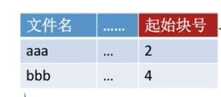
	  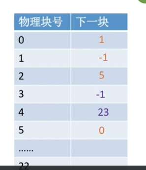
	  数组里面存的值 = 同一个文件的“下一块的物理块号”（如果是文件最后一块，就存个特殊标记，比如 -1）
	  你想找这个文件的第 4 块数据？很简单！不需要读磁盘，直接在内存的 FAT 表里查：`FAT[5] = 12`，`FAT[12] = 28`，`FAT[28] = 45`。找到了！第 4 块在物理块 45！然后直接去磁盘读 45 号块。
- 索引分配
	 每个页表项都会有索引表，存放索引表的块叫索引块 
	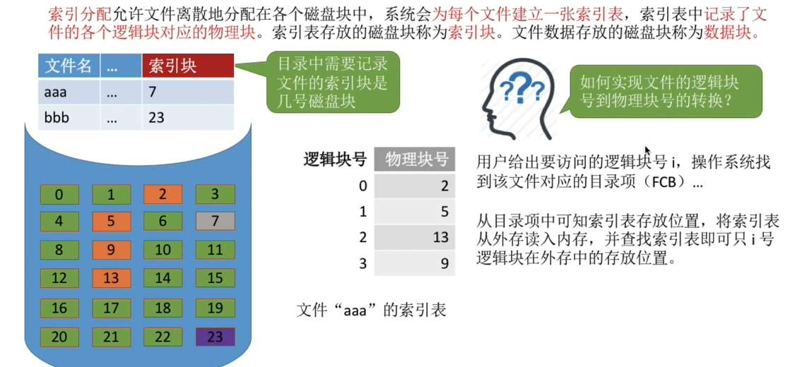
	- 改进：多层索引；混合索引
	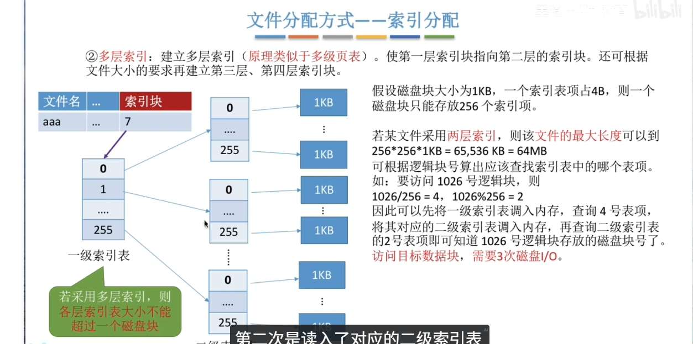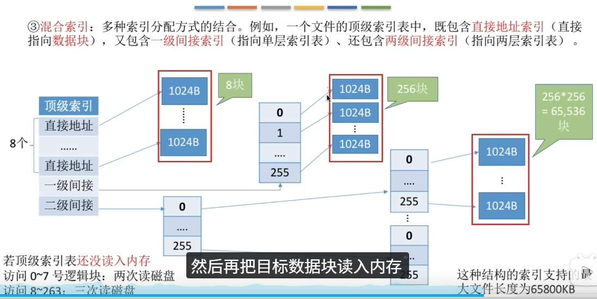
区分下文件的逻辑结构和刚才讲的一堆物理结构。其实二者根本互不影响吧？逻辑结构只是用户怎么构建文件，这导致了找逻辑块号方式的不同。而物理结构决定的是逻辑块号变为物理块号的方式？

## 文件存储空间
空闲表
连续的绿色视为一个整体。一个整体就叫空闲盘块，整体的第一个号就是空闲盘块号
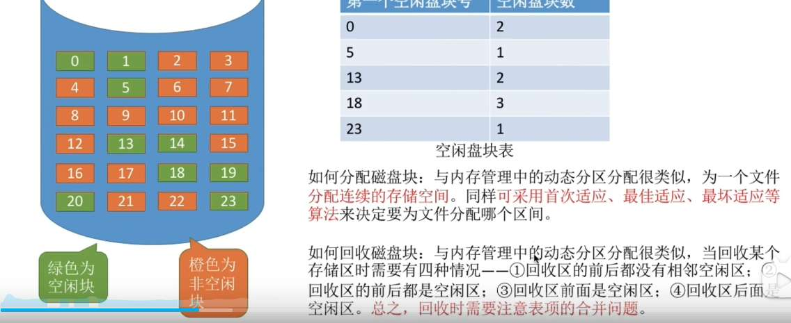
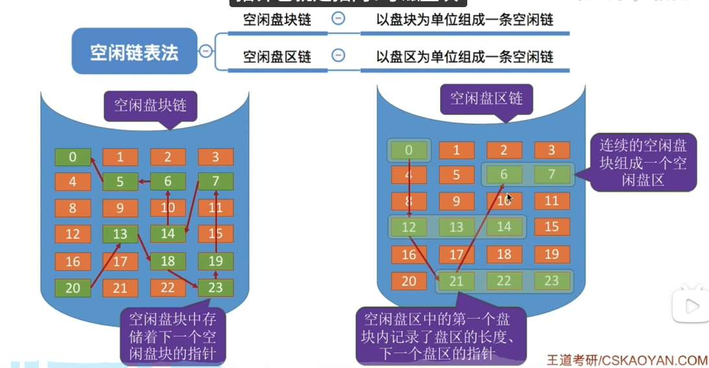

位示图
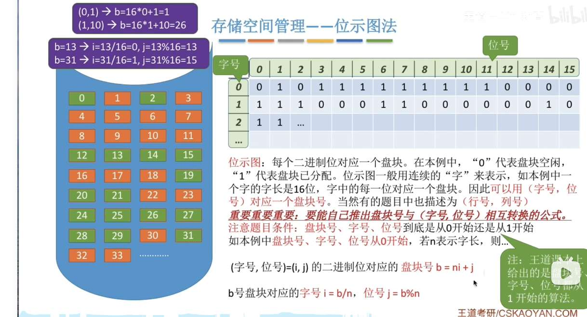

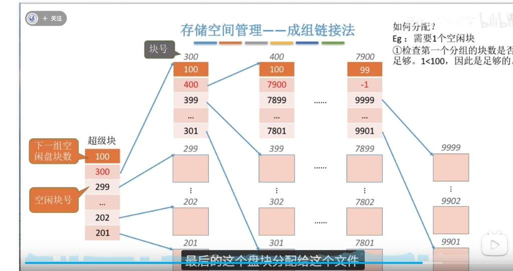

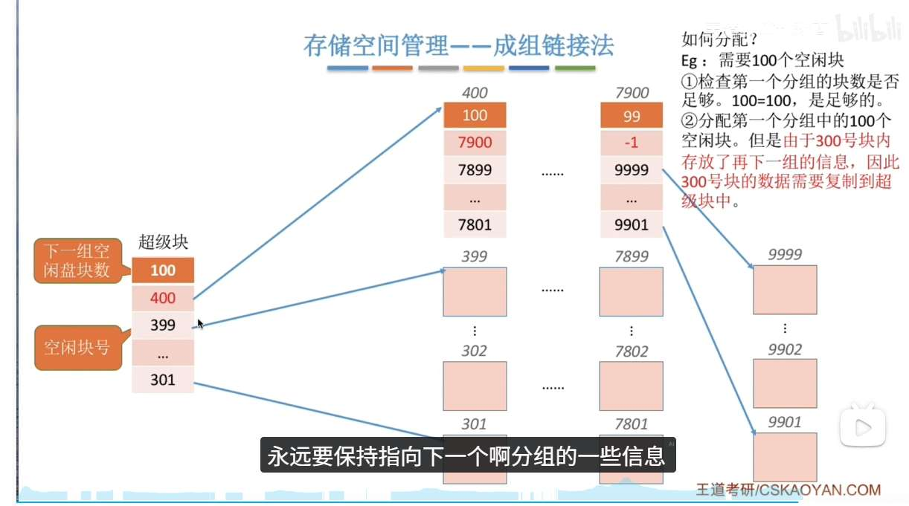

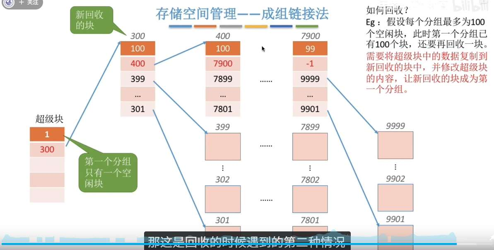
# 文件基本操作

创建文件：
- 外存大小--放到外存
- 文件名、文件存放路径--创建目录项

删除文件：
- 文件名、存放路径--删除目录项，根据目录项的外存地址，回收外存块

打开文件
- 文件名、存放路径--目录项检查是否有权限，讲目录项复制到“打开文件表‘’
- 关闭文件 ：
	- 删除用户打开文件表对应表项（表项序号/索引，也叫文件描述符）。
	- 系统的打开文件表，“打开计数器-1”
		- 如果等于 0 了，就删除对应表表项
- 读文件索引号、数据、从外存读入内存
- 写文件 ：索引号、数据、写回位置
、