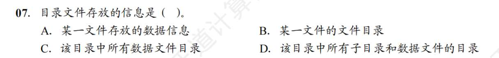
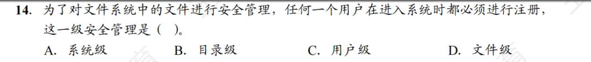
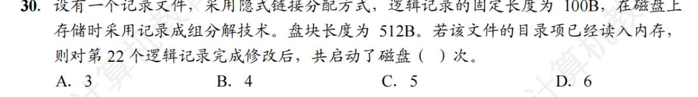
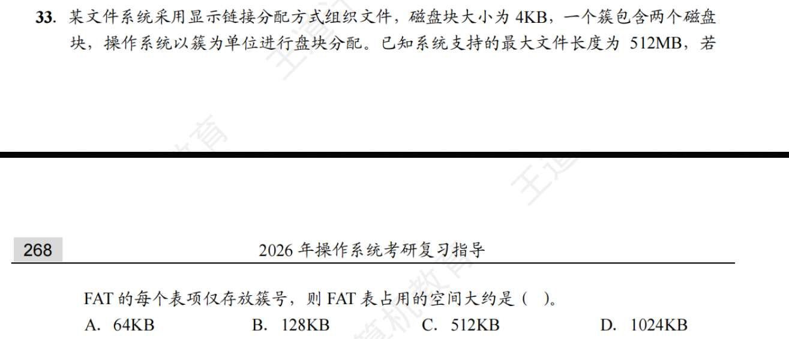
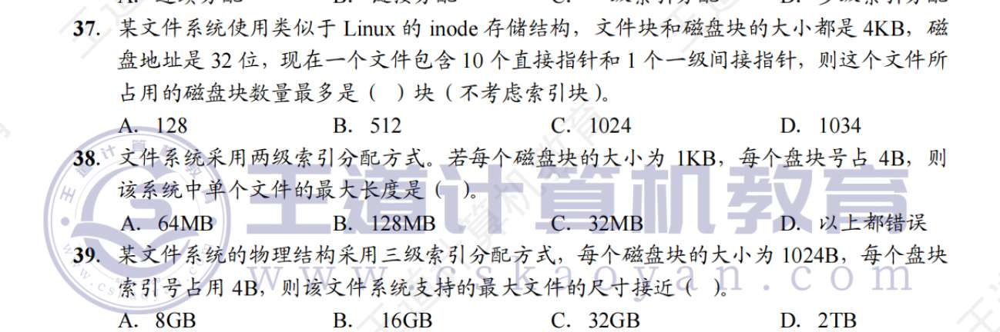
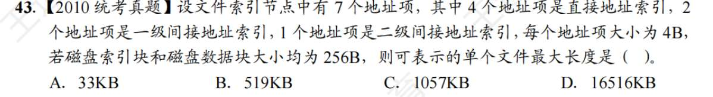
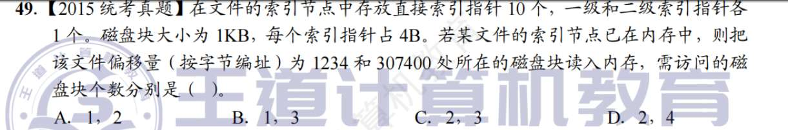

# 文件基础
1. D? 
   还有同类型考点吗
   UNIX 将 I/O 设备分为**字符设备文件**（键盘、鼠标，不可寻址，按字符流读写）和**块设备文件**（硬盘、U盘，可寻址，按数据块读写）
   设备文件的 Inode 里存的是**主设备号**（找对应的设备驱动程序）和**次设备号**（区分同类型的具体哪个设备，比如是 1 号硬盘还是 2 号硬盘）。
2. A
3. C?
   打开文件操作是把指定文件的目录项复制到内存指定的区域。
4. B?
5. A？
   关闭文件指讲文件当前控制信息从内存写回磁盘，而不是将文件数据写回磁盘。
6. B
7. B?
   
   Windows 里的“我的文档”文件夹，里面是不是既有 Word 文档（数据文件），又有新建文件夹（子目录）？这个目录文件存放的就是这些东西的清单（FCB 集合）。
8. A？
   内存索引节点是磁盘索引节点 copy 过来的，是读文件过来的，甚至不是打开文件过来的，是吗？然后只多一个 count，其他和磁盘的节点一样？
   
   `open()` 去磁盘上查目录，找到这个文件的 FCB / Inode，然后**把这个 FCB / Inode 从磁盘 copy 到内存里！** 这就叫建立“打开文件表”和“内存索引节点”。`open` **绝对不会**去把文件里的文章内容（数据）读到内存里。
   
   **`read()` 操作的核心任务**：看着内存里已经建好的打开文件表，顺着里面的物理块地址，去磁盘把真正的**文件内容（数据数据数据！）**读进内存缓冲区。
   
   内存 Inode 确实是从磁盘 Inode 复制来的。多加的几个动态属性：count、dirty bit、设备号
9. FAT32？
   文件目录项不包含自身的物理位置信息
10. C?
    inode 是为了减少查找时的 IO，其他环节的 IO 省不了！
11. A
12. D
13. B?
    文件的访问由用户访问权限和文件属性里的控制信息共同限制，和用户优先级没有关系
14. C?
    
    - **系统级管理（第一道大门）**：
    
    - **干什么的**：防贼进院子。控制谁能登录这台电脑/系统。
        
    - **手段**：注册、登录账号、校验密码（如题目所说的“进入系统时注册”）。
        
	- **用户级管理（第二道大门）**：
	    
	    - **干什么的**：院子里的不同人，能进哪些房间。
	        
	    - **手段**：给不同的用户分类（比如超级管理员 root、普通用户、访客），并通过“访问控制列表 (ACL)”规定张三能访问目录 A，李四不能。
	        
	- **目录级管理（第三道大门）**：
	    
	    - **干什么的**：保护整个房间（文件夹）不被乱搞。
	        
	    - **手段**：规定对某个目录的读、写、执行权限。防止别人把整个目录删了。
	        
	- **文件级管理（最后一道防线）**：
	    
	    - **干什么的**：保护具体的某个抽屉（文件）。
	        
	    - **手段**：设置文件的具体属性。比如哪怕你进了房间，这个文件我也设成了“只读”、“隐藏”、“系统文件”。
15. D?
    异步 IO 只是提高 CPU 利用率，对磁盘 IO 次数没有影响。
16. D
17. D
18. B?
19. C
20. A
21. B
22. B
    连续结构不利于文件长度动态增长，主要原因是连续结构要预留空间。链接分配不需要预留，随便增。
23. B
24. B
25. D
26. C 突然感觉，显式链接的 FAT，和索引表，和逻辑上的索引文件，都挺像的啊，辨析一下
27. B
28. D?
    逻辑文件存放到存储介质上，采用的组织形式与存储介质特性有关
29. B?
    在文件中加一块，一定是连续分配 IO 次数最多。因为有可能要迁移。其他分配方式无论如何都是改改指针、索引之类的
30. ？
    
31. B
32. A
    脑子没反应过来
33. 
    $$\text{FAT表总大小} = \text{FAT表项的总个数} \times \text{每个FAT表项占用的字节数}$$
    这个系统的最小物理单位是 **簇 = 8KB**。也就是说，不管文件多小，哪怕只有 1 个字节，系统也会直接分给它 8KB 的物理空间。
    $$\text{簇的总个数} = \frac{512\text{MB}}{8\text{KB}} = \frac{512 \times 1024\text{KB}}{8\text{KB}} = 65536 \text{ 个}$$
    磁盘上一共有 $65536$ 个簇。因为 FAT 表是全局的，每个簇都要在 FAT 表里占一行，所以 **FAT 表项的总个数 = 65536 个**。
    $2^{16} = 65536$。所以，你需要用 **16 个 bit（也就是 2 个字节）**，才能存得下一个簇号。
    每个 FAT 表项需要占用 **2B (Bytes)** 的空间。- $\text{FAT表总大小} = 65536 \text{ (个表项)} \times 2\text{B (每项大小)} = 131072\text{B}$
	- 把它换算成 KB：

34. C
35. B?
36. A
37. ？
    
38. ？
39. ？
40. ？
41. A？
FCB 包含基本信息、存取控制信息、使用信息
42. B
43. C
    
44. D?
45. A
46. A?
47. D
48. B
49. ?
    
50. A?
51. 

