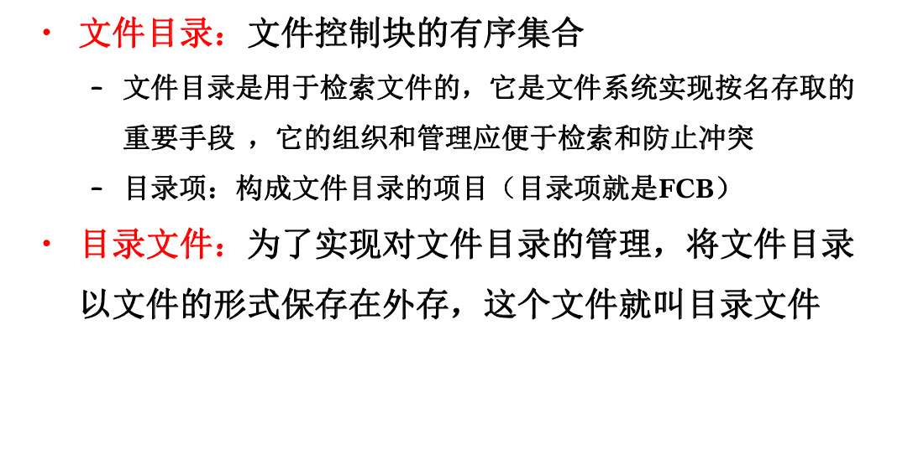
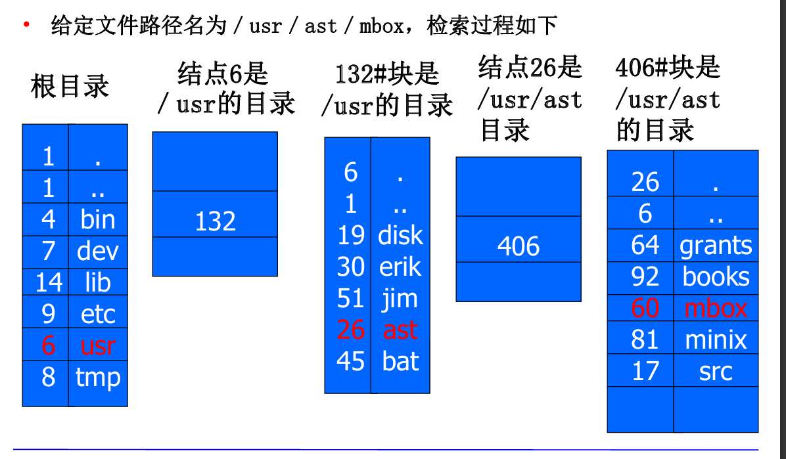

什么是文件 构成，存取方式。文件目录 目录文件。目录结构 检索方式，操作文件 创建打开写读关删复制
机械系盘 结构 原理 时间，寻道 旋转延迟 数据传输（时间短）
磁盘调度算法
文件系统可靠性 持久性 一致性

# 定义
- 记录在外存的：磁带、磁盘等... 额，反正就是，不在内存嘛，内存？内存是那些ram芯片吧，是的，内存也可以叫主存，是CPU直接访问的地方.
- 具有符号名的：额，什么叫符号名？    就是**文件名**（比如 homework.doc）。
- 在逻辑上具有完整意义的一组相关信息项的集合：  相反的， 像进程被分页法切分的碎片，应该就是 逻辑上没完整意义的吧 

# 组成
由目录和文件体（数据实体？）组成。

- 逻辑结构：文件在用户眼里的样子    “无结构的流式文件”是啥，不知道啥意思。 **重点！现代OS（Unix/Linux/Windows）全是这个 ！ 就是一长串字符流 系统根本不知道里面是图片还是代码，系统只看到 01010101... 排成一条长龙**                    **有结构文件 (记录式文件 - Record File)** —— **老古董/数据库专用**
- 物理结构：以磁盘举例，那就是磁盘的物理块呗 。分为连续存储、链接结构存储（链表的样子）、索引结构存储（像页表）

# 文件的存取方式
顺序存取：对文件中的信息按顺序依次读写     什么是文件中的信息？
随机读取：
- 直接存取：随意存取文件中任意一个物理记录   什么是物理记录？
- 按键存取：根据文件中各记录的某个数据项内容来存取记录   什么是数据项内容？
这里有点迷糊啊
按道理不都是按顺序存取吗？无论在外存是何种方式存储的，连续、索引、串联，不都是按顺序吗？

# 目录

文件，
无论它是文本、exe、还是文件夹，在操作系统眼里都只有两部分组成：

1. **FCB (File Control Block)**：**文件控制块**。这是文件的**“身份证”**（元数据）。
    
2. **文件体 (File Body)**：**数据实体**。这是文件的**“肉身”**（实际内容）

FCB，是找到文件体的关键。
他们一般在”目录“这个东西里，
联系实际  ”目录“也是个文件   其实就是文件夹 ？   文件夹这个文件，点进去后，会发现我们一堆文件或文件夹   怎么解释的？怎么与现实对应
那一级目录结构、二级、多级都指什么？

FCB 指向 文件体。通过 FCB 才能找到文件体在硬盘的哪个位置。
- **基本信息**：文件大小、创建者、创建时间。
- **存取控制**：读写权限（rwx）。
- **使用信息**：指针！指向文件数据在硬盘上的位置（比如：起始块号100，长度5）。

FCB 现在理解成俩部分，
先是文件名+inode  一个是去inode里的地址，可以发现上面存储着的文件信息

- **Q: 先是文件名+inode？**
    
    - A: 对，这是在**目录文件的数据**里存着的。
        
- **Q: 一个是去inode里的地址？**
    
    - A: 对，拿到 Inode号后，去**Inode表**（通常在磁盘开头的特定区域）里找。
        
- **Q: 发现上面存储着文件信息？**
    
    - A: 对，Inode 结构体里存了除了文件名以外的所有 FCB 信息。

如果是 **Inode 系统**，如果你想查看一个文件的**大小**，你需要访问硬盘几次？  
答案通常是：**读取目录块（拿到Inode号） -> 读取Inode块（拿到属性）**。至少两次。

1. **古代阶段（FAT/DOS）**：**目录项 = FCB**。
    
    - 目录文件里的一行（目录项），就直接记全了文件名、大小、权限、物理地址。
        
    - 所以 PPT 说“目录项就是 FCB”。
        
2. **现代阶段（Unix/Linux）**：**目录项 ≠ FCB**。
    
    - 为了搜索快，把 FCB 拆了。
        
    - **目录项**只保留：文件名 + Inode号。
        
    - **FCB 的本体**（大小、权限、物理地址）：搬家到了 **Inode 区**。
        

**关键对齐**：为了应试，如果题目没特别强调 Unix/Inode，你就按 PPT 的定义背：**“目录是由目录项组成的，目录项就是 FCB”**。但如果考到了 Inode 计算题，立刻切换到现代思维。

## 目录检索
用户给出文件名，按名寻找目录项
根据路径名检索： 
• 全路径名：从根开始
• 相对路径：从当前目录开始

在检索时（即按名寻找目录项时）的算法：
哈希表算法、线性检索法

# 对文件的操作
- 读文件：找目录（就是刚才一连串 文件路径：文件名找inode 进入inode看内容 到实际物理块..）  最终得到目标文件，在外存的地址，然后从外存将数据读入内存
- 写文件：查找目录，找到目录项，（啥是目录项，就是FCB呗 又乱了 到底此时是不是unix的inode），利用目录中的文件指针将信息写入文件  
### 一、 核心考点：Open（打开）的本质 —— “索引加速”

这是选择题和简答题的重灾区。你必须明白：**Open 并没有把文件数据读出来！**

**考法逻辑：**
1.  **为什么需要 Open？**
    *   如果每次读写都要从根目录 `/` 开始解析路径（查目录 -> 找 Inode -> 查目录...），太慢了！
    *   `Open` 的作用是：**把文件的 FCB/Inode 复制到内存里**，建立一个“快捷方式”。
2.  **两张关键表（必考难点）：**
    *   **系统打开文件表 (System Open File Table)**：整个操作系统只有一张。记录所有被打开的文件的 Inode 信息、**打开计数 (Open Count)**。
    *   **进程打开文件表 (Process Open File Table)**：每个进程一张。记录**当前读写位置 (Offset)**、指向系统表的指针。
3.  **返回值是什么？**
    *   返回一个 **文件描述符 (File Descriptor, fd)**。这就是进程表中那该死的**索引号**（比如 0, 1, 2, 3...）。

**高频坑题：**
> **Q:** 多进程打开同一个文件，系统表和进程表怎么变？
> **A:**
> *   **进程表**：每个进程各有一项（因为读写指针不同，A读到头了，B可能刚开始读）。
> *   **系统表**：**只有一项**（对应同一个文件的 Inode）。但是**打开计数 (Open Count)** 会变成 2。

---

### 二、 核心考点：Create（创建）与 Delete（删除） —— “位示图与硬链接”

这里主要考**磁盘空间的分配**和**链接计数**。

#### **1. 创建 (Create)**
**考试问你：创建一个文件，系统干了哪几件事？（排序或填空）**
1.  **查重**：在目录里搜一下，有没有叫这个名字的？有就报错。
2.  **找房（分配 FCB）**：去 Inode 区（或申请 FCB），找一个空闲的 Inode 号（比如 88）。
3.  **落户（写目录）**：在父目录的数据块里，增加一行：`("文件名", 88)`。
4.  **初始化**：把 Inode 88 的属性填好（大小=0，权限...）。
    *   *注意：此时通常还没分配数据块，直到写数据时才分配。*

#### **2. 删除 (Delete) —— 致命陷阱：硬链接**
**考法：** 给你一个场景，A 和 B 都指向同一个文件，删了 A，B 还能读吗？

*   **逻辑链**：
    *   在 Unix/Inode 系统中，删除文件（`rm`）本质上是 **Unlink（解除链接）**。
    *   **动作**：
        1.  把目录里 `("文件名", 88)` 这一行删掉。
        2.  把 Inode 88 里的 **链接计数 (i_nlink)** 减 1。
    *   **回收条件**：只有当 **链接计数 = 0** 时，系统才会真正把 Inode 88 标记为空闲，并回收它的数据块。
*   **答案**：如果 A 和 B 是硬链接，删了 A，**B 完全不受影响**，甚至不知道 A 没了。因为 Inode 还在。

---

### 三、 核心考点：Read/Write（读写） —— “I/O 次数计算”

这是计算题的地盘。结合你之前学的“混合索引”（直接、一级间接、二级间接）。

**考法：**
> 文件 `test.dat` 已经打开（Inode 已在内存）。文件系统块大小 1KB，地址项 4B。Inode 有 10 个直接地址，1 个一级间接。
> **问：** 若要读文件的第 15000 字节，需要几次磁盘 I/O？

**解题逻辑：**
1.  **定位**：$15000 / 1024 \approx 14.6$。也就是说在第 **14** 号逻辑块（从0开始算）。
2.  **判断范围**：
    *   直接地址：管 $0 \sim 9$ 块。
    *   一级间接：管 $10 \sim (10 + 256)$ 块。 -> **第 14 块在一级间接里！**
3.  **计算 I/O**：
    *   **第 1 次**：去读“一级间接索引块”（从内存 Inode 里拿到地址，去读盘）。
    *   **第 2 次**：从索引块里查到第 14 号块的物理地址，去读真实数据。
    *   **答案**：**2 次**。

*(注意：如果没 Open，还要加上前面查目录的那一堆 I/O)*

---

### 四、 核心考点：Close（关闭） —— “引用计数”

这个考点比较隐蔽，通常结合 Open 考。

**逻辑链：**
1.  用户调用 `close(fd)`。
2.  **进程动作**：删除“进程打开文件表”里的记录。
3.  **系统动作**：
    *   找到“系统打开文件表”里的对应项。
    *   **打开计数 (Open Count) 减 1**。
4.  **关键判断**：
    *   如果 **Open Count > 0**：说明还有别的进程在用，不能释放系统表项。
    *   如果 **Open Count = 0**：说明没人用了。
        *   **刷盘**：如果内存里有改动过的数据（脏数据），强制写回磁盘。
        *   **释放**：删除系统表项，释放内存里的 Inode。

---

### 总结：应试必杀技

如果考试题目出现以下关键词，请立刻条件反射：

1.  **"打开文件"** $\rightarrow$ 对应 **把 FCB 读入内存，建立映射表，返回 fd**。（绝不是读数据）
2.  **"删除文件"** $\rightarrow$ 对应 **链接计数减 1**。（绝不是直接擦除磁盘数据）
3.  **"读/写第 x 字节"** $\rightarrow$ 对应 **混合索引计算**。（直接？间接？几次 I/O？）
4.  **"创建文件"** $\rightarrow$ 对应 **目录里加一行 + 分配 Inode + 更新位示图**。