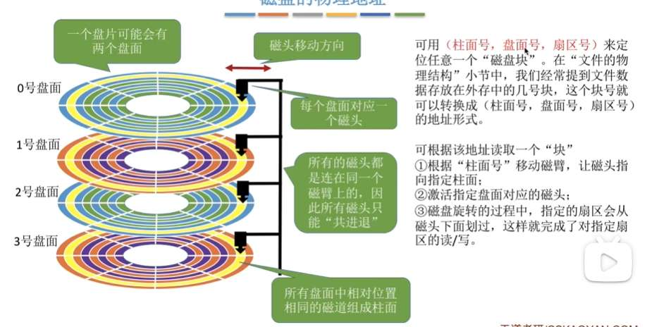

首先，本章节讲
操作系统怎么管理和外部设备的交互(IO设备)
那IO设备有很多，我们可以用很多种方式去分类
我觉得最好想的是
人机交互，如鼠标键盘；信息交互 ，如硬盘； 通信交流 。

ok 那么到底，操作系统怎么去管理IO？

数据流应该是这样的
CPU，可以代表操作系统的意志？ 然后把信息传递给寄存器这些硬件，
硬件的信息怎么转译？ 有个叫IO逻辑的东西，是硬件，每个设备（键盘、硬盘、网卡）都有**自己专属的**控制器。
他负责把信息，或者说命令，向设备传达！
传达这一点，势必最终是硬件传达，这个最后一步，就是与设备的接口！ 

那么“IO控制器”这个名词？ 应该指代？刚才那个中间人！

OK，有数据流这个框架了。

我们知道每一个设备都有一个转述的IO控制器作为中间人。
他们控制的方式一样吗？
不一样：
- 程序直接控制
- 中断驱动
- DMA
- 通道控制
我们先不陷进去细节， 只要知道 不同IO控制器 与设备的“传达”、“交互”，都不同
这个理解错误！
这讲的是 **CPU (代表驱动程序)** 与 **I/O控制器** 之间的交互方式。 
**位置**：位于 **设备驱动程序 <---> I/O控制器** 这一层。
- **物理设备**（如磁盘盘片）和 **I/O控制器** 之间的交互是内部的、电子信号级的，操作系统**看不见也不管**。
- 操作系统（驱动程序）只跟 **I/O控制器** 说话。
- **轮询**：驱动程序（CPU）一直问控制器：“好了吗？”
- **中断**：控制器发信号给CPU：“我好了！”
- **DMA**：CPU把总线控制权交给DMA控制器，DMA控制器直接搬运数据，搬完发中断。

刚才是硬件，现在我们回到软件！！！

首先，软件应当指一堆程序？
比如 我们想让计算机打印出个东西，我们会用print(...) 这是在库函数里的， 这个叫**用户层软件**。编码了“print()"的逻辑？你写 printf("Age: %d", 18)，它得先把 %d 替换成字符 1 和 8，拼成字符串 "Age: 18"。这是纯计算逻辑。它通常不会立刻找操作系统，而是先把这串字符放到**用户空间的一个数组**（缓冲区）里攒着。 

printf 的源码里写着：“当我把格式化搞定，缓冲区攒满后，**我就去调用 write()**。”
**【系统调用发生！】** —— CPU 状态位改变，权限提升，跳进内核。
这个就叫**系统调用接口/IO应用接口** write() 既是一个**系统调用**（因为它触发了模式切换），也是**I/O应用接口**的一部分（因为它符合标准规范）。    

然后这个信息 会进入“设备独立性软件” 他做了很多，（怎么找我要的设备？**缓冲 & 缓存**，IO调度，设备保护，块与字符设备的抽象逻辑）呃，携带信息仍然是write () 吧    ，只是说，去处理一下，像”中间人“  它调用下层接口时，**输入**：write(fd, "hello")指令变成了 —— scsi_disk_driver_write(具体的设备结构体, "hello")。
然后使用设备驱动程序接口 进入设备驱动程序，（所以接口的意思是，某个区域的入口吗？）
让其进行翻译为硬件指令
这下CPU就能直接把设备驱动程序翻译的语言，写入寄存器等硬件。到底怎么描述？
- **场景复现**：
    
    1. **驱动程序的代码（写在内存里）**：MOV 0x3F0, 0x01 （汇编语言：把数值1放入地址0x3F0）。
        
    2. **CPU（读到了这句话）**：哦，让我把1写到0x3F0。
        
    3. **硬件机制**：CPU发现 0x3F0 不是普通内存地址，而是一个**I/O端口地址**。
        
    4. **动作**：CPU通过系统总线，把 1 这个电信号，发送到了编号为 0x3F0 的**I/O控制器寄存器**里。
        
    5. **I/O控制器**：看到了寄存器里变成了1，立刻控制磁头开始移动。

转述后信息如何流动？
- 怎么找我要的设备？ ”设备独立性软件“干的，用到了表。当然他还有很多功能，先不陷入
- 把”打印“具体翻译为设备听懂的信号， ”设备驱动程序“
- 设备不能光埋头干，还得给我回应。用的是”中断处理程序“ 

现在，我们再软件硬件对照一下！

**CPU传达意志**  正是CPU忠实地执行着设备驱动程序的每一行代码。 
存到寄存器上，这个代码就包含了“设备独立性软件找到的具体设备，和我们刚才转述print的操作write”

下面，依然是这个信息流中的详细知识点

轮询、中断、DMA 都讲的是，硬件设备，与IO控制器的直接交互？相当于设备与CPU的间接交互？
IO应用接口，是在说什么呢？ 块与字符黑色版，阻塞与非阻塞IO，是如何填入框架的？
IO调度、缓冲、缓存
、假脱机呢  
应用程序IO接口 设备驱动程序接口， 这些接口，是怎么理解的？

假脱机  搞不懂 不太清楚
然后刚才软件层的，细的知识点， 只在那个“设备独立软件”了
其俩个功能   设备的分配与回收  缓冲区管理

### **场景：你的C程序运行了一句 scanf("%c", &input_char);**

这就相当于调用了系统调用 read(0, &buffer, 1) （从标准输入读取1个字节）。

#### **第一阶段：向下请求（软件栈）—— “我想要数据，但我得等”**

1. **用户层软件 (scanf)**
    
    - **动作**：发起调用。
        
    - **逻辑**：它并没有直接去问键盘。它调用了**系统调用接口** read()。
        
2. **系统调用接口 (I/O Application Interface)** —— **【接口高亮！】**
    
    - **定义**：这就是**应用接口**。它规定了：“不管你是想读文件还是读键盘，都得用 read(fd, ...) 这个标准姿势。”
        
    - **关键属性——阻塞 (Blocking)**：
        
        - 默认情况下，read 接口被定义为**阻塞**的。
            
        - **含义**：如果此刻缓冲区里没有数据（你还没按键），这个函数**不允许返回**。
            
        - **结果**：操作系统把你的进程从**“运行态”**踢到了**“阻塞态”**。
            
        - **CPU**：在这个进程睡觉的时候，CPU转头去运行别的进程了（比如播放音乐）。**此时，软件栈的执行暂停了。**
            

---

#### **第二阶段：向上响应（硬件流）—— “数据来了，打断CPU”**

(几秒钟后，你的手指按下了 'A' 键)

1. **物理层 & I/O控制器**
    
    - **动作**：键盘电路感受到压力，生成扫描码。键盘**I/O控制器**把这个码存入自己的寄存器。
        
    - **通知**：I/O控制器通过总线，向CPU发送一个**中断信号 (Interrupt)**。
        
2. **CPU (被动响应)**
    
    - **动作**：CPU正在放音乐呢，突然被拍了一下肩膀（中断）。
        
    - **反应**：CPU暂停音乐播放，保护现场，根据**中断向量表**，跳转到**键盘驱动程序**预设的**中断处理程序**。
        
3. **设备驱动程序 (中断处理部分)**
    
    - **位置**：这是驱动程序的**下半部分**。
        
    - **动作**：
        
        1. 读取I/O控制器寄存器里的 'A'。
            
        2. 把 'A' 放入内核的**输入缓冲区**。
            
        3. **关键动作**：驱动程序通知内核——“嘿，刚才那个因为等键盘而睡觉的进程，现在可以醒了！”
            
4. **内核 (I/O子系统)**
    
    - **动作**：把你的进程从**“阻塞态”**拉回**“就绪态”**。
        

---

#### **第三阶段：完成闭环 —— “拿走数据”**

1. **回到系统调用接口**
    
    - **动作**：你的进程再次获得CPU。read() 系统调用继续执行。
        
    - 它发现缓冲区里有 'A' 了！
        
    - 它把 'A' 从**内核缓冲区**拷贝到你程序的**用户缓冲区** (&input_char)。
        
    - read() 函数**返回**（解除阻塞）。
        
2. **回到用户层软件**
    
    - scanf 拿到数据，程序继续往下跑。
        

---

### **【深度辨析：接口、阻塞、非阻塞、异步】**

在这个例子中，我们来玩弄一下**“接口”**的定义，看看会有什么不同。

#### **1. 阻塞 I/O (Blocking I/O) —— 刚才演示的**

- **接口行为**：read() 说：“没数据我就不回去了，我在内核里睡到死。”
    
- **适用场景**：大部分命令行工具。逻辑简单，代码好写。
    

#### **2. 非阻塞 I/O (Non-blocking I/O)**

- **怎么做**：你在调用 open 打开键盘设备时，传入一个标志位 O_NONBLOCK。
    
- **接口行为变了**：read() 变成了：“有数据就给我，**没数据（你还没按键）别让我睡，立刻返回一个错误码 -1 给我**。”
    
- **流程变化**：
    
    - 用户层软件必须写一个 while 循环（轮询），不停地调 read()，不停地收到 -1，直到你按键为止。
        
    - **代价**：CPU这时候就没法去放音乐了，它得陪着你在这个循环里空转，效率极低。
        

#### **3. 异步 I/O (Asynchronous I/O, AIO)**

- **接口完全变了**：你不再调 read()，而是调 aio_read()。
    
- **接口行为**：“我想要个 'A'，这是我的**回调函数地址**。你（操作系统）去等吧，等到了直接把数据填好，然后**运行这个回调函数**通知我。”
    
- **流程变化**：
    
    - 你的主线程**完全不停**，继续干别的事（比如渲染游戏画面）。
        
    - 当你按下 'A'，触发中断后，操作系统处理完数据，会自动“插入”到你的进程里，执行你留下的那个回调函数。
        

---

### **总结**

- **I/O应用接口**：就是 read 这个函数。通过设置不同的参数（阻塞/非阻塞），它表现出不同的性格。
    
- **设备驱动接口**：是内核用来呼叫键盘驱动的一组标准函数指针（比如 keyboard_read）。
    
- **核心逻辑**：
    
    - **阻塞**是“操作系统帮你等”。
        
    - **非阻塞**是“你自己不停问”。
        
    - **中断**是硬件通知软件的唯一渠道（不管你上面是阻塞还是非阻塞，底层硬件永远是通过中断把数据送上来的）。
        

关键动作：驱动程序通知内核——“嘿，刚才那个因为等键盘而睡觉的进程，现在可以醒了！”  
这一步我发现 是否有隐含知识点？ 驱动程序为什么还能联系内核， 本来以为驱动程序只是翻译为硬件能懂的电信号而已。  

1. **位置**：驱动程序（Driver）的代码，是**链接**在操作系统内核里的。它是**内核的一部分**，运行在**内核态 (Kernel Mode)**。
    
2. **权限**：因为它在内核态，所以它拥有**最高权限**。它可以直接访问内核的**核心数据结构**（比如进程调度队列）。
    
3. **动作**：
    
    - 当**中断处理程序**（驱动的一部分）运行时，它不仅仅是把数据从硬件读进来。
        
    - 它还会调用内核提供的**内部函数**（比如 wake_up_process()）。
        
    - 这个函数会去修改那个“睡觉进程”的 PCB（进程控制块），把它从 **Blocked** 改为 **Ready**，并把它从等待队列挪到就绪队列。
        

**结论**：驱动程序是**长了手的翻译官**。它不仅能对硬件指手画脚，也能修改内核的调度状态。

然后就是 轮询和中断都是硬件层面 指IO控制器如何唤醒驱动程序去接收硬件input的数据，他已经将电信号翻译成数字了 但我们常常用中断这个方式  
阻塞是一种状态 是指调用IO应用接口后 如果要数据，比如read()这个接口就要数据 那么调用接口的进程，到底以什么样的方式去等待数据。 阻塞的话，就是进程直接变成阻塞态 就纯等数据 有数据时，IO控制器 给CPU发中断信号 应说CPU去运行驱动程序这个代码中，中断处理程序的代码片段， 会让内核，唤醒进程，将进程变为就绪态 。‘  
非阻塞状态的话 是read()函数一直调用 直到返回的值不是-1 呃， 那么怎么感觉，阻塞状态，更能让cpu闲着，非阻塞反而让cpu一直轮询，效率不高呢？ 

- **单看一个进程**：
    - **阻塞 I/O**：进程睡觉，CPU去干别的。**CPU利用率极高，不浪费。**
    - **非阻塞 I/O (配合轮询)**：进程死皮赖脸地占用CPU，不停地问“好了没”。**CPU时间被大量浪费在无效的查询上。**
**场景：高性能 Web 服务器 (Nginx)**

- Nginx 需要同时处理 **10000 个** 用户的连接。
    
- **如果用阻塞 I/O**：为了不让一个用户卡死其他9999个，Nginx 必须开 **10000 个线程**。每个线程阻塞在其中一个用户的连接上。
    
    - 代价：10000 个线程的**上下文切换**和**内存消耗**，会直接把服务器搞崩。
        
- **如果用非阻塞 I/O**：
    
    - Nginx 只需要 **1 个线程**。
        
    - 它用一个循环，快速扫描这 10000 个连接（实际上是用 epoll 技术，比轮询更高级，但基础是非阻塞）。
        
    - 谁有数据来了，就处理谁；没数据的，就跳过。
        
    - 结果：1 个线程就扛住了 1万并发。

原来如此，我之前一直把CPU的状态和进程的状态搞混了
首先 一核CPU 一个瞬间，只能运行一个线程。
阻塞与非阻塞 说的是 线程程有没有被阻塞？ 阻塞的话，线程停了，不干其他事。
此时，CPU是可以去忙其他线程的
非阻塞的话 线程...确实没停 但我感觉跟停了没区别 因为时间仍然一直耗费在”询问数据“这个事情 而且还把CPU拖累了 ，CPU只忙这一个线程 
异步的话， 是线程停止这件事， 转而做其他事情。 仍然是线程这个角度。 CPU呢，只忙着一个线程。
我记得我之前的理解是，阻塞与非阻塞是方式，同步与异步是状态？
同步又是什么状态？ 感觉这里可以再深度辨析一下

同步不是一种“状态”，而是一种“态度”！

- **同步**的态度是：这件事**我得盯着**，要么死盯（阻塞），要么时不时盯一下（非阻塞）。
    
- **异步**的态度是：这件事**我不管了**，结果出来了告诉我。

#### **维度一：被调用者（函数/接口）怎么回应？ —— 阻塞 vs 非阻塞**

这个维度关注的是**“函数调用的瞬间行为”**。

- **阻塞 (Blocking)**：
    
    - **定义**：你调用我，如果数据没准备好，**我不让你走**（函数不返回）。
        
    - **线程状态**：**被挂起 (Blocked)**。
        
    - **CPU**：切换去干别的（高效）。
        
- **非阻塞 (Non-blocking)**：
    
    - **定义**：你调用我，如果数据没准备好，**我立刻让你走**（函数返回错误码），你自己看着办。
        
    - **线程状态**：**没停 (Running)**。
        
    - **CPU**：**没停**。如果线程选择死循环轮询，CPU就在做无用功（低效）。
        

---

#### **维度二：消息通信机制（谁来主动？） —— 同步 vs 异步**

这个维度关注的是**“数据传输完成时，谁来主导？”**

- **同步 (Synchronous)**：
    
    - **定义**：**“我（线程）必须亲自参与/等待数据的传输结果。”**
        
    - 不管是“死等”（阻塞），还是“过一会儿去问一下”（非阻塞轮询），**只要是你（线程）在主动关心这件事，就是同步。**
        
    - **关键点**：在数据从内核拷贝到用户空间的那个**最终瞬间**，你的线程是必须**在场**的，甚至是被卡住的（因为拷贝内存需要时间）。
        
- **异步 (Asynchronous)**：
    
    - **定义**：**“我（线程）完全不管了，系统（内核）搞定后通知我。”**
        
    - **关键点**：你发起请求后，就去干别的事了。**连“把数据从内核拷贝到用户空间”这个脏活累活，都是内核替你干完的。** 当内核通知你的时候，数据已经端端正正地摆在你的缓冲区里了。

### **【四象限情景剧：奶茶店模型】**

为了彻底搞清“同步非阻塞”和“异步”，我们来买奶茶。  
**你是线程，店员是操作系统。**

#### **1. 同步阻塞 (Synchronous Blocking) —— 最常见的**

- **你**：“我要一杯珍珠奶茶。”
    
- **店员**：“好的，在做了，你站在这别动。”
    
- **行为**：**你只能像木头一样站着（线程挂起）**。直到奶茶做好递到你手里，你才能动。
    
- **评价**：这就是普通的 read()。简单，但你啥也干不了。
    

#### **2. 同步非阻塞 (Synchronous Non-blocking) —— 你疑惑的那个**

- **你**：“我要一杯珍珠奶茶。好了吗？”
    
- **店员**：“没好。” （**立刻返回**）
    
- **你**：（刷了会手机，又抬头）“好了吗？”
    
- **店员**：“没好。”
    
- **你**：（回个微信，又抬头）“好了吗？”
    
- **店员**：“好了，给你。”
    
- **行为**：**你没被定身（线程Running），但你一直在操心（轮询）**。
    
- **评价**：这就是设置了 O_NONBLOCK 的 read()。
    
- **你的疑问：“这不就是浪费CPU吗？”**
    
    - **是的！** 如果你只是傻傻地死循环问，这就是极大的浪费。
        
    - **但是！** 如果你是一个**“时间管理大师”（IO多路复用，如 select/epoll）**，你一次点了100杯奶茶，然后你就站在那里，**只问那个“做好了”的店员**。这样效率就极高了！**非阻塞是实现高并发的基础，通常不单独使用。**
        

#### **3. 异步 (Asynchronous) —— 高级VIP**

- **你**：“我要一杯珍珠奶茶。**这是我的电话，做好了直接送到我座位上。**”
    
- **店员**：“好的，您请便。”
    
- **行为**：**你直接回座位打游戏去了（线程处理其他逻辑）**。你完全忘了奶茶这回事。
    
- **结果**：突然电话响了（回调函数/信号），你一看，奶茶已经放在桌子上了。
    
- **评价**：这就是 aio_read。你从头到尾都没等过，也没问过。

# 磁盘
然后再一个独立知识点 磁盘 
首先视频展示了磁盘的样子
直观感受了
- 磁头臂、磁头
- 磁盘
	- 磁道
	- 扇区（磁盘块）
- 盘面
- 柱面

所以可以有个坐标（柱面号（哪个磁道），盘面号（第几层）、扇区号（哪一块））
我疑惑的是 最内侧的磁道，面积最小，数据密度最大，  言外之意是，每一个磁道 其数据量相同吗？
扇区 每个地方数据相同很好理解。
如何读写数据？
先磁头移动到对应磁道（根据柱面号）  然后盘面会旋转， 选择的时候磁头会读取扇区号，

## 调度算法
- 寻道时间 找磁道
- 延迟时间 “找”扇区
- 传输时间 读写时间

操作系统影响的只能是寻道时间？为什么？
**哦哦 理解了 这个视角，是放在“有很多磁道要寻找”的情况 我们如何排序 好比好多进程。**
另外，磁头有一个“初始位置”
- FCFS 先来先服务
- SSTF 最短寻找时间优先 有点贪心 只能是局部最优 像第一个的话，就是找离初始位置最近的.会有饥饿风险 
- SCAN 扫描算法  只有磁头移动到最外层磁道时才能往内移动 反之一样。
	针对SCAN缺点的改进 
	- LOOK算法，在SCAN基础上加一个观测，如果移动方向上没有别的请求立即改变方向 
	- C-SCAN算法 额 SCAN是左到右 到头 从右往左 到头  而C-SCAN是定方向 比如说左到右 那就右 到头 再次从左往右
		- C-LOOK算法 结合LOOK和C-SCAN

延迟时间：磁盘读一个扇区的数据后要有一段时间处理
- 交替编号：能减少读连续逻辑扇区所需的延迟时间。 我疑惑了，那如果原来要读2、4、6 本来没有延迟时间的问题，交替编号后，可能246就有延迟时间问题了啊。有一种拆东墙补西墙的感觉。但也许 我们常常读的是连续的？ 
- 地址结构的设计，其坐标命名本身就有此效果
- 错位命名 仍然是服务于读连续扇区  然后由于磁盘旋转特性想出的方法

## 磁盘格式化

分区、逻辑格式化：c盘在里面的磁道  D、E依次在外面 