1. C?
   共享设备必须可寻址和可随机访问。关于寻址、随机访问，还有哪些知识点？
   块设备 (Block Device) —— 必须支持“随机寻址”,**代表：** 磁盘、U盘、固态硬盘。
   
2. B?
   
   虚拟设备是，将一台独占设备转换为若干逻辑设备，怎么做到的？引入虚拟设备是为了客服独占设备速度慢、占用率低的特点。
   虚拟设备（SPOOLing）3 个进程以为自己都独占了一台高速打印机（3 台逻辑设备），实际上底层只有一台慢吞吞的物理打印机在吭哧吭哧干活
3. D？
4. A?
   控制命令由设备控制器（就是 IO 接口吧？）提供？怎么提供的。突然发现我有个困惑，我之前以为 N 个设备就有 N 个 IO 接口，现在看来是一个 IO 接口，这个 IO 接口有 N 个与外设的端口？ 
   这里的“提供”，其实是指**“向下（向物理设备）发放具体的电气指令”**
   第二个想法正确，- 你的主板上只有一个 USB 控制器（I/O 接口）。但是它后面可以接一个 USB 扩展坞，上面插着鼠标、键盘、U 盘、打印机（N 个外设）。CPU 把数据和控制命令发给 USB 控制器时，会附带一个“子设备地址”。USB 控制器看到后，会在内部做路由，把这个命令精准分发给那个鼠标。
5. C
6. A
7. B?
   通道是硬件技术!
8. C
9. B
10. D
11. B?
    在预处理 DMA 之前，请求 IO 的进程进入内核态。怎么还这么考，我怎么知道啥时候内核啥时候用户，怎么区分？  “负责预处理的进程是请求 IO 的进程，负责后处理的进程是中断服务例程”这又啥意思？为什么？  为什么预处理阶段请求 IO 的进程处于运行态，后处理阶段处于阻塞态
    凡是涉及到“直接摸硬件”或者“分配系统公共资源”的操作，100% 必须在内核态！
    用户态能干啥？ 只能在自己的内存小单间里做纯算术逻辑运算（加减乘除、while 循环、字符串拼接）。
    预处理（填任务单）—— 状态：运行态 (Running) 你的 C 语言程序（**请求 I/O 的进程**）通过系统调用进入了内核态。此时，**CPU 正在执行这个进程的代码**。
    等待期（苦逼等数据）—— 状态：阻塞态 (Blocked)
    你的进程发现自己没数据算不下去了，它主动调用 `block()` 原语，把自己挂起，把 CPU 让给别的程序。此时，你的进程进入了**阻塞态**。
    后处理（结账收尾）—— 状态：依然是阻塞态！DMA 把 10000 个字传完了，发出 `INTR` 中断！CPU 瞬间切到**中断服务例程 (ISR)** 去处理。**注意！这是谁的代码？** 这个 ISR 是操作系统的公共代码，**它不属于你的那个进程！**
12. A?
13. 
    **绝对号（绝对设备名 / 物理设备名）：** 系统里这台设备的**真实、唯一物理身份证号**（比如 `MAC地址`，或者主板上的 `端口号 0x3F0`）。不管谁来用，它就是它，是系统统一编号的。这就是题干描述的东西。
    **相对号（相对设备名 / 逻辑设备名 / 符号）：** 用户程序自己随便起的名字（比如代码里的 `Printer_1`）。
14. A?
    通道控制设备控制器，设备控制器控制设备工作（设备控制器就是 IO 接口，确认下对不对 ）
    对于一组命令，CPU 要么给通道发命令要么给设备控制器发命令
15. C
16. D？
    
    
    1. **系统调用参数（上层黑话）：** 比如 `write(fd, buffer)`。这里的 `fd`（文件描述符）是个纯粹的逻辑代号（比如数字 3）。
    
	2. **设备独立性软件（中介翻译）：** **驱动程序是根本听不懂什么是 `fd` 的！** 驱动程序只认硬件。所以，必须由“设备独立性软件”去查一张系统表（打开文件表），把抽象的 `fd = 3`，**翻译**成统一的标准内部命令：“请向逻辑设备 U盘 的第 10 扇区写入数据”。——**这就是题目里说的“将系统调用参数翻译成设备操作命令”！**
	    
	3. **设备驱动程序（终极苦力）：** 驱动程序拿到独立性软件发来的“设备操作命令（写第 10 扇区）”后，再把它转换成硬件引脚上的高低电平和寄存器指令（比如算出来对应哪个柱面、哪个磁头），**负责“执行”这个命令**。
	    
	
	**总结我的翻车点：** 我把翻译过程的“最后一步”当成了全部。在 OS 考研题中，**“翻译系统调用参数（fd）”是独立性软件的专属 KPI**，驱动程序只负责“执行”独立性软件下发的标准命令。你的答案解析 说的“根据设备类型选择调用相应的驱动程序”，正是独立性软件干的活。
17. C
18. A?
19.  A
    
    这里说的“中断类型”，**不是**让你去分类它是“内中断还是外中断”，而是指**“到底是几号中断（中断类型号/向量号）”**！
    主机获取设备输入**是软件干的？** 当硬件把各种准备工作（找入口、切状态、存断点）都做完后，CPU 终于跳转到了**中断服务程序（ISR 代码）**里。在这小段代码里，程序员写了一条类似 `IN AX, 0x60`（从 60 号端口把键盘敲下的那个字母读进 AX 寄存器）的指令。
20. D?
    程序直接控制方式下，进程不会被阻塞，这才有 CPU 一直沦轮询，对 CPU 来说它堵塞了！而 DMA 和中断，是进程堵塞，CPU 不堵塞？
    - **“进程阻塞”是一个软件概念**：指的是进程放弃了对 CPU 的竞争，去休息室睡觉了。这是一种**极其高尚的让贤行为**，是为了提升整体效率！
	  - **“CPU 阻塞（空转）”是一个物理现象**：指的是 CPU 满头大汗地在原地踏步，做无用功。
21. B?
    多重中断！
22. A
23. B
24. B
25. A
26. B

# IO 软件 
1. B
设备独立性，并不是指系统对设备的管理是独立的，为什么？
“设备独立性”这个词，**主语不是操作系统，而是“用户程序”！**全称应该叫**“用户程序对物理设备的独立性”*
设备独立性指用户使用设备的透明性
2. C
3. A
4. D
   输入井和输出井在磁盘，输入输出缓冲是内存，但他们作用一模一样吧？为什么地方不一样
   打印机太慢了，如果让 10 个进程在内存里等，内存直接就被撑爆了！所以，OS 在容量极其庞大、且便宜的磁盘上挖了“井”。
   “井”是为了装下整个任务，实现设备共享，所以放在**大而慢的磁盘**；“缓冲”是为了跟上 CPU 的节奏，平滑数据流，所以放在**小而快的内存**。
5. B，多缓冲区和缓冲池的区别？
   多缓冲区多缓冲区 比如咱们上一回合聊的双缓冲，或者连成一个圈的“循环缓冲”。它们通常是**“专款专用”**的。
   缓冲池是**公共资源**！任何设备、任何进程都可以来申请和释放。极大地提高了内存的利用率
   
6. B，缓冲区软件硬件、字符或块、输入输出，都有
7. B
8. C???
   设备分配，为什么会有算法？到底分配了什么？
   是操作系统修改了内存里的一张表格（比如 DCT）。OS 把这个设备的 `status` 字段从 `FREE` 改成了 `BUSY`，并把 `owner` 字段写上了你的 `进程 ID`。这就相当于把这台设备的**“独占使用权（钥匙）”**交给了你！别人再来查表，看到是 `BUSY`，就只能去排队了。是操作系统修改了内存里的一张表格（比如 DCT）。OS 把这个设备的 `status` 字段从 `FREE` 改成了 `BUSY`，并把 `owner` 字段写上了你的 `进程 ID`。这就相当于把这台设备的**“独占使用权（钥匙）”**交给了你！别人再来查表，看到是 `BUSY`，就只能去排队了。
   只要有**“排队”**，就必然需要**“调度算法”**！
   是用 **FCFS（先来先服务，讲究公平）**？还是用 **优先级调度（给 VIP 充钱进程先用）**？
9. A
10. D
11. A?
    当 IO 花费时间比 CPU 处理时间短很多时，缓冲区没有必要设置，为啥？说白了，感觉我还是没理解缓冲区的本质。
12. C?
    缓冲区是一种临界资源？
    什么是临界资源？ 就是一次只允许一个进程访问的共享资源。所以当然是
13. D?
    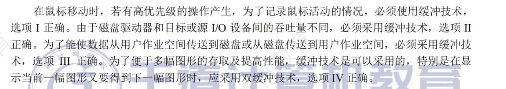
14. A
15. D?
16. B
    设备分配，从 SDT--DCT--COCT--CHCT，怎么记住这个逻辑
    你的进程喊着“我要一台打印机”。OS 首先去查全系统的总目录（SDT），看看公司里到底有没有你要的这号设备，并找到这台设备的“个人档案”放在哪。
    拿到这台打印机的个人档案（DCT），看看它现在有没有空（BUSY 还是 FREE）。如果有空，把它分配给你。但打印机是个底层打工人，它还得向它的直属领导汇报！档案里写着它的领导是谁。
    顺着档案找到管这台打印机的 I/O 控制器（COCT）。问这个控制器经理现在忙不忙。如果不忙，控制器也批给你了。但经理上面还有大老板！
    最后，找到掌管总线大权的大老板——通道（CHCT）。问大老板现在这条传输马路空不空。如果连大老板也点头了，这条从你到打印机的通路才算**彻底审批通过**！
17. A？
    共享设备的定义：一个时间间隔内，可被多个进程同时访问的设备。所以只有磁盘满足？为什么？
    **为什么磁盘行？** 磁盘是**直接存取设备（DAM）**。进程 A 读第 1 扇区，进程 B 读第 100 扇区。磁头只要“唰”地一下飞过去就能切替服务。在 1 秒钟内，磁头在 A 和 B 之间来回横跳了 50 次。对 A 和 B 来说，它们觉得自己在“同时”共享这块磁盘。 * **为什么打印机（独占设备）不行？** 打印机是输出在实体纸张上的。如果进程 A 打了一半，进程 B 强行插队交替，那打出来的一页纸上，上半段是 A 的情书，下半段是 B 的辞职信，这纸直接废了！所以打印机必须**“一口气干完一个人的活，再干下一个”**，绝对不能交替，只能独占。
18. A?
    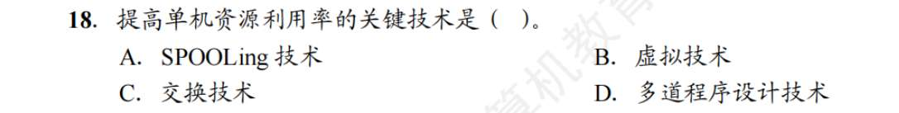
    什么叫提高单机资源利用率，这些不都挺重要吗。
    **多道程序设计诞生：** 它的核心思想就是**“并发”**。程序 A 读硬盘发呆时，OS 立刻把 CPU 抢过来给程序 B 用！这是计算机发展史上最伟大的一次革命，**直接把单机资源利用率从个位数拉到了 90% 以上！** * **降维打击其他选项**
19. C
    清楚了共享设备的定义，以及打印机并不是共享设备，才能知道，SPOOLING 技术是将独占设备改造为共享设备
20. B
21. A
    脱机”二字是怎么来的？
    这里的“机”，特指**“主机（主 CPU）”**！
22. A?
    SPOOLing 不需要外围计算机
23. A?
    SPOOLing 系统由预输入程序、井管理程序和缓输出程序组成
24. B
25.  D?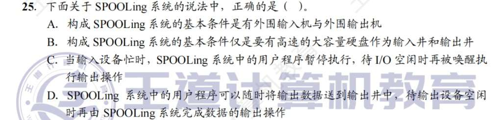
	C“没有 SPOOLing 的原始时代（同步阻塞 I/O）”**！如果输入设备忙，进程就只能暂停（阻塞挂起），死等设备空闲
	**D 选项在描述什么？** 完美描述了 **SPOOLing 输出井的工作原理**。用户进程随时随地把数据往“输出井（磁盘）”里一扔，就当做打印完了。至于打印机什么时候空闲、什么时候真正打到纸上，那是 SPOOLing 后台系统（输出进程）操心的事情，用户进程早跑去干别的了。
26. B
    SPOOling 系统加快了作业执行的速度，这个说法是正确的。但我觉得很模糊。因为一个打印作业，所完成的时间应该就取决于作业内容和打印机，所以速度应不变。但宏观来看有多个作业，SPOOLing 又让整体速度加快了
    **为什么说“作业执行速度”加快了？** 因为对于**你的程序（作业）**来说，它把数据丢进磁盘的那一刻，它关于“打印”的这行代码就已经**执行完毕**了！它在 CPU 和内存里驻留的时间被极大地缩短了。
27. A?
    SPOOLing 空间换时间
28. D
    磁盘不是物理设备吗？SPOOLing 中，代替打印机的部分由物理设备完成不对吗？答案是虚拟设备，也对，这里软件上来讲磁盘也是虚拟设备的载体，总感觉在考语文
29. D，静态、动态分配
30. B?
31. C?
    谁最懂底层寄存器？**设备驱动程序**！大管家（独立性软件）是不屑于干这种脏活的。
    **检查用户是否有权使用：** 典型的安检员工作。**设备独立性软件**负责在下发任务前做全局统筹和安全校验。
    **将二进制转成 ASCII 打印：** 这种纯排版的计算活儿，是谁干的？是 C 语言库函数（比如 `printf`）！属于**用户层 I/O 软件**。进入内核之前就干完了。
    **V. 缓冲区管理：** 咱们上个回合刚盘过，分配内核缓冲、管理缓冲池，都是**设备独立性软件**这个大管家的本职工作。
    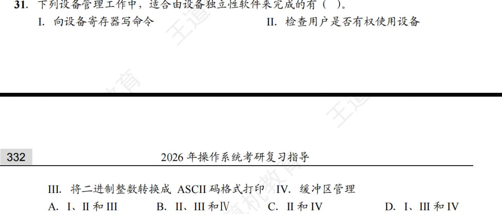
32. A?
    现在的驱动程序 95% 都是用 **C 语言** 写的（比如 Linux 内核的驱动）。只有极少数对时序要求苛刻的代码才用汇编
    **驱动可以在任意操作系统运行？** 错得离谱！你见过把 Windows 的显卡驱动装在 Mac 上的吗？驱动是要调用 OS 内核接口的，与 OS 密切相关
    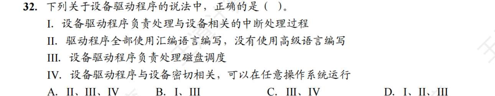
33. B?
    驱动程序是个没感情的搬砖机器！你让它读磁盘，它只负责把 0101 的电平信号搬进内存。它管你读出来的是苍老师的电影，还是操作系统的内核代码？它根本不管，也**不具备“分析数据内容”的能力**！数据分析是用户态的应用程序（如播放器、Word）干的事。
    A 选项的后半句**“检查合法性”是驱动程序的真·本职工作**！管家检查的是“权限（你是谁，能不能用）”；驱动程序检查的是“物理合法性（你要读第 1000 个扇区，但我这块破硬盘一共才 500 个扇区，不合法，驳回！）”。
    
34. 
    **④ 将抽象要求转化为具体要求（先搞懂要干啥）：**
    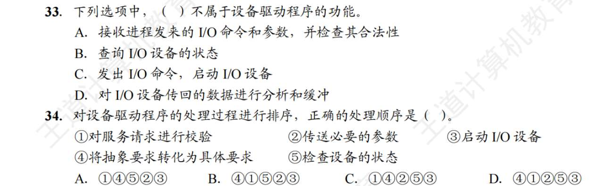
35. 
    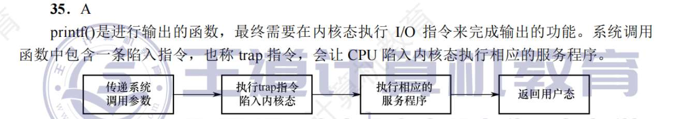
36. A
37. A
38. 
    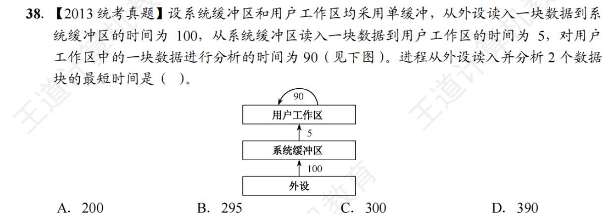
    对于单缓冲处理 $n$ 个数据块，总耗时 = **第 1 块的完整时间 + 后续 $(n-1)$ 块的周期时间**。

	- 第 1 块完整时间 = $T + M + C = 100 + 5 + 90 = 195$。
	    
	- 后续每块的周期（咱们上回合推导的木桶原理） = $\max(T, C) + M = \max(100, 90) + 5 = 105$。
39. C
40. A
41. D? 为什么说 SPOOling 需要多道程序设计技术的支持？看过到很多次这个名词了，它都有什么考点
    如果没有多道程序设计（也就是单道时代），系统里同一时刻只能跑一个程序！要么跑你的用户程序，要么跑后台守护进程。它俩根本没法“同时”存在并交替干活。既然不能并发，SPOOLing 那套“前台丢数据，后台慢慢打”的魔术就彻底破产了
    
42. D?
    
43. B
    底层的控制方式不同，驱动程序的源代码结构可谓天差地别！驱动程序与 I/O 控制方式**绝对是强相关的**。
    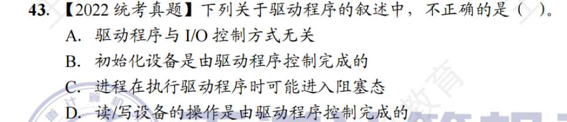
    
44. D?
    设备类型、访问权限、占用状态、逻辑设备与物理设备的映射
45. D
    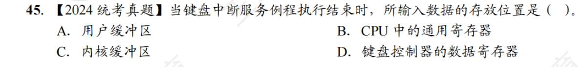
- **键盘控制器的数据寄存器（D 选项）：** 这是纯硬件！敲击瞬间，硬件电平把 "A" 的 ASCII 码存到了这。但如果下一秒你敲了 "B"，这个寄存器就会被无情覆盖！
    
- **中断服务例程的紧急救援：** CPU 收到键盘中断，赶紧放下手头的活，跳到中断程序。这个程序的第一要务，就是用 `IN` 指令把 "A" 从那个随时会覆灭的硬件寄存器里救出来，读进 CPU 寄存器。
    
- **转移阵地（为什么选 C）：** CPU 的寄存器（B 选项）马上就要去干别的事了，数据不能呆在这。中断程序把它转移到了操作系统的**内核缓冲区**里存起来！
    
- **为什么不是用户缓冲区（A 选项）：** 中断程序是底层的无情机器，它根本不知道此刻按键是给 Word 用的，还是给浏览器的。它只负责把键盘输入先统一收进内核的“大池子”里。等操作系统慢慢调度，发现 Word 正在等输入，才会把数据从内核缓冲区拷贝到 Word 的用户缓冲区‘

# 磁盘
1. B
2. D
3. A?
   能直接访问或随机访问的本质原因是什么？不能的又是什么？辨析下磁带磁盘光盘 U 盘等
4. A
5. D?
6. A?
7. A?
   对磁盘读写时间影响最大的是寻道时间
8. B?
   硬盘就是磁盘对吧，出厂时自带的 ROM 是小引导程序，然后低级初始化，高级初始化都发生了什么，何时发生，有哪些考点
9. D?
   每个扇区里包含的扇区号等基础信息，是出厂时商家创建的，叫低级格式化
10. C?
    扇区数据的处理时间主要影响传输时间。文件的物理结构就包括磁道上的存放方式（连续分配还是交替分配）
11. D?
    移动磁头的延迟，即寻道时间，最影响磁盘 IO
12. C
13. D
    先来先服务不会出现饥饿现象！SSTF（最短寻道时间优先）才是
14. B
15. B
16. B
17. ?
    T+r 是读写一个磁道的时间
18. C
19. C
20. D
21. C
22. C
23. C
24. D
25. D?
    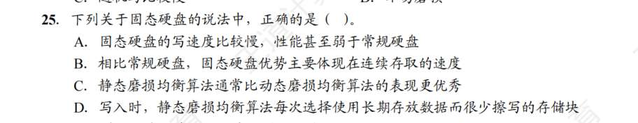
26. D
27. A
28. B?
    
    
29. C
30. B?
31. 
    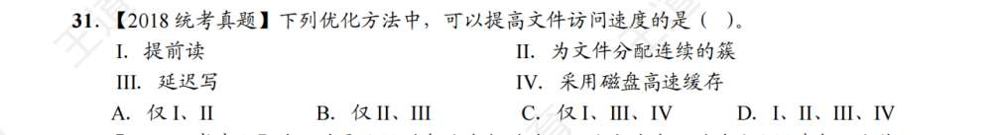
32. A
    - **概念翻译：** “磁头臂黏着（Arm Stickiness）”其实就是**“局部极度饥饿”**的变种。假设磁头现在停在第 50 道，突然有一个流氓进程，疯狂地、源源不断地向第 50 道发出读写请求。
    
	- **为什么 SSTF、SCAN、C-SCAN 会中招？** 这三个算法都是**“空间（距离）优先”**的！它们一看：“哎呀，这有个请求就在我脚下（距离为 0），顺手干了吧！”结果刚干完，脚下又冒出一个。它们就会一直停在第 50 道疯狂接客，**磁头就像被强力胶“黏”在了这一个磁道上**，其他磁道的请求全被饿死了。
	    
	- **为什么 FCFS 是免疫的？（所以选 A）** 因为 FCFS 是个**“只看时间，不看距离的铁憨憨”**。它严格遵守排队纪律。即使第 50 道涌来了 1 万个新请求，只要在这些请求到来之前，有一个第 900 道的请求排在前面，FCFS 也会毫不犹豫地离开 50 道，长途跋涉去 900 道！
33. C
34. C