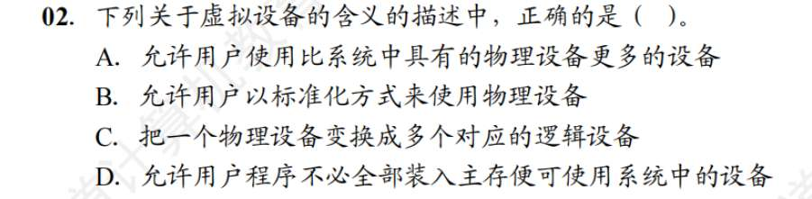
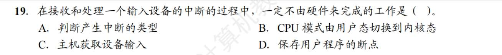

1. C?
   共享设备必须可寻址和可随机访问。关于寻址、随机访问，还有哪些知识点？
   块设备 (Block Device) —— 必须支持“随机寻址”,**代表：** 磁盘、U盘、固态硬盘。
   
2. B?
   
   虚拟设备是，将一台独占设备转换为若干逻辑设备，怎么做到的？引入虚拟设备是为了客服独占设备速度慢、占用率低的特点。
   虚拟设备（SPOOLing）3 个进程以为自己都独占了一台高速打印机（3 台逻辑设备），实际上底层只有一台慢吞吞的物理打印机在吭哧吭哧干活
3. D？
4. A?
   控制命令由设备控制器（就是 IO 接口吧？）提供？怎么提供的。突然发现我有个困惑，我之前以为 N 个设备就有 N 个 IO 接口，现在看来是一个 IO 接口，这个 IO 接口有 N 个与外设的端口？ 
   这里的“提供”，其实是指**“向下（向物理设备）发放具体的电气指令”**
   第二个想法正确，- 你的主板上只有一个 USB 控制器（I/O 接口）。但是它后面可以接一个 USB 扩展坞，上面插着鼠标、键盘、U 盘、打印机（N 个外设）。CPU 把数据和控制命令发给 USB 控制器时，会附带一个“子设备地址”。USB 控制器看到后，会在内部做路由，把这个命令精准分发给那个鼠标。
5. C
6. A
7. B?
   通道是硬件技术?
8. C
9. B
10. D
11. B?
    在预处理 DMA 之前，请求 IO 的进程进入内核态。怎么还这么考，我怎么知道啥时候内核啥时候用户，怎么区分？  “负责预处理的进程是请求 IO 的进程，负责后处理的进程是中断服务例程”这又啥意思？为什么？  为什么预处理阶段请求 IO 的进程处于运行态，后处理阶段处于阻塞态
    凡是涉及到“直接摸硬件”或者“分配系统公共资源”的操作，100% 必须在内核态！
    用户态能干啥？ 只能在自己的内存小单间里做纯算术逻辑运算（加减乘除、while 循环、字符串拼接）。
    预处理（填任务单）—— 状态：运行态 (Running) 你的 C 语言程序（**请求 I/O 的进程**）通过系统调用进入了内核态。此时，**CPU 正在执行这个进程的代码**。
    等待期（苦逼等数据）—— 状态：阻塞态 (Blocked)
    你的进程发现自己没数据算不下去了，它主动调用 `block()` 原语，把自己挂起，把 CPU 让给别的程序。此时，你的进程进入了**阻塞态**。
    后处理（结账收尾）—— 状态：依然是阻塞态！DMA 把 10000 个字传完了，发出 `INTR` 中断！CPU 瞬间切到**中断服务例程 (ISR)** 去处理。**注意！这是谁的代码？** 这个 ISR 是操作系统的公共代码，**它不属于你的那个进程！**
12. A?
13. 
    **绝对号（绝对设备名 / 物理设备名）：** 系统里这台设备的**真实、唯一物理身份证号**（比如 `MAC地址`，或者主板上的 `端口号 0x3F0`）。不管谁来用，它就是它，是系统统一编号的。这就是题干描述的东西。
    **相对号（相对设备名 / 逻辑设备名 / 符号）：** 用户程序自己随便起的名字（比如代码里的 `Printer_1`）。
14. A?
    通道控制设备控制器，设备控制器控制设备工作（设备控制器就是 IO 接口，确认下对不对 ）
    对于一组命令，CPU 要么给通道发命令要么给设备控制器发命令
15. C
16. D？
    
    
    1. **系统调用参数（上层黑话）：** 比如 `write(fd, buffer)`。这里的 `fd`（文件描述符）是个纯粹的逻辑代号（比如数字 3）。
    
	2. **设备独立性软件（中介翻译）：** **驱动程序是根本听不懂什么是 `fd` 的！** 驱动程序只认硬件。所以，必须由“设备独立性软件”去查一张系统表（打开文件表），把抽象的 `fd = 3`，**翻译**成统一的标准内部命令：“请向逻辑设备 U盘 的第 10 扇区写入数据”。——**这就是题目里说的“将系统调用参数翻译成设备操作命令”！**
	    
	3. **设备驱动程序（终极苦力）：** 驱动程序拿到独立性软件发来的“设备操作命令（写第 10 扇区）”后，再把它转换成硬件引脚上的高低电平和寄存器指令（比如算出来对应哪个柱面、哪个磁头），**负责“执行”这个命令**。
	    
	
	**总结我的翻车点：** 我把翻译过程的“最后一步”当成了全部。在 OS 考研题中，**“翻译系统调用参数（fd）”是独立性软件的专属 KPI**，驱动程序只负责“执行”独立性软件下发的标准命令。你的答案解析 说的“根据设备类型选择调用相应的驱动程序”，正是独立性软件干的活。
17. C
18. A?
19.  A
    
    这里说的“中断类型”，**不是**让你去分类它是“内中断还是外中断”，而是指**“到底是几号中断（中断类型号/向量号）”**！
    主机获取设备输入**是软件干的？** 当硬件把各种准备工作（找入口、切状态、存断点）都做完后，CPU 终于跳转到了**中断服务程序（ISR 代码）**里。在这小段代码里，程序员写了一条类似 `IN AX, 0x60`（从 60 号端口把键盘敲下的那个字母读进 AX 寄存器）的指令。
20. D?
    程序直接控制方式下，进程不会被阻塞，这才有 CPU 一直沦轮询，对 CPU 来说它堵塞了！而 DMA 和中断，是进程堵塞，CPU 不堵塞？
    
    
    - **“进程阻塞”是一个软件概念**：指的是进程放弃了对 CPU 的竞争，去休息室睡觉了。这是一种**极其高尚的让贤行为**，是为了提升整体效率！
    
	  - **“CPU 阻塞（空转）”是一个物理现象**：指的是 CPU 满头大汗地在原地踏步，做无用功。
21. B?
    多重中断！
22. A
23. B
24. B
25. A
26. B