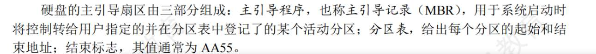

- 分扇区：由厂家完成，叫低级初始化。每个扇区留出装数据的地方，和头部尾部装信息的地方
- 分区: **操作系统（OS）的安装程序干的**，在逻辑上将不同柱面分一个区域。
- 创建文件系统：操作系统（OS）干的，高级初始化，创建文件系统即FAT 表、根目录区、空闲位示图

以时间为单位，那个 ROM 里的自检程序，到底怎么起作用的？

1. 检查 CPU、内存、显卡有没有插好，有没有烧坏。如果有问题，主板会“滴滴滴”报警。
2. 去寻找你插在主板上的第一块硬盘，然后把这块硬盘的**绝对物理第 0 号扇区（MBR，主引导记录）**那 512 个字节，无脑读进内存里！
	1. 刚买回一块**纯白板**的全新硬盘时，里面确实既没有分区，也没有文件系统，更没有 OS 和 Bootloader。BIOS 自检完后，按 F12去读 U 盘，U 盘里的程序把这些全写好。此时就是
3. BIOS 完成历史使命，把 CPU 控制权交给这 512 字节的代码。
4. Bootloader去 C 盘的特定目录（比如 `C:\Windows\System32`）里，找到了操作系统的“内核程序 (Kernel)然后把 CPU 控制权交给 OS。

- Master Boot Record，主引导记录：整块物理硬盘的**绝对第 0 号扇区**，产生于“磁盘分区”的时机。
- 操作系统引导扇区：每个独立分区（比如 C 盘）的**第 0 号扇区**！产生于“高级初始化（格式化）”的时机**

**1. 物理格式化（低级初始化 / 低级格式化）**

- **时间：** 硬盘出厂前，由厂家完成（或者由磁盘控制器完成）。
    
- **发生了什么（绝对硬件层）：**
    
    - 原本空白的磁质盘片，被强行划分为一个一个的**扇区（Sector）**。
        
    - 每个扇区不仅留出了装数据的 512 字节，还会被加上**头部和尾部**（包含扇区号、校验码 CRC 等）。
        
    - 工厂会把坏掉的扇区标记出来，用备用扇区替换（坏块管理）。
        

**2. 磁盘分区 (Partitioning)**

- **时间：** 你装系统时（比如分出 C盘、D盘）。
    
- **发生了什么：** 操作系统把一整块物理磁盘，在逻辑上切成了几个独立的区域。这会在磁盘的最开头写下**分区表**。
    

**3. 逻辑格式化（高级初始化 / 高级格式化）**

- **时间：** 你对着 D 盘右键点击“格式化”时。
    
- **发生了什么（绝对软件层）：**
    
    - 操作系统在这个分区里**创建文件系统（File System，如 FAT32、NTFS）**。
        
    - 它会在盘里建立一堆极其重要的 OS 管理数据结构：**根目录、空闲盘块链表/位示图、文件分配表（FAT）等**。
        
    - **考点预警：** 逻辑格式化**绝对不会**去改变物理扇区的大小，它只是在盘里写入了操作系统的“账本”。
        

**4. 纠正一个关于引导程序（ROM）的细节：**

- 你说的“出厂自带的 ROM 小引导程序”其实分两部分：
    
    - **主板上的 ROM (BIOS)：** 这里面确实装了开机第一瞬间执行的自检程序。
        
    - **磁盘扇区 0 (主引导记录 MBR)：** 当低级格式化和分区做完后，装系统时，会在磁盘的绝对第 0 号扇区（最开头）写入一小段**“引导块（Boot Block）”**代码。BIOS 自检完后，就是把这个引导块读进内存来启动操作系统的！