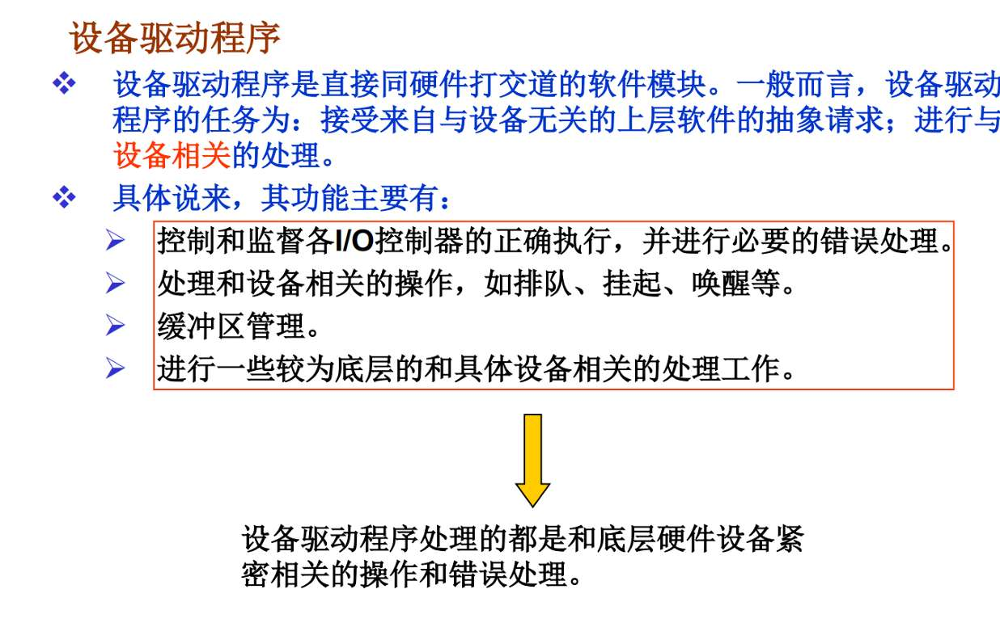
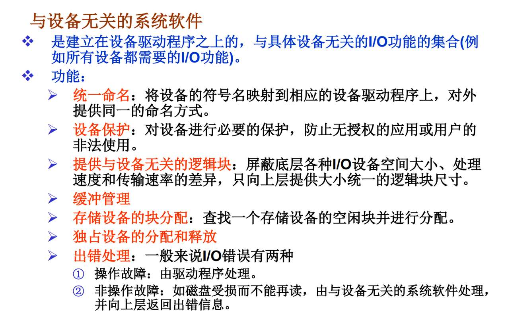

机械盘 结构 原理 时间，寻道 旋转延迟 数据传输（时间短）
磁盘调度算法
设备管理，管理方式io，设备分类，io软件组成（考）
缓冲区是什么 为什么要 干什么的 怎么干

# 磁盘

直观感受了
- 磁头臂、磁头
- 磁盘
	- 磁道
	- 扇区（磁盘块）
- 盘面
- 柱面

# IO设备分类
块设备，以数据块为单位组织和传送数据信息，传输速率高，可寻址（即可随机地读/写，，随机地写我明白 随机的读意义何在？ 哦 意思是时间复杂度o1吗？）
- **磁带（字符设备/顺序设备）**：你想听第 10 首歌，必须快进，把前 9 首的磁带卷过去（顺序访问）。
    
- **硬盘（块设备）**：你想读第 1000 块，磁头可以直接“飞”到那个位置（直接访问/随机访问）。虽然有寻道时间，但比卷磁带快多了
1. **随机读的意义**：
    
    - 没有随机读，**虚拟内存**就无法实现（缺页时，系统需要精准地把第 X 页调入内存，不可能把硬盘从头读一遍）。
        
    - 没有随机读，**数据库**就废了（查询一条记录需要遍历全库）。
        
    - **文件系统**（上一章的内容）全是建立在“块设备可寻址”的基础上的。
字符设备：键盘、鼠标、**打印机**、串口。单位是“字符”，不可寻址（你不能对键盘说：请把刚才输入的第3个字重读一遍），通常用中断方式传输。

还可以纯粹按照速度分为低、中、高速  不过中高速就是块设备吧？打印机、磁盘（相对键盘、鼠标这种字符设备一定很快了）
**错！打印机是特例！**

- **低速**：键盘、鼠标（每秒几个字节）。 -> **字符设备**。
    
- **高速**：磁盘（每秒几百兆）。 -> **块设备**。
    
- **中速**：**打印机**（激光打印机每秒也能吐不少数据）。
    
    - **陷阱**：虽然它不慢，但**打印机通常被归类为“字符设备”**（或者流设备）。
        
    - **原因**：你发给打印机的是数据流，你不能指挥打印机“请把纸上第 5 行第 8 个字擦掉重写”。它是一去不复返的。

资源分配角度：独占设备、共享设备、虚拟设备。 
假脱机我觉得我理解的不到位，这个是不是也叫缓冲区？ 打印机的速度和cpu速度不一样，要假装让cpu以为他完成了打印，打印机本身慢慢打印，引入一个中间人，缓冲区？
- **组成**：
    
    1. **输入井 / 输出井**：这是**在磁盘上**开辟的两大块区域。（注意：不是内存！是磁盘！）
        
    2. **输入进程 / 输出进程**：操作系统后台的守护进程。
        
    3. **井管理程序**。
        
- **流程（以打印为例）：**
    
    1. **用户进程请求**：用户 A 说“我要打印”。
        
    2. **拦截**：操作系统说：“打印机现在忙，但我收下你的请求了。”
        
    3. **写盘（Output Well）**：操作系统把 A 要打印的数据，快速写到**磁盘上的输出井**里。
        
    4. **假装完成**：操作系统立刻告诉 A：“打印完了，你可以干别的了。”（A 很高兴，CPU 释放了）。
        
    5. **实际打印**：后台的 **SPOOLing 进程**（输出进程），在打印机空闲时，慢慢地从**磁盘输出井**里读数据，发给打印机。
        

#### 3. 为什么 SPOOLing 不等于 缓冲区 (Buffering)？

这是高难度考试的**辨析题**。

- **位置不同**：
    
    - **缓冲区 (Buffer)**：通常在**内存 (RAM)** 里。
        
    - **SPOOLing**：核心在**磁盘 (Disk)** 的输入/输出井里。
        
- **目的不同**：
    
    - **缓冲区**：为了缓和 CPU 和 I/O 设备之间的**速度差异**（比如 CPU 产生数据太快，暂停一下等磁盘）。
        
    - **SPOOLing**：为了**设备虚拟化**。它允许 100 个进程同时发起打印请求，系统全收下来存在磁盘里，然后慢慢排队打。如果没有 SPOOLing，第 2 个进程就会直接报错或阻塞。
- **中间人**：是 **磁盘**（输出井）。
    
- **本质**：把**独占设备**（物理打印机）变成了**逻辑上的共享设备**（每个进程都以为自己拥有一台打印机）。
    
- **关键区别**：它用**磁盘**做缓存，而普通 Buffer 用**内存**做缓存。

# IO软件
组成部分，
- IO交通管制程序
- IO调度程序
- IO设备处理程序

额，可是我之前学的是
- 系统调用程序接口
- 设备独立性软件
- **设备驱动程序**
- 中断处理程序

  
PPT的描述中 怎么设备驱动程序像管理的 很忙的样子 都没体现出软件翻译硬件  
这个所谓与设备无关的系统软件就是设备独立性软件吧。话说为什么叫这个名字，以及终于能看出他的管理任务了。 但好像与设备驱动有点重合啊

1. **翻译是核心，但硬件太笨、太慢**：
    
    - 上层发来命令：“读100号块”。
        
    - 驱动程序不能只对着硬盘喊一声“读！”就完了。硬盘可能正在转，或者正在读别人的数据。
        
    - **排队 (Queueing)**：驱动程序必须维护一个**设备内部的队列**（比如电梯算法就是在驱动层或者紧挨着驱动层实现的），决定先执行哪个指令能让磁头少跑路。
        
    - **挂起/唤醒**：硬盘读数据要 10ms，这对 CPU 来说是 1000万年。驱动程序必须发出指令后，把当前进程**挂起**（让出CPU），等硬盘转好了发中断过来，驱动再负责**唤醒**进程。
        
2. **缓冲区的真相**：
    
    - PPT 里说的“缓冲区管理”，在驱动层指的是**硬件缓冲区**或**DMA 缓冲区**。
        
    - 硬盘读出来的数据，不能直接扔给用户，必须先放在驱动程序能控制的一小块内存里（DMA区域），然后再拷贝走。
**总结**：  
驱动程序确实在“管理”，但它管的是**这一个设备的“吃喝拉撒”**。它必须处理硬件的延迟、状态和物理细节。**它是硬件的“全职保姆”。**

### 二、 为什么叫“与设备无关的系统软件”？（Device-Independent Software）

> **你的疑惑**：为什么叫这个名字？

**核心逻辑**：  
因为这一层代码，**写一次，到处跑**。它**完全不包含**任何特定硬件的代码。

- **举例**：
    
    - 你买了一个希捷硬盘，装了一个驱动。
        
    - 你又换了一个西部数据硬盘，装了另一个驱动。
        
    - 但是！操作系统里负责“判断文件权限”、“给文件分配空闲块”、“管理缓存”的那部分代码，**完全不需要改动**！
        
    - 这部分代码**不关心**你下面挂的是希捷还是西数，甚至不关心是机械硬盘还是 SSD。只要你是“块设备”，我就按统一的逻辑管理你。
        

**所以它叫“与设备无关”**：它的存在就是为了**屏蔽**下面驱动程序的差异，给上面提供一个统一的接口（比如 read()、write()）。

### 三、 致命重叠：为什么两层都在搞“缓冲”和“报错”？

这是你最晕的地方。请记住：**名字一样，层级不同，粒度不同。**

#### 1. 关于“缓冲管理” (Buffering)

- **设备独立性软件层**：
    
    - **管的是**：**全局缓冲池 (Buffer Cache)**。
        
    - **动作**：比如高速缓存。用户要写 10KB 数据，这层软件把数据扣在内存里，凑够了 4KB 才发给驱动。它不知道硬盘怎么转，它只管**攒数据**。
        
- **设备驱动程序层**：
    
    - **管的是**：**本地专用缓冲 (Local Buffer)**。
        
    - **动作**：硬盘控制器一次只能吃 512 字节。驱动程序得把上面发来的 4KB 切碎，或者放入 DMA 专用的内存区域，防止数据丢包。
        

#### 2. 关于“错误处理” (Error Handling)

- **设备驱动程序层（底层错误）**：
    
    - **管的是**：**可重试的物理错误**。
        
    - **场景**：校验和错误（CRC Error）。
        
    - **动作**：驱动程序悄悄地**重试** 3 次。如果成功了，它就不告诉上面，假装无事发生。这是**硬件层面的补救**。
        
- **设备独立性软件层（高层错误）**：
    
    - **管的是**：**逻辑错误** 或 **彻底的物理损坏**。
        
    - **场景**：驱动程序重试了 10 次都失败了，汇报上来“老大，这盘废了”。
        
    - **动作**：独立层软件向用户报错：“I/O Error，文件写入失败”。或者处理“权限不足”、“文件不存在”这种逻辑错误