线性表对数据的操作：
创销，增删查改

# 顺序表

静态分配：需要声明 data `[maxsize]` ，然后地址就固定不变
动态分配：顺序表满后，可使用 malloc 拓展顺序表的最大空间，即地址是可变化的（但需要将数据元素复制到新的存储区域，并用 free 函数释放原区域）
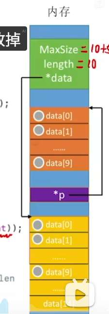
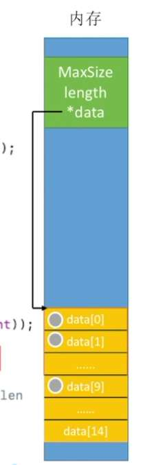

## 操作
插入：
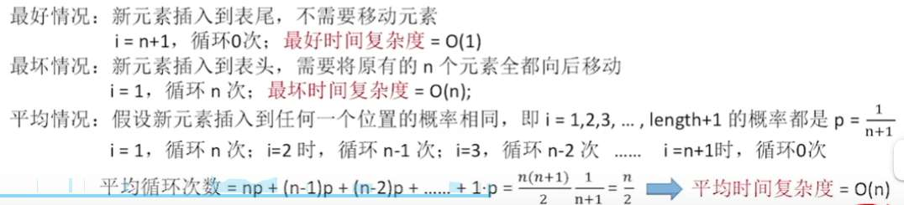删除：
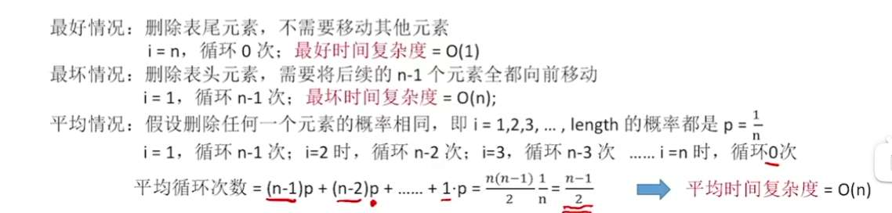查找：
- 按位（位置）查找是 O (1)
- 按值查找是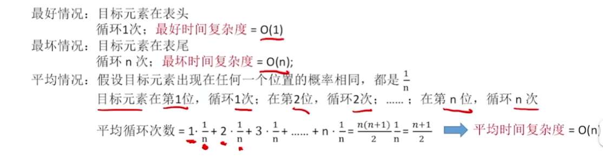

# 链表 

## 初始化
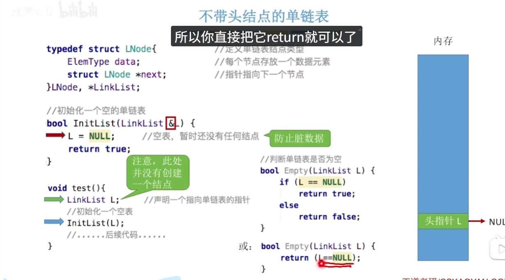

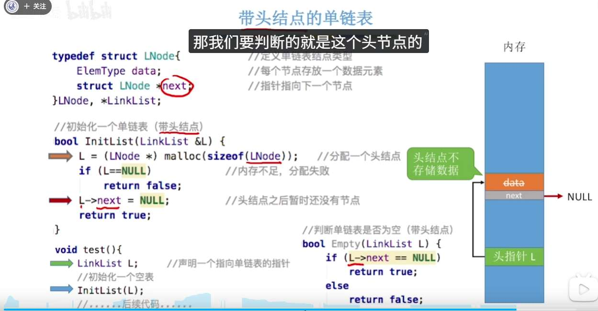

## 插入

### 按位插入
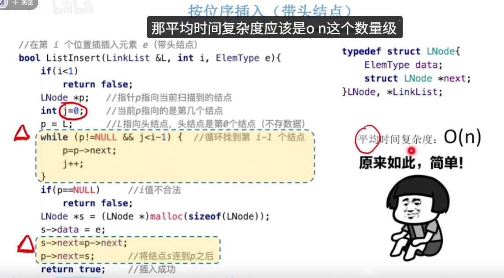
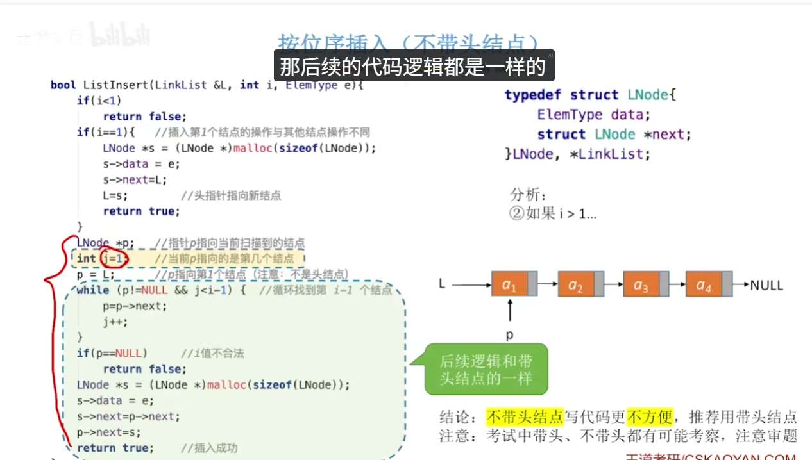
### 前插后插
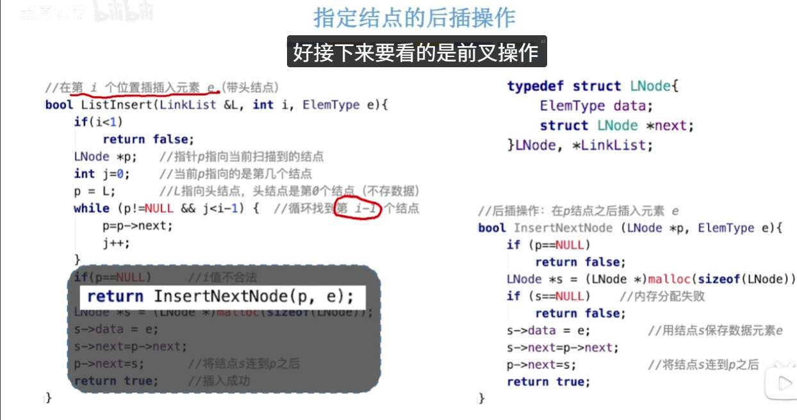

对于前插，我们让数据移动
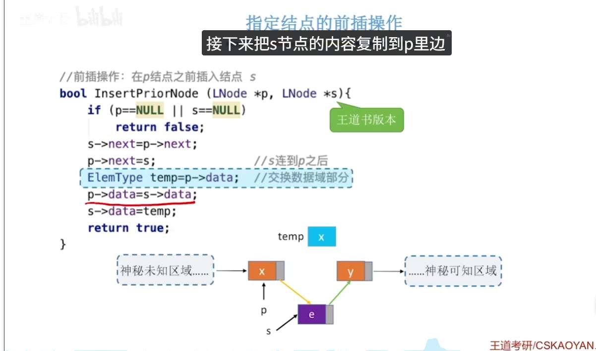

## 删除

### 按位删除 
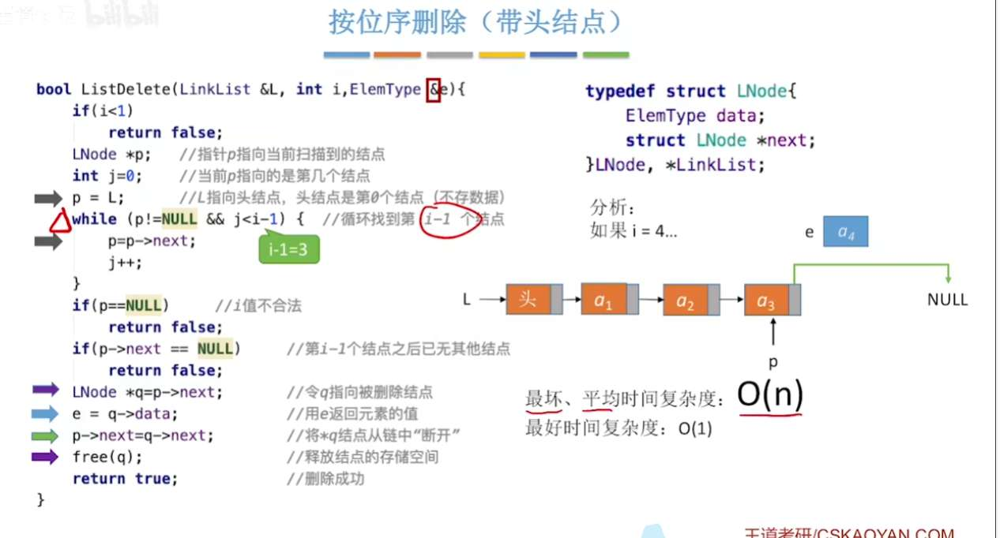
### 按指定结点删除
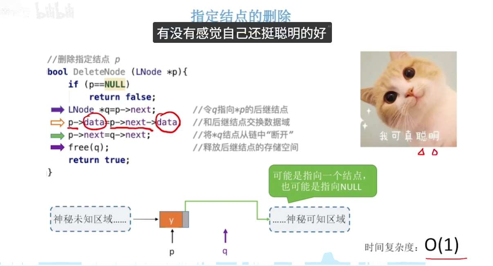

## 查找

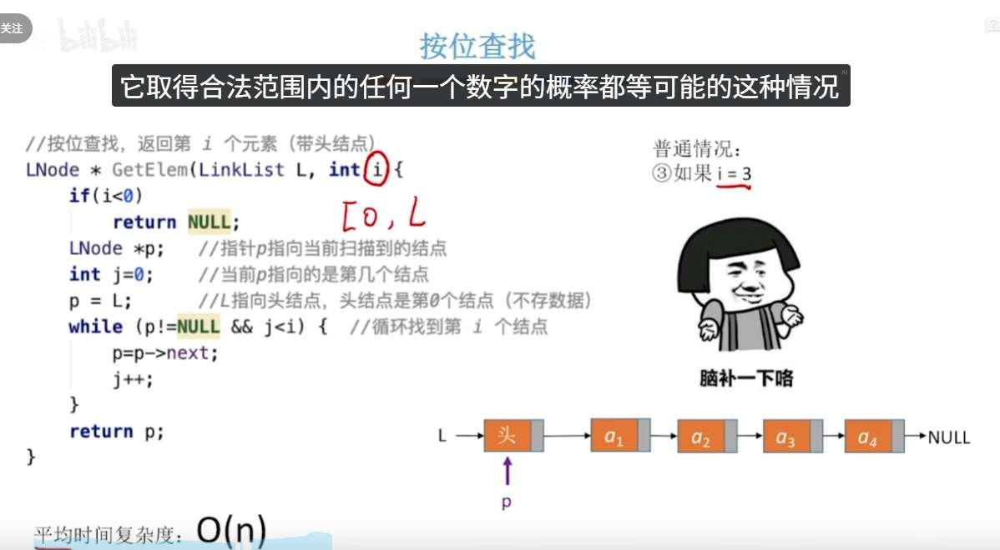

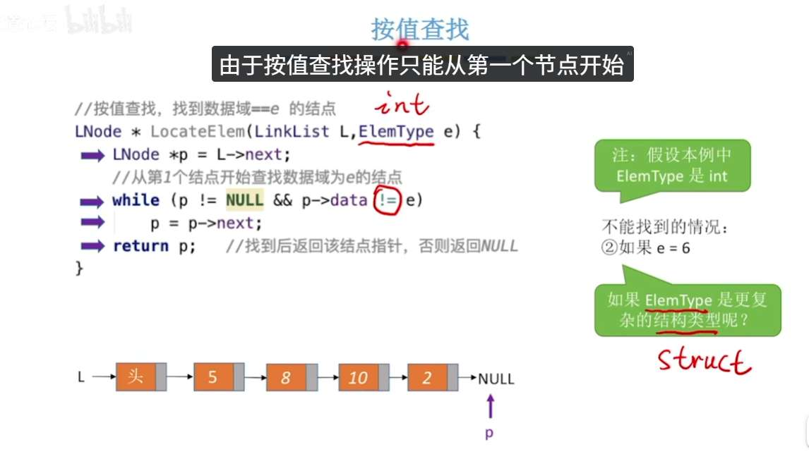