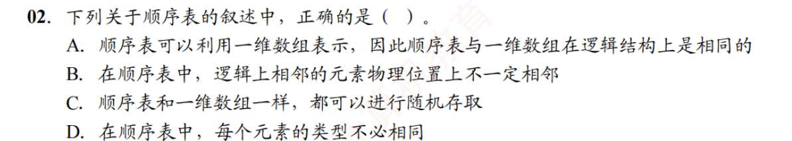

# 线性表
1. D
   线性表是由具有相同数据类型的有限数据元素组成的，数据元素是由数据项组成的
2. D?
   线性表要求数据类型相同，且有限序列
3. A
4. A

# 顺序表
1. A?
   对于逻辑结构的存储表示，若逻辑结构是树，显然顺序表不如链表
2. C,, A?
   一维数组和线性表的区别
   线性表有两种常见的实现方式：用数组实现（叫**顺序表**），或者用指针实现（叫**链表**）
   线性表是逻辑结构，一维数组是实现线性表的一种物理结构。
   然而，一维数组完全也可以存储不同类型的元素，此时它就不是线性表的载体。毕竟它只是个物理容器，爱咋样咋样
3. C
4. B, 元素的类型，元素中字段的类型？字段又是啥
   **元素 (Element)：** 线性表中的一个完整数据单元。比如一个班级花名册（线性表），里面的“每一个学生”就是一个元素。
   **字段 (Field)：** 也叫属性或成员。如果一个“元素”很复杂（比如在 C 语言中是一个 `struct` 结构体，或者 Java 中的一个对象），那么组成这个元素的各个小数据项就叫字段。
5. D
6. B?
   指定序号！即指定位置
7. C? 删除结点后，剩下的结点是前移还是后移
   前移！
8. B？
   对于交换元素值，顺序表比链表快，对于顺序输出 n 个元素的值，都一样。
9. C
10. C
11. C
12. D
13. D