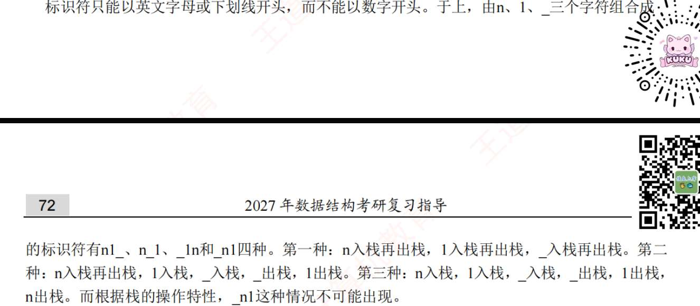
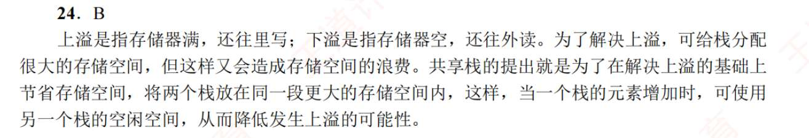
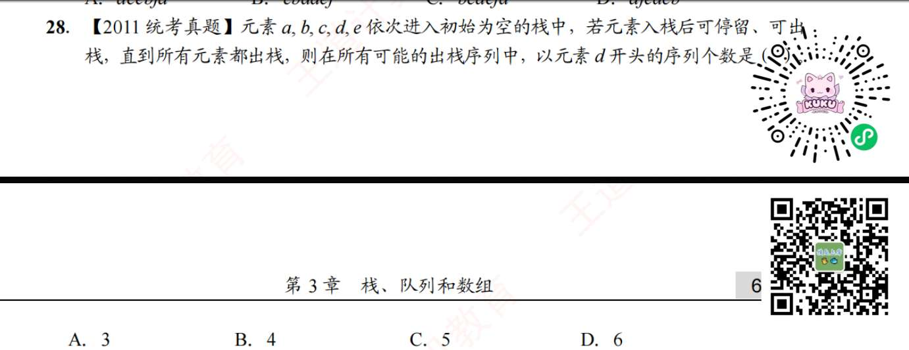
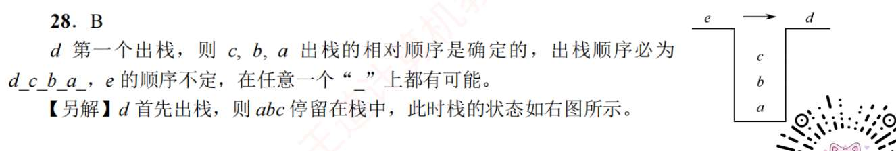
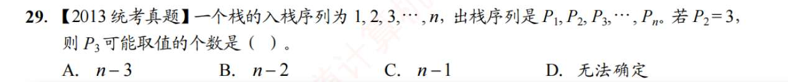
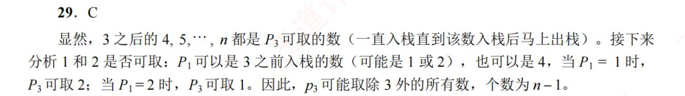
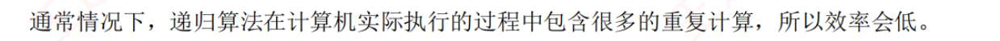

1. C
   栈和队列逻辑结构相同
2. C
3. D?
   基本操作：增删查改，创销
4. C
5. B
6. A
7. A
8. A
9. C?
10. C
11. D
12. A
13. B
14. D
15. A
16. D
17. D
18. D
19. C
20. C,
21. C,
    ### 入栈无序，出栈有序（第 20、21 题）

	这两题是把上一种情况**反过来了**：输入序列未知，但要求输出必须是完美的 `1, 2, 3...`。
	
	既然题目反过来了，我们的口诀也要反过来！
	
	**全新秒杀规律：“中-大-小”禁忌法则**
	
	为了能让栈顺利吐出完美的 `1, 2, 3...` 升序，**入栈序列绝对不能出现“中-大-小”的排列格局。**
	
	（也就是说，不能有三个数 $a, b, c$ 满足 $b > a > c$ 的顺序进入栈中，这在数学上叫避免 `2-3-1` 模式）。
	
	不用管原理，直接拿这个禁忌去套：
	
	**秒杀第 20 题：**
	
	已知入栈序列是 $P_1, P_2, 1, \dots$（因为 $P_3 = 1$）。
	
	问：$P_1$ 可能是 2 吗？
	
	- 假设 $P_1 = 2$，那序列开头就是 `2, P_2, 1`。
	    
	- 既然 1 和 2 都用了，$P_2$ 只能是比 2 大的数（比如 3、4）。
	    
	- 现在的入栈序列变成了：**`2, (比2大的数), 1`**。
	    
	- 发现没有？这就是典型的**“中-大-小”**格局！触发禁忌！
	    
	- 所以 $P_1$ **绝对不可能**是 2。秒选 **C**。
	    
	
	**秒杀第 21 题：**
	
	已知入栈序列是 $P_1, P_2, 3, \dots$（因为 $P_3 = 3$）。
	
	问：$P_1$ 可能是多少？
	
	- 我们试试 A 选项：假设 $P_1 = 2$。序列开头是 `2, P_2, 3, ...`。
	    
	- 如果我让 $P_2 = 1$，序列变成 `2, 1, 3`。
	    
	- 检查一下有没有触发“中-大-小”禁忌？
	    
	    - 这里只有 `2, 1`（中-小）和 `1, 3`（小-大）。
	        
	    - **没有**凑齐“中-大-小”的恶劣格局！
	        
	- 既然没触发禁忌，那它就是**合法**的。（你在脑子里验证一下：进 2，进 1，弹 1，弹 2，进 3，弹 3，完美输出 `1, 2, 3`）。
	    
	- 既然 `2, 1, 3` 行得通，说明 $P_1$ **可能是 2**。秒选 **A**。
22. C
	 第一类：入栈有序，出栈无序（第 22 题）
	
	这道题就是我们上一回合讲过的**标准题型**：输入 `1, 2, 3, 4`，输出未知。
	
	**复习黄金规律（看小不看大，必须降序）：**
	
	出栈序列中，对于任意一个数，在它**后面**且比它**小**的数，必须严格**降序**（即不能出现“大-小-中”的格局）。
	
	**秒杀第 22 题：**
	
	题目问 $P_2, P_4$ 不可能是哪个，说明输出序列的骨架是 `(P1), P2, (P3), P4`。我们直接把选项代入测试：
	
	- **A `?, 2, ?, 4`：** 剩下 1 和 3。如果是 `1, 2, 3, 4`，完全合法，放过。
	    
	- **B `?, 2, ?, 1`：** 剩下 3 和 4。如果是 `3, 2, 4, 1`，检查 3 后面比它小的是 2 和 1（降序，合法）；检查 2 后面小的是 1（合法）；检查 4 后面小的是 1（合法）。完全合法，放过。
	    
	- **C `?, 4, ?, 3`：** 剩下 1 和 2。
	    
	    - 不管 $P_3$ 放 1 还是 2，序列都会变成 `?, 4, 1, 3` 或者 `?, 4, 2, 3`。
	        
	    - **警报拉响！** 盯住 4，后面比 4 小的数是 `1, 3` 或者 `2, 3`。这两个组合**全部是升序的！**
	        
	    - 违反了“必须降序”的死规定，所以这种情况**绝对不可能**发生。秒选 **C**。
	        
23. ?
    
24. D 栈语境下的上溢下溢？
    
25. A
26. C
27. D
28. 
    
29. B
    
    
30. D
31. D

# 队列
1. D
2. B
3. D
4. B
5. D
6. C
7. B
8. D
9. C
10. A
11. AD
    “队列的长度不受限制”有点夸张，还是受内存限制的
12. A
    非循环首尾指针单链表就最适合队列，循环这个功能是冗余的
13. A
14. A
15. D
16. D
17. A
18. B
19. B
    见卡片
20. C
21. A?
    见卡片
22. C
    A 见卡片
23. C
24. D

# 栈队列应用
1. D
2. B
3. D
4. B
5. B
6. B
   还有第一次呢
7. C
8. D?
   
9. C
10. B
11. D?
    使用栈可以模拟递归，但对于单向递归和尾递归可以用迭代消除递归
12. B
13. A
14. B
15. A
16. C
17. C
18. B
19. A
20. D