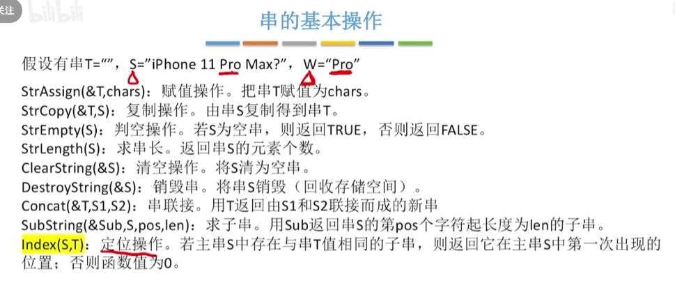
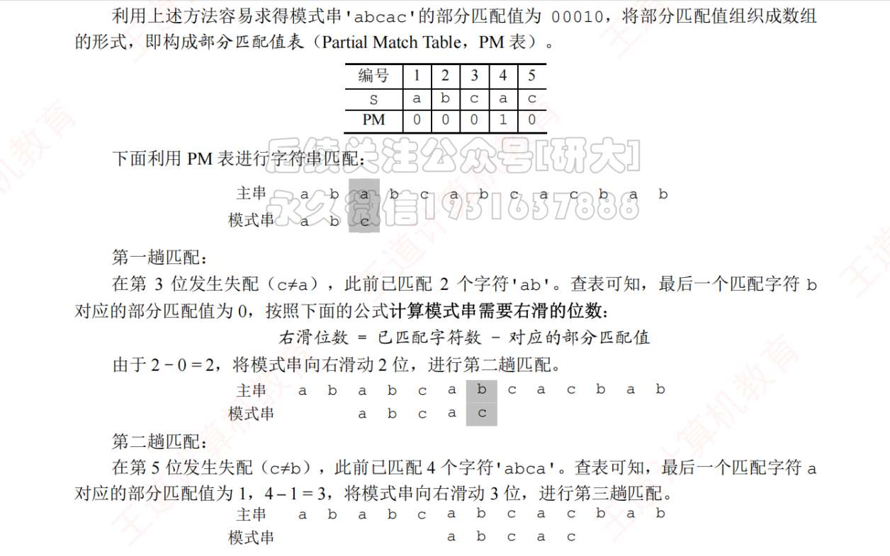
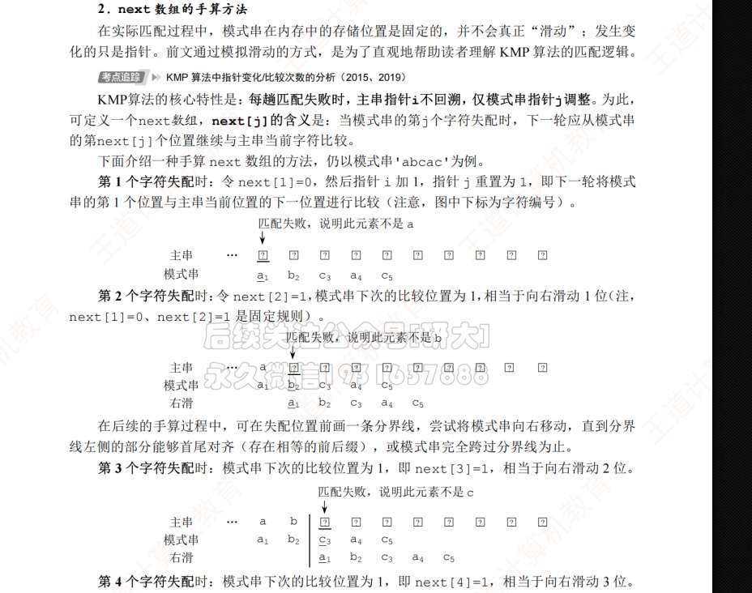

基本操作

# KMP

首先，PM 表很好理解

这是最符合直觉的，如何利用重复前后缀

如果我们不用“右滑位数”：
假设在第 $j$ 个字符失配了。

- 这意味着前面的 $j-1$ 个字符已经完美匹配。
    
- 这 $j-1$ 个字符的 PM 值是 `PM[j-1]`。
    

**核心顿悟时刻来了：**

`PM[j-1]` 的物理意义是什么？是这串字符里，**最前面有几个字符（前缀）和最后面几个字符（后缀）是一模一样的。**

假设 `PM[j-1] = 2`，说明最前面有 2 个字符，和最后面 2 个字符一样。

既然我们要把前缀拉过来对齐后缀，那么对齐之后，前缀的那 2 个字符就已经是匹配好的了。

那我们的指针 $j$ 接下来该去比较模式串里的第几个字符呢？

**显然是去比较前缀后面的那一个字符啊！**

前缀长度是 2（占据了第 1 和第 2 个位置），下一个要比较的自然就是**第 3 个位置**！

把这个逻辑变成通用公式：

前缀长度是 `PM[j-1]`，下一个要比较的位置坐标就是 `PM[j-1] + 1`。

这就是王道书上那个终极公式的由来：

$$next[j] = PM[j-1] + 1$$

next 数组，是第 j 个字符失配，然后不考虑第 j 个字符到底是什么，不考虑第 j 个字符和前面几个字符的关系！只考虑前面几个字符的前后缀，即 PM。下一次进化，就是再考虑下第 j 个字符和前面几个字符的关系了！

即，nextval！

### 为什么说 next 数组是“盲目的”？

就像你说的，`next` 数组在第 `j` 个字符失配时，它**捂住了自己的眼睛，根本不看第 `j` 个字符到底是个啥**。它只管往回看，翻历史旧账（看 PM 表），然后甩给你一个坐标：“去吧，去和那个位置比！”

来看看图里这个极端的例子：**模式串 `aaaab`**

假设主串是 `aaab...`，我们在第 4 个字符处发生了失配（主串是 `b`，模式串第 4 个是 `a`）。

- **盲目的 next 指挥：**
    
    1. `next[4]` 说：退到 3 去比！结果模式串第 3 个还是 `a`，必然和主串的 `b` 失配。
        
    2. `next[3]` 说：退到 2 去比！结果第 2 个还是 `a`，又失配。
        
    3. `next[2]` 说：退到 1 去比！结果第 1 个还是 `a`，再失配。
        
    4. 最后只能乖乖让主串往下走一步。
        

你看，这简直就是**“连环撞南墙”**。因为 `next` 数组根本没考虑当前失配的这个字符本身就是 `a`，它给你指的退路居然全都是 `a`！

---

### 二、 nextval 的绝妙进化：看看“替身”是谁

`nextval` 就是为了打破这种“连环撞南墙”而生的。它的逻辑正如你所说：**不仅要看历史（拿到退路坐标），还要看当下（检查那个退路上的字符跟我现在是不是一样的）！**

在计算 `nextval[j]` 时，它会在心里默默做一个预判：

“老实人 `next` 让我退到 `next[j]` 去比。那我先偷偷瞄一眼，**模式串里第 `next[j]` 个字符，跟我当前的第 `j` 个字符是不是同一个字母？**”

这就衍生出了两条终极判断法则（也就是你图里那段代码的核心精髓）：

#### 法则 1：长得不一样（退路安全）

- **条件：** 如果模式串的第 `j` 个字符 $\neq$ 第 `next[j]` 个字符。
    
- **做法：** 说明这条退路不是个坑，过去之后面对的是个新面孔，有可能会匹配成功。
    
- **结论：** `nextval[j] = next[j]`。（直接采纳老实人的建议）
    

#### 法则 2：长得一模一样（必死之局，启动连环抄袭）

- **条件：** 如果模式串的第 `j` 个字符 $==$ 第 `next[j]` 个字符。
    
- **做法：** 警报拉响！我自己就是因为这个字母死掉的，你还让我退到一个同样字母的位置去，那不是去送死吗？
    
    既然那个位置也不行，那我就**直接去抄那个位置的“聪明退路”**！
    
- **结论：** `nextval[j] = nextval[ next[j] ]`。
    

---

### 三、手摇模拟图中的极致优化

我们用“法则 2（连环抄袭）”来破解图里的 `aaaab`，感受一下 `nextval` 的可怕威力：

（注：规定 `nextval[1] = 0`）

**推导过程极其爽快：**

- **算 `j=2`：** `next` 让退到 1。第 1 个是 `a`，当前也是 `a`。必死！直接抄 1 的 `nextval`（是 0）。所以 `nextval[2] = 0`。
    
- **算 `j=3`：** `next` 让退到 2。第 2 个是 `a`，当前也是 `a`。必死！直接抄 2 的 `nextval`（是 0）。所以 `nextval[3] = 0`。
    
- **算 `j=4`：** `next` 让退到 3。第 3 个是 `a`，当前也是 `a`。必死！直接抄 3 的 `nextval`（是 0）。所以 `nextval[4] = 0`。
    
- **算 `j=5`：** `next` 让退到 4。第 4 个是 `a`，**当前是 `b`。长得不一样！安全！** 直接采纳 `next[5]` 的值。所以 `nextval[5] = 4`。
    

**实战效果：**

再回到一开始主串遇到 `b` 失配的情况。

当我们在第 4 个字符 `a` 失配时，一查 `nextval[4]`，发现值是 **0**。

这就是 `nextval` 在大声警告计算机：“别试前面的 3、2、1 了，全都是 `a`，全是死路！直接让主串往下挪一步，模式串从头开始吧！”