1. D
2. A
3. C
   树的路径长度是从树根到每个结点的路径长度总和
4. AC 都对啊
   度为 4（即 $m=4$），所以第 $i$ 层最多有 $4^{i-1}$ 个结点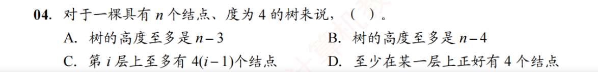
5. A
6. C
7. D
8. D
9. B
10. C

# 二叉树
1. C
2. C
3. A
4. B
5. ?不应该是 2^{h-1}个吗
   哦，不是完全二叉树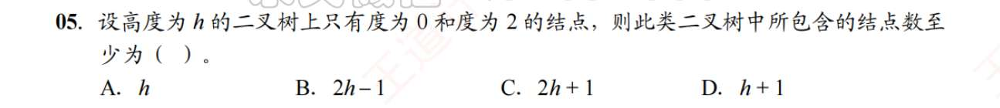
6. D
7. C
8. C
9. C
10. C
11. C
12. A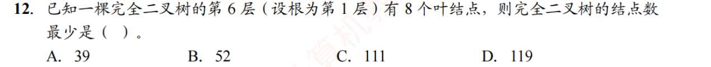这不是固定的吗？何来最少一说
    哦，详见 25.，就是另一种情况
13. A
14. 这题我的思路是，铺满了 9 层，511 个结点，没铺满 10 层（1023 个结点）。那第 10 层的结点是 1001-511=490 个结点，全是叶子。然后 490/2，是第 9 层生孩子的，511-490/2 是另一批叶子结点，显然答案没有啊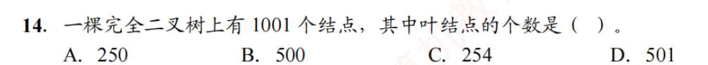
    **帮你纠错：**
	
	- 铺满 9 层，**总共**确实有 511 个结点。
	    
	- 但是！第 9 层**这一层本身**，并没有 511 个结点，只有 $2^{9-1} = 256$ 个结点。
	    
	- 按照你的逻辑继续往下算：第 10 层有 490 个叶子结点，它们占用了第 9 层的 $490 / 2 = 245$ 个父结点。
	    
	- 那么第 9 层剩下的叶子结点应该是：`第9层本层的总数 - 被占用的父结点` = $256 - 245 = 11$ 个。
	    
	- 最终总叶子数：第 10 层的 490 + 第 9 层的 11 = **501 个。答案选 D。**
	    
	
	**✨ 秒杀必杀技（强烈建议背诵）：**
	
	在完全二叉树中，已知总结点数 $N$，求叶子结点数 $n_0$ 的终极公式：
	
	$$n_0 = \lceil N/2 \rceil$$
	
	（即总数除以 2，向上取整）

这道题直接代入：$1001 / 2 = 500.5$，向上取整就是 **501**。3 秒出答案，根本不用去数层数！
15. C
16. A 我的思路就是，第 8 层铺满，128 个结点，然后-8 个结点，但上一层多 4 个叶节点，所以最后 124 个叶节点，这就是最多的情况
    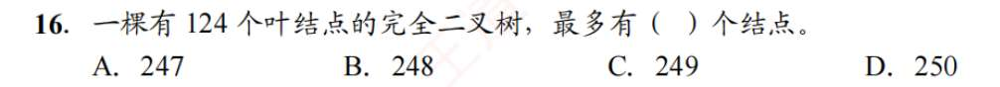
    任何二叉树都有一个绝对真理：**$n_0 = n_2 + 1$** （叶子结点数永远比度为 2 的结点数多 1 个）。

	以及总结点数：**$N = n_0 + n_1 + n_2$**。
	
	1. 题目已知叶子结点 $n_0 = 124$。
	    
	2. 立刻推导出度为 2 的结点数 $n_2 = 124 - 1 = 123$。
	    
	3. 那么总结点数 $N = 124 + n_1 + 123 = 247 + n_1$。
	    
	4. **关键点来了**：在完全二叉树中，度为 1 的结点（$n_1$）**要么是 0 个，要么是 1 个**（且如果存在，只能是左孩子）。
	    
	5. 题目问最多有多少个结点？那当然是让 $n_1 = 1$ 的时候最多啦！
	    
	6. 所以最大总结点数 $N = 247 + 1 =$ **248。答案选 B。**
17. 我的想法是，第 4 层 8 个结点，然后再生 7 个孩子。这样一共 2^4-1,+7，等于 22 个结点...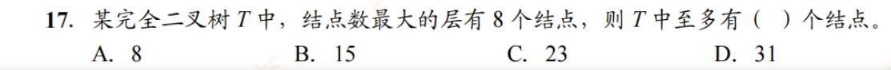
    你之所以加 7，大概是潜意识里觉得：“如果下一层也生 8 个，那最大层的结点数就不唯一了，所以只能少生一个，变成 7”。

	但实际上，数学题里说“结点数最大的层有 8 个结点”，意思仅仅是 **$\max(\text{各层结点数}) = 8$**。它并没有规定这个最大值不能“并列”。
	
	- 第 4 层全满，有 8 个结点。
	    
	- 我们希望总树的结点最多，那就让第 5 层尽量多生孩子。
	    
	- 第 5 层的上限能达到 16（因为第 4 层的 8 个父节点全满能生 16 个）。
	    
	- 但是，题目限制了“最大层的结点数是 8”，所以第 5 层绝对不能超过 8！
	    
	- 为了追求“至多”有多少个结点，我们把第 5 层直接拉满到它的限制上限，也就是刚好生 **8 个**孩子。
	    
	- 这样，第 4 层是 8，第 5 层也是 8，最大值依然是 8，完全符合题意。
	    
	
	**最终计算：**
	
	前 4 层铺满（15 个） + 第 5 层拉满限制（8 个） = **23 个。答案选 C**
18. A
    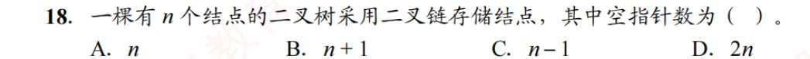
    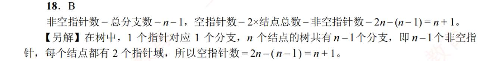
19. D
    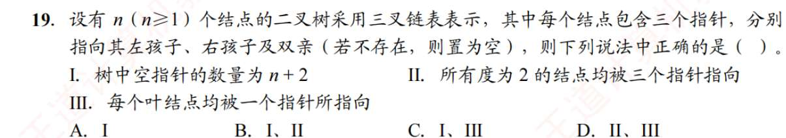
    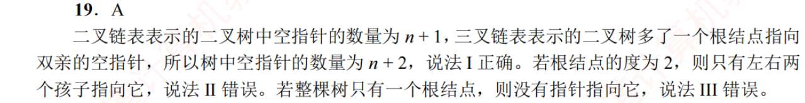
20. A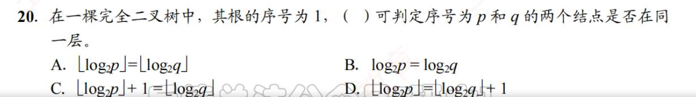
21. C
22.  C
23. B
24. D
25. C
26. C
27. A
28. B
    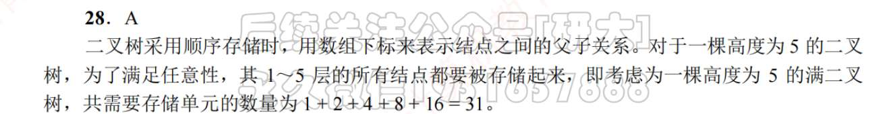
29. C
30. D

# 二叉树遍历与线索二叉树

1. 感觉很考验理解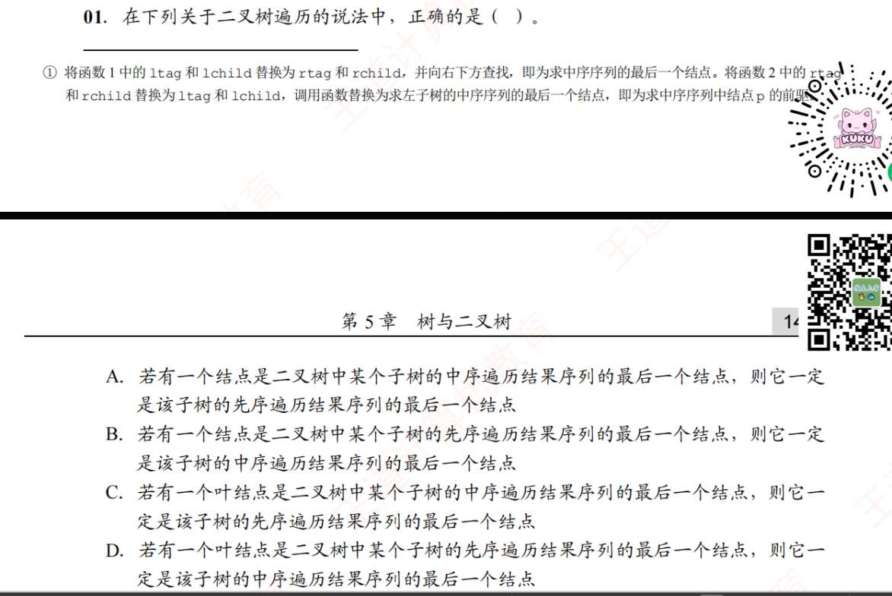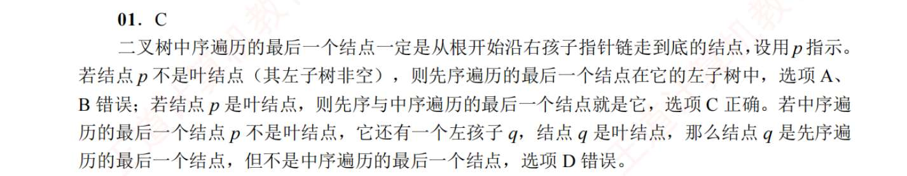